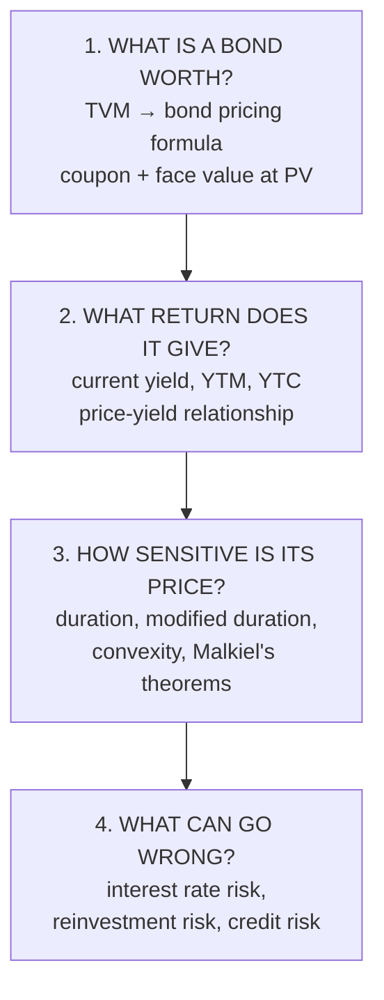
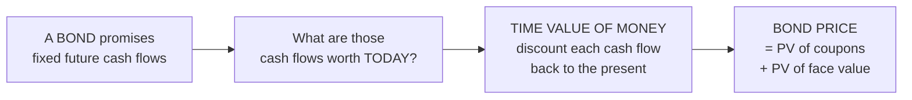
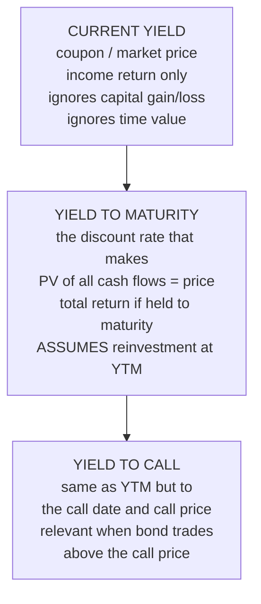
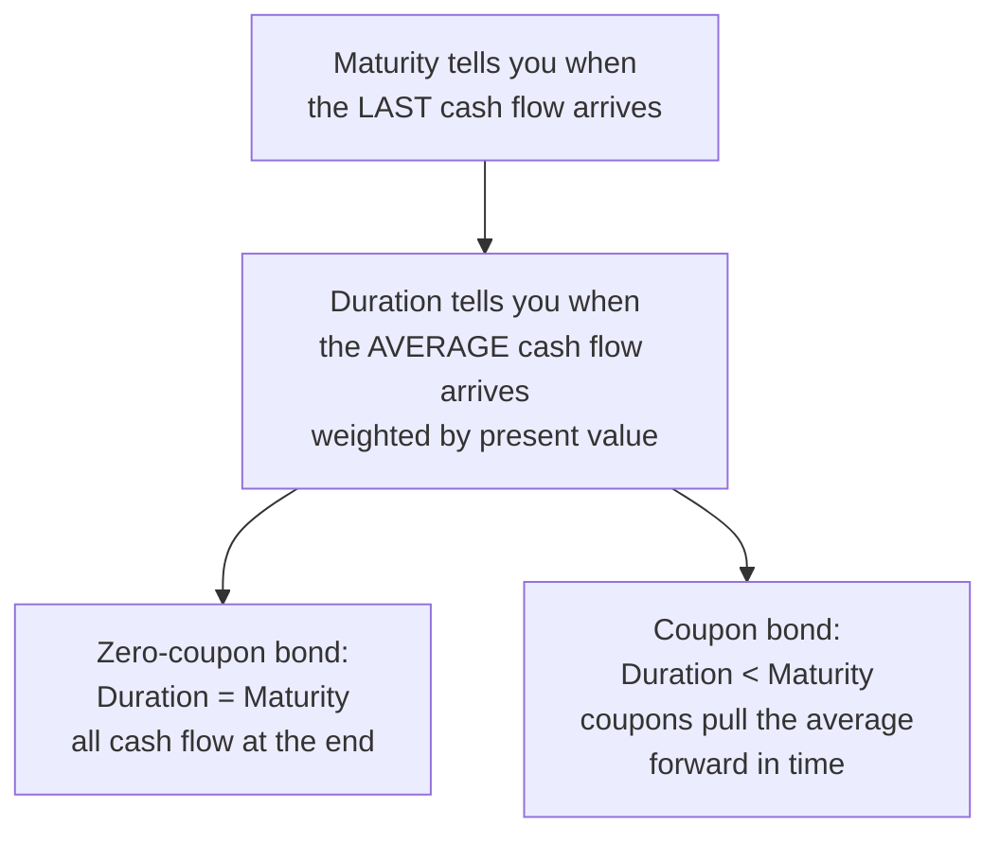
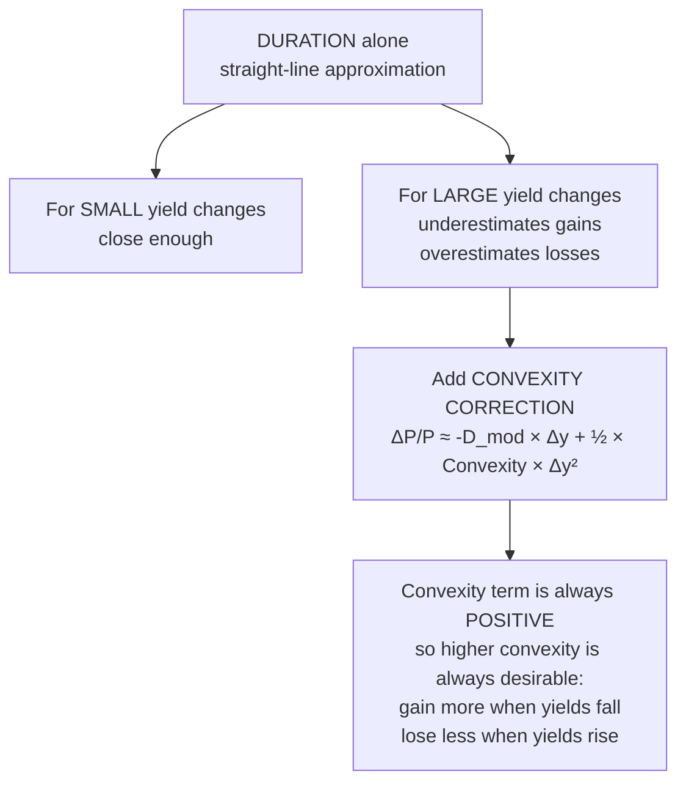
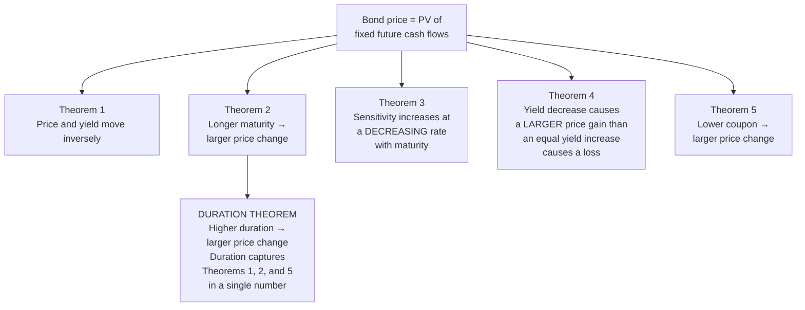
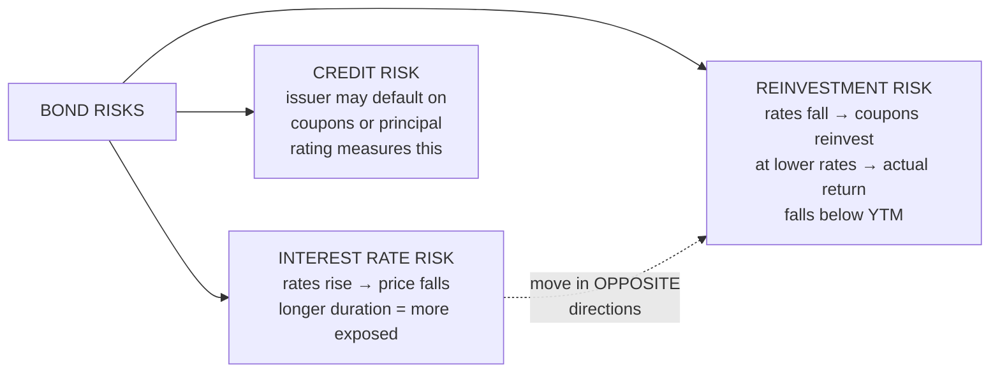
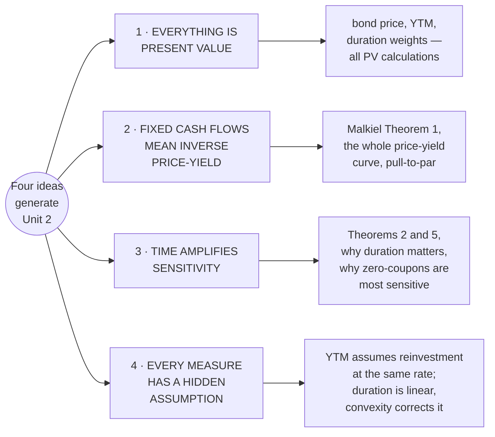
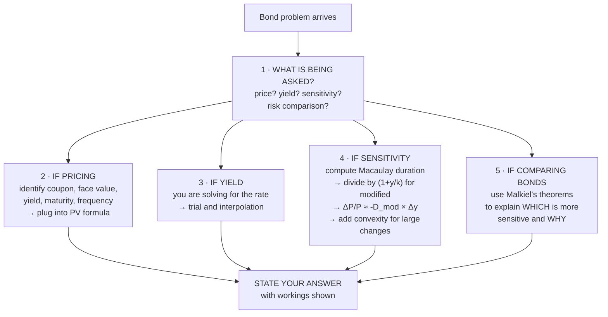

# Bond Market Unit 2 — How Bond Valuation Actually Works

An understanding-first companion for the Bond Market CIA 2 exam. This note explains why every
formula and theorem exists, so the machinery becomes derivable rather than memorised.

Formulas and figures: [[Bond Market Unit 2 - Cheat Sheet]].

---

## 0. The shape of the whole subject

Unit 2 is one argument, built in four layers. Each layer answers a harder question than the last.

Layer 1 prices the bond. Layer 2 measures what you earn from it. Layer 3 measures how much the
price moves when yields change. Layer 4 names the things that can hurt you. Every formula in the
unit sits in exactly one of these layers, and knowing which layer you are in tells you what the
formula is for, even if you have forgotten its exact shape.

---

## 1. What is a bond worth — and why TVM is the entire foundation

A bond is a contract: the issuer promises to pay you a fixed series of cash flows (coupons) and
then return your principal (face value) at a future date. Those cash flows are certain in amount
(barring default) and fixed in timing. The only question left is: what is the right price to pay
today for a known stream of future money?

The answer is the time value of money. A rupee received a year from now is worth less than a rupee
in hand, because the rupee in hand can be invested and earn a return in the meantime. The further
away a cash flow sits, the less it is worth today, and the rate at which it shrinks is the
discount rate — which for a bond is the yield the market demands.

This is why the bond pricing formula has two terms. The coupon stream is an annuity (equal
payments at regular intervals), so it gets the annuity PV formula. The face value is a single
lump sum at the end, so it gets the simple PV formula. Add them and you have the price.

A zero-coupon bond strips this down to its essence: no coupons at all, just the face value
returned at maturity. Its price is purely the PV of that single payment, and its entire return
comes from buying at a discount and receiving par at maturity. That discount IS the yield.

**Why price and yield move in opposite directions.** This is not a market convention or a pattern
that could sometimes reverse. It is arithmetic. The bond promises fixed cash flows. When the
discount rate (yield) rises, the present value of those fixed cash flows mechanically falls.
When the discount rate falls, the present value mechanically rises. The cash flows do not change;
only the lens through which you value them changes. If you ever get a calculation where price and
yield move in the same direction, there is an error.

**Pull-to-par.** As a bond approaches maturity, its price converges toward face value. A premium
bond (trading above par because its coupon exceeds the market yield) drifts down. A discount bond
(trading below par because its coupon is below market yield) drifts up. At maturity the bond is
worth exactly its face value, because there are no future cash flows left to discount — you
collect the face value and it is over. The "n" in the formula shrinks every day, and as n
approaches zero, PV approaches FV.

---

## 2. What return does it give — yield measures, from crude to precise

Not all yield measures tell you the same thing. They differ in what they include and what they
assume, and picking the wrong one for the question being asked is a common exam error.

**Current yield** is the roughest measure: annual coupon divided by market price. It tells you
the cash income you collect each year as a percentage of what you paid, and nothing else. It
ignores the capital gain or loss you will realise if you hold to maturity (a discount bond will
gain; a premium bond will lose), and it ignores the time value of money entirely. It is useful
only as a quick screening number, not as a decision tool.

**YTM** is the complete measure and the one the exam will usually demand. It is defined as the
discount rate that makes the PV of all future cash flows (coupons and face value) exactly equal
to the current market price. You cannot solve for it algebraically — the equation is
non-linear — so you find it by trial and error: pick a rate, compute PV, see if it matches the
price, adjust, and interpolate between two rates that bracket the answer.

The critical hidden assumption: YTM assumes you reinvest every coupon payment at the same YTM
rate for the remaining life of the bond. If rates change after you buy, your actual return will
differ from the YTM you calculated. This is not a flaw in the measure — it is a fact about what
it measures. YTM is the return you would earn if nothing changed. Reinvestment risk is the name
for the gap between that assumption and reality.

**YTC** replaces maturity with the call date and face value with the call price. It matters
when a bond is callable and trades above the call price, because the issuer has an economic
incentive to call it (borrow again at the now-lower rate). In that situation, the investor
should compute YTC instead of YTM, because the bond is more likely to be retired early than
held to maturity.

---

## 3. How sensitive is the price — duration, convexity, and Malkiel

This is the heart of Unit 2 and the layer where the most marks are available, because it
connects pricing to risk management.

### Why duration exists

You already know that longer bonds are more sensitive to yield changes. But "longer" is
imprecise. Consider two 10-year bonds: one with a 10% coupon and one with a 2% coupon. Both
mature in 10 years, but they are not equally sensitive to rate changes, because the high-coupon
bond returns most of your money early (through large coupons), while the low-coupon bond forces
you to wait for the face value at the end. The high-coupon bond behaves like a shorter bond even
though it has the same maturity. Maturity alone does not capture this.

Duration solves the problem by asking: **on average, how long do you wait to get your money
back?** It is a weighted average of the time to each cash flow, where the weight is the PV of
that cash flow as a fraction of the bond's price.

For a zero-coupon bond, all cash flow arrives at maturity, so the weighted average is maturity
itself. Duration equals maturity exactly.

For a coupon bond, coupons arrive before maturity and pull the weighted average forward. The
higher the coupon, the more they pull, and the shorter the duration. Duration is always less
than maturity for a coupon bond.

### Modified duration — the tool you actually use

Macaulay duration is measured in years. To convert it into a price-sensitivity measure, divide
by (1 + yield per period). The result is modified duration, and it tells you the approximate
percentage price change for a 1% change in yield.

The formula ΔP/P ≈ -D_mod x Δy is the single most useful equation in this unit for exam
purposes. It says: if modified duration is 6 and yield rises by 0.5%, the bond's price falls by
approximately 3%. The negative sign enforces the inverse relationship.

### Why duration is not enough — convexity

Duration gives a straight-line approximation to a curve. The actual price-yield relationship is
convex (bowed outward), which means:

- When yields fall, the actual price gain is LARGER than duration predicts.
- When yields rise, the actual price loss is SMALLER than duration predicts.

Higher convexity is always desirable, all else equal. Between two bonds with the same duration
and yield, the one with higher convexity will outperform in both directions. This is why
convexity is treated as a benefit, not just a correction factor.

### Malkiel's five theorems — the intuition

Malkiel's theorems are not independent discoveries. They are five observable consequences of the
same pricing formula, stated as testable propositions. Once you understand why each one follows
from the formula, you can derive any of them in an exam rather than reciting them from memory.

**Theorem 1** is the price-yield inverse relationship, already explained. Arithmetic, not theory.

**Theorem 2**: longer maturity means more cash flows sit further in the future, where they are
more affected by a change in the discount rate. A 1% rate change applied to a cash flow 20 years
away changes its PV more than the same change applied to a cash flow 2 years away, because the
compounding effect of the rate change accumulates over more periods.

**Theorem 3**: the sensitivity described in Theorem 2 increases at a decreasing rate. Going from
5-year to 10-year maturity adds more sensitivity than going from 20-year to 25-year. This is
because the PV of very distant cash flows is already so small that discounting them a little more
does not move the total price much. The marginal impact of an extra year diminishes.

**Theorem 4**: this is the convexity effect stated in non-mathematical terms. The price-yield
curve is convex — bowed outward — so a yield decrease (moving left on the curve) traces a steeper
path (larger price gain) than an equal yield increase (moving right) traces (smaller price loss).
The curve is not symmetric.

**Theorem 5**: a lower coupon means more of the bond's total value is concentrated in the face
value payment at maturity, which is the cash flow furthest away and most sensitive to discounting.
A higher coupon spreads value across earlier payments, reducing the weighted average sensitivity.
This is exactly what duration captures.

**The duration theorem** ties them together: for a given yield change, bonds with higher duration
show larger price changes. Duration is the single number that unifies Theorems 1, 2, and 5.

---

## 4. What can go wrong — the three risks

**Interest rate risk** is price risk: if market yields rise after you buy, your bond's price
falls. This matters if you need to sell before maturity. Duration is the direct measure of this
risk. Longer duration means more exposure.

**Reinvestment risk** is return risk: YTM assumes all coupons are reinvested at the same rate.
If rates fall, coupons get reinvested at lower rates, and your actual total return undershoots
the YTM you calculated. Higher coupon means more reinvestment risk, because there is more cash
flow to reinvest. A zero-coupon bond has zero reinvestment risk — there are no coupons.

The crucial insight: interest rate risk and reinvestment risk move in opposite directions. When
rates rise, your bond's price falls (bad), but your coupons reinvest at higher rates (good). When
rates fall, your bond's price rises (good), but your coupons reinvest at lower rates (bad). They
are partial natural hedges of each other, and this is the foundation of immunisation strategies
covered in later units.

**Credit risk** is default risk: the issuer might not pay. Government securities carry near-zero
credit risk (the sovereign can tax and print). Corporate bonds carry credit risk proportional to
the issuer's financial health, measured by credit ratings. Lower rating means higher yield demanded
by investors as compensation for bearing the default possibility. The spread between a corporate
bond's yield and a government bond's yield of the same maturity is the credit spread, and it
isolates the market's price for credit risk.

---

## 5. Design principles that repeat

**1. Everything is present value.** Bond price, YTM, duration weights — every calculation in this
unit is a PV calculation, just with different inputs or solving for a different unknown.

**2. Fixed cash flows mean inverse price-yield.** Because the cash flows do not adjust, the only
thing that can move is the discount rate, and a higher rate mechanically shrinks PV. This single
fact drives Malkiel's Theorem 1 and the entire price-yield curve.

**3. Time amplifies sensitivity.** Cash flows further in the future are more affected by rate
changes, because the compounding effect accumulates over more periods. This drives Theorems 2
and 5, and is why duration (which measures average time to cash flow) is the right sensitivity
measure.

**4. Every measure has a hidden assumption.** YTM assumes reinvestment at the same rate. Duration
assumes a linear price-yield relationship. Both are useful approximations, not perfect truths, and
knowing the assumption tells you when to trust the number and when to correct it.

---

## 6. The one thing to hold if you hold nothing else

Identify what the question is asking. Price problems want you to discount. Yield problems want
you to solve for the rate. Sensitivity problems want duration and possibly convexity. Comparison
problems want Malkiel's theorems applied to explain differences. Show the formula, show the
substitution, state the answer.

## Links
- [[Bond Market Unit 2 - Cheat Sheet]]
- [[Home]]
