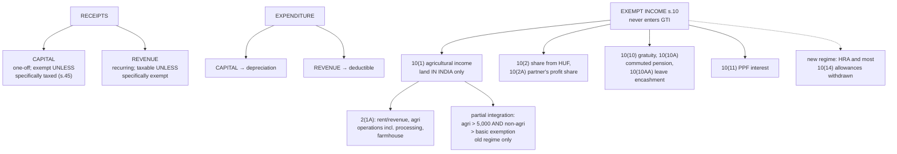

# Unit 1 — Capital vs Revenue Receipts & Exempted Incomes

Covers: capital vs revenue receipts/expenses, exempted incomes (self-study topic in the course plan), agricultural income and partial integration. Companion to [[Unit 1 - Basic Concepts and Residential Status]]. My source note: [[Agriculture Income - Sec 10(1)]].

## Capital vs revenue receipts

| | Capital receipt | Revenue receipt |
|---|---|---|
| Nature | Non-recurring, one-off | Recurring, part of normal operations |
| Examples | Sale of a fixed asset, loan received, insurance claim on capital asset, capital brought in by a partner | Sale of goods/services, rent from a business asset, interest on business deposits, commission |
| Default tax treatment | **Exempt** unless a specific provision taxes it (e.g., capital gains) | **Taxable** unless a specific provision exempts it |
| Where it shows | Balance sheet | Profit & Loss account |

**Recall prompt:** A firm sells a machine used in its business for a profit. Is that gain a capital or revenue receipt, and is it automatically tax-free? → Capital receipt (disposal of a capital asset) — but *not* automatically tax-free: Section 45 specifically brings capital gains into tax, which is the "specific provision" exception to the general capital-receipt exemption rule.

## Capital vs revenue expenditure (mirror logic)

- **Capital expenditure**: acquires or improves a fixed asset, or brings an enduring benefit (e.g., buying machinery, building extension). Not deductible in full in the year incurred — only depreciation is allowed.
- **Revenue expenditure**: day-to-day running costs (salaries, rent, repairs that don't extend asset life). Fully deductible in the year incurred, against business income.

**Recall prompt:** Money spent on a machine's *ordinary repair* vs. money spent *replacing its major component to extend its life* — which is capital, which is revenue? → Ordinary repair = revenue expenditure. Replacement that extends useful life / increases capacity = capital expenditure.

## Exempted incomes — Section 10 (self-study topic; know the categories, not just agri income)

Section 10 lists incomes that never enter Gross Total Income at all (contrast with *deductions*, which reduce GTI after inclusion). Categories commonly tested from Section 10:
- **10(1)** — Agricultural income (see below)
- **10(2)** — Sum received by a member of a HUF out of family income / from HUF's estate
- **10(2A)** — Share of profit received by a partner from the firm (firm itself already taxed)
- **10(10)** — Gratuity (see [[Unit 2 - PF Gratuity Pension and Leave Encashment]])
- **10(10A)** — Commuted pension
- **10(10AA)** — Leave encashment
- **10(13A)** — House Rent Allowance
- **10(14)** — Prescribed special allowances (children education, hostel, transport-disabled, uniform, tribal area, etc.)
- **10(34)/10(35)** — Certain dividend and mutual fund income (subject to current-year Finance Act changes — dividend taxation has moved around; verify current treatment before relying on this in a numeric answer)

## Agricultural income — Section 2(1A) definition, Section 10(1) exemption

Agricultural income = (a) rent/revenue from land in India used for agricultural purposes, (b) income from agricultural operations on such land including processing of produce to make it marketable, (c) income from a farmhouse, subject to conditions on the building's proximity/use relative to the agricultural land.

**Fully exempt under Section 10(1)** — but the exemption is only from *tax*, not from the *rate calculation*. That's where partial integration comes in.

### Partial integration (indirect taxation of agricultural income)

Applies when **both**:
1. Net agricultural income exceeds **₹5,000**, AND
2. Non-agricultural (total) income exceeds the basic exemption limit.

**Method:**
1. Compute tax on (Non-agricultural income + Net agricultural income) at slab rates.
2. Compute tax on (Basic exemption limit + Net agricultural income) at slab rates.
3. Tax payable = Step 1 − Step 2.

Effect: agricultural income itself stays tax-free, but it pushes the non-agricultural income into a higher *effective* slab — because it's added only to determine the rate, not the tax base.

**Note:** partial integration is a graduated-slab rate device, and commentators treat it as inapplicable under Sec 115BAC — agricultural income stays exempt under 10(1) and simply has no effect on tax computed at new-regime slab rates. If a problem hands you agricultural income and asks you to compute, run the two-step anyway and state that assumption; the marks are for demonstrating the mechanism. See [[Unit 1-2 Fact Check and Corrections]].

**Recall prompt:** Net agricultural income ₹40,000, non-agricultural income ₹6,00,000, basic exemption ₹4,00,000. Walk through partial integration. → Step 1: tax on (6,00,000+40,000)=6,40,000. Step 2: tax on (4,00,000+40,000)=4,40,000. Final tax = Step 1 tax − Step 2 tax. The ₹40,000 agri income is never itself taxed — it only shifts where the slab boundary is applied.

## What to remember

- **Capital receipt**: exempt **unless** a specific provision taxes it (e.g. s. 45 capital gains, s. 28(va) non-compete). **Revenue receipt**: taxable **unless** specifically exempt.
- **Capital expenditure**: enduring benefit → depreciation only. **Revenue expenditure**: running cost → deductible.
- **Exempt income (s. 10)** never enters GTI; a **deduction** reduces GTI after inclusion.
- **Agricultural income 2(1A)**: rent/revenue from land in India used for agriculture, income from agricultural operations (including processing to make produce marketable), farmhouse income. **Exempt u/s 10(1).**
- **Partial integration** applies when net agri income > ₹5,000 and non-agri income > basic exemption, under the **old regime**. Under the **new regime** it is generally treated as **not applicable** (see [[Unit 1-2 Fact Check and Corrections]]).
- **Agricultural income from land outside India** is **taxable** (IFOS). Only Indian land qualifies.
- Under the new regime, **HRA 10(13A)** and most **10(14)** allowances are **not** exempt; gratuity, commuted pension, leave encashment, PPF interest, share of profit from a firm remain exempt.

## Concept map

## Flashcards
Q: What is the default tax treatment of a capital receipt?
A: Exempt, unless a specific provision (such as s. 45 for capital gains) makes it taxable.

Q: What is the default tax treatment of a revenue receipt?
A: Taxable, unless specifically exempt.

Q: How is capital expenditure on a machine recovered for tax purposes?
A: Through depreciation, not as a deduction in the year of purchase.

Q: What is the difference between an exempt income and a deduction?
A: Exempt income never enters GTI; a deduction is subtracted from GTI after the income is included.

Q: Is agricultural income from land in Nepal exempt u/s 10(1)?
A: No. Only agricultural income from land in India is exempt; foreign agricultural income is taxable under IFOS.

Q: Is income from processing agricultural produce to make it marketable agricultural income?
A: Yes, if the processing is of a kind ordinarily employed by a cultivator to make the produce fit for the market.

Q: When does partial integration apply?
A: When net agricultural income exceeds ₹5,000 and non-agricultural income exceeds the basic exemption limit (old regime).

Q: Is partial integration applied under the new regime?
A: It is generally treated as not applicable under s. 115BAC; state your assumption if a problem gives agricultural income.

Q: Is a partner's share of profit from the firm taxable in his hands?
A: No, exempt u/s 10(2A), because the firm has already paid tax on it.

## Sources
- [Capital Receipts and Revenue Receipts: Meaning, Difference and Examples](https://cleartax.in/s/capital-receipts-and-revenue-receipts)
- [Exempt income under Section 10 of Income-tax Act 1961](https://taxguru.in/income-tax/exempt-income-under-section-10-of-income-tax-act-1961.html)
- [Agricultural Income Tax: Guide To Partial Integration](https://1finance.co.in/blog/is-agricultural-income-fully-exempt-from-income-tax/)
- [Agricultural Income: Exemption Limit, Tax Calculation, Examples](https://cleartax.in/s/agricultural-income)

## Links
- [[Taxation Law MOC]]
- [[Unit 1 - Tax Fundamentals and Statutory Framework]]
- [[Unit 1 - Basic Concepts and Residential Status]]
- [[Taxation Units 1-2 MCQ Bank]]
