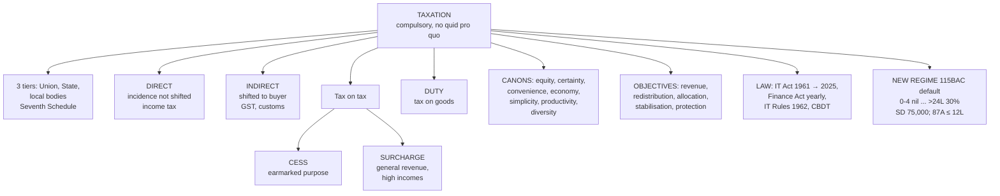

# Unit 1 — Tax Fundamentals & Statutory Framework

Covers: meaning of taxation, direct vs indirect tax, duty/cess/surcharge, principles of a good tax system, the new tax regime, objectives of taxation, legal enactments. Feeds into [[Unit 1 - Basic Concepts and Residential Status]] and [[Unit 1 - Capital vs Revenue and Exempted Incomes]]. Practice: [[Taxation Units 1-2 MCQ Bank]]. My source notes: [[Income Tax]], [[Income Slab]].

## What is taxation

A compulsory financial charge imposed by government on income, property, or transactions, without a direct quid-pro-quo, to fund public expenditure. India runs a three-tier federal system under the Constitution — Union, State, Local Bodies — each with defined taxing powers (Union List, State List under the Seventh Schedule).

## Direct vs indirect tax

| | Direct tax | Indirect tax |
|---|---|---|
| Who pays | Levied on and paid directly by the person earning income/holding wealth | Levied on goods/services, collected by an intermediary (seller) and passed to govt |
| Incidence | Cannot be shifted | Can be shifted to the buyer |
| Examples | Income tax, (erstwhile) wealth tax | GST, customs duty, excise duty |
| Progressivity | Generally progressive (rate rises with income) | Generally regressive (same rate regardless of payer's income) |

**Recall prompt:** Why is income tax "direct" but GST "indirect"? → Legal liability to pay vs. who actually bears the economic burden differ for GST (seller pays government, but burden passes to buyer via price).

## Duty, cess, surcharge — don't confuse these three

- **Duty**: tax on goods, typically at the border (import/export) — customs duty, excise duty. Tax on a *thing*, not on income.
- **Cess**: a tax on tax — added on top of the base tax + surcharge, earmarked for a *specific* purpose (e.g., education cess, health & education cess). Goes to the Consolidated Fund of India but must be spent only on its stated purpose; lapses once that purpose is met.
- **Surcharge**: additional charge on the *tax payable* (not on income directly), applied at higher income slabs. Unlike cess, it's not purpose-earmarked — general revenue.

**Recall prompt:** A cess is stated as "tax on tax, purpose-bound"; a surcharge is "tax on tax, general revenue." What's the one-line test to tell them apart? → Ask "does the money have a locked purpose?" Yes = cess, No = surcharge.

## Principles / canons of a good taxation system

Classical canons (Adam Smith) + modern additions typically tested:
1. **Equity** — ability-to-pay; progressive burden.
2. **Certainty** — assessee should know how much, when, how to pay (not arbitrary).
3. **Convenience** — timing/method suits the taxpayer (e.g., TDS at source).
4. **Economy** — cost of collection should be low relative to revenue raised.
5. **Simplicity** — easy to understand and comply with.
6. **Productivity/Elasticity** — should yield sufficient and flexible revenue as the economy grows.
7. **Diversity** — multiple tax sources rather than over-reliance on one.

## New regime (Section 115BAC)

The default regime since AY 2024-25 — an assessee is taxed under it unless they file to opt out (Form 10-IEA for business/profession income, a choice on the ITR for salaried assessees).

**Slab rates, FY 2025-26 / AY 2026-27** (confirm against your course plan / exam AY before using in a problem):

| Income slab | Rate |
|---|---|
| Up to ₹4,00,000 | Nil |
| ₹4,00,001 – ₹8,00,000 | 5% |
| ₹8,00,001 – ₹12,00,000 | 10% |
| ₹12,00,001 – ₹16,00,000 | 15% |
| ₹16,00,001 – ₹20,00,000 | 20% |
| ₹20,00,001 – ₹24,00,000 | 25% |
| Above ₹24,00,000 | 30% |

**Key numbers:**
- Standard deduction (salaried/pensioners): **₹75,000** (FY 2025-26 / AY 2026-27 — raised from ₹50,000 by Budget 2024)
- Rebate u/s 87A: full rebate if total income ≤ ₹12,00,000 (rebate up to ₹60,000) — effectively nil tax up to that point
- Most exemptions/deductions (HRA, LTA, 80C, 80D, home loan interest, most 10(14) allowances) are **not available**

**Recall prompt:** What is the new regime's basic exemption slab, and up to what income is tax effectively nil once the 87A rebate is applied? → Nil slab up to ₹4,00,000; effectively nil tax up to ₹12,00,000 once the full 87A rebate applies.

## Objectives of levying taxes

Revenue generation for public expenditure; redistribution of income/wealth (progressive taxation); resource allocation (discouraging demerit goods via higher duty, e.g., tobacco); economic stabilisation (counter-cyclical fiscal policy); protecting domestic industry (customs duty); correcting externalities.

## Legal enactments governing tax administration in India

- **Income Tax Act, 1961** — the substantive law on income tax (being progressively replaced/consolidated by the **Income Tax Act, 2025**, which received assent and is the modernised recodification — check current effective date with your professor since the transition is ongoing in your course period).
- **Finance Act** (annual) — amends rates/slabs each Budget.
- **Income Tax Rules, 1962** — procedural/valuation detail (e.g., Rule 3 for perquisite valuation — see [[Unit 2 - Perquisites]]).
- **CBDT (Central Board of Direct Taxes)** — apex administrative body, issues circulars/notifications.
- Administrative hierarchy: CBDT → Chief Commissioners → Commissioners → Assessing Officers.

**Recall prompt:** What's the practical difference between the Income Tax Act and the annual Finance Act? → The Act is the permanent statutory framework; the Finance Act each year amends rates, slabs, and specific provisions within that framework.

## What to remember

- Tax = **compulsory**, **no direct quid pro quo**, funds public expenditure. Three tiers: Union, State, local bodies (Seventh Schedule).
- **Direct**: incidence cannot be shifted (income tax). **Indirect**: shifted to buyer (GST, customs).
- **Cess** = tax on tax, **earmarked**. **Surcharge** = tax on tax, **general revenue**. **Duty** = tax on goods.
- Canons: **equity, certainty, convenience, economy** (Adam Smith) + simplicity, productivity/elasticity, diversity.
- New regime **115BAC** is the default: slabs 0-4 nil / 5 / 10 / 15 / 20 / 25 / 30%; standard deduction ₹75,000; 87A rebate up to ₹60,000 if total income ≤ ₹12L.
- Enactments: **Income-tax Act 1961** (replaced by the **Income-tax Act 2025** from 1.4.2026; AY 2026-27 is still under the 1961 Act), annual **Finance Act**, **Income-tax Rules 1962**, **CBDT** circulars and notifications.

## Concept map

## Flashcards
Q: Define tax.
A: A compulsory payment to the government, without any direct quid pro quo, to fund public expenditure.

Q: What is the test that separates a direct tax from an indirect tax?
A: Whether the incidence can be shifted. A direct tax is borne by the person on whom it is levied; an indirect tax is passed on to the buyer.

Q: Distinguish cess from surcharge.
A: Both are levied on tax. Cess is earmarked for a specific purpose; surcharge goes to general revenue and applies at higher incomes.

Q: Name Adam Smith's four canons of taxation.
A: Equity, certainty, convenience and economy.

Q: Which regime is the default for AY 2026-27?
A: The new regime under s. 115BAC.

Q: What does the annual Finance Act do?
A: It amends rates, slabs and specific provisions of the Income-tax Act each year.

Q: Which body is the apex administrative authority for direct taxes?
A: The Central Board of Direct Taxes (CBDT).

Q: Which Act governs AY 2026-27 computations — the 1961 Act or the 2025 Act?
A: The Income-tax Act 1961. The 2025 Act applies from tax year 2026-27 (from 1 April 2026).

Q: Give two objectives of taxation other than revenue.
A: Redistribution of income and wealth; economic stabilisation (also resource allocation and protecting domestic industry).

## Sources
- [Difference Between Tax, Duty, Cess, Surcharge & Fee](https://taxguru.in/goods-and-service-tax/difference-tax-duty-cess-surcharge-fee-conceptual-clarity.html)
- [Difference between Cess and Surcharge](https://vajiramandravi.com/upsc-exam/difference-between-cess-and-surcharge/)
- [Income Tax Slabs for FY 2025-26 & AY 2026-27](https://www.sbigeneral.in/blog/general-insurance/general-articles/income-tax-slabs)
- [New Income Tax Slab 2026-27](https://vajiramandravi.com/current-affairs/income-tax-slab/)

## Links
- [[Taxation Law MOC]]
- [[Unit 1 - Basic Concepts and Residential Status]]
- [[Unit 1 - Capital vs Revenue and Exempted Incomes]]
