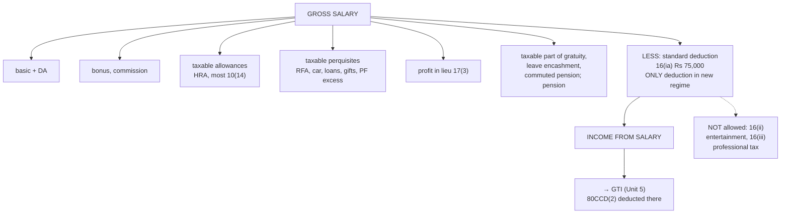

# Unit 2 — Deductions from Gross Salary & Computation of Taxable Salary

Covers: deductions from gross salary under Section 16, computation of taxable salary (practical problems) — the assembly step that pulls together [[Unit 2 - Salary Chargeability and Allowances]], [[Unit 2 - Perquisites]], and [[Unit 2 - PF Gratuity Pension and Leave Encashment]].

## Deductions under Section 16

Section 16 lists three deductions **from Gross Salary**, and Sec 115BAC allows exactly one of them:

1. **Standard deduction — Section 16(ia)**: flat deduction, no proof of expense needed. **₹75,000** (salaried/pensioners, FY 2025-26 / AY 2026-27 — raised from ₹50,000 by Budget 2024). The only Section 16 deduction to apply in a computation.
2. **Entertainment allowance — Section 16(ii)**: not available. Know the name for MCQ recognition, never subtract it.
3. **Professional tax — Section 16(iii)**: not available. Same.

**Recall prompt:** In a salary computation, how many deductions apply under Section 16, and which one? → Just one — the standard deduction, ₹75,000.

## Computation of taxable salary — standard format

```
Basic Salary                                   xxx
+ Dearness Allowance                           xxx
+ Bonus/Commission                             xxx
+ Fully taxable allowances                     xxx
+ Allowances (HRA and most 10(14)
  allowances are fully taxable —
  no exemption to net out)                     xxx
+ Taxable perquisites (accommodation,
  car, PF-excess, loans, gifts-over-limit)      xxx
+ Profit in lieu of salary                     xxx
+ Taxable portion of retirement benefits
  (gratuity/pension/leave-encashment
  excess over exemption)                        xxx
─────────────────────────────────────────────
GROSS SALARY                                   xxx
Less: Deductions u/s 16 (new regime: standard
  deduction only)
  - Standard deduction                        (xxx)
─────────────────────────────────────────────
INCOME UNDER THE HEAD "SALARY"                 xxx
```

This figure then flows into Gross Total Income alongside the other four heads (House Property, Business/Profession, Capital Gains, Other Sources) — see [[Unit 1 - Basic Concepts and Residential Status]] for the GTI → Total Income chain.

**Recall prompt:** Why does the computation carry no HRA-exemption line and no professional-tax deduction line, even though both may appear on the payslip? → Sec 115BAC allows neither. HRA is added in full as a taxable allowance, professional tax paid is simply not deductible, and Section 16 offers only the standard deduction.

## Worked mini-example (new regime, illustrative figures)

Basic ₹6,00,000, DA ₹60,000 (forms part of retirement benefits), HRA received ₹1,20,000, rent-free accommodation perquisite ₹66,000. Under the new regime, HRA has **no exemption** (fully taxable) and professional tax is **not deductible** — only the standard deduction applies.

```
Basic                          6,00,000
DA                                60,000
HRA (fully taxable, no exemption) 1,20,000
RFA perquisite                    66,000
──────────────────────────────
Gross Salary                   8,46,000
Less: Standard deduction        (75,000)
──────────────────────────────
Income from Salary             7,71,000
```

## What to remember

- Gross salary = basic + DA + bonus/commission + taxable allowances + taxable perquisites + profit in lieu + taxable retirement benefits.
- **Section 16 under the new regime: only the standard deduction of ₹75,000.** No entertainment allowance deduction, no professional tax.
- The **employer's NPS contribution** is added to salary (s. 17(1)(viii)) and deducted later as **80CCD(2)** at the total-income stage, not inside the salary head.
- Salary income then joins the other heads in GTI (Unit 5).

## Concept map



## Flashcards
Q: How many s. 16 deductions are allowed under the new regime?
A: One: the standard deduction of ₹75,000.

Q: Is professional tax deductible from salary under the new regime?
A: No.

Q: Gross salary ₹8,46,000 under the new regime. Income from salary?
A: ₹7,71,000 (after ₹75,000 standard deduction).

Q: Where is the employer's NPS contribution deducted?
A: It is included in gross salary and deducted u/s 80CCD(2) from GTI, up to 14% of salary.

Q: List the building blocks of gross salary.
A: Basic, DA, bonus/commission, taxable allowances, taxable perquisites, profit in lieu of salary, taxable retirement benefits and pension.

## Sources
- [Section 16 of Income Tax Act - Standard Deduction](https://www.tataaig.com/health-insurance/section-16-of-income-tax)
- [Section 16 of the Income Tax Act: A Complete Guide](https://callmyca.com/blog/section-16-of-income-tax-act)

## Links
- [[Taxation Law MOC]]
- [[Unit 2 - Salary Chargeability and Allowances]]
- [[Unit 2 - Perquisites]]
- [[Unit 2 - PF Gratuity Pension and Leave Encashment]]
- [[Taxation Units 1-2 MCQ Bank]]
