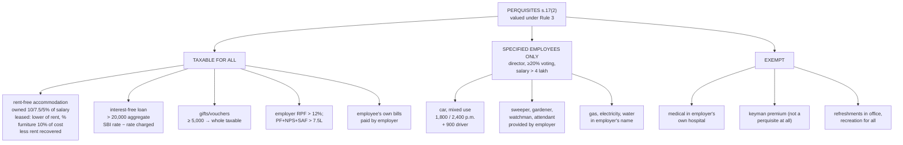

# Unit 2 — Perquisites

Covers: rent-free/concessional accommodation, employer motor car, free/concessional education, domestic servants, gas/electricity/water, food/refreshments, employer PF contribution beyond limits, interest-free/concessional loans, club membership, gifts/vouchers beyond limits, free travel, employer-paid insurance, other benefits. Companion to [[Unit 2 - Salary Chargeability and Allowances]].

## What counts as a perquisite (Section 17(2))

Non-cash benefits/facilities an employer gives an employee **in addition to** salary — taxable as part of "Salary" income. Valuation rules come from **Rule 3** of the Income Tax Rules, 1962. Perquisites split into three tax categories:
1. **Taxable for all employees** — e.g., rent-free accommodation, motor car (personal use portion), interest-free/concessional loans above threshold.
2. **Taxable only for specified employees** (director, employee with substantial interest, or salary above a threshold, excluding perquisite value) — e.g., free domestic servants, gas/electricity/water for non-specified employees are exempt but taxable for specified ones.
3. **Tax-exempt perquisites** — e.g., medical treatment in employer's own hospital, refreshments during working hours, recreational facilities available to all employees, telephone/internet for official use.

### The two exempt items that get skipped over — worth their own line

- **Medical treatment in the employer's own hospital/dispensary**: fully exempt, **no monetary ceiling** — because it's treated as the employer running its own facility rather than paying cash that substitutes for salary. Also extends to treatment at a hospital maintained by the government, local authority, or an approved hospital for prescribed diseases (cancer, TB, and similar) under Rule 3A. Contrast this with reimbursement of medical bills at an *outside, non-approved* hospital, which (post the standard-deduction-era withdrawal of the old ₹15,000 blanket exemption) is generally taxable as a perquisite unless it falls within one of these specific carve-outs.
- **Keyman Insurance Policy premium**: a policy taken by the *employer* on the life of a key employee, with the employer as both premium-payer and beneficiary. The premium is **not a perquisite in the employee's hands at all** (Section 17(2) doesn't apply — the policy protects the company's interest, not the employee's), so it never enters the salary computation. On the flip side, at maturity, the sum received by the *employer* is fully taxable as the employer's income and is specifically excluded from the Section 10(10D) life-insurance-maturity exemption — this is a company-side tax point, not something that shows up in an individual's salary computation, but a common source of MCQ confusion between "employee perquisite" and "employer's own taxable receipt."

**Recall prompt:** A company pays ₹50,000/year premium on a Keyman Insurance Policy for its CFO. Does any part of that ₹50,000 appear as a taxable perquisite in the CFO's salary computation? → No — the premium is not treated as the employee's perquisite under Section 17(2) since the policy benefits the company, not the employee; it stays entirely off the individual's salary computation.

## Rent-free / concessional accommodation

**Employer-owned accommodation**, valued as % of salary based on the city's population (CBDT slabs, effective FY 2023-24 revision):

| City population | % of salary |
| --------------- | ----------- |
| Above 40 lakh   | 10%         |
| 15–40 lakh      | 7.5%        |
| Below 15 lakh   | 5%          |

**Employer-leased/rented accommodation given rent-free**: perquisite value = actual rent paid/payable by the employer (or the % of salary above, whichever is lower, per Rule 3).

**Concessional accommodation**: perquisite = value as above, minus rent actually recovered from the employee.

**Recall prompt:** Employer in Mumbai (population > 40 lakh) owns the flat and gives it rent-free to an employee with salary ₹12,00,000. What's the perquisite value? → 10% of salary = ₹1,20,000.

## Motor car (Rule 3(2))

| Scenario                                                                                | Taxability                                                                                       |
| --------------------------------------------------------------------------------------- | ------------------------------------------------------------------------------------------------ |
| Car owned by employee, expenses reimbursed by employer, used for official purposes only | Not a perquisite (fully official use, properly documented)                                       |
| Employer-owned car, used only for official purposes                                     | Not a perquisite (if maintained with proper records)                                             |
| Employer-owned car, used partly for personal purposes, running costs borne by employer  | ₹1,800/month (≤1600cc) or ₹2,400/month (>1600cc), **+ ₹900/month** if a driver is also provided  |
| Employer-owned car, used only for personal purposes                                     | Actual expenses + driver salary + 10% depreciation on cost, minus amount recovered from employee |

**Recall prompt:** Employer provides a 1800cc car with a driver, used for mixed official/personal purposes, running costs on employer. Monthly perquisite? → ₹2,400 + ₹900 = ₹3,300/month.

## Other common perquisites

- **Free/concessional education** for employee's children in an employer-run/-sponsored institution — exempt up to a small per-child ceiling (historically ₹1,000/month/child for employer-owned institution cost basis); above that, actual cost less amount recovered is taxable.
- **Domestic servants** (sweeper, gardener, watchman, personal attendant) provided by employer — taxable perquisite = actual cost to employer minus amount recovered from employee (taxable for all employees under current rules, not just "specified" ones, post the 2001 amendment consolidating this).
- **Gas, electricity, water** — if employer's own resources supply it, valued at employer's cost; if purchased from an outside agency and provided to employee, valued at the amount paid by the employer. Amount recovered from employee reduces the taxable value.
- **Free food/refreshments** — exempt up to ₹50 per meal during office hours (or non-transferable meal vouchers up to that limit); tea/snacks during working hours generally exempt regardless of value.
- **Employer's contribution to Provident Fund beyond the limit** — contribution above **12% of salary** to a Recognised PF is taxable as a perquisite in the employee's hands (separate from the interest-on-PF rule — see [[Unit 2 - PF Gratuity Pension and Leave Encashment]]).
- **Interest-free or concessional loans** — taxable if aggregate outstanding loan exceeds ₹20,000 (medical treatment loans for specified diseases are excluded); perquisite = interest at SBI's lending rate on the loan, less interest actually charged by employer.
- **Club membership** — fees paid/reimbursed by employer for the employee's club membership (not incidental to business) is a taxable perquisite; corporate memberships used purely for business are excluded.
- **Gifts/vouchers** — exempt if aggregate value in the year is **below ₹5,000**; the entire amount becomes taxable once it crosses ₹5,000 (not just the excess).
- **Free/concessional travel** — provided by transport-undertaking employers (e.g., airline, railway staff) to employees/family — generally exempt for the employer's own line of business use; not extended to other employers' staff.
- **Employer-paid insurance premium** on a policy for the employee (other than statutory schemes like group insurance for accident) is a taxable perquisite.

**Recall prompt:** Employer gives Diwali gift vouchers worth ₹6,000 in a year. How much is taxable? → All ₹6,000 — crossing the ₹5,000 threshold makes the *entire* amount taxable, not just the ₹1,000 excess.

## What to remember

- Perquisites are valued under **Rule 3**; three buckets: taxable for all, taxable only for **specified employees**, exempt.
- **Specified employee**: director, or holder of ≥ 20% voting power, or salary (excluding non-monetary perquisites) above **₹4,00,000** (raised from ₹50,000 by CBDT Notification 133/2025 from FY 2025-26 — see [[Unit 1-2 Fact Check and Corrections]]).
- **Correction:** services of a **sweeper, gardener, watchman or personal attendant** provided by the employer, and **gas, electricity, water** supplied by the employer, are taxable **only for specified employees**. If the *employee* engages the servant or holds the connection and the employer **pays the bill**, it is taxable for **all** employees (an obligation of the employee met by the employer).
- **Owned accommodation**: 10% / 7.5% / 5% of salary by population > 40L / 15-40L / < 15L. **Leased**: lower of actual rent and that %. **Furniture**: 10% of cost p.a. **Less rent recovered**; never negative.
- **Car, mixed use, employer bears expenses**: ₹1,800 p.m. (≤ 1.6 L) / ₹2,400 p.m. (> 1.6 L) + ₹900 for driver.
- **Interest-free loan**: taxable if aggregate > ₹20,000; SBI rate on 1 April less interest charged.
- **Gifts/vouchers**: below ₹5,000 exempt; once crossed, **whole** amount taxable.
- **Free food ₹50 per meal**: this exemption does **not** apply under the new regime (per the fact check).
- **Employer's RPF contribution > 12% of salary** is taxable; so is the aggregate of employer contributions to **PF + NPS + superannuation above ₹7,50,000** (s. 17(2)(vii)).

## Concept map

## Flashcards
Q: Who is a specified employee for AY 2026-27?
A: A director, a person holding 20% or more voting power, or an employee whose salary (excluding non-monetary perquisites) exceeds ₹4,00,000.

Q: Value of rent-free employer-owned accommodation in a city of 50 lakh population?
A: 10% of salary.

Q: Value of rent-free accommodation leased by the employer?
A: Actual rent paid by the employer or the population-based % of salary, whichever is lower.

Q: Perquisite value of furniture provided with accommodation (owned by employer)?
A: 10% p.a. of its original cost.

Q: Rent recovered from the employee exceeds the accommodation value. Perquisite?
A: Nil; it cannot be negative.

Q: Car of 1,800 cc with driver, mixed use, expenses by employer — monthly value?
A: ₹2,400 + ₹900 = ₹3,300 per month.

Q: Is an interest-free loan of ₹15,000 a taxable perquisite?
A: No; only if the aggregate outstanding exceeds ₹20,000.

Q: Gift vouchers of ₹6,000 in a year — how much is taxable?
A: The whole ₹6,000.

Q: Employer pays the gardener it engaged for a non-specified employee. Taxable?
A: No; servants provided by the employer are taxable only for specified employees.

Q: Employer reimburses the electricity bill of the employee's own connection. Taxable?
A: Yes, for all employees, as an obligation of the employee met by the employer.

Q: Employer contributes 14% of salary to RPF. What is taxable?
A: The contribution above 12% of salary.

Q: Is keyman insurance premium paid by the employer a perquisite for the employee?
A: No.

## Sources
- [Perquisites in Income Tax: Meaning, Examples, Types](https://cleartax.in/s/perquisites-in-income-tax)
- [What Is Section 17(2) of the Income Tax Act?](https://www.manipalcigna.com/blog/section-17-2-of-income-tax-act)
- [Perquisites - Motor Car - Rule 3(2)](https://www.taxtmi.com/manuals?id=879)

## Links
- [[Taxation Law MOC]]
- [[Unit 2 - Salary Chargeability and Allowances]]
- [[Unit 2 - PF Gratuity Pension and Leave Encashment]]
- [[Unit 2 - Deductions and Computation of Taxable Salary]]
- [[Taxation Units 1-2 MCQ Bank]]
