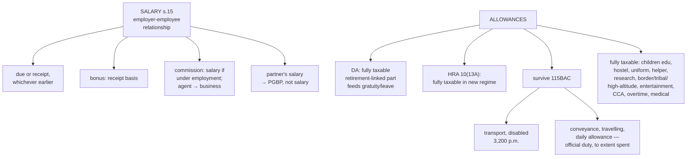

# Unit 2 — Salary: Chargeability & Allowances

Covers: chargeability of salary income, and treatment of the allowance list from the course plan (HRA, children education, hostel, transport-disabled, uniform, helper, research/academic, travelling, daily, conveyance, underground/border/remote/tribal/high-altitude, entertainment for govt employees). Feeds into [[Unit 2 - Perquisites]], [[Unit 2 - PF Gratuity Pension and Leave Encashment]], [[Unit 2 - Deductions and Computation of Taxable Salary]].

All treatment below is under **Section 115BAC**. Allowances the syllabus lists that carry no exemption under 115BAC are shown as fully taxable rather than with an exemption formula.

## Chargeability (Section 15)

Salary is taxable on **due or receipt basis, whichever is earlier** — i.e., salary is charged to tax in the PY in which it becomes due, even if not yet paid, or when actually received, whichever comes first. Includes salary from a former employer, present employer, and (in specific circumstances) a prospective employer. Salary is taxable only if there's an employer-employee relationship — a professional's fee is business/professional income, not salary, even if paid regularly.

**Recall prompt:** An employee's March salary is credited on 5 April. In which PY is it taxable? → PY in which it *became due* (March), because "due or receipt, whichever is earlier" — not the PY it was actually paid.

## Allowances — general rule

Allowances are fixed periodic payments over and above basic salary, given to meet specific expenses. Tax treatment falls into three buckets:
1. **Fully taxable** (no specific exemption section applies) — e.g., dearness allowance, city compensatory allowance, overtime allowance.
2. **Partially exempt** — exempt up to a prescribed limit or actual expenditure, whichever is lower; balance taxable.
3. **Fully exempt** — for specified allowances to government employees serving abroad, etc. (narrow category).

### Dearness Allowance (DA) — always tested, deserves its own line

**What it is:** a cost-of-living adjustment paid on top of basic pay to offset inflation, revised periodically against the **All-India Consumer Price Index (AICPI)**. Standard in government, PSU, and public-sector-bank pay structures; less common as a separate line in modern private-sector CTC (often folded into "special allowance" instead).

**Types:**
- **Industrial DA (IDA)** — for PSU/public-sector employees, revised **quarterly** based on AICPI movement.
- **Variable DA (VDA)** — for central government employees (and states following the same pattern) and some private-sector categories under the Minimum Wages framework, revised **twice a year** (Jan and Jul), consisting of a fixed component plus a variable component that moves with the AICPI.
- **DA merged with Basic Pay** — historically, when cumulative DA crosses **50%** of basic pay, governments have periodically merged it into basic pay itself (last done for central govt employees in 2004) to simplify pay structures; after a merger, a fresh DA cycle starts from a lower base.

**Calculation basis (illustrative, central govt formula):**
DA% = [(Average AICPI for the past 12 months − a fixed base-year index) ÷ base-year index] × 100, rounded per government notification. You won't be asked to compute this from raw index numbers in a tax paper — the DA **amount** is simply given as a figure in salary problems — but knowing *why* it changes (inflation-indexing) is a common one-line theory question.

**Tax treatment:** DA is **fully taxable at slab rate under "Salary" income, with zero exemption**, regardless of whether it's called IDA, VDA, or plain "DA" on the payslip. This is unconditional — unlike allowances under Section 10(14), there is no partial-exemption carve-out for DA anywhere in the Act.

What makes DA a recurring exam trap *beyond* its own taxability is that several *other* computations key off "salary" in a way that depends on **whether DA forms part of salary "for retirement benefits"** (i.e., under the terms of employment, DA counts toward PF/gratuity/pension calculation):
- **Provident Fund contributions** — employer/employee PF contributions are typically computed on Basic + DA, so higher DA directly increases both the contribution base and (via the 12%-of-salary cap) the risk of the employer's contribution crossing into taxable-perquisite territory — see [[Unit 2 - Perquisites]].
- **Gratuity computation** — "salary" in the 15-days/half-month formulas (see [[Unit 2 - PF Gratuity Pension and Leave Encashment]]) includes DA if it forms part of retirement benefits under the terms of employment.
- **Pension** — DA hikes flow straight into pension amounts for pensioners linked to DA-indexed pay scales; every DA revision for serving employees is mirrored as a Dearness Relief (DR) revision for pensioners.

**Recall prompt 1:** An employee's terms of employment say DA does *not* count toward retirement benefits. Does it still enter the gratuity "salary" figure? → No — gratuity's salary base is Basic + DA *only when DA forms part of retirement benefits*; if the terms say otherwise, the formula runs on Basic alone. This "forms part of retirement benefits" qualifier is the single most commonly missed condition in salary computation problems.

**Recall prompt 2:** Is any part of DA ever exempt from tax, the way gratuity partly is? → No — DA has no exemption provision at all; 100% of whatever DA figure is given in a problem goes straight into Gross Salary as taxable income.

### Bonus and commission — the other two computation-format line items that only got a mention

Both are fully taxable, no exemption — but each has its own timing/inclusion nuance worth knowing beyond "add it to gross salary":

- **Bonus**: taxable in the PY it is **received** (unlike regular salary, which follows due-or-receipt-whichever-is-earlier — bonus is specifically taxed on receipt basis under Section 15's explanation, since a bonus typically isn't a contractually "due" amount until declared/paid). Includes statutory bonus (Payment of Bonus Act), festival/ex-gratia bonus, and performance bonus alike — all fully taxable, no distinction in tax treatment by bonus type.
- **Commission**: taxable as salary only if it arises from the **employer-employee relationship** (e.g., a fixed percentage of turnover paid to a sales employee under their employment contract) — taxed on due-or-receipt basis like regular salary. Commission paid to an independent agent with no employment relationship is business/professional income instead, not salary — same distinguishing test as in Chargeability above. Commission that is *turnover-based* is one of the few components (along with DA-if-retirement-linked) that can be added to "salary" in the retirement-benefit formulas, e.g. the average-salary base for leave encashment under 10(10AA).

**Recall prompt:** A salesperson gets ₹50,000 fixed salary + 2% commission on personal sales, per their employment contract. Does the commission count toward the "salary" base for leave encashment? → Yes — turnover-based commission fixed as a percentage under the terms of employment is a specifically-included component, alongside Basic and (conditionally) DA.

### House Rent Allowance — Section 10(13A)

**Fully taxable.** Section 115BAC withdraws the 10(13A) exemption entirely, so the whole HRA received goes into Gross Salary no matter how much rent was actually paid, metro or non-metro. There is no least-of-three computation to run.

**Recall prompt:** An employee pays ₹1,80,000 rent and receives ₹1,80,000 HRA. How much is exempt? → Nil. The entire ₹1,80,000 is taxable salary; rent paid is irrelevant under 115BAC.

### Section 10(14) special allowances — the list from your syllabus

Section 115BAC carries forward only a short list of 10(14) exemptions. The rest of the syllabus list is **fully taxable** — know the names for recognition questions, but never apply an exemption to them in a computation.

**Exemption survives:**

| Allowance | Exemption |
|---|---|
| Transport Allowance for disabled employees | ₹3,200/month |
| Conveyance Allowance | To the extent spent on conveyance for official duties (not commuting) |
| Travelling Allowance | To the extent spent on official tour/transfer travel |
| Daily Allowance | To the extent spent while on tour/transfer away from normal place of duty |

The through-line: an allowance survives when it reimburses a real cost of doing the job. One that tops up pay is taxed as pay.

**Fully taxable** (no exemption to compute): Children Education, Hostel Expenditure, Uniform, Helper, Research/Academic, Underground (mines), Border/Remote/Tribal/High-Altitude/Compensatory Field Area, and Entertainment Allowance for government employees.

**[Verify before relying on this in an exam answer]** — the surviving list is drawn from the Section 115BAC notified exemptions; confirm against your professor/current Finance Act since this list has shifted with Budget amendments.

**Recall prompt:** An employee receives Children Education Allowance ₹2,400/year and Transport Allowance (disabled) ₹38,400/year. How much of each is exempt? → Children Education Allowance: ₹0, fully taxable. Transport Allowance for disabled: exempt up to ₹3,200/month = ₹38,400/year, one of the four that survive 115BAC.

## What to remember

- Salary is taxed only where there is an **employer-employee relationship**; on **due or receipt basis, whichever is earlier**.
- **Bonus** is taxed on **receipt**. **Commission** under the employment contract is salary; an agent's commission is business income. **Partner's salary** from a firm is business income, not salary.
- **DA**: fully taxable. Matters again only in retirement formulas, **if it forms part of retirement benefits**.
- **HRA**: fully taxable under 115BAC. No least-of-three computation.
- **Surviving 10(14) allowances** in the new regime: **transport allowance for disabled (₹3,200 p.m.)**, **conveyance** for official duty, **travelling** on tour/transfer, **daily** allowance on tour/transfer — each to the extent of the cost of the job.
- Everything else on the syllabus list (children education, hostel, uniform, helper, research/academic, underground, border/remote/tribal/high-altitude, entertainment) is **fully taxable**.

## Concept map

## Flashcards
Q: On what basis is salary taxed?
A: Due or receipt basis, whichever is earlier.

Q: March salary is paid on 5 April. In which PY is it taxed?
A: The PY in which it fell due (the year containing March).

Q: Is HRA exempt under the new regime?
A: No, it is fully taxable.

Q: Which s. 10(14) allowances survive under the new regime?
A: Transport allowance for disabled employees (₹3,200 p.m.), conveyance allowance for official duty, travelling allowance and daily allowance on tour or transfer.

Q: Children education allowance of ₹200 per month — exempt under the new regime?
A: No, fully taxable.

Q: Is DA ever exempt?
A: No, DA is always fully taxable.

Q: When does DA enter the salary base for gratuity and leave encashment?
A: When it forms part of retirement benefits under the terms of employment.

Q: Salary received by a partner from his firm — which head?
A: Profits and Gains of Business or Profession, s. 28(v).

Q: Is entertainment allowance to a government employee deductible under the new regime?
A: No; it is fully taxable and the s. 16(ii) deduction is not available.

## Sources
- [What is Dearness Allowance in Salary, its Calculation & Types](https://www.godigit.com/finance/salary/what-is-dearness-allowance)
- [Dearness Allowance - Meaning, Types, Taxation & How to Calculate](https://scripbox.com/tax/dearness-allowance/)
- [Section 10(14): Tax-Free Special Allowances For Employees](https://lemonn.co.in/blog/glossary/section-10-14/)
- [Allowances Exempt Under Section 10(14)](https://www.taxbuddy.com/blog/section-1014-allowances-list)

## Links
- [[Taxation Law MOC]]
- [[Unit 2 - Perquisites]]
- [[Unit 2 - PF Gratuity Pension and Leave Encashment]]
- [[Unit 2 - Deductions and Computation of Taxable Salary]]
- [[Taxation Units 1-2 MCQ Bank]]
