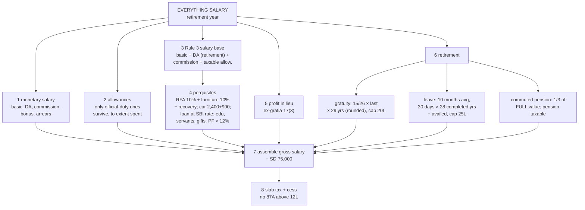

# Unit 2 — The Everything Salary Problem

One sum built to force every component of the salary head into play at once, worked line by line
under **Sec 115BAC, AY 2026-27**. Companion to [[Unit 2 - Salary Chargeability and Allowances]],
[[Unit 2 - Perquisites]], [[Unit 2 - PF Gratuity Pension and Leave Encashment]] and
[[Unit 2 - Deductions and Computation of Taxable Salary]].

It is set in a **retirement year** on purpose. That is the only fact pattern where running salary,
perquisites, and all three retirement lump sums appear in the same previous year.

---

## First: "salary" is five different numbers in this one problem

This is the thing that costs marks. Each formula defines its own base. Never carry one across.

| Formula | What "salary" means there | Basis | In this sum |
|---|---|---|---|
| **Gratuity, covered by Payment of Gratuity Act** | Basic + **the whole** DA. Sec 2(s) of that Act defines wages to include DA and to **exclude bonus, commission, HRA and overtime** — so the income-tax "forms part of retirement benefits" test never enters | **Last drawn** | ₹1,00,000 p.m. |
| **Gratuity, not covered by the Act** | Basic + DA *if it forms part of retirement benefits* + **turnover-based** commission | Average of last 10 months | not used here |
| **Leave encashment, 10(10AA)** | Same as above | Average of last 10 months | ₹96,000 p.m. |
| **Employer PF, 12% cap** | Same as above | Current month | ₹96,000 p.m. |
| **Rent-free accommodation, Rule 3** | Basic + DA *if retirement-linked* + bonus + **all** commission + any other monetary payment (arrears, advance, fees) + **every taxable allowance, to the extent taxable** | Period of occupation | ₹10,91,200 for the 9 months |
| **Entertainment allowance, 16(ii)** | Basic alone — no DA, no commission | — | n/a, 115BAC does not allow 16(ii) |

**Rule 3 excludes** five things, and each is a mark: the non-retirement portion of DA, the employer's
PF contribution, exempt allowances, the value of any perquisite under 17(2), and every lump sum
received on retirement or termination.

Two distinctions do most of the damage:

- **"Commission" is not the same word twice.** The gratuity/leave-encashment/PF family counts only
  commission fixed as a **percentage of turnover**. Rule 3 counts *all* commission, because its
  definition reaches "any monetary payment by whatever name called" — which also pulls in arrears
  and advance salary that the other formulas ignore.
- **"All taxable allowances" is not "all allowances except HRA."** Only the taxable portion of each
  allowance enters. HRA is not carved out — under 115BAC it is fully taxable and would go straight
  in. You never see it in a sum because HRA and rent-free accommodation are mutually exclusive in
  practice, not because a rule excludes it.

Read the bases against each other: gratuity-under-the-Act takes **full DA and no commission**, leave
encashment takes only the **retirement-linked half plus turnover commission**, and Rule 3 stacks
bonus, arrears and every taxable allowance on top of that. Same employee, same month, three
different figures.

---

## The problem

**Mr. Arjun Mehta**, a non-government employee of Zenith Industries Ltd, **Bengaluru** (population
above 40 lakh), retired on **31 December 2025** after **28 years 7 months** of service. He is covered
by the Payment of Gratuity Act. He has no other income and is taxed under the default regime.

**Pay, 1 April – 31 December 2025 (9 months)**
- Basic salary ₹80,000 p.m.
- Dearness allowance ₹20,000 p.m., **50% of which forms part of retirement benefits**
- Commission at 2% on turnover achieved; turnover ₹27,00,000 → ₹6,000 p.m.
- Bonus ₹1,00,000, received October 2025
- Arrears of salary ₹60,000 for a FY 2023-24 pay revision, received August 2025

**Allowances (per month unless stated)**
- Children education allowance ₹500 per child, 2 children
- Hostel expenditure allowance ₹800
- Conveyance allowance for official duty ₹4,000, actually spent ₹3,500
- Daily allowance while on tour ₹25,000 for the year, fully spent
- City compensatory allowance ₹2,000
- Overtime allowance ₹15,000 for the year
- Medical allowance ₹1,500

**Perquisites**
- Rent-free **unfurnished** flat owned by the employer, occupied all 9 months; furniture costing
  ₹4,00,000 also provided; ₹5,000 p.m. recovered from him
- Car of 1,800 cc owned by the employer, used for both official and personal purposes, employer bears
  all running expenses and provides a driver
- Interest-free housing loan of ₹5,00,000, outstanding in full every month (SBI rate on 1 April 2025: 9%)
- Two children educated free in a school maintained by the employer, cost to employer ₹900 per child
  per month
- Gardener and watchman paid by the employer, ₹3,000 p.m. in total
- Gas, electricity and water bills paid by the employer, ₹2,000 p.m.
- Free lunch in office, ₹80 per meal for 180 days
- Wristwatch worth ₹12,000 gifted on retirement
- Employer contributes **14%** of salary to the recognised PF; interest credited at **10%** on the
  balance, ₹80,000 for the year
- Ex-gratia of ₹1,50,000 paid on retirement

**On retirement**
- Gratuity ₹22,00,000
- Leave encashment ₹11,00,000. Entitlement 30 days per completed year; 180 days availed during service
- Pension fixed at ₹40,000 p.m. from 1 January 2026; he commuted **60%** and received ₹18,00,000

**Compute income under the head Salary and the tax payable for AY 2026-27.**

---

## Step 1 — Monetary salary

| Item | Working | ₹ |
|---|---|---|
| Basic | 80,000 × 9 | 7,20,000 |
| DA (fully taxable, no exemption anywhere in the Act) | 20,000 × 9 | 1,80,000 |
| Commission on turnover | 6,000 × 9 | 54,000 |
| Bonus | taxable on **receipt** | 1,00,000 |
| Arrears of salary | taxable on **receipt**; Sec 89 relief claimable separately | 60,000 |
| | | **11,14,000** |

## Step 2 — Allowances

Under 115BAC only four 10(14) exemptions survive: travel on tour or transfer, daily allowance while
away, conveyance for official duty, and transport allowance for a disabled employee. Everything else
is added in full.

| Allowance | Received | Exempt | Taxable |
|---|---|---|---|
| Children education (500 × 2 × 9) | 9,000 | nil | 9,000 |
| Hostel expenditure (800 × 9) | 7,200 | nil | 7,200 |
| Conveyance, official duty (4,000 × 9) | 36,000 | 31,500 (spent) | 4,500 |
| Daily allowance on tour | 25,000 | 25,000 (fully spent) | nil |
| City compensatory (2,000 × 9) | 18,000 | nil | 18,000 |
| Overtime | 15,000 | nil | 15,000 |
| Medical allowance — **cash, so never exempt** | 13,500 | nil | 13,500 |
| | | | **67,200** |

> **If the problem gives HRA instead of a rent-free flat**, there is nothing to compute. 115BAC
> withdraws 10(13A) entirely: add the whole HRA received to gross salary and move on. Rent paid,
> metro or non-metro, none of it matters.

## Step 3 — The Rule 3 salary base

Needed before the accommodation can be valued.

| | ₹ |
|---|---|
| Basic | 7,20,000 |
| DA forming part of retirement benefits (10,000 × 9) | 90,000 |
| Commission | 54,000 |
| Bonus | 1,00,000 |
| Arrears | 60,000 |
| All taxable allowances (Step 2) | 67,200 |
| **Rule 3 salary for the 9 months of occupation** | **10,91,200** |

Excluded: the non-retirement half of DA, the exempt allowances, every perquisite, the employer's PF
contribution, and the retirement lump sums.

## Step 4 — Perquisites

| Perquisite | Working | ₹ |
|---|---|---|
| Rent-free accommodation, employer-owned, city above 40 lakh → **10% of salary** | 10% × 10,91,200 | 1,09,120 |
| Furniture | 10% p.a. of 4,00,000 × 9/12 | 30,000 |
| *Less* rent recovered | 5,000 × 9 | (45,000) |
| **Accommodation, net** | | **94,120** |
| Car above 1.6 litre, both uses, employer bears expenses + driver | (2,400 + 900) × 9 | 29,700 |
| Interest-free loan | 5,00,000 × 9% × 9/12 | 33,750 |
| Free education, employer-maintained school | ₹900 ≤ ₹1,000 per child per month → **nil** | nil |
| Gardener and watchman | 3,000 × 9 | 27,000 |
| Gas, electricity, water | 2,000 × 9 | 18,000 |
| Free meals in office | (80 − 50) × 180 | 5,400 |
| Gift in kind | 12,000 − 5,000 | 7,000 |
| Employer PF above 12% | 14% − 12% = 2% of (96,000 × 9) | 17,280 |
| RPF interest above 9.5% | 0.5/10 × 80,000 | 4,000 |
| | | **2,36,250** |

Two traps in that table. The **education** line is a threshold, not a deduction — at ₹900 the whole
perquisite is nil, and if it crossed ₹1,000 the treatment of the excess is disputed, so state your
assumption. The **PF** line uses the ₹96,000 base, not basic alone and not the Rule 3 figure.

> **[Verify]** The ₹50-per-meal relief is well settled for food served in office premises. Its
> availability for **meal vouchers** under 115BAC is not — the proviso to 115BAC(2) is read by many
> commentators as withdrawing the voucher exemption. If your problem says "meal coupons", flag the
> assumption in your answer.

## Step 5 — Profit in lieu of salary

Ex-gratia on retirement, Sec 17(3): **₹1,50,000**, fully taxable. Sec 17(3) exists to stop severance
and retirement top-ups being relabelled as capital receipts.

## Step 6 — Retirement benefits

**Gratuity — 10(10), covered by the Act.** Service 28 years 7 months → **29 years** (a part above
6 months rounds up). Wages = last drawn basic + full DA = ₹1,00,000.

- (a) Actual: ₹22,00,000
- (b) (1,00,000 ÷ 26) × 15 × 29 = ₹16,73,077
- (c) Statutory ceiling: ₹20,00,000
- **Exempt = least = ₹16,73,077 → taxable ₹5,26,923**

**Leave encashment — 10(10AA), non-government.** Completed years = **28** (no rounding here — this is
the second half of the same trap). Credit 28 × 30 = 840 days, less 180 availed = **660 days**.
Average salary of the last 10 months = ₹96,000.

- (a) Actual: ₹11,00,000
- (b) 10 months' average salary: ₹9,60,000
- (c) Cash equivalent of 660 days = 22 × 96,000 = ₹21,12,000
- (d) Ceiling: ₹25,00,000
- **Exempt = least = ₹9,60,000 → taxable ₹1,40,000**

**Commuted pension — 10(10A).** 60% commuted for ₹18,00,000, so the **full (100%) commutation value
is ₹30,00,000**. Gratuity was also received, so 1/3 is exempt.

- Exempt = 1/3 × 30,00,000 = ₹10,00,000
- **Taxable = 18,00,000 − 10,00,000 = ₹8,00,000**

The fraction is applied to the notional full value, never to the amount actually received. This is
the single most commonly botched line in the unit.

**Uncommuted pension.** After commuting 60%, monthly pension is 40% × 40,000 = ₹16,000, for January
to March 2026 = **₹48,000**, fully taxable. Monthly pension is always fully taxable, for everyone.

Retirement benefits taxable: 5,26,923 + 1,40,000 + 8,00,000 + 48,000 = **₹15,14,923**

## Step 7 — Assembly

| | ₹ |
|---|---|
| Monetary salary (Step 1) | 11,14,000 |
| Taxable allowances (Step 2) | 67,200 |
| Perquisites (Step 4) | 2,36,250 |
| Profit in lieu of salary (Step 5) | 1,50,000 |
| Taxable retirement benefits (Step 6) | 15,14,923 |
| **Gross Salary** | **30,82,373** |
| *Less* standard deduction, Sec 16(ia) — the only Sec 16 deduction 115BAC allows | (75,000) |
| **Income under the head "Salary"** | **30,07,373** |

## Step 8 — Tax

No other income, so Gross Total Income = Total Income = ₹30,07,373 (Chapter VI-A is effectively shut
under 115BAC; only 80CCD(2) would have applied, and there is no employer NPS contribution here).

| Slab | Rate | Tax ₹ |
|---|---|---|
| Up to 4,00,000 | Nil | — |
| 4,00,001 – 8,00,000 | 5% | 20,000 |
| 8,00,001 – 12,00,000 | 10% | 40,000 |
| 12,00,001 – 16,00,000 | 15% | 60,000 |
| 16,00,001 – 20,00,000 | 20% | 80,000 |
| 20,00,001 – 24,00,000 | 25% | 1,00,000 |
| Balance 6,07,373 | 30% | 1,82,212 |
| **Tax** | | **4,82,212** |
| Surcharge — income below ₹50L | | nil |
| Health & education cess @ 4% | | 19,288 |
| **Total tax payable (rounded off, Sec 288B)** | | **₹5,01,500** |

No 87A rebate: that dies above ₹12,00,000 of total income.

---

## What this sum does not cover

Worth recognising if it turns up, none of it changes the method:

- **Transport allowance for a disabled employee** — ₹3,200 p.m. exempt, and one of the four that
  survive 115BAC. Arjun is not disabled, so it could not appear here.
- **VRS compensation, 10(10C)** — exempt up to ₹5,00,000, once in a lifetime.
- **Retrenchment compensation, 10(10B)**.
- **ESOPs** — perquisite valued at FMV on exercise date minus the price paid.
- **Employer's NPS contribution** — perquisite above 14% of salary, and the matching **80CCD(2)**
  deduction, which is the one Chapter VI-A item that survives 115BAC.
- **Sec 17(2)(vii) aggregate cap** — employer contributions to PF + NPS + superannuation together
  above ₹7,50,000 in a year are a perquisite. Here the total is nowhere near it.
- **Sec 89 relief** on the ₹60,000 arrears — computed on Form 10E, outside the salary head.
- **Unrecognised and statutory PF**, which are valued on entirely different rules from the RPF above.

## Recall prompts

1. Gratuity used ₹1,00,000 as monthly salary but leave encashment used ₹96,000. Why? → Gratuity under
   the Payment of Gratuity Act takes basic + **full** DA under the Act's own wages definition. Leave
   encashment takes basic + only the **retirement-linked** portion of DA + turnover commission.
2. Service was 28 years 7 months. Why 29 years for gratuity and 28 for leave encashment? → Gratuity
   rounds a part-year above six months up; leave encashment counts **completed** years only, no rounding.
3. He received ₹18,00,000 for commuting 60%. What figure does the 1/3 apply to? → ₹30,00,000, the full
   100% commutation value. Applying 1/3 to ₹18,00,000 is the classic error.
4. Rent recovered from the employee was ₹45,000 and the gross accommodation value ₹1,39,120. What if
   the recovery had exceeded the value? → The perquisite is nil, not negative. A recovery cannot create
   a deduction.
5. Which single line would change most if the flat were in a town of 12 lakh people? → The
   accommodation rate drops from 10% to 5% of salary; the population bands are 10% above 40 lakh,
   7.5% for 15–40 lakh, 5% below 15 lakh.

## Concept map

## Flashcards
Q: Why does gratuity use a different salary figure from leave encashment in this problem?
A: Gratuity under the PG Act uses basic + full DA; leave encashment uses basic + retirement-linked DA + turnover commission.

Q: Service of 28 years 7 months: years for gratuity (PG Act) and for leave encashment?
A: 29 for gratuity (part-year over 6 months rounds up); 28 for leave encashment (completed years only).

Q: 60% of pension commuted for ₹18 lakh, gratuity also received. Exempt amount?
A: One-third of the full value ₹30 lakh, i.e. ₹10 lakh.

Q: Rent recovered exceeds the accommodation value. Perquisite?
A: Nil, never negative.

Q: If the flat were in a city of 12 lakh population, what rate would apply?
A: 5% of salary.

Q: Is ex-gratia paid on retirement salary?
A: Yes, profit in lieu of salary u/s 17(3).

## Links
- [[Taxation Law MOC]]
- [[Unit 2 - Salary Chargeability and Allowances]]
- [[Unit 2 - Perquisites]]
- [[Unit 2 - PF Gratuity Pension and Leave Encashment]]
- [[Unit 2 - Deductions and Computation of Taxable Salary]]
- [[Units 1-2 - Section Cheat Sheet]]
- [[Taxation Units 1-2 MCQ Bank]]
