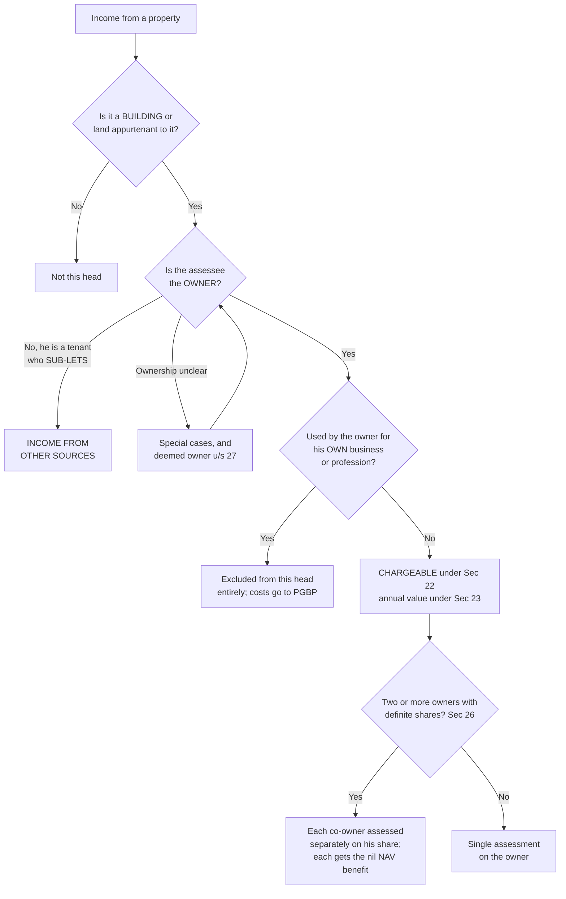

# HP-1 — Chargeability and Ownership

Covers: what kind of income lands under this head at all, the three conditions for a charge, who counts as the owner in the awkward cases, co-ownership, and the section map that holds the unit together.

## The head exists because property income does not behave like any other income

Before any arithmetic, notice what makes this head different from the four around it. Salary is money that actually arrived. Business income is receipts minus real costs. Capital gains needs a sale to have happened. House property is the only head where the Act taxes you on a value the property is *capable of* producing, whether or not a single rupee came in.

That single design choice explains almost every rule you will meet in the rest of this unit. Because the tax is on capacity rather than on cash, the Act needs some way to measure capacity, which is why there are four competing rental values waiting for you in HP-2. Because the tax is on capacity, a house sitting empty can still be taxed, which is why deemed let out property exists in HP-5. And because the owner has no real accounts to produce, the Act refuses to look at actual expenses at all and hands out a flat 30% instead, which is HP-6.

Hold that idea while you read the rest. The head taxes the property, and it sends the bill to the owner.

The income from houses, buildings, bungalows, land appurtenant and godowns is computed and assessed under the head Income from House Property. The annual value of the building or house property is determined according to the provisions of Section 23. And it is only the OWNER of the house property who can be taxed under this head.

## The three conditions for a charge

For income to be charged under this head, all three of these must hold together. In a theory answer, list them.

1. The property must consist of a **building or land appurtenant to it**.
2. The assessee must be the **owner** of the property.
3. The property must **not be used by the owner for the purposes of a business or profession** carried on by them, the profits of which are chargeable to income tax.

Each of the three is doing real work, and each is a place where an examiner can set a trap.

**Condition one** is why bare land is not house property. The head is about buildings. Land only enters when it is *appurtenant* to a building, meaning attached to it and serving it: the garden, the courtyard, the approach road, the parking area. Rent from an open plot with nothing standing on it is not house property income.

**Condition two** is the whole of the rest of this note, because ownership is the one condition that is genuinely contested in the fact patterns you will be given.

**Condition three** is a boundary rule between two heads. It is easy to state and easy to lose marks on. If you own a building and run your own business out of it, the Act does not ask you to pay tax on a notional rent that you are, in effect, paying to yourself. It removes the property from this head altogether. Note the wording carefully: not nil income under this head, but *outside* this head. The benefit reaches you the other way round. As a businessperson you claim the repairs, the depreciation and the municipal taxes on that building as business expenses under PGBP. Taxing a notional rent as well would be counting the same building twice.

So the phrase to carry into the exam hall: property used for the owner's own business is excluded from this head altogether.

## Ownership is the gateway, and the Act stretches the word

The charge attaches to the owner. Not to the person receiving the money, and not to the person in possession. Which means that in any problem where the receiver and the owner are different people, your first job is to find the owner, because the receiver may be taxable under a completely different head, or not at all.

The master notes give four special situations. Learn them as a set, because they are compact and they are exactly what a short theory question asks for.

| Situation | Who is treated as owner, and how it is taxed |
|---|---|
| Land taken on lease and a super-structure constructed on it | The person who takes the land on lease is treated as its owner |
| Property constructed in the name of a partnership | The partnership FIRM is assessable as owner, not the individual partner |
| House constructed by a co-operative building society and allotted or leased to its members | The members are deemed to be the owners of the building |
| The assessee takes a building on lease and derives income by SUB-LETTING or re-letting it | Such income is taxable under Income from Other Sources, NOT under house property |

Read those four together and a pattern falls out. The Act is trying to tax **whoever holds the economic substance of the building**, not whoever happens to hold the paper title.

The lessee who builds on leased land owns the building in every meaningful sense, so he is the owner. The partner who put the property into the firm's name has handed the substance to the firm, so the firm is assessed. The society member who has been allotted a flat lives in it and deals with it as his own, so he is deemed the owner even though the society holds the title.

**The sub-letting case is the one that gets tested most, and it is the odd one out.** A sub-letter is a tenant. He owns nothing. What he holds is a lease, which is a right against his landlord, not a building. So the second condition of the charge fails outright, and the income cannot come under this head however rent-like it looks. It goes to Income from Other Sources, where it is taxed on a net basis: he may set off the rent he himself pays to his landlord and his other expenses, and he gets no 30% standard deduction, because the 30% belongs to this head alone.

The practical consequence is worth spelling out, because problems are built this way. A owns a building, A lets it to B, B sub-lets to C. A's rent from B is house property income in A's hands. B's rent from C is Other Sources income in B's hands. Two different heads out of one building, decided entirely by who owns it.

## Deemed ownership under Section 27

Section 27 stretches "owner" further, this time for a defensive reason rather than an economic one. Without it, ownership would be the easiest thing in the Act to give away on paper while keeping in fact.

The categories, for completeness:

- An individual who **transfers property to their spouse** otherwise than for adequate consideration.
- An individual who **transfers property to a minor child**, not being a married daughter.
- The **holder of an impartible estate**.
- A **member of a co-operative society or company** to whom a building is allotted under a house-building scheme.
- A person **in possession of a property under part performance of a contract** under Section 53A of the Transfer of Property Act.
- A person **holding a lease of a property for a term of not less than twelve years**.

The first two are anti-avoidance and read as such. If a gift to your wife or your young child moved the rental income out of your hands, this head would be trivially avoidable by every married taxpayer in the country. So the Act says the transferor remains the owner. Notice the two qualifiers that examiners lean on: the transfer to a spouse must be for *inadequate consideration*, since a genuine sale at market value really does move ownership, and a *married daughter* is carved out of the minor-child limb.

The last two limbs run on the opposite instinct. They are about substance again. A buyer who has paid, taken possession and is only waiting on the registry is the owner in every way that matters, so Section 53A treats him as one. And a lease of twelve years or more is so close to ownership in duration that the Act stops distinguishing. Short leases, renewable month to month, stay outside that limb.

## Co-ownership, Section 26

Where a property is owned by two or more persons and their **respective shares are definite and ascertainable**, the income is NOT assessed as an association of persons. Each co-owner is assessed individually on their share of the income.

This matters more than it looks on the page. Assessing two co-owners as an AOP would pile their shares into one income and push the total up the slab table. Section 26 breaks the property apart and sends each share into its own owner's return, to be taxed at that owner's own slab rate.

And where the property is self-occupied by the co-owners, **each co-owner separately gets the nil annual value benefit**. Two people who jointly own the house they live in get one relief each, not one between them. Carry this forward to HP-5 and HP-6, because the interest deduction is also applied per co-owner.

The condition to watch is "definite and ascertainable". If the shares cannot be determined, Section 26 does not apply and the AOP treatment returns.

## The section map

Six numbers hold this unit together, and knowing which does what is worth easy marks in the one-liners.

| Section | What it does |
|---|---|
| 22 | Chargeability, the charging section for the head |
| 23 | Annual value, how the taxable value is determined |
| 24 | Deductions, the 30% and the interest |
| 25A | Recovery of unrealised rent and arrears of rent |
| 26 | Co-ownership |
| 27 | Deemed owner |

## What to remember

- Only the OWNER is taxed under this head. Sub-letting income goes to Other Sources.
- Sec 22 chargeability, Sec 23 annual value, Sec 24 deductions, Sec 26 co-ownership, Sec 27 deemed owner.
- Property used for the owner's own business is excluded from this head altogether.

## Concept map

## Flashcards
Q: Under which head is income from houses, buildings, bungalows, land appurtenant and godowns computed?
A: Income from House Property.

Q: State the three conditions for a charge under the head Income from House Property.
A: The property must consist of a building or land appurtenant to it; the assessee must be the owner; the property must not be used by the owner for a business or profession of theirs whose profits are chargeable to income tax.

Q: Who alone can be taxed under the head Income from House Property?
A: Only the OWNER of the house property.

Q: Land is taken on lease and a super-structure is constructed on it. Who is treated as the owner?
A: The person who takes the land on lease.

Q: A property is constructed in the name of a partnership. Who is assessable as owner?
A: The partnership FIRM, not the individual partner.

Q: A co-operative building society constructs a house and allots or leases it to its members. Who is deemed the owner?
A: The members are deemed to be the owners of the building.

Q: An assessee takes a building on lease and earns income by sub-letting it. Under which head is that income taxable?
A: Income from Other Sources, not House Property, because he is not the owner.

Q: How is a property used by the owner for his own business treated under this head?
A: It is excluded from the head altogether, and the related costs are claimed under PGBP instead.

Q: Name four categories of deemed owner under Section 27.
A: An individual transferring property to a spouse otherwise than for adequate consideration; an individual transferring to a minor child not being a married daughter; the holder of an impartible estate; a member of a co-operative society or company allotted a building under a house-building scheme; a person in possession under part performance of a contract under Sec 53A of the Transfer of Property Act; a person holding a lease for a term of not less than twelve years.

Q: Which relative is expressly carved out of the minor-child limb of Section 27?
A: A married daughter.

Q: Under Section 26, how is a co-owned property assessed where the shares are definite and ascertainable?
A: Not as an AOP. Each co-owner is assessed individually on their share of the income.

Q: Where co-owners self-occupy the property, do they share one nil annual value benefit or get one each?
A: Each co-owner separately gets the benefit.

Q: Match the sections: 22, 23, 24, 26, 27.
A: 22 chargeability, 23 annual value, 24 deductions, 26 co-ownership, 27 deemed owner.

Q: Is a lease of any length enough to make the lessee a deemed owner under Sec 27?
A: No. The lease must be for a term of not less than twelve years.

## Sources
- Master exam notes §3.1, Chargeability and Ownership
- Next node: [[Unit 3A - HP-2 Rental Values and ERV]]
- [[Unit 3A - House Property MOC (Node Map)]]
