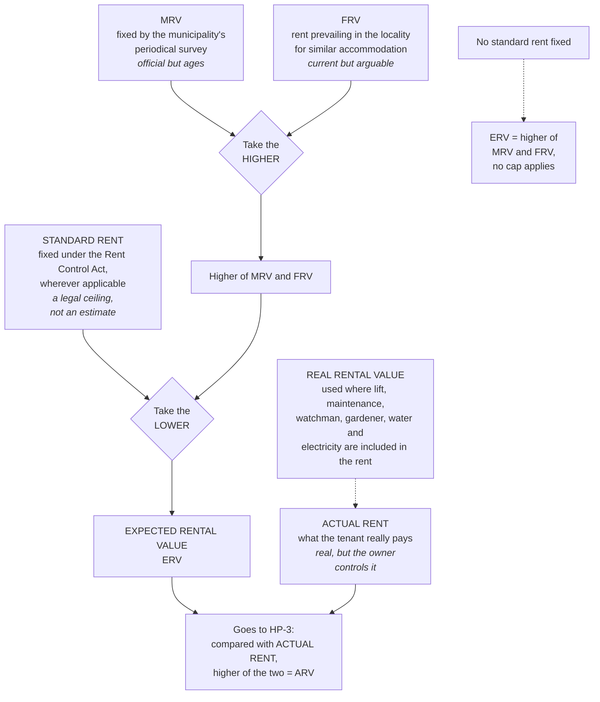

# HP-2 — Rental Values and the Expected Rental Value

Covers: the five rental values the Act works with, what each one actually measures, and the two-step rule that collapses them into a single figure called the Expected Rental Value.

## Why one property has five different rents

HP-1 ended on the observation that this head taxes what a property is *capable of* earning. That is a clean idea until you try to put a number on it, and then the trouble starts. Capable according to whom?

The actual rent is one answer, but it is the least reliable one, because the owner controls it. If the actual rent settled the matter, the head would collapse the moment anyone let a flat to a relative for ₹100 a month. So the Act does not trust the actual rent on its own. It goes looking for independent evidence of what the property could fetch, and it finds three separate sources of evidence, each imperfect in a different way.

That is why there are several rental values rather than one. Each is a different witness being asked the same question, and the rules in this note are simply the Act deciding which witness to believe.

| Term | Meaning |
|---|---|
| **Actual Rent** | The rent actually received by the owner of the house property from the tenant |
| **Real Rental Value (RRV)** | Used where the cost of common facilities such as lift, maintenance, watchman, gardener, water and electricity bill is included in the rent |
| **Municipal Rental Value (MRV)** | For the purpose of levying local taxes the municipal corporation conducts a periodical survey of house properties within its local limits. On the basis of such survey the rent fixed by the municipality is called the MRV. |
| **Fair Rental Value (FRV)** | The rental value of house property prevailing in the locality for a similar type of accommodation |
| **Standard Rent (SR)** | The rent fixed under the Rent Control Act wherever so applicable |

Now take them one at a time, because knowing what each *is* tells you why the rule treats it the way it does.

### Actual rent

What the tenant actually pays. Real money, verifiable, and in the great majority of ordinary commercial lettings it is the truest measure of the property's earning power. The Act's problem with it is only that it can be manipulated downward, never that it is inherently wrong. Which is why, as you will see in HP-3, the actual rent is never ignored. It is compared against a floor.

### Real Rental Value

This one is not a rival to the other three so much as a cleaning operation on the actual rent. Sometimes the rent a tenant pays is not purely rent. It bundles in the lift charges, the maintenance, the watchman, the gardener, the water and the electricity. The landlord is collecting one figure that pays for two different things: the use of the building, and a set of services.

Those services are not house property income. They are costs the owner is recovering. So where common facilities are folded into the rent, the Real Rental Value is the concept used to identify the genuine rent element. If a problem tells you the rent includes charges for services, do not treat the gross figure as the rent.

### Municipal Rental Value

The municipality has its own reason to value your house: it levies local taxes on it. To do that it conducts a periodical survey of properties within its local limits and fixes a rent for each one. That figure is the MRV.

Its strength is that it is official, independently arrived at, and completely outside the owner's control. Its weakness is that surveys are periodic, so the figure ages. A municipal valuation done four years ago will understate a rising market.

### Fair Rental Value

The rent prevailing in the locality for a similar type of accommodation. This is the market's answer rather than the state's: what comparable flats on comparable streets actually let for.

Its strength is that it is current. Its weakness is that "similar" is a matter of judgment, and comparables can be argued about.

So MRV and FRV are two independent estimates of the same thing, each unreliable in a different direction. Neither is obviously better. Which is exactly why the Act does not choose between them on the merits and instead applies a blunt rule: **take the higher.** The reasoning is revenue-protective, not evidential. Where two honest estimates disagree, take the one that yields more tax, and put the burden on the taxpayer to show otherwise.

### Standard Rent

The rent fixed under the Rent Control Act wherever so applicable. This is different in kind from everything above it. MRV and FRV are *estimates* of what the property could fetch. Standard rent is a **legal ceiling** on what the owner may lawfully charge.

That difference dictates how it is used. It would be plainly unjust to tax a man on a rent he is legally forbidden to collect. A rent-controlled flat might have an FRV of ₹1,80,000 while the law caps what the landlord can demand at ₹1,70,000. The extra ₹10,000 is not income he is forgoing. It is income the statute has taken away from him. So standard rent does not enter the "take the higher" competition at all. It sits on top of the result as a cap.

And note the qualifier in the definition: "wherever so applicable". Not every property is rent-controlled. Where no standard rent has been fixed, there is no cap, and the rule simplifies.

## The rule for the Expected Rental Value

Everything above compresses into this. Read the two limbs separately first.

**Where standard rent is NOT fixed:** the ERV is the **HIGHER of MRV and FRV**.

**Where standard rent IS fixed:** take the higher of MRV and FRV, but the amount so calculated **CANNOT EXCEED the standard rent**.

In other words, and this is the line to memorise:

> **ERV = LOWER of (higher of MRV and FRV) and (Standard Rent).**

Two steps, and they run in a fixed order because they are doing different jobs.

**Step one, higher of MRV and FRV**, resolves a disagreement between two estimates. Revenue-protective, so take the larger.

**Step two, cap at standard rent**, applies a legal limit. Taxpayer-protective, so take the smaller.

Students mix the two steps up under exam pressure and produce the "higher of all three" or the "lower of all three", both of which are wrong and both of which corrupt every figure downstream. The defence against that is to stop thinking of it as three numbers and start thinking of it as **two estimates having an argument, and then a law overruling whatever they agreed**.

### Working the rule by hand

Say MRV is ₹60,000 and FRV is ₹66,000.

*No standard rent fixed.* Higher of the two is ₹66,000. There is no cap. ERV = ₹66,000.

*Standard rent ₹69,000.* Higher of the two is ₹66,000. The cap is ₹69,000. ₹66,000 is already below the cap, so the cap does nothing. ERV = ₹66,000.

*Standard rent ₹52,000.* Higher of the two is ₹66,000. But the law says the owner cannot charge more than ₹52,000, so he cannot be taxed on ₹66,000. ERV = ₹52,000.

Notice that in two of those three cases the standard rent changed nothing. That is normal. The cap only bites when the market value has risen above the controlled rent, which is precisely the situation rent control exists to create. When a problem gives you a standard rent, check whether it is actually below the higher of MRV and FRV. If it is not, say so in one line and move on. Examiners include a non-binding standard rent to see whether you know the difference between applying a rule and applying it mechanically.

## Where ERV goes next

The ERV is not the answer to anything on its own. It is a **floor**. It is the Act's independent view of what this property ought to have earned, and it exists so that the actual rent can be tested against it.

In HP-3 the ERV meets the actual rent and the higher of the two becomes the Annual Rental Value. That single comparison is what stops a ₹100-a-month letting to a relative from working. If you let below what the property is worth, the Act taxes you on what it is worth anyway.

Which gives you the honest one-line summary of this note: **the ERV is the number the Act will fall back on when it does not believe your rent.**

## Concept map

## Flashcards
Q: Define Actual Rent.
A: The rent actually received by the owner of the house property from the tenant.

Q: When is the concept of Real Rental Value used?
A: Where the cost of common facilities such as lift, maintenance, watchman, gardener, water and electricity bill is included in the rent.

Q: Define Municipal Rental Value.
A: For the purpose of levying local taxes the municipal corporation conducts a periodical survey of house properties within its local limits, and the rent fixed by the municipality on the basis of that survey is the MRV.

Q: Define Fair Rental Value.
A: The rental value of house property prevailing in the locality for a similar type of accommodation.

Q: Define Standard Rent.
A: The rent fixed under the Rent Control Act wherever so applicable.

Q: State the ERV rule in one line.
A: ERV = LOWER of (higher of MRV and FRV) and Standard Rent.

Q: Where no standard rent has been fixed, what is the ERV?
A: The HIGHER of MRV and FRV.

Q: Where standard rent is fixed, how is the ERV arrived at?
A: Take the higher of MRV and FRV, but the amount so calculated cannot exceed the standard rent.

Q: MRV ₹60,000, FRV ₹66,000, standard rent ₹69,000. What is the ERV?
A: ₹66,000. The higher of MRV and FRV is ₹66,000, which is already below the standard rent, so the cap does not bite.

Q: MRV ₹60,000, FRV ₹66,000, standard rent ₹52,000. What is the ERV?
A: ₹52,000. The higher of MRV and FRV is ₹66,000, but it is capped at the standard rent.

Q: Why is standard rent applied as a ceiling rather than entered into the "higher of" comparison?
A: Because it is a legal limit on what the owner may lawfully charge, not an estimate of value, and an owner cannot be taxed on rent he is forbidden by law to collect.

Q: Why is the higher of MRV and FRV taken rather than the lower?
A: They are two independent estimates of the same value, each unreliable in a different direction, so the Act resolves the disagreement in favour of revenue.

Q: What role does the ERV play once computed?
A: It is the floor against which the actual rent is tested; the higher of ERV and actual rent becomes the Annual Rental Value.

Q: Is the ERV itself ever the final taxable figure?
A: No. It still has to be compared with actual rent, then adjusted for vacancy and municipal tax.

## Sources
- Master exam notes §3.2, Types of Rental Values and the Expected Rental Value (starred exam focus)
- Previous node: [[Unit 3A - HP-1 Chargeability and Ownership]]
- Next node: [[Unit 3A - HP-3 GAV and NAV]]
- [[Unit 3A - House Property MOC (Node Map)]]
