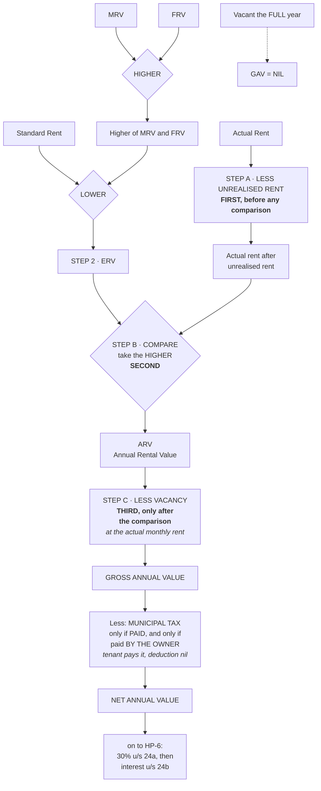

# HP-3 — Computation of Gross Annual Value and Net Annual Value

Covers: the five-step ladder from rental values to NAV, the standard computation format, the sequence rule for unrealised rent and vacancy, municipal taxes, and four worked illustrations.

## This is the spine of the unit

Six of the nine nodes in this unit hang off this one. Every numerical you will be set, whatever it is really testing, passes through the ladder in this note. If the ladder is shaky, a question about pre-construction interest still produces a wrong final figure, because the interest is being subtracted from a NAV you computed wrongly three lines earlier.

So read this one slowly, and rework all four illustrations with a pen.

## The standard steps

There are five, and they run in this order:

1. Compare MRV and FRV and take the **HIGHER** of the two.
2. Compare that figure with the Standard Rent and take the **LOWER**. This is the **Expected Rental Value (ERV)**.
3. Compare the ERV with the **Actual Rent Received** and take the **HIGHER**. This is the **Annual Rental Value (ARV)**.
4. Deduct the rent for the **vacancy period**. This gives the **GROSS ANNUAL VALUE (GAV)**.
5. Deduct the **municipal taxes actually PAID BY THE OWNER**. This gives the **NET ANNUAL VALUE (NAV)**.

Steps 1 and 2 are HP-2 and you already have them. Steps 3, 4 and 5 are this note.

### Step 3, why higher and not lower

The ERV is what the Act thinks the property should have earned. The actual rent is what it did earn. Taking the higher means the Act never accepts a rent below its own estimate, which is what shuts down letting cheaply to a relative. But notice it also means that where the actual rent is *above* the ERV, the actual rent wins. The Act is not capping you at its estimate. It is using its estimate as a floor and nothing more. Honest commercial landlords are taxed on what they really got.

That figure, the higher of the two, is the **Annual Rental Value (ARV)**.

### Step 4, vacancy

If the property lay empty for part of the year, the owner genuinely did not receive that rent. So the rent for the vacancy period comes off. This is the one place in the ladder where reality is allowed to reduce the notional figure, and it is allowed because a vacancy is a fact about the property, not a choice about the rent.

**Where the house is vacant for the FULL year, the GAV is NIL.** Take that as given rather than trying to derive it from the arithmetic. It is a stated rule.

### Step 5, municipal taxes

Two things to fix in your head here, and both of them are examined.

**Municipal taxes are deductible only on a PAID basis, not on an accrual basis.** It does not matter that the tax was levied for this year, or that it is due. The question is whether it was actually paid during the previous year. A useful consequence follows directly: **arrears of municipal tax paid during the year are deductible in that year**, even though they relate to an earlier year. The Act follows the cash, not the levy.

**And if the tenant or occupant pays them, no deduction is available to the owner at all.** This is the trap, and it is set constantly. A problem will tell you the municipality levies tax at 10% of MRV, quote a figure, and then mention in passing that it is borne by the occupant. The deduction is then nil. Not half, not a proportion. Nil. The owner did not part with the money, so he has nothing to deduct.

Look for two words in every problem: **paid**, and **by whom**. If either is missing or points the wrong way, the municipal tax line is zero.

## The computation format

Reproduce this layout in the answer script. The marks for method are real.

| Particulars | Amount (₹) |
|---|---|
| Expected Rental Value or Actual Rent, whichever is higher = ARV | xx |
| Less: Vacancy period rent | (xx) |
| **GROSS ANNUAL VALUE (GAV)** | **xx** |
| Less: Municipal taxes paid by the owner | (xx) |
| **NET ANNUAL VALUE (NAV)** | **xx** |
| Less: Standard deduction u/s 24(a) @ 30% of NAV | (xx) |
| Less: Interest on borrowed capital u/s 24(b) | (xx) |
| **INCOME FROM HOUSE PROPERTY** | **xx** |

The last three lines belong to HP-6, but keep them in view. They are why the NAV matters: the 30% is computed *on the NAV*, so an error in the NAV propagates into the standard deduction as well, and you lose the same marks twice.

## THE SEQUENCE RULE

This is the highest-value fact in the whole unit. Everything else in this note is a rule you can reconstruct from first principles. This one you cannot, and getting it wrong destroys the numerical.

> **Deduct UNREALISED RENT from the actual rent FIRST.**
> **THEN compare the result with the ERV.**
> **Only THEN deduct the VACANCY.**

Three operations, one fixed order: **unrealised rent, comparison, vacancy.**

Why the two adjustments sit on opposite sides of the comparison is worth understanding, because understanding it is the only reliable defence against reversing them under pressure.

**Unrealised rent is a fact about the rent.** The tenant was contracted to pay, he did not pay, and the owner could not recover it. So the actual rent, as a measure of what this letting produced, was never the contracted figure. The unrealised portion is stripped out *before* the comparison because the comparison is supposed to test a true actual rent against the ERV. Comparing an uncollected figure would be comparing a fiction.

**Vacancy is a fact about the property.** It is not saying the rent was wrong. It is saying that for some months there was no letting at all. That reduction applies to whichever annual value survived the comparison, ERV or actual rent, because it is about the property being empty, not about the rent being uncollected.

So: unrealised rent adjusts the *input* to the comparison. Vacancy adjusts the *output*.

The practical difference this makes is large. If you deducted vacancy first and then compared, the ERV would win far more often, and the GAV would come out higher. If you deducted unrealised rent after the comparison, the ERV would be untouched by the default and the GAV would come out higher again. Both errors push the answer the same way, which is why an examiner can spot the mistake at a glance.

### The conditions for unrealised rent to be deducted, Rule 4

Four conditions, all of which must be satisfied:

1. The **tenancy must be bona fide**.
2. The defaulting tenant must have **vacated**, or steps must have been taken to compel them to vacate.
3. The defaulting tenant must **not be in occupation of any other property** of the assessee.
4. The assessee must have **taken all reasonable steps to institute legal proceedings** for recovery, or must satisfy the Assessing Officer that such proceedings would be useless.

The shape of the list is recognisable: the Act will allow the deduction, but only after it has satisfied itself that the default is real and not an arrangement. Condition 3 is the neatest of the four. If the defaulting tenant is still renting another property from you, you clearly have leverage you are not using, and the story does not hold.

## Illustration 1, simple GAV

MRV ₹60,000 p.a.; FRV ₹66,000 p.a.

| Case | Working | GAV |
|---|---|---|
| (a) Actual rent ₹72,000; standard rent ₹69,000 | ERV = higher of 60,000 and 66,000 = 66,000, capped at SR 69,000, so 66,000. Actual rent 72,000 is higher. | **₹72,000** |
| (b) Actual rent ₹63,000; standard rent ₹69,000 | ERV = 66,000; actual rent 63,000 is lower, so take the ERV. | **₹66,000** |

Two cases, one changed figure, and they demonstrate the whole of step 3. In (a) the market rewarded the owner above the Act's estimate, so the Act taxes the real rent. In (b) the owner let below the estimate, so the Act falls back on its own figure. Note that the standard rent of ₹69,000 does nothing in either case, because ₹66,000 was already under it. That is deliberate on the examiner's part.

## Illustration 2, vacancy

MRV 60,000; FRV 66,000; standard rent 69,000; actual rent ₹7,000 p.m.

| Step | ₹ |
|---|---|
| Higher of MRV and FRV = 66,000; standard rent 69,000, so ERV = 66,000 | |
| Actual rent 7,000 × 12 = 84,000, which is higher, so this is the ARV | 84,000 |
| Less: Vacancy 2 months (7,000 × 2) | (14,000) |
| **GROSS ANNUAL VALUE** | **70,000** |

**Variation from the same problem.** If the actual rent were ₹4,000 p.m., that is ₹48,000 for the year. The ERV of ₹66,000 is now the higher, so ARV = ₹66,000. Less vacancy (4,000 × 2 = 8,000), giving **GAV ₹58,000**.

Look carefully at that variation, because it contains a detail students get wrong. The ARV was taken as the ERV, ₹66,000, but the **vacancy is still deducted at the actual monthly rent of ₹4,000**, not at one-sixth of the ERV. The vacancy deduction is the rent that was actually lost during the empty months, and the rent actually lost is the rent the tenant was actually paying.

**Also from the same problem:** if the house is vacant for the full year, GAV is NIL.

## Illustration 3, unrealised rent and vacancy together

This is the illustration that carries the sequence rule. Rework it until the order is automatic.

Continuing the same figures: actual rent ₹7,000 p.m., 2 months unrealised, 2 months vacant.

| Step | ₹ |
|---|---|
| Actual rent | 84,000 |
| Less: Unrealised rent (2 months) | (14,000) |
| Actual rent after unrealised rent | 70,000 |
| Expected ARV, higher of ERV and actual rent | 70,000 |
| Less: Vacancy (7,000 × 2) | (14,000) |
| **GROSS ANNUAL VALUE** | **56,000** |

Trace the ₹70,000 line. The ERV is ₹66,000 and the adjusted actual rent is ₹70,000, so the adjusted actual rent wins. Had you skipped the unrealised rent deduction and compared ₹84,000 against ₹66,000, you would have carried ₹84,000 forward and ended at a GAV of ₹70,000 instead of ₹56,000, an error of ₹14,000 that then flows into the 30% deduction and the final income.

And had you deducted the unrealised rent *after* the comparison, you would have taken ₹84,000 as the ARV, deducted vacancy to reach ₹70,000, and then had a ₹14,000 unrealised rent deduction sitting in your working with nowhere legitimate to go.

**The order is critical: deduct UNREALISED RENT from the actual rent FIRST, then compare with the ERV, and only then deduct the VACANCY.**

## Illustration 4, full NAV computation

Now everything at once, and with municipal tax.

MRV 1,60,000; FRV 1,80,000; SR 1,70,000; actual rent ₹16,000 p.m. = ₹1,92,000; vacant 1 month; 2 months' rent unrealised; municipal tax ₹1,60,000 of which 50% is paid by the owner.

| Step | Working | ₹ |
|---|---|---|
| ERV | Higher of 1,60,000 and 1,80,000 = 1,80,000, capped at the standard rent | 1,70,000 |
| Actual rent after unrealised rent | 1,92,000 − 32,000 | 1,60,000 |
| ARV, higher of ERV and actual rent | | 1,70,000 |
| Less: Vacancy (1 month) | | (16,000) |
| **GROSS ANNUAL VALUE** | | **1,54,000** |
| Less: Municipal tax paid by the owner | 50% of 1,60,000 | (80,000) |
| **NET ANNUAL VALUE** | | **74,000** |

Four things happen in this one problem, and each is a separate marking point.

**The standard rent finally bites.** The higher of MRV and FRV is ₹1,80,000, but the standard rent is ₹1,70,000, so the ERV drops to ₹1,70,000. This is the first illustration in the set where the cap does any work, which is exactly why it appears last.

**The unrealised rent is ₹32,000**, being two months at ₹16,000, and it comes off the ₹1,92,000 before anything else, leaving ₹1,60,000.

**The comparison now goes the other way.** Adjusted actual rent ₹1,60,000 against ERV ₹1,70,000, so the ERV wins and becomes the ARV. Note how the unrealised rent deduction changed the outcome of the comparison: unadjusted actual rent of ₹1,92,000 would have beaten the ERV comfortably.

**The municipal tax is halved, because only half of it was paid by the owner.** ₹80,000 is deducted and the other ₹80,000 is simply lost, because that half was not paid by the owner.

Also notice that the vacancy of one month is deducted at ₹16,000, the actual monthly rent, even though the ARV being reduced is the ERV. Same point as in Illustration 2.

## What to remember

- Municipal tax is deducted only if actually **PAID BY THE OWNER**. Paid by the tenant, deduction NIL.
- **Unrealised rent comes off BEFORE the ERV comparison; vacancy comes off AFTER it.**
- Vacant for the full year, GAV NIL.
- Municipal tax is on a paid basis, so arrears paid this year are deductible this year.

## Concept map

## Flashcards
Q: State the five standard steps from rental values to NAV.
A: Higher of MRV and FRV; lower of that and standard rent, giving ERV; higher of ERV and actual rent, giving ARV; less vacancy, giving GAV; less municipal tax paid by the owner, giving NAV.

Q: What is the correct order for unrealised rent, the ERV comparison and vacancy?
A: Unrealised rent comes off the actual rent FIRST, then compare against the ERV, and only THEN deduct vacancy.

Q: Why is unrealised rent deducted before the comparison but vacancy after it?
A: Unrealised rent is a fact about the rent, so it corrects the input to the comparison. Vacancy is a fact about the property, so it reduces whichever annual value survived the comparison.

Q: MRV 60,000, FRV 66,000, SR 69,000, actual rent 72,000. What is the GAV?
A: ₹72,000. ERV is 66,000, actual rent of 72,000 is higher.

Q: Same figures but actual rent 63,000. What is the GAV?
A: ₹66,000, the ERV, because the actual rent is lower.

Q: Actual rent ₹7,000 p.m., ERV ₹66,000, vacant 2 months. GAV?
A: ARV = 84,000, less vacancy 14,000, GAV ₹70,000.

Q: Actual rent ₹4,000 p.m., ERV ₹66,000, vacant 2 months. GAV?
A: ARV = ERV = 66,000, less vacancy 4,000 × 2 = 8,000, GAV ₹58,000. Vacancy is deducted at the actual rent even though the ARV is the ERV.

Q: Actual rent ₹7,000 p.m., 2 months unrealised, 2 months vacant, ERV ₹66,000. GAV?
A: 84,000 less unrealised 14,000 = 70,000; higher of that and ERV 66,000 is 70,000; less vacancy 14,000; GAV ₹56,000.

Q: A house is vacant for the whole year. What is the GAV?
A: NIL.

Q: Municipal tax of ₹1,60,000 is levied and the tenant pays all of it. What is the deduction to the owner?
A: Nil. Municipal tax is deductible only if paid by the owner.

Q: Are municipal taxes deductible on an accrual or a paid basis?
A: Paid basis only. So arrears of municipal tax paid during the year are deductible in that year.

Q: State the four Rule 4 conditions for deducting unrealised rent.
A: The tenancy must be bona fide; the defaulting tenant must have vacated or steps must have been taken to compel them to vacate; the defaulting tenant must not be in occupation of any other property of the assessee; the assessee must have taken all reasonable steps to institute legal proceedings for recovery, or satisfy the Assessing Officer that such proceedings would be useless.

Q: MRV 1,60,000; FRV 1,80,000; SR 1,70,000; rent ₹16,000 p.m.; 1 month vacant; 2 months unrealised; municipal tax 1,60,000, half paid by the owner. Find the NAV.
A: ERV 1,70,000; actual rent 1,92,000 − 32,000 = 1,60,000; ARV = 1,70,000; less vacancy 16,000 gives GAV 1,54,000; less municipal tax 80,000 gives NAV ₹74,000.

Q: On what figure is the 30% standard deduction computed?
A: On the NAV, not the GAV.

## Sources
- Master exam notes §3.3, Computation of Gross Annual Value and Net Annual Value (starred exam focus)
- Previous node: [[Unit 3A - HP-2 Rental Values and ERV]]
- Feeds: [[Unit 3A - HP-4 Part-Year Property]], [[Unit 3A - HP-5 Self-Occupied and Deemed Let Out]], [[Unit 3A - HP-6 Deductions from NAV Section 24]], [[Unit 3A - HP-8 Recovery of Unrealised Rent Section 25A]]
- [[Unit 3A - House Property MOC (Node Map)]]
