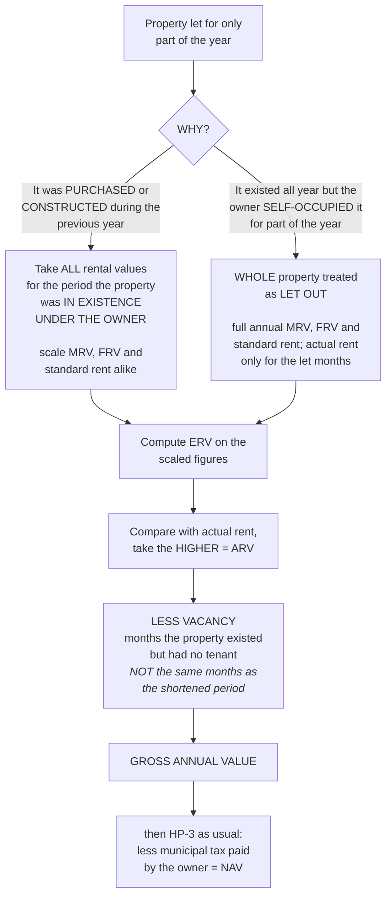

# HP-4 — Property Let Out or Acquired for Part of the Year

Covers: how the ladder in HP-3 is adjusted when the property did not exist under the owner for the whole year, the separate rule for a property that is partly let and partly self-occupied, and the ten-month trap in the worked illustration.

## Two different situations that look the same on the page

A problem tells you a property was let out for only part of the year. Before touching a figure, work out *why*, because there are two quite different reasons and the Act handles them differently.

**Reason one: the property did not exist under the owner for the whole year.** It was purchased or constructed during the previous year. Before that date the assessee had no property and therefore no house property income, and there is nothing to tax for those months.

**Reason two: the property existed all year but was let for only part of it,** because the owner lived in it for the rest.

The first case shortens the year. The second does not. Confusing them is the main way marks are lost here.

## Rule one, property acquired or constructed during the year

> If a house property is let out for part of the year because it was either purchased or constructed during the relevant previous year, take all the rental values ONLY for that period for which the house property was in existence under the owner during the previous year. Compare them and select the GAV accordingly.

The phrase doing the work is **in existence under the owner**. Not "let out". Not "occupied". The period runs from the moment the property came into the assessee's hands, by purchase or on completion of construction, to the 31st March at the end of that previous year.

And notice the scope of the instruction: take **all** the rental values only for that period. Not just the actual rent. The MRV, the FRV and the standard rent are annual figures, quoted in the problem for a full twelve months, and every one of them has to be scaled down to the shortened period before the ERV comparison is run. Scale the MRV but not the FRV and the whole comparison is being conducted between figures covering different lengths of time, which is meaningless.

This is where students most often go wrong, because the actual rent is naturally given month by month and so gets handled correctly by accident, while the annual values sit there in the question already looking like totals.

## Rule two, property partly let out and partly self-occupied over the year

> If a house property is let out for part of the year and is under self-occupancy for the other part, the WHOLE property is treated as let out, but the actual rent is taken only for the number of months for which the house property was let out.

Read that twice. The property is treated as **let out for the whole year**, which means the MRV, the FRV and the standard rent are taken for the full twelve months and are **not** scaled down. There is no nil annual value for the self-occupied months. The only concession is that the actual rent, being real money, is counted only for the months there was actually a tenant.

The logic follows from the head's design. The property existed under the owner for all twelve months, so its full annual capacity to earn is in play. The owner chose to live in it for some of them, and a choice does not reduce capacity. Contrast that with the acquisition case, where the shortening is not a choice at all: the property simply was not his.

The practical effect is severe on the taxpayer, and that is the point of the rule. Full annual ERV, part-year actual rent. Which means the ERV wins the comparison much more often in these problems than you would expect, and you should not be surprised when the ARV comes out as the ERV.

## The illustration

**Problem.** Construction completed 31 May 2025; the property is let out from 1 August 2025. For the full year, MRV ₹60,000, FRV ₹66,000, standard rent ₹63,000. Actual rent ₹6,000 p.m. Find the GAV for the previous year 2025-26.

| Step | Working | ₹ |
|---|---|---|
| MRV for 10 months | 60,000 × 10/12 | 50,000 |
| FRV for 10 months | 66,000 × 10/12 | 55,000 |
| Standard rent for 10 months | 63,000 × 10/12 | 52,500 |
| ERV, higher of MRV and FRV, capped at standard rent | higher of 50,000 and 55,000 = 55,000, capped at 52,500 | 52,500 |
| Actual rent | 6,000 × 10 | 60,000 |
| ARV, higher of the two | higher of 52,500 and 60,000 | 60,000 |
| Less: Vacancy (2 months × 6,000) | | (12,000) |
| **GROSS ANNUAL VALUE** | | **48,000** |

### The ten-month trap

This is the reason the illustration is in the syllabus, and it is worth slowing right down.

Construction was completed on **31 May 2025**. The property was let from **1 August 2025**. The previous year ends **31 March 2026**.

Now count. From 1 June 2025 to 31 March 2026 is **ten months**. From 1 August 2025 to 31 March 2026 is **eight months**.

The figure used throughout the illustration is ten. **The ten months is the period the property existed under the owner, not the period it was let.** That is exactly what Rule one said: take the rental values for the period the property was in existence under the owner.

So where did the other two months go? June and July, when the property existed but had no tenant. They are the **vacancy**, and that is the ₹12,000 line at the bottom, being two months at ₹6,000.

The whole structure of the answer depends on that reading:

- The MRV, FRV and standard rent are all scaled by **10/12**, the existence period.
- The actual rent is **6,000 × 10 = ₹60,000**, which is the rent for the existence period as if it had been let throughout.
- The two months the property stood empty are then removed as **vacancy** after the comparison, exactly as HP-3 requires.

If you had instead scaled everything by 8/12 and taken the actual rent as 6,000 × 8 = ₹48,000, you would have double counted the two empty months: once by shortening the period, and again by not having a vacancy to deduct. And the ERV would have been computed over a period that does not correspond to the period the assessee owned the property.

The check to run in the exam: **existence period first, vacancy afterwards.** The two must not be the same months.

Trace the ERV as well, because the standard rent bites here. The higher of the scaled MRV (₹50,000) and the scaled FRV (₹55,000) is ₹55,000, but the scaled standard rent is ₹52,500, so the ERV drops to ₹52,500. Then the actual rent of ₹60,000 beats it, so the ARV is ₹60,000. Everything after that is HP-3 unchanged.

## Separable and inseparable units

The master notes cover the partly let and partly self-occupied case again from a different angle in §3.5, and the two rules sit together:

- Where the units are **separable**, the NAV of the occupied part is NIL and the let out part is treated as rental.
- Where they are **not separable**, the whole is considered as rental.

The distinction between §3.4 and §3.5 is a distinction between **time** and **space**. §3.4 is about a property split across the *year*: let for some months, occupied for others. §3.5 is about a property split across *itself*: one floor occupied, another let, at the same time. Read the question carefully to see which split you are being given, because the treatments differ.

## What to remember

- Property acquired or constructed during the year: scale **all** the rental values, MRV, FRV and standard rent, to the period the property was in existence under the owner.
- Let for part of the year and self-occupied for the rest: the **whole** property is treated as let out. Full annual rental values, actual rent for the let months only.
- In the illustration, the ten months is the **existence period**, and the two empty months come out later as vacancy.

## Concept map

## Flashcards
Q: A property is let for part of the year because it was purchased during that year. Over what period are the rental values taken?
A: Only the period for which the house property was in existence under the owner during the previous year.

Q: Which rental values have to be scaled to the shortened period?
A: All of them: MRV, FRV and standard rent, along with the actual rent.

Q: A property is let for part of the year and self-occupied for the rest. How is it treated?
A: The whole property is treated as let out, but the actual rent is taken only for the number of months for which it was let.

Q: In the part-year case, are the annual values scaled down for the self-occupied months?
A: No. Only the actual rent is restricted to the let months; the rental values are taken for the full year.

Q: Construction completed 31 May 2025, let out from 1 August 2025. How many months are the rental values scaled to, and why?
A: Ten months, being 1 June 2025 to 31 March 2026, because that is the period the property was in existence under the owner, not the period it was let.

Q: In that illustration, what happens to June and July 2025?
A: They are treated as the vacancy period, and two months' rent of ₹6,000 each is deducted after the ERV comparison.

Q: MRV 60,000, FRV 66,000, SR 63,000 for the full year. Scale them to 10 months.
A: MRV 50,000, FRV 55,000, standard rent 52,500.

Q: With those scaled figures, what is the ERV?
A: ₹52,500. The higher of 50,000 and 55,000 is 55,000, capped at the scaled standard rent of 52,500.

Q: Actual rent ₹6,000 p.m. over the ten-month existence period. What is the ARV?
A: ₹60,000, since 6,000 × 10 = 60,000 beats the ERV of 52,500.

Q: Complete the illustration to the GAV.
A: ARV 60,000, less vacancy 2 × 6,000 = 12,000, GAV ₹48,000.

Q: Why is it wrong to scale the rental values to eight months in that illustration?
A: Because the two empty months would then be counted twice, once by shortening the period and again by deducting vacancy, and the ERV would cover a period different from the ownership period.

Q: Where a property has separable units, one occupied and one let, how is each treated?
A: The NAV of the occupied part is NIL and the let out part is treated as rental.

Q: Where the units are not separable, how is the property treated?
A: The whole is considered as rental.

Q: What is the difference in the split being tested by §3.4 and §3.5?
A: §3.4 splits the property across the year in time; §3.5 splits it across itself in space, into units occupied and let at the same time.

## Sources
- Master exam notes §3.4, Property Let Out or Acquired for Part of the Year, with the separable and inseparable unit rules from §3.5
- Previous node: [[Unit 3A - HP-3 GAV and NAV]]
- Next node: [[Unit 3A - HP-5 Self-Occupied and Deemed Let Out]]
- [[Unit 3A - House Property MOC (Node Map)]]
