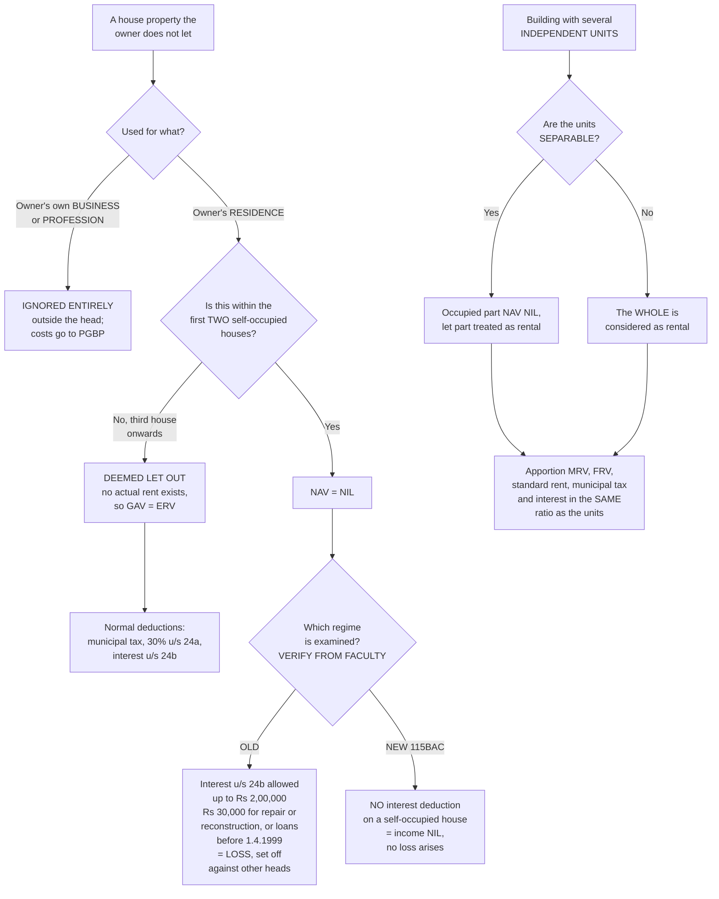

# HP-5 — Self-Occupied Property, Deemed Let Out and Multiple Units

Covers: the nil annual value for up to two self-occupied houses, why a third house is taxed on rent nobody paid, the business-use exclusion, multiple independent units, the old regime and new regime split on interest, and Mr. P's three-unit illustration.

## The problem the Act is solving

Go back to the design idea from HP-1. This head taxes a property's *capacity* to earn, not the cash it produced. Apply that consistently and something uncomfortable follows: the house you live in has exactly the same capacity to earn as the identical house next door that is let. So on the pure logic of the head, you should be taxed on the rent you would have received had you not been living in it.

That is a real position, and the Act held it for a long time. It is also politically impossible to apply to an ordinary family's only home. So the Act carves out an exception, and then, because an uncapped exception would be abused, it caps the exception at two houses and taxes the rest as though they were let.

Everything in this note is that compromise working itself out.

## The rules

**For a self-occupied house property used for RESIDENCE, the NAV is NIL for up to 2 houses. For the remaining houses it will be treated as DEEMED TO BE LET OUT and will be taxed.**

**A self-occupied house property used for the assessee's OWN BUSINESS OR PROFESSION is to be ignored entirely while computing house property income.**

Those two sentences are doing different things and the difference is examinable. A residential self-occupied house *enters* the computation and produces a NAV of nil. A business-use property does not enter the computation at all. It is outside the head, as HP-1 established, because the third condition of the charge fails. In a model answer, a residential self-occupied unit gets a line showing NAV nil; a business unit gets a line saying it is ignored.

The quick rule from the notes, worth keeping in that compressed form:

> **2 houses, exempt | 3rd house, if used for business or profession, ignore it.**

## Deemed let out property

Once you own more than two self-occupied residences, the surplus ones are **deemed to be let out**. The Act pretends there is a tenant.

Which raises an obvious mechanical question: if there is no tenant, what is the actual rent? There is none. So there is nothing to compare the ERV against.

**For a DEEMED LET OUT property there is no actual rent, so the GAV is simply the Expected Rental Value.** The comparison step collapses, because one side of it is empty. Then everything else in the HP-3 ladder runs normally: **all the normal deductions, municipal tax, the 30% standard deduction and interest, are available.**

That last point is the one worth holding, because students assume a deemed let out property must be treated harshly across the board. It is not. It is treated as an ordinary let out property in every respect except that its GAV is the ERV. The owner is taxed on notional rent, and in exchange he is given the full set of let-out deductions to set against it, including the 30% he would not have got on a self-occupied house.

There is a small consolation in this, and noticing it helps you choose correctly in problems. Where an assessee owns three houses and lives in one, he picks which two get the nil NAV. The sensible choice is to leave the house with the **lowest ERV net of deductions** as the deemed let out one. Examiners sometimes ask for the treatment that minimises tax, and that is what they want.

## Multiple independent units in one building

A single building can be split into parts used differently, and the Act follows the parts rather than the building.

**Where a house property consists of various independent units and 2 are under self-occupation while the others are let out, the annual value of the 2 self-occupied units is taken as NIL and the others are considered as let out.**

So the two-house limit is really a two-*unit* limit. Independence is what matters, not the number of front doors on the street.

Then the partly let and partly self-occupied case, where the wording is precise:

- Where the units are **SEPARABLE**, the NAV for the occupied part is NIL and the let out part is treated as rental.
- Where they are **NOT separable**, the whole is considered as rental.

The separability test is about whether the parts can be identified and valued on their own. Three self-contained floors with their own entrances are separable. A single flat where a lodger has a room and shares the kitchen is not. And where the parts cannot be separated, the Act does not attempt an arbitrary split. It takes the whole as let out, which is the answer less favourable to the assessee, because the alternative would be an invitation to claim that every property is really mostly self-occupied.

**The apportionment rule that goes with this:** where a property is split into units, apportion the MRV, FRV, standard rent, municipal tax and interest in the SAME ratio as the units. Three equal units means one-third of each figure to each unit. This is mechanical, and it is where arithmetic marks are lost through inconsistency rather than through not knowing the rule.

## Interest on a self-occupied property, and the regime question

Here is where HP-5 and HP-6 part company from the rest of the unit, because the two tax regimes give different final figures.

**Under the OLD regime,** interest on a loan for a self-occupied property is deductible **up to ₹2,00,000** (**₹30,000** where the loan is for **repair or reconstruction**, or where the loan was taken **before 1.4.1999**), even though the NAV is nil. Since there is no income to set it against, the result is a **loss from house property**, which is then set off against other heads.

**Under the NEW regime, Section 115BAC,** no interest deduction is available for a self-occupied property at all.

Set them side by side, because a question may be gradable either way:

| | Old regime | New regime, 115BAC |
|---|---|---|
| NAV of a self-occupied house | NIL | NIL |
| 30% standard deduction u/s 24(a) | Not available, there is no NAV to take 30% of | Not available |
| Interest u/s 24(b) on a self-occupied house | Deductible up to ₹2,00,000; ₹30,000 for repair or reconstruction loans, or loans taken before 1.4.1999 | **Not available at all** |
| Result | Negative income, a loss from house property | Nil income from that house |
| Loss set off against other heads | Yes | There is no loss to set off |
| Deemed let out property | Normal let out treatment, full deductions | Normal let out treatment, full deductions |

Note the bottom row. The regime split affects **self-occupied** property only. A deemed let out house is treated as let out, and the interest on it is ordinary let-out interest, which survives in both regimes. So in a three-house problem, the regime changes the treatment of the two self-occupied houses and leaves the third alone.

**[VERIFY FROM FACULTY / OFFICIAL MATERIAL]** The master notes flag that the position examined has not been confirmed. Until it is, learn both, and **state your assumption in the answer script**. One line at the top of the answer, "computed under the old regime, the Section 24(b) cap of ₹2,00,000 having been applied", costs nothing and protects the whole answer. An examiner marking the other basis can see that you knew there were two.

## Illustration, Mr. P, Chandigarh house in three equal independent units

One-third for own business, one-third for own residence, one-third let out at ₹3,000 p.m. and self-occupied for 1 month. MRV of the whole house ₹96,000 p.a. The municipality levies 10% tax but it is **PAID BY THE OCCUPANT**.

| Unit | Use | Computation | NAV |
|---|---|---|---|
| A | One-third for business | Ignored entirely | NIL |
| B | One-third for residence | Self-occupied | NIL |
| C | One-third let out | MRV 96,000 × 1/3 = 32,000; actual rent 3,000 × 12 = 36,000, so ARV 36,000; less vacancy 3,000, so GAV 33,000; municipal tax paid by the occupant, so NIL deduction | 33,000 |
| | **TOTAL INCOME FROM HOUSE PROPERTY** | | **33,000** |

Four separate points are being tested in one short problem.

**Unit A is ignored, not valued at nil.** It is used for the assessee's own business, so the third condition of the charge in HP-1 fails and it leaves the head. Write "ignored entirely" rather than computing a nil NAV, because the two are different in principle even though both contribute zero.

**Unit B gets the nil NAV** as a self-occupied residence. This is his only residential self-occupation, well within the limit of two.

**Unit C is where the arithmetic lives.** The MRV of the whole house is ₹96,000, so the unit's share is 96,000 × 1/3 = ₹32,000. That is the ERV, there being no FRV or standard rent given. The actual rent is ₹3,000 × 12 = ₹36,000, which is higher, so the ARV is ₹36,000. The unit was self-occupied for one month, treated here as a vacancy of ₹3,000, giving a GAV of ₹33,000.

**The municipal tax line is nil**, and this is the trap from HP-3 appearing in a live problem. The municipality does levy 10%, and on an MRV of ₹96,000 that would be ₹9,600, a third of which is ₹3,200. All of that is irrelevant, because the tax is **paid by the occupant**. The owner parted with nothing, so he deducts nothing. Write the line explicitly as nil with the reason, because that is where the mark is.

So the NAV of Unit C is ₹33,000, and the total income from house property, before the Section 24 deductions which this illustration does not carry, is **₹33,000**.

Notice also the treatment of the one self-occupied month in Unit C. The unit is treated as let out for the whole year and the one month of occupation is handled as a vacancy at the actual rent of ₹3,000, which is exactly the §3.4 rule from HP-4 doing its work.

## What to remember

- Self-occupied for residence: NAV nil for **up to two** houses; the rest are **deemed let out**.
- Self-occupied for the owner's own **business or profession**: ignored entirely, it never enters the head.
- Deemed let out: **GAV = ERV**, and all the normal deductions follow.
- Split a building into units in a **consistent ratio** across MRV, FRV, standard rent, municipal tax and interest.
- Separable units: occupied part nil, let part rental. Not separable: the whole is rental.
- Old regime interest cap ₹2,00,000 (₹30,000 for repair or reconstruction, or pre-1.4.1999 loans). New regime: nothing. **State your assumption.**

## Concept map

## Flashcards
Q: For how many self-occupied residential houses is the NAV nil?
A: Up to two.

Q: What happens to self-occupied residential houses beyond the second?
A: They are treated as deemed to be let out and are taxed.

Q: How is a house used for the assessee's own business or profession treated under this head?
A: It is ignored entirely while computing house property income.

Q: What is the GAV of a deemed let out property?
A: Simply the Expected Rental Value, because there is no actual rent to compare against.

Q: Which deductions are available on a deemed let out property?
A: All the normal ones: municipal tax, the 30% standard deduction and interest.

Q: A property is partly let and partly self-occupied, and the units are separable. How is it treated?
A: The NAV for the occupied part is nil and the let out part is treated as rental.

Q: Same case but the units are not separable?
A: The whole is considered as rental.

Q: In a unit-wise computation, which figures are apportioned and in what ratio?
A: MRV, FRV, standard rent, municipal tax and interest, all in the same ratio as the units.

Q: Under the old regime, what is the interest deduction limit on a self-occupied house?
A: ₹2,00,000, reduced to ₹30,000 where the loan is for repair or reconstruction or was taken before 1.4.1999.

Q: Under the new regime, Section 115BAC, what interest deduction is allowed on a self-occupied house?
A: None at all.

Q: Which regime is being examined for house property numericals?
A: [VERIFY FROM FACULTY] Not yet confirmed. Learn both and state the assumption in the answer script.

Q: Does the regime split affect a deemed let out property?
A: No. A deemed let out property gets the ordinary let out treatment and full interest deduction under both regimes.

Q: In the Mr. P illustration, why is the municipal tax deduction nil?
A: Because the 10% municipal tax is paid by the occupant, not the owner.

Q: In the Mr. P illustration, what is the NAV of the let out unit, and the total income from house property?
A: MRV share 96,000 × 1/3 = 32,000; actual rent 3,000 × 12 = 36,000, so ARV 36,000; less one month vacancy 3,000 gives GAV 33,000; municipal tax nil; NAV ₹33,000, which is also the total, since the business unit is ignored and the residence unit is nil.

## Sources
- Master exam notes §3.5, Self-Occupied Property, Deemed Let Out and Multiple Units (starred exam focus)
- Previous node: [[Unit 3A - HP-3 GAV and NAV]]
- Regime question shared with: [[Unit 3A - HP-6 Deductions from NAV Section 24]]
- [[Unit 3A - House Property MOC (Node Map)]]
