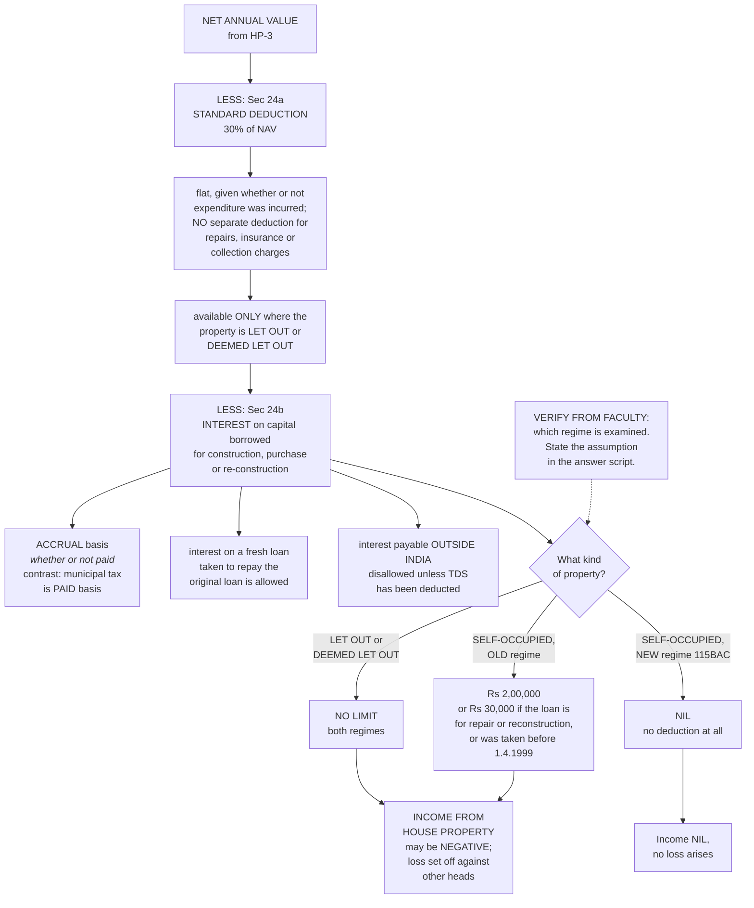

# HP-6 — Deductions from Net Annual Value, Section 24

Covers: the two deductions and only two, why the 30% is flat, why interest is on an accrual basis, the order in which they are applied, negative income from house property, and the old regime against new regime split.

## Only two deductions exist, and that is the whole point

HP-3 left you at the Net Annual Value. Section 24 takes you from the NAV to the income under the head, and it does so with exactly two deductions.

| Deduction | Section | Amount or limit |
|---|---|---|
| Standard Deduction | 24(a) | 30% of NAV, available ONLY when the house property is let out or deemed to be let out |
| Interest on loan taken for construction, purchase or re-construction | 24(b) | No limit, as stated in the notes (see the regime note below on self-occupied property) |

Two. Not two plus repairs. Not two plus insurance. Two.

That exhaustiveness is deliberate and it flows straight from the design of the head. Go back to HP-1. This head taxes a property's notional capacity to earn, which means the owner is not producing a set of accounts. He has no audited statement of what he spent on the roof. If the Act allowed deductions for actual repairs, it would be asking an assessing officer to adjudicate every landlord's plumbing bill, on a head where the income itself was never real. So it stops arguing and hands out a flat proportion instead.

**The 30% deduction is a flat allowance. It is given whether or not any expenditure is actually incurred, and no separate deduction for repairs, insurance or collection charges is allowed.**

Read that sentence in both directions, because both directions are examined.

**A landlord who spent nothing still gets the full 30%.** He does not have to show a single bill. The deduction is not a reimbursement, it is a standardised allowance, and a question that tells you "no repairs were carried out during the year" is testing precisely this. The answer is still 30%.

**A landlord who spent ₹80,000 on repairs against a NAV of ₹1,00,000 still gets only ₹30,000.** He cannot claim the excess, and he cannot claim the repairs separately in addition to the 30%. Whatever he actually spent is irrelevant in both directions.

And note the scope restriction in the table: the 30% is available **only when the property is let out or deemed to be let out**. A self-occupied house has a NAV of nil, so 30% of nil is nil anyway, but say it explicitly. The arithmetic and the rule agree, which is a mild comfort.

## Interest under 24(b)

The second deduction is interest on money borrowed for the **construction, purchase or re-construction** of the property. As the master notes state it, there is **no limit**. That is a correct statement for a let out property, and the qualification for self-occupied property is dealt with below.

Three features of the interest deduction are worth fixing, all of them stated in the notes and all of them producing one-line questions.

**Interest is allowed on an ACCRUAL basis, that is, whether or not it has actually been paid during the year.** Compare this with municipal tax in HP-3, which is on a paid basis only. Two lines of the same computation, two opposite bases. Students routinely apply the paid basis to interest, or the accrual basis to municipal tax, because they half-remember that one of them is different. The reliable way to hold it: **tax paid, interest accrued.** The tax goes to a third party, the municipality, so the Act waits for the money to move. The interest is the owner's own financing cost against the property, and the Act allows it as it arises.

**Interest on a fresh loan taken to repay the original loan is also allowable.** The refinanced loan inherits the character of the loan it replaced. Without this, refinancing to a lower rate would cost the owner his deduction, which would be an absurd result, and the second loan is still, in substance, money borrowed for the property.

**But interest payable outside India is not allowed unless tax has been deducted at source on it.** This one is not about house property at all. It is a general enforcement lever. Money leaving India as interest is the point at which India can collect from a non-resident lender, and the way it gets collected is TDS. So the Act conditions the borrower's deduction on the borrower having done the withholding. Deny the deduction and the incentive to deduct tax appears immediately.

## The order, and why it matters

**Interest is deducted after the 30% deduction, and can make the income from house property NEGATIVE.**

The order is fixed:

```
NET ANNUAL VALUE
  less  30% of NAV                    [Sec 24(a)]
  less  interest on borrowed capital  [Sec 24(b)]
  = INCOME FROM HOUSE PROPERTY
```

The 30% is computed on the NAV, not on the NAV after interest, and not on the GAV. Three figures are floating around at this point in a computation and the 30% attaches to exactly one of them. Take 30% of the GAV instead and you have inflated the deduction by 30% of the municipal tax, which is a small error that produces a wrong final figure and is easy for an examiner to spot.

**Negative income is permitted and is the normal result on a heavily financed property.** There is no rule anywhere in Section 24 requiring the income under this head to be at least nil. Interest can exceed the NAV as reduced by 30%, and when it does, the head produces a loss. That loss is then set off against income under other heads.

This is not an accident of drafting. It is the mechanism by which the tax system subsidises home borrowing, and it is why the regime question below matters so much in rupee terms.

## The two regimes

**[VERIFY FROM FACULTY / OFFICIAL MATERIAL].** The master notes flag this explicitly and it is carried through here rather than resolved. Your notes state that interest under 24(b) has "no limit". **That is correct for a LET OUT property. For a SELF-OCCUPIED property the old regime caps it at ₹2,00,000 and the new regime disallows it altogether. Confirm which position your faculty examines.**

Side by side:

| | Let out or deemed let out | Self-occupied, OLD regime | Self-occupied, NEW regime 115BAC |
|---|---|---|---|
| NAV | Computed through the HP-3 ladder | NIL | NIL |
| 30% u/s 24(a) | Yes, 30% of NAV | Nil, there is no NAV | Nil, there is no NAV |
| Interest u/s 24(b) | **No limit** | Capped at **₹2,00,000**, or **₹30,000** where the loan is for repair or reconstruction, or was taken **before 1.4.1999** | **Not available at all** |
| Possible result | Negative income | Negative income, up to the cap | Nil |
| Loss set off against other heads | Yes | Yes | No loss arises |

Three things to notice in that table.

**The let out column is unaffected by the regime question.** Interest on a let out property is deductible without limit in both regimes, and the loss it can generate is a real loss in both. So in a mixed problem, only the self-occupied units are in doubt.

**The ₹30,000 sub-limit has two independent triggers**, and either one is enough to drop the cap from ₹2,00,000. The loan being for **repair or reconstruction** is one. The loan having been taken **before 1.4.1999** is the other. A pre-1999 loan for original construction is still capped at ₹30,000, and a 2023 loan for repairs is capped at ₹30,000 too. Read the date and read the purpose.

**Under the new regime, a self-occupied house simply produces nil.** Not a loss, not a small deduction. Nil. Which removes the entire home-loan subsidy from the self-occupied case, and is consistent with what 115BAC does everywhere else: it withdraws itemised reliefs in exchange for lower rates.

**How to write this in the answer script.** Pick a basis, state it in one line at the head of the computation, and compute consistently. Something like: "Computed under the old regime; interest on the self-occupied house restricted to ₹2,00,000 u/s 24(b)." If time allows, add a two-line note showing what the figure would have been on the other basis. An examiner who marks the other regime can see the knowledge is there, and the assumption line is what converts a wrong regime into a stated assumption rather than an error.

## What to remember

- **Two deductions only.** No separate claim for repairs, insurance or collection charges.
- The 30% is on the **NAV**, is **flat**, and is available only for let out or deemed let out property.
- Interest is on an **accrual** basis; municipal tax is on a **paid** basis.
- Interest on a fresh loan taken to repay the original loan is allowable.
- Interest payable outside India is not allowed unless TDS has been deducted.
- **Order: NAV, then 30%, then interest.** Negative income is valid.
- Self-occupied interest: old regime ₹2,00,000 or ₹30,000; new regime nil. **[VERIFY FROM FACULTY]**

## Concept map



## Flashcards
Q: How many deductions are available under Section 24, and what are they?
A: Two. The standard deduction of 30% of NAV under 24(a), and interest on borrowed capital under 24(b).

Q: On what figure is the standard deduction of 30% computed?
A: On the Net Annual Value.

Q: No repairs were carried out during the year. How much standard deduction is allowed?
A: The full 30% of NAV. It is a flat allowance given whether or not any expenditure is incurred.

Q: Can repairs, insurance and collection charges be claimed separately in addition to the 30%?
A: No. No separate deduction for them is allowed.

Q: For which properties is the 30% standard deduction available?
A: Only where the house property is let out or deemed to be let out.

Q: Is interest under 24(b) allowed on a paid basis or an accrual basis?
A: Accrual basis, whether or not it has actually been paid during the year.

Q: Contrast that with municipal taxes.
A: Municipal taxes are deductible on a paid basis only. Tax paid, interest accrued.

Q: Is interest on a fresh loan taken to repay the original loan deductible?
A: Yes, it is allowable.

Q: When is interest payable outside India disallowed?
A: Unless tax has been deducted at source on it.

Q: In what order are the two deductions applied?
A: NAV, then the 30% standard deduction, then the interest.

Q: Can income from house property be negative?
A: Yes. Interest is deducted after the 30% and can make the income negative, and that loss is set off against other heads.

Q: Under the old regime, what is the interest limit on a self-occupied property?
A: ₹2,00,000, or ₹30,000 where the loan is for repair or reconstruction or was taken before 1.4.1999.

Q: Under the new regime 115BAC, what is the interest deduction on a self-occupied property?
A: None at all.

Q: Is the "no limit" position on 24(b) interest correct?
A: It is correct for a let out property. [VERIFY FROM FACULTY] For a self-occupied property the old regime caps it at ₹2,00,000 and the new regime disallows it, so state the assumption in the answer.

## Sources
- Master exam notes §3.6, Deductions from Net Annual Value, Section 24 (starred exam focus), including the [VERIFY FROM FACULTY / OFFICIAL MATERIAL] flag on the interest limit
- Previous node: [[Unit 3A - HP-3 GAV and NAV]]
- Next node: [[Unit 3A - HP-7 Pre-Construction Interest]]
- Regime question shared with: [[Unit 3A - HP-5 Self-Occupied and Deemed Let Out]]
- [[Unit 3A - House Property MOC (Node Map)]]
