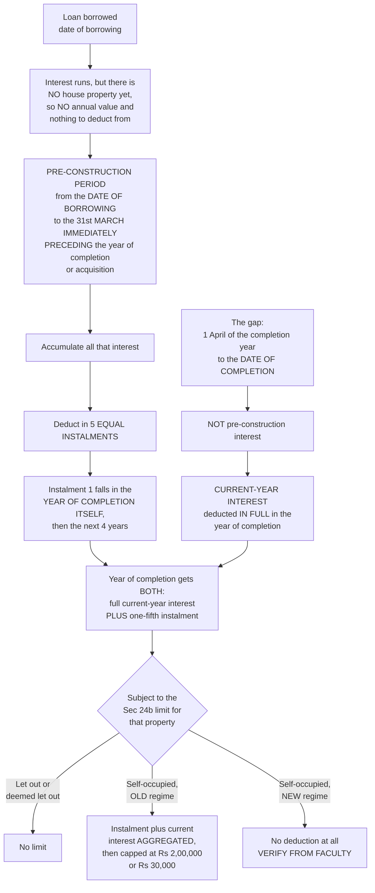

# HP-7 — Pre-Construction Interest

Covers: why interest paid before a house exists cannot simply be deducted, how the pre-construction period is defined, the five instalment rule, and the worked example with the dates that catch people out.

## The problem

You borrow money in April 2023 to build a house. The house is finished in July 2025. Interest has been running the whole time, and by any commercial measure it is a genuine cost of acquiring that property.

But under Section 24(b) interest is deducted from the Net Annual Value of a house property, and until July 2025 there is no house property. There is a loan and a building site. No annual value, no NAV, nothing to deduct from.

So the interest for those two-and-a-bit years has nowhere to go. The Act's options are to let it vanish, which is plainly unfair on a real cost, or to let the owner claim all of it in the year of completion, which would give him one enormous deduction in a single year and a very small one thereafter.

**It picks a third option: accumulate the interest, and then release it in five equal slices.**

That is the whole of HP-7. Everything else is the mechanics of defining which interest goes into the accumulation.

## Defining the pre-construction period

> The pre-construction period starts from the **date of borrowing of the loan** and ends on the **31st March immediately preceding the year of completion of construction or acquisition**.

Both ends of that definition need care.

**The start.** Not the date construction began, not the date of the first instalment being drawn, but the **date of borrowing**. If the loan was taken well before a brick was laid, the interest from the date of borrowing counts.

**The end.** This is the one that is examined, because the definition deliberately does **not** run up to the date of completion. It stops on the **31st March immediately preceding the previous year in which the construction was completed**.

Which means there is a gap. The period from that 1st April to the actual date of completion falls **outside** the pre-construction period. And it is not lost. It becomes ordinary interest for the year of completion, deducted in full in that year, because by the end of that previous year the property does exist and has an annual value.

The rule is cruder than reality, and that is the point. It means the split is always made at a financial year boundary, so that the whole of a previous year's interest is either pre-construction or current, never part of each. Nobody has to apportion interest across a mid-year date.

## The five instalment rule

> Interest for the pre-acquisition or pre-construction period is allowed as a deduction in **5 EQUAL INSTALMENTS**, beginning from the previous year in which the house is acquired or the construction is completed, and for the next 4 years.

Five instalments, one-fifth each. The first instalment falls in the **year of completion or acquisition itself**, not the year after. Count the year of completion as instalment one, then four more, which is why the phrasing is "beginning from that year and for the next 4 years".

And crucially:

> **Interest for the year of completion onwards is ordinary current-year interest and is deducted in full in that year, in addition to the one-fifth instalment.**

So in the year of completion the owner claims two things at once: the whole of that year's current interest, plus one-fifth of the accumulated pre-construction interest. And he goes on claiming the one-fifth for the four following years alongside each of those years' current interest.

This is the line that produces the marks in a numerical, and it is the line most often missed. A candidate who finds the pre-construction interest correctly, divides it by five correctly, and then forgets to add the current year's interest has thrown away the larger of the two figures.

## The worked example

Loan taken 1 April 2023; construction completed 1 July 2025.

**Step one, find the year of completion.** Completion on 1 July 2025 falls in the previous year 1 April 2025 to 31 March 2026, which is **PY 2025-26**.

**Step two, find the end of the pre-construction period.** The 31st March immediately preceding that year is **31 March 2025**.

**Step three, find the start.** The date of borrowing, **1 April 2023**.

**So the pre-construction period is 1.4.2023 to 31.3.2025, that is previous years 2023-24 and 2024-25.** Two full previous years of interest go into the accumulation.

**Step four, mind the gap.** **The period from 1.4.2025 to 30.6.2025 is NOT part of the pre-construction period.** Those three months of interest, and indeed the whole of the interest for PY 2025-26, are current-year interest for the year of completion.

**Step five, release it.** **The accumulated interest for those two years is deducted in 5 equal instalments starting from PY 2025-26.** So one-fifth each in PY 2025-26, 2026-27, 2027-28, 2028-29 and 2029-30.

Set out as a schedule, and assuming for illustration that interest accrued at ₹1,20,000 a year and that the property is let out:

| Previous year | Pre-construction instalment | Current-year interest u/s 24(b) | Total interest deduction |
|---|---|---|---|
| 2023-24 | Nil, the property does not exist | Nil | Nil |
| 2024-25 | Nil, the property does not exist | Nil | Nil |
| 2025-26, year of completion | 1/5 of ₹2,40,000 = ₹48,000 | ₹1,20,000 | ₹1,68,000 |
| 2026-27 | ₹48,000 | ₹1,20,000 | ₹1,68,000 |
| 2027-28 | ₹48,000 | ₹1,20,000 | ₹1,68,000 |
| 2028-29 | ₹48,000 | ₹1,20,000 | ₹1,68,000 |
| 2029-30 | ₹48,000 | ₹1,20,000 | ₹1,68,000 |
| 2030-31 onwards | Exhausted | ₹1,20,000 | ₹1,20,000 |

The ₹2,40,000 is the interest for PY 2023-24 and PY 2024-25 together, two years at ₹1,20,000. The rates and the amount are illustrative; the structure is what to carry.

Notice how the first two rows are nil. The accumulation is not deducted as it arises. It sits and waits for the property to come into existence.

## The three checks to run in an exam

Given any set of dates, run these in order and the answer follows.

**One. Which previous year does completion fall in?** Convert the completion date to a previous year running 1 April to 31 March. This is the year the instalments start.

**Two. What is the 31st March immediately preceding that year?** That closes the pre-construction period. Everything from the date of borrowing to that date accumulates.

**Three. What falls in the gap?** Any interest from that 1st April up to the completion date is current-year interest for the year of completion, not pre-construction interest. It is deducted in full, on top of the first one-fifth.

If completion happened on, say, 20 March 2026 instead of 1 July 2025, the year of completion would still be PY 2025-26, the pre-construction period would still end on 31 March 2025, and the gap would simply be longer, almost twelve months of current-year interest. The structure does not change with the month of completion within the year, which is exactly what the financial-year boundary rule was designed to achieve.

## How this interacts with the interest limits

Pre-construction interest is not a separate deduction. It is Section 24(b) interest arriving in instalments, which means it sits inside whatever limit applies to 24(b) interest for that property.

- **Let out or deemed let out property:** no limit, so the one-fifth instalment plus the current-year interest are both deducted in full.
- **Self-occupied property, old regime:** the one-fifth instalment and the current-year interest are **added together and the total is tested against the ₹2,00,000 cap**, or the ₹30,000 cap where that applies. The cap is on the aggregate, not on each component.
- **Self-occupied property, new regime 115BAC:** no interest deduction on a self-occupied house, so the instalments get nothing. **[VERIFY FROM FACULTY]** as flagged in HP-6.

The middle case is a favourite. A candidate computes ₹48,000 of instalment and ₹1,80,000 of current interest, totals ₹2,28,000, and forgets to restrict it to ₹2,00,000.

## What to remember

- Pre-construction period: from the **date of borrowing** to the **31st March immediately preceding the year of completion or acquisition**.
- Deducted in **five equal instalments**, starting in the **year of completion itself** and running for the next four years.
- The stub from that 1st April to the completion date is **not** pre-construction interest. It is current-year interest, deducted in full.
- In the year of completion the owner gets **both**: the full current-year interest **and** one-fifth of the accumulation.
- The instalment is part of 24(b) interest and is subject to the same limits as the rest of it.

## Concept map

## Flashcards
Q: When does the pre-construction period start?
A: From the date of borrowing of the loan.

Q: When does the pre-construction period end?
A: On the 31st March immediately preceding the year of completion of construction or acquisition.

Q: In how many instalments is pre-construction interest deducted?
A: Five equal instalments.

Q: In which year does the first instalment fall?
A: The previous year in which the house is acquired or the construction is completed, and then for the next four years.

Q: Loan taken 1 April 2023, construction completed 1 July 2025. What is the pre-construction period?
A: 1.4.2023 to 31.3.2025, that is previous years 2023-24 and 2024-25.

Q: In that example, how is the interest for 1.4.2025 to 30.6.2025 treated?
A: It is not part of the pre-construction period. It is ordinary current-year interest for PY 2025-26.

Q: In that example, from which previous year do the five instalments start?
A: PY 2025-26.

Q: In the year of completion, what interest deduction is available?
A: Both the full current-year interest and one-fifth of the accumulated pre-construction interest.

Q: Pre-construction interest of ₹2,40,000 and current interest of ₹1,20,000 in the year of completion, property let out. What is deducted that year?
A: ₹48,000 as the first instalment plus ₹1,20,000 of current interest, ₹1,68,000 in all.

Q: Is any pre-construction interest deducted in the years before completion?
A: No. Nothing is deducted until the year of completion, because until then there is no house property to deduct it from.

Q: Why does the pre-construction period end on a 31st March rather than on the completion date?
A: So that the split always falls on a financial year boundary and no previous year's interest has to be apportioned across a mid-year date.

Q: Is pre-construction interest a separate deduction from 24(b)?
A: No. It is 24(b) interest released in instalments, and it is subject to the same limits.

Q: Self-occupied property, old regime, instalment ₹48,000 and current interest ₹1,80,000. What is deducted?
A: ₹2,00,000. The two are aggregated to ₹2,28,000 and then restricted to the cap.

Q: What happens to the pre-construction instalments on a self-occupied house under the new regime?
A: No deduction is available at all. [VERIFY FROM FACULTY] which regime is examined.

## Sources
- Master exam notes §3.7, Pre-Construction Interest (starred exam focus)
- Previous node: [[Unit 3A - HP-6 Deductions from NAV Section 24]]
- Next node: [[Unit 3A - HP-8 Recovery of Unrealised Rent Section 25A]]
- [[Unit 3A - House Property MOC (Node Map)]]
