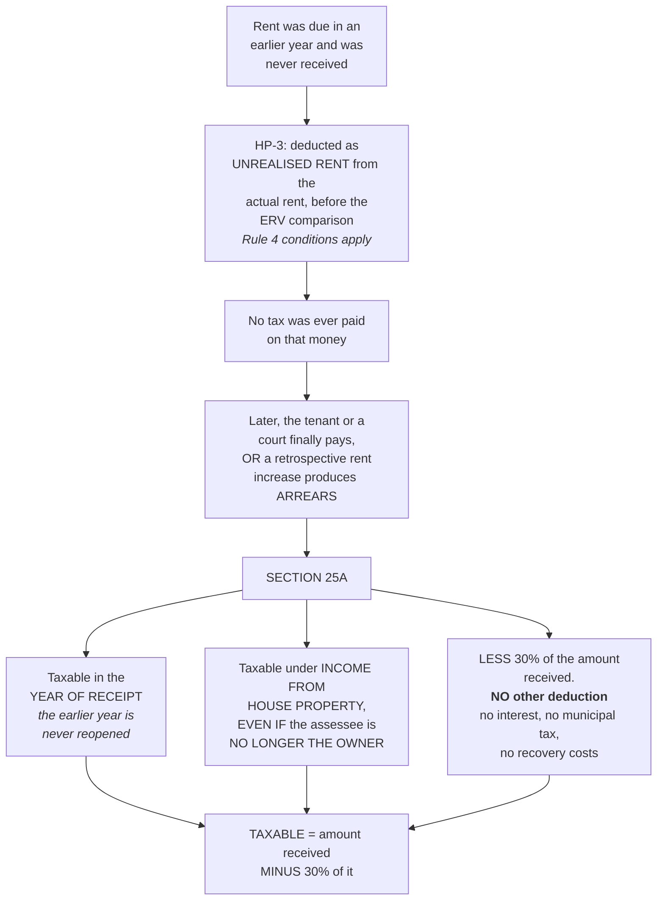

# HP-8 — Recovery of Unrealised Rent and Arrears of Rent, Section 25A

Covers: what happens when rent written off in an earlier year finally arrives, why it is taxed in the year of receipt even from a person who no longer owns the property, the flat 30% deduction against it, and how it differs from the unrealised rent deduction in HP-3.

## The loose end HP-3 left behind

In HP-3 you learnt to deduct unrealised rent from the actual rent before comparing it against the ERV. That deduction is a concession: the owner never got the money, so he is not taxed on it.

But look at what that concession leaves open. Suppose the deduction was allowed in PY 2023-24, and then in PY 2026-27 the defaulting tenant, or a court, finally pays. The owner now has money in his hand that has never been taxed. He escaped tax on it when it was due, on the ground that he had not received it, and if nothing more were said he would escape tax on it on receipt too, on the ground that it related to an earlier year.

That gap is what Section 25A closes. The master notes make the point directly: your notes deduct unrealised rent while computing GAV but never deal with what happens when it is later recovered. **Recovery of unrealised rent is a named topic in the course plan**, so it can be asked on its own.

The same provision also handles **arrears of rent**, which is the closely related case where a rent increase is agreed or awarded with retrospective effect and a lump sum for past years arrives now.

## The rule

**Any arrears of rent received, or unrealised rent subsequently realised, is taxable in the year of RECEIPT.**

**It is taxable under the head Income from House Property, and is taxable even if the assessee is NO LONGER THE OWNER of that property in the year of receipt.**

**A deduction of 30% of the amount so received is allowed. No other deduction is allowed against it.**

> **Taxable amount = Arrears or unrealised rent recovered − 30% of that amount**

Three design choices are packed into that, and each of them is doing something.

### Year of receipt, not year of accrual

The rent relates to an earlier year, and the natural instinct is to reopen that year and tax it there. The Act refuses to. It taxes the sum **in the year it is received**.

The reason is administrative. Reopening a completed assessment every time an old debt is settled would be an enormous amount of work for very little revenue, and it would leave every assessment provisionally open for years. Taxing on receipt closes the question in a single year with a single, simple computation. This is the same instinct you saw in HP-3, where municipal tax is deductible on a paid basis and arrears of municipal tax are allowed in the year they are paid. Both rules follow the cash rather than reopening the past.

### Taxable even if you no longer own the property

This is the limb most likely to be tested, because it looks wrong at first glance.

The whole head is built on ownership. HP-1 was emphatic: only the owner is taxed under this head. So how can a person who sold the house in 2025 be taxed under this head on money received in 2027?

Because the charge attaches to the **character of the receipt**, not to the current state of the title. The money is rent from a house property that he owned at the time it was earned. If losing ownership defeated the charge, the avoidance route would be obvious: write off the rent, sell the property, then collect. The provision forecloses that by fixing the head at the time the income arose and following the money wherever the owner has since gone.

Note the practical consequence for a problem: you may be given a fact pattern where the property was sold two years ago, and you must still bring the recovery in under this head. Do not divert it to Income from Other Sources.

### The flat 30%, and only the 30%

**A deduction of 30% of the amount so received is allowed. No other deduction is allowed against it.**

Two halves to that, and both matter.

The **30% is given** because the receipt is rent, and rent under this head always carries the standard deduction. Denying it would tax the recovered rent more heavily than the same rent would have been taxed had it been received on time, which would be a penalty for having been defaulted on.

But **no other deduction is allowed**. No interest under 24(b), no municipal tax, no legal costs of recovering the money. The computation is deliberately a single line: take the amount, knock off 30%, tax the rest. There is no NAV here, no GAV, none of the HP-3 ladder. The ladder computes the annual value of a property, and this receipt is not the annual value of anything. It is a stand-alone item being taxed on its own.

So if the recovered amount is ₹60,000, the taxable figure is 60,000 − 18,000 = **₹42,000**, and that is the end of it.

## Do not confuse the two unrealised rents

The word "unrealised rent" appears in both HP-3 and HP-8, doing opposite things. Keep them apart.

| | HP-3, §3.3 | HP-8, §3.8 |
|---|---|---|
| What is happening | Rent was due but never came in | Rent written off earlier has now come in |
| Effect | **Reduces** the actual rent | **Adds** to income |
| Where it sits | Inside the GAV ladder, before the ERV comparison | Outside the ladder, as a separate item |
| Conditions | The four Rule 4 conditions must be satisfied | Simply that it is received |
| Deduction | The 30% comes later, on the NAV | A flat 30% on the receipt itself |
| Ownership | The assessee is the owner | Taxable even if he is no longer the owner |

The clean way to hold the pair: **the Act let you off when the money did not come, and it collects when the money finally does.** One concession, one catch-up, and they are the same rupees seen at two different moments.

## Worked shape for an answer

There is no illustration for this section in the master notes, so the layout below is just the rule written as a computation. If a question gives you a recovery alongside an ordinary let out property, show them as two separate blocks and add them, because they are computed on different bases.

| Particulars | ₹ |
|---|---|
| Income from house property, computed through the normal ladder | xx |
| **Add:** Arrears of rent or unrealised rent recovered u/s 25A | xx |
| **Less:** 30% of the amount so recovered | (xx) |
| **INCOME FROM HOUSE PROPERTY** | **xx** |

Write the 30% as a separate line rather than netting it in your head. It is a marking point.

## What to remember

- Arrears of rent and recovered unrealised rent are taxable in the **year of receipt**.
- Taxable under **Income from House Property**, even if the assessee is **no longer the owner**.
- **30% flat deduction**, and **no other deduction** against it.
- Taxable = amount received minus 30% of it.

## Concept map

## Flashcards
Q: In which year are arrears of rent or recovered unrealised rent taxable?
A: In the year of receipt.

Q: Under which head are they taxable?
A: Income from House Property.

Q: Are they taxable if the assessee has since sold the property?
A: Yes. They are taxable even if the assessee is no longer the owner of that property in the year of receipt.

Q: What deduction is allowed against arrears or recovered unrealised rent?
A: A flat 30% of the amount so received.

Q: Is any other deduction allowed against it?
A: No. No other deduction is allowed.

Q: State the formula for the taxable amount under Section 25A.
A: Taxable amount = arrears or unrealised rent recovered, minus 30% of that amount.

Q: ₹60,000 of unrealised rent is recovered. How much is taxable?
A: ₹42,000, being 60,000 less 30% of 60,000.

Q: Which section governs the recovery of unrealised rent and arrears of rent?
A: Section 25A.

Q: Why is the recovery taxed in the year of receipt rather than in the year to which it relates?
A: Because reopening a completed assessment for every old debt settled would be administratively impractical, so the Act follows the cash.

Q: Why is a person who no longer owns the property still taxed under this head?
A: The charge follows the character of the receipt, which is rent from a house property he owned when it was earned. Otherwise an owner could write off rent, sell the property and then collect free of tax.

Q: Does the recovered amount pass through the GAV and NAV ladder?
A: No. It is a stand-alone item, taxed as the amount received less 30%.

Q: Contrast the unrealised rent in §3.3 with the recovery in §3.8.
A: In §3.3 it reduces the actual rent before the ERV comparison, subject to the Rule 4 conditions. In §3.8 the same rupees, now received, are added to income in the year of receipt with a flat 30% deduction.

Q: Does Section 25A apply to arrears of rent as well as to recovered unrealised rent?
A: Yes, both are covered and both are taxed on the same basis.

Q: How should a recovery be presented in a composite answer?
A: As a separate block added after the normal computation, with the 30% shown as its own line.

## Sources
- Master exam notes §3.8, Recovery of Unrealised Rent and Arrears of Rent, Section 25A
- Depends on: [[Unit 3A - HP-3 GAV and NAV]]
- Next node: [[Unit 3A - HP-9 Composite Problems]]
- [[Unit 3A - House Property MOC (Node Map)]]
