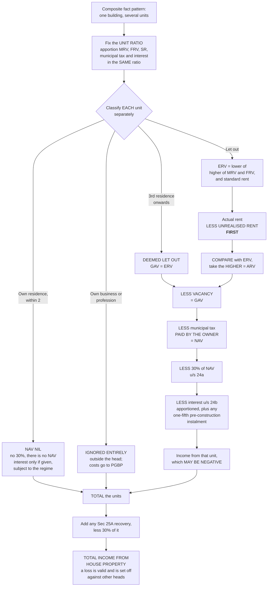

# HP-9 — Composite Problems and the Model Answer Layout

Covers: how a multi-unit question is assembled from the eight preceding nodes, the model answer layout reproduced exactly, the apportionment rule, negative income from house property, and the checklist to run before you start writing.

## What a composite question actually is

A composite question is not a new topic. It is HP-1 to HP-8 arriving at once, in a single fact pattern, with the deliberate intention of seeing whether you can keep several treatments running in parallel without letting them contaminate each other.

The characteristic shape is one building split into units that are used differently. One unit is the owner's residence, one is let, one houses his business. Each unit goes down a different branch of the decision tree, and the marks are distributed across the branches rather than concentrated in any one arithmetic step.

So the way to lose marks here is not to be bad at arithmetic. It is to apply the treatment of one unit to another: to compute a nil NAV for the business unit instead of ignoring it, or to claim a 30% deduction on the self-occupied residence, or to apportion the municipal tax to a unit that is outside the head altogether.

**The discipline that answers this: one mini-statement per unit, then a total.** Never a single merged column.

## The apportionment rule

Where a property is split into units, **apportion the MRV, FRV, standard rent, municipal tax and interest in the SAME ratio as the units.**

Three equal units means each figure is taken at one-third. The rule is mechanical and the marks in it are mechanical, which means they are free if you are consistent and gone if you are not. The commonest failure is apportioning the MRV and FRV, then forgetting to apportion the interest, because the interest appears further down the answer and looks like a property-level figure.

The actual rent is never apportioned, because it is given per unit already. Read the question carefully: "let out at ₹3,500 p.m." almost always means that unit's rent, not the whole building's.

## The model answer layout

Reproduce this layout exactly. A three-unit property: own residence, let out, and own business.

| Particulars | ₹ |
|---|---|
| **UNIT 1, Own residence:** NAV NIL, deduction u/s 24 NIL, so Income from house property | NIL |
| **UNIT 2, Let out:** | |
| MRV (1,20,000 × 1/3) = 40,000; FRV (1,32,000 × 1/3) = 44,000; SR (1,08,000 × 1/3) = 36,000, so ERV | 36,000 |
| Actual rent (3,500 × 12) = 42,000 less unrealised rent (3,500 × 3) = 10,500, so 31,500 | |
| ARV / GAV, higher of ERV 36,000 and 31,500 | 36,000 |
| Less: Municipal tax (14,400 × 1/3) | (4,800) |
| **NET ANNUAL VALUE** | **31,200** |
| Less: Standard deduction @ 30% | (9,360) |
| Less: Interest on loan (96,000 × 1/3) | (32,000) |
| **Income from Unit 2** | **(10,160)** |
| **UNIT 3, Own business:** NAV NIL, so Income from house property | NIL |
| **TOTAL INCOME FROM HOUSE PROPERTY** | **(10,160)** |

## Walking the answer line by line

**Unit 1, own residence.** One line, and the reasoning behind it is HP-5. This is a self-occupied residential house, within the limit of two, so the NAV is nil. And since the NAV is nil there is no base for the 30% under 24(a). Write both facts, because the examiner is checking that you know the 30% dies with the NAV rather than surviving as an independent allowance. No interest is given on this unit in the problem, so the line closes at nil.

**Unit 2, the ERV.** All three annual values are building-level figures and all three are apportioned at one-third:

- MRV: 1,20,000 × 1/3 = **40,000**
- FRV: 1,32,000 × 1/3 = **44,000**
- SR: 1,08,000 × 1/3 = **36,000**

Now the HP-2 rule. Higher of MRV and FRV is 44,000. Capped at the standard rent of 36,000. **ERV = ₹36,000.** The standard rent bites here, which is the point of choosing these numbers.

**Unit 2, the actual rent and the sequence rule.** Actual rent is 3,500 × 12 = **42,000**. Three months' rent is unrealised, 3,500 × 3 = **10,500**. Deduct it first: 42,000 − 10,500 = **31,500**.

This is the HP-3 sequence rule appearing in its natural habitat, and it decides the answer. Compare 31,500 against the ERV of 36,000, and the **ERV wins**. Had you skipped the unrealised rent deduction and compared 42,000 against 36,000, the actual rent would have won instead, and every figure below would be wrong by ₹6,000 before the 30% even ran.

**ARV = GAV = ₹36,000.** There is no vacancy in this problem, so the ARV passes straight through to the GAV with no line in between. Say so rather than leaving a gap, because an examiner reading for method wants to see that you know a vacancy line belongs there when there is one.

**Municipal tax.** 14,400 × 1/3 = **₹4,800**. Nothing in the problem says the tenant paid it, so the owner's deduction stands. Contrast with the Mr. P illustration in HP-5, where the same line was nil because the occupant paid.

**NAV = 36,000 − 4,800 = ₹31,200.**

**Standard deduction.** 30% of the NAV: 31,200 × 30% = **₹9,360**. On the NAV, not the GAV. Had you taken 30% of 36,000 you would have claimed ₹10,800, an over-claim of ₹1,440.

**Interest.** 96,000 × 1/3 = **₹32,000**, apportioned in the same ratio as everything else. This unit is let out, so there is no cap under either regime and the whole ₹32,000 is deducted.

**Income from Unit 2:** 31,200 − 9,360 − 32,000 = **−₹10,160**.

**Unit 3, own business.** NAV nil, so income from house property nil. Strictly, as HP-1 established, this unit is **ignored entirely** rather than valued, because the third condition of the charge fails. The model layout shows it as a line with nil against it, and that is what to reproduce, but say in a word why: used for the assessee's own business, hence outside this head, with the related expenses claimable under PGBP instead.

**Total: NIL + (10,160) + NIL = (₹10,160).**

## [VERIFY FROM FACULTY / OFFICIAL MATERIAL]

In the handwritten working the interest line is written as **"(82,000)"** while the calculation shown alongside it is **96,000 × 1/3 = 32,000**, and the stated total of **−10,160** is consistent with 32,000. **The figure 32,000 has been used above.**

Carry this flag rather than quietly resolving it. If the faculty's official solution uses 82,000, the total changes to 31,200 − 9,360 − 82,000 = −60,160, and the printed total of −10,160 would then be wrong too. Since the arithmetic of the stated total agrees with 32,000, and 32,000 is what the apportionment produces, 32,000 is the defensible figure. But note the discrepancy to the faculty rather than assuming.

## Negative income from house property is a correct answer

A composite question that ends in a loss is not a signal that you have made a mistake. **A negative income from house property is perfectly valid and is set off against other heads.**

This falls straight out of HP-6: interest is deducted after the 30% and there is no floor at zero. On a financed let out property with a modest rent, a loss is the ordinary outcome, and it is the mechanism by which the tax system subsidises property borrowing.

Two things to do when your total comes out negative. Write it in brackets, which is the convention the model layout uses. And add a closing line saying the loss is set off against income under other heads, because that is the examiner's last checkpoint.

Under the new regime the same loss on a **let out** unit still arises, since the let out interest deduction survives in both regimes. It is only the **self-occupied** interest that the new regime removes, so a loss generated purely by self-occupied interest would disappear under 115BAC. **[VERIFY FROM FACULTY]** as flagged in HP-5 and HP-6, and state the assumption at the head of the answer.

## The checklist to run before writing

Five minutes spent sorting is worth more than five minutes of extra arithmetic.

1. **Count the units and fix the ratio.** Equal thirds, or something else? Write the ratio at the top of your working and apply it to every building-level figure.
2. **Classify each unit.** Self-occupied residence, let out, deemed let out, or own business. This decides which branch each unit takes.
3. **Check the self-occupied count.** More than two residential self-occupations means the surplus becomes deemed let out, with GAV equal to the ERV.
4. **For each let unit, run the sequence rule.** Unrealised rent off the actual rent first, then compare against the ERV, then vacancy.
5. **Check who paid the municipal tax**, and whether it was actually paid.
6. **Apportion the interest**, and check whether any cap applies to any unit.
7. **State the regime assumption** in one line if any self-occupied interest is in play.
8. **Total the units, and say what happens to a loss.**

## What to remember

- Where a property is split into units, apportion **MRV, FRV, standard rent, municipal tax and interest** in the SAME ratio as the units.
- A negative income from house property is perfectly valid and is set off against other heads.
- Show **each unit as a separate mini-statement**, then total them.

## Concept map

## Flashcards
Q: Where a property is split into units, which figures are apportioned and in what ratio?
A: MRV, FRV, standard rent, municipal tax and interest, all in the same ratio as the units.

Q: How should a composite answer be laid out?
A: Each unit as a separate mini-statement, then a total.

Q: Is a negative income from house property a valid answer?
A: Yes, and it is set off against income under other heads.

Q: In the model problem, MRV 1,20,000, FRV 1,32,000 and SR 1,08,000 for the whole building, three equal units. Find the let unit's ERV.
A: MRV 40,000, FRV 44,000, SR 36,000. Higher of MRV and FRV is 44,000, capped at 36,000, so ERV = ₹36,000.

Q: Actual rent ₹3,500 p.m. with three months unrealised. What is the adjusted actual rent?
A: 42,000 less 10,500 = ₹31,500.

Q: With an ERV of 36,000 and an adjusted actual rent of 31,500, what is the GAV?
A: ₹36,000, the ERV being higher. There is no vacancy in this problem.

Q: Would the answer change if the unrealised rent had been deducted after the comparison instead of before?
A: Yes. The unadjusted actual rent of 42,000 would have beaten the ERV of 36,000, and every figure below would be wrong.

Q: Compute the NAV of the let unit.
A: GAV 36,000 less municipal tax 4,800 = ₹31,200.

Q: Compute the standard deduction on that NAV.
A: 30% of 31,200 = ₹9,360.

Q: Interest of 96,000 on the building, three equal units. What is the let unit's share, and is it capped?
A: ₹32,000. It is a let out unit, so there is no cap under either regime.

Q: Compute the income from the let unit.
A: 31,200 less 9,360 less 32,000 = a loss of ₹10,160.

Q: What is the total income from house property in the model problem?
A: A loss of ₹10,160, the residence unit and the business unit both contributing nil.

Q: What is the flagged discrepancy in the model working?
A: [VERIFY FROM FACULTY] The handwritten interest line reads "(82,000)" while the calculation alongside is 96,000 × 1/3 = 32,000, and the stated total of −10,160 is consistent with 32,000, so 32,000 has been used.

Q: How is the own-business unit shown in the model layout, and why?
A: NAV nil, income nil. It is used for the assessee's own business, so the third condition of the charge fails and it falls outside this head, with the costs claimable under PGBP.

## Sources
- Master exam notes §3.9, Composite Problem, Model Answer Layout (starred exam focus), including the [VERIFY FROM FACULTY / OFFICIAL MATERIAL] flag on the interest figure
- Depends on: [[Unit 3A - HP-4 Part-Year Property]], [[Unit 3A - HP-5 Self-Occupied and Deemed Let Out]], [[Unit 3A - HP-7 Pre-Construction Interest]], [[Unit 3A - HP-8 Recovery of Unrealised Rent Section 25A]]
- [[Unit 3A - House Property MOC (Node Map)]]
