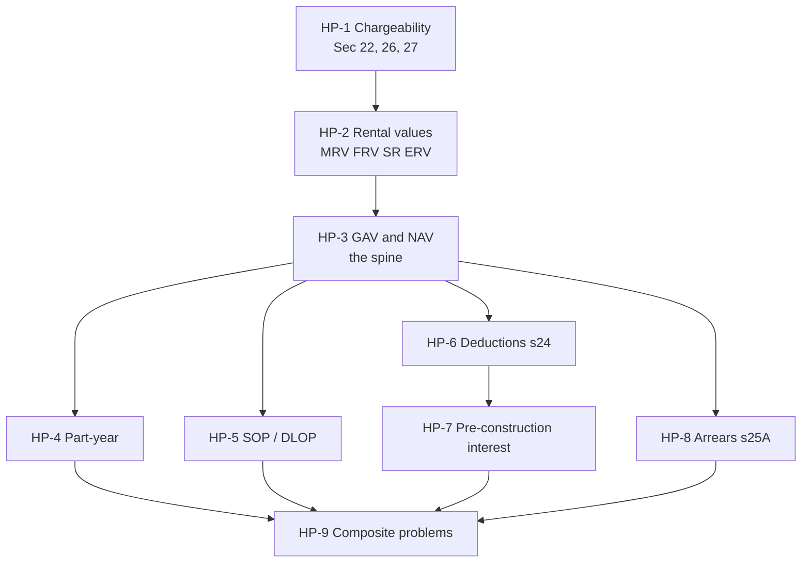

# Unit 3A — House Property (Sections 22 to 27)

Node map for the whole head. One node = one topic = one file. Each node carries
three states, studied → mapped → drilled, and the states are tracked in each
note's own frontmatter so this file stays the index and never the source of truth.

## The loop, per node

1. **Study** the note. Read the worked illustrations, do not skim them.
2. **Map** it. Close the note, redraw the concept map from memory on paper, then
   diff against the mermaid block in the note. Structure errors found here are
   worth more than any flashcard.
3. **Drill** the flashcards at the bottom of the note until clean twice.

Only after a node is drilled does it enter the test pool.

## Nodes

| Node | § | Topic | Depends on | Minutes | Exam focus |
| --- | --- | --- | --- | --- | --- |
| HP-1 | 3.1 | [[Unit 3A - HP-1 Chargeability and Ownership]] | — | 20 | |
| HP-2 | 3.2 | [[Unit 3A - HP-2 Rental Values and ERV]] | HP-1 | 25 | ★ |
| HP-3 | 3.3 | [[Unit 3A - HP-3 GAV and NAV]] | HP-2 | 35 | ★ |
| HP-4 | 3.4 | [[Unit 3A - HP-4 Part-Year Property]] | HP-3 | 20 | |
| HP-5 | 3.5 | [[Unit 3A - HP-5 Self-Occupied and Deemed Let Out]] | HP-3 | 30 | ★ |
| HP-6 | 3.6 | [[Unit 3A - HP-6 Deductions from NAV Section 24]] | HP-3 | 30 | ★ |
| HP-7 | 3.7 | [[Unit 3A - HP-7 Pre-Construction Interest]] | HP-6 | 25 | ★ |
| HP-8 | 3.8 | [[Unit 3A - HP-8 Recovery of Unrealised Rent Section 25A]] | HP-3 | 20 | |
| HP-9 | 3.9 | [[Unit 3A - HP-9 Composite Problems]] | HP-4, HP-5, HP-7, HP-8 | 35 | ★ |

Minutes is the length of one reading sitting for that node, and doubles as the
node's weight. The nine notes total 240 minutes of reading.

## Dependency graph

**HP-3 is the spine.** Six of the nine nodes hang off it. If the GAV/NAV ladder is
shaky, everything downstream produces a wrong number even when the concept is
known. **HP-9 is the terminal node** and gates on all eight others, which is
exactly what a 15-mark composite question tests.

## Calendar split

- **Day 2, Tue Sep 23** → HP-1 to HP-4. 100 minutes of reading.
- **Day 3, Wed Sep 24** → HP-5 to HP-9. 140 minutes of reading.

Note the asymmetry. Day 3 carries more mass and contains four of the six starred
topics. If Day 2 finishes early, pull HP-6 forward, since HP-6 only needs HP-3.

## Open faculty question that changes answers here

The master notes flag it and the [[Taxation Law Exam Calendar - Oct 2]] repeats
it: whether house property numericals are graded old regime or new regime.

- **Old regime**: self-occupied interest deductible up to ₹2,00,000 (₹30,000 for
  repair/reconstruction, or loans pre 1.4.1999). Loss from house property sets
  off against other heads.
- **New regime (115BAC)**: no interest deduction on self-occupied property at
  all. This is the vault's working assumption everywhere else.

Until that is answered, **learn both and state your assumption in the answer
script.** HP-5 and HP-6 are the two nodes where the regime actually changes the
final figure.

## Links
- [[Taxation Law MOC]]
- [[Taxation Law Exam Calendar - Oct 2]]
