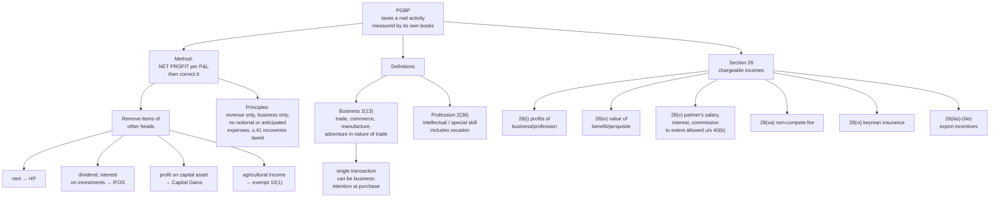

# PG-1 — Business, Profession, and What Section 28 Charges

Covers: what counts as business, profession and vocation, why the Act bothers to distinguish them, the list of incomes Section 28 pulls into this head, the incomes that look like business income but are taxed elsewhere, and the basic principles that run through every PGBP computation.

## Why this head is different from the other four

House property taxes a value the property is *capable* of earning. Salary taxes what an employer pays. Capital gains taxes a one-off transfer. Profits and Gains of Business or Profession (PGBP) is the only head that taxes a **real, running economic activity measured by its own accounts**.

That single fact explains the architecture of the whole unit. Because the activity keeps its own books, the Act starts from the assessee's **net profit as per the Profit and Loss Account** and then *corrects* it. It adds back what the Act refuses to allow (PG-3), deducts what the Act allows but the books missed (PG-2, PG-4, PG-5), and strips out incomes that belong to other heads. PG-6 is nothing more than that correction done in one table.

So the question in every PGBP problem is never "what is the profit?" The accountant already told you. The question is **"what would the profit have been if the accountant had followed the Income-tax Act instead of accounting standards?"**

## The three words

| Term | Section | Meaning |
|---|---|---|
| **Business** | 2(13) | Any trade, commerce or manufacture, or any adventure or concern in the nature of trade, commerce or manufacture |
| **Profession** | 2(36) | Includes vocation. An occupation requiring intellectual skill or manual skill based on special learning, e.g. doctor, lawyer, chartered accountant, architect, engineer |
| **Vocation** | — | A natural ability or calling pursued for a living, e.g. singer, dancer, writer, astrologer |

Three points worth fixing.

**"Adventure in the nature of trade" catches even a single transaction.** Business does not need continuity. Someone who buys a large lot of goods once, with the intention of reselling at a profit, is carrying on business for that transaction. What matters is the intention at purchase: bought to resell (business) or bought to hold (investment, so capital gains).

**Profession and vocation are taxed under the same head as business.** The distinction matters for books of account (s. 44AA), presumptive taxation (44AD for business, 44ADA for specified professions), and for problems that use the **receipts and payments** format for a doctor or CA. It does not create a separate head.

**Illegal business is still business.** Profits from smuggling or other illegal activity are taxable under this head. But expenditure for an offence or anything prohibited by law is disallowed under the Explanation to s. 37(1). The Act taxes the profit and refuses the cost of the crime.

## Section 28 — the incomes chargeable under this head

Section 28 lists what is charged. The list is longer than "profit from the business", and the extra items are what gets examined.

| Clause | Income chargeable |
|---|---|
| 28(i) | Profits and gains of any business or profession carried on during the previous year |
| 28(ii) | Compensation received on termination or modification of a management agency, managing agency or similar agreement |
| 28(iii) | Income derived by a trade, professional or similar association from specific services performed for its members |
| 28(iiia)–(iiie) | Export incentives: profit on sale of import licences, cash assistance, duty drawback, profit on transfer of DEPB/DFRC |
| 28(iv) | Value of any **benefit or perquisite**, whether convertible into money or not, arising from business or profession |
| 28(v) | **Interest, salary, bonus, commission or remuneration** received by a **partner** from the firm (to the extent allowed to the firm under s. 40(b)) |
| 28(va) | Sum received for a **non-compete** agreement, or for not sharing know-how, patent, copyright, trademark etc. |
| 28(vi) | Sum received under a **Keyman insurance policy**, including bonus |
| 28(via) | FMV of inventory on its conversion into a capital asset |
| 28(vii) | Sum received on account of any capital asset (other than land, goodwill or financial instrument) being demolished, destroyed, discarded or transferred, where the whole cost was allowed under s. 35AD |

Two of these produce most exam questions.

**Partner's remuneration, 28(v).** A partner is not an employee of the firm, so his "salary" from the firm is not taxed under the head Salaries. It is business income in his hands, and only to the extent the firm was allowed to deduct it under s. 40(b). The logic is symmetry: whatever the firm deducts, the partner is taxed on; whatever the firm could not deduct, the firm has already paid tax on.

**Non-compete fees, 28(va).** Before this clause, a lump sum received for agreeing not to compete was a capital receipt (compensation for giving up a source of income) and escaped tax. The clause converts it into business income.

## What looks like business income but is not

The Profit and Loss account is a record of *everything* the assessee received, including items the Act assigns elsewhere. Remove them from business income and tax them under their own heads.

| Item credited to P&L | Correct head |
|---|---|
| Rent from a house property owned by the assessee (not the business of letting) | Income from House Property |
| Dividends on shares held as investment | Income from Other Sources |
| Interest on securities / bank deposits held as investment | Income from Other Sources |
| Profit on sale of a capital asset (investment, building, land) | Capital Gains |
| Agricultural income | Exempt u/s 10(1) |
| Income-tax refund | Not income (refund of tax already paid). Interest on it is IFOS |
| Gifts from friends or relatives (not linked to the profession) | Not business income |

The distinction running through that table is **stock-in-trade versus investment.** Shares held as stock-in-trade by a dealer produce business income when sold. The same shares held as investments produce capital gains. Nothing about the shares changes, only the purpose for which they are held.

## Basic principles of computation

These principles apply to every item in PG-2 and PG-3 and are worth reading as a set.

1. **Business must be carried on during the previous year.** Income of a business discontinued in an earlier year is taxed only through specific deeming provisions (e.g. s. 41).
2. **Income is computed for each business, but the head is one.** Profits of all businesses are aggregated; a loss in one is set off against the profit of another.
3. **Accrual or cash, as per the method regularly employed** (s. 145). Companies must use accrual. Individuals may use either, which is why professionals often prepare Receipts and Payments accounts.
4. **Only revenue expenditure is deductible.** Capital expenditure is recovered through depreciation (PG-5), not deducted.
5. **Expenditure must be for the business**, not personal.
6. **Anticipated losses and notional expenses are not allowed.** A provision for a future loss, or "interest on own capital", is added back.
7. **Recovery of a deduction already allowed is taxed** (s. 41(1)). If a trading liability deducted earlier is remitted or ceases, the benefit is income of the year of remission.

## What to remember

- PGBP starts from **net profit per P&L** and corrects it. That is the whole method.
- Business 2(13), profession 2(36). A **single transaction** can be an adventure in the nature of trade.
- Section 28 adds: partner's remuneration and interest (28(v)), non-compete fees (28(va)), keyman insurance (28(vi)), value of business perquisites (28(iv)), export incentives.
- **Rent, dividends, interest on investments, capital gains and agricultural income** are removed from business profit.
- Stock-in-trade → business income. Investment → capital gains.
- Revenue expenditure is deducted; capital expenditure is depreciated.

## Concept map

## Flashcards
Q: What does the PGBP computation start from?
A: The net profit as per the Profit and Loss Account, which is then adjusted as per the Income-tax Act.

Q: Define business under s. 2(13).
A: Any trade, commerce or manufacture, or any adventure or concern in the nature of trade, commerce or manufacture.

Q: Can a single transaction amount to business?
A: Yes. An isolated purchase made with the intention of resale at a profit is an adventure in the nature of trade.

Q: Define profession under s. 2(36).
A: An occupation requiring intellectual or manual skill based on special learning; it includes vocation.

Q: How is a partner's salary from the firm taxed?
A: As business income under s. 28(v), to the extent it was allowed as a deduction to the firm under s. 40(b).

Q: What is taxed under s. 28(va)?
A: Any sum received for a non-compete agreement or for not sharing know-how, patents, copyright or trademarks.

Q: Under which head is a sum received on a Keyman insurance policy taxed in a business's hands?
A: PGBP, under s. 28(vi).

Q: Rent from a building owned by a trader is credited to P&L. How is it treated?
A: Deducted from business profit and taxed under Income from House Property.

Q: Dividend on investment shares credited to P&L — where is it taxed?
A: Deducted from business profit and taxed under Income from Other Sources.

Q: Shares sold by a share dealer versus an investor — what is the difference in head?
A: Dealer holds them as stock-in-trade, so business income. Investor holds them as capital assets, so capital gains.

Q: Is profit from an illegal business taxable?
A: Yes, it is business income. But expenditure for an offence or prohibited by law is disallowed under Explanation to s. 37(1).

Q: What does s. 41(1) tax?
A: The benefit from remission or cessation of a trading liability that was allowed as a deduction earlier.

Q: Is interest on the proprietor's own capital deductible?
A: No. It is a notional expense; add it back.

## Sources
- Course plan Unit III: meaning of business and profession, incomes chargeable under this head
- Income-tax Act 1961: ss. 2(13), 2(36), 28, 29, 41, 145
- Reference textbook chapter 8 (PGBP)
- Next node: [[Unit 3B - PG-2 Allowed Expenses]]
- [[Unit 3B - PGBP MOC (Node Map)]]
