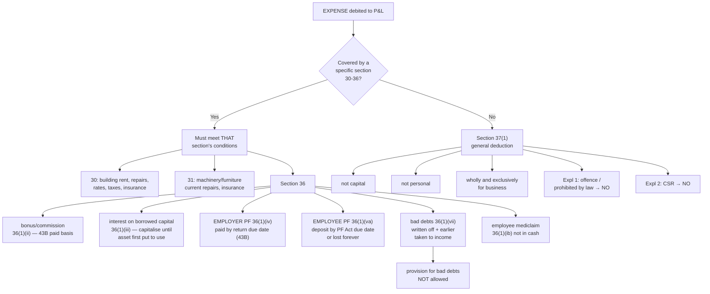

# PG-2 — Allowed Expenses, Sections 30 to 37

Covers: the specific deductions in ss. 30, 31 and 36, the general deduction in s. 37(1) with its four conditions, and the recurring exam traps (employee PF, bad debts, interest on capital, capital versus revenue).

## The structure of the allowance sections

The Act allows deductions in two layers.

**Layer 1: specific sections (30 to 36).** Each names a particular kind of expenditure and sets its own conditions and limits.

**Layer 2: the residuary section 37(1).** Anything not covered by 30 to 36 is allowed if it passes four tests. It is a catch-all, and most everyday business expenses (salaries, advertisement, travel, legal fees, stationery) are allowed under it.

The ordering matters in one direction only. **If an expense is covered by a specific section, it must satisfy that section.** You cannot fail the conditions of s. 36 and then fall back on s. 37. The residuary section is for expenses *of a kind* the specific sections do not address.

## Sections 30 and 31 — premises and machinery

| Section | Allowed |
|---|---|
| **30** — buildings used for business | Rent, current repairs (not capital repairs), land revenue, local rates, municipal taxes (subject to s. 43B, paid basis), insurance premium against risk of damage or destruction |
| **31** — machinery, plant, furniture | Current repairs and insurance premium |

"Current repairs" means repairs that maintain the asset, not repairs that create a new asset or significantly extend its life. A new roof on an old godown is capital. Patching a leaking roof is current.

If a tenant carries out repairs that the lease requires him to do, the tenant gets the deduction. If the owner uses the building for his own business, there is no notional rent. He cannot deduct rent to himself.

## Section 36 — specific deductions

| Clause | Deduction | Condition worth remembering |
|---|---|---|
| 36(1)(i) | Insurance premium on stock or stores | — |
| 36(1)(ib) | Medical insurance premium for employees | Paid by any mode **other than cash** |
| 36(1)(ii) | **Bonus or commission to employees** | Not payable as profit or dividend otherwise; subject to s. 43B (paid basis) |
| 36(1)(iii) | **Interest on capital borrowed** for business | Interest on borrowing to acquire an asset, for the period **until the asset is first put to use**, must be **capitalised**, not deducted |
| 36(1)(iv) | Employer's contribution to a **recognised provident fund** or approved superannuation fund | Within limits; s. 43B applies |
| 36(1)(iva) | Employer's contribution to NPS for employees | Up to **14% of salary** (salary = basic + DA) |
| 36(1)(v) | Contribution to approved gratuity fund | — |
| 36(1)(va) | **Employees' own PF/ESI contribution** deducted from their salary and deposited | Allowed only if deposited **by the due date under the PF/ESI Act**, not the due date of the return |
| 36(1)(vii) | **Bad debts** actually **written off** as irrecoverable in the books | Debt must have been taken into income in an earlier year (or be money lent in the business of banking or money-lending) |
| 36(1)(xv) | Securities Transaction Tax paid on business transactions | Where income from the transaction is business income |

Two items here are guaranteed exam material.

**Employee's contribution versus employer's contribution to PF.** They sound alike and are treated differently. The **employer's own contribution** (36(1)(iv)) is an expense and is governed by s. 43B: allowed if paid by the due date of filing the return. The **employee's contribution** (36(1)(va)) is the employee's money, deducted from his salary. It is first treated as the employer's income under s. 2(24)(x), and only if it is deposited **by the due date under the PF Act** (the 15th of the following month) is it deductible. Deposit it late, even by one day, and the deduction is permanently lost. The Supreme Court confirmed this in *Checkmate Services (2022)*. The logic: the employer was holding the employee's money in trust; late deposit is treated as the employer having used it.

**Bad debts.** Three conditions: it must be a debt arising from the business, it must have been **included in income** in an earlier year (a trade debtor from credit sales qualifies automatically), and it must be **actually written off** in the books of the previous year. A mere **provision for bad and doubtful debts** is not a write-off and is disallowed (it is an anticipated loss). A bad debt later **recovered** is taxed in the year of recovery under s. 41(4).

**Interest on borrowed capital.** Interest on a loan for working capital is fully deductible. Interest on a loan taken to buy a machine is deductible **only from the date the machine is first put to use**. Interest for the earlier period is added to the cost of the machine and recovered through depreciation. This is the capital/revenue line drawn on a timeline.

## Section 37(1) — the general deduction

An expense not covered by ss. 30 to 36 is allowed under s. 37(1) if all four conditions are satisfied:

1. It is **not of a capital nature.**
2. It is **not a personal expense** of the assessee.
3. It is **laid out wholly and exclusively for the business or profession.**
4. It is **not covered by ss. 30 to 36.**

And two explanations close common loopholes:

- **Explanation 1:** Expenditure for **any purpose which is an offence or prohibited by law** is not allowed. Penalties and fines for infringement of law, bribes, and payments that are illegal are disallowed. (Penalty for *breach of contract* is not an offence; it is allowed.)
- **Explanation 2:** **Corporate Social Responsibility** expenditure under s. 135 of the Companies Act is not allowed.

**"Wholly and exclusively" does not mean "necessarily".** The test is commercial expediency judged by the businessman, not by the tax officer. A business can spend lavishly on advertisement; the Act does not second-guess the amount. What it rejects is a *personal* element or a *capital* character.

### Common items and their treatment

| Item | Allowed? | Why |
|---|---|---|
| Salary to employees | Yes | s. 37(1), subject to TDS rules (PG-3) |
| Advertisement | Yes | Revenue, business purpose |
| Legal expenses to defend the business or title to stock | Yes | Protects business, revenue |
| Legal expenses for a **criminal case** against the proprietor personally | No | Personal |
| Income-tax paid | No | s. 40(a)(ii), tax on profits is not an expense of earning them |
| Donations to charity | No, under PGBP | Not for business (possibly deductible under Chapter VI-A in old regime) |
| Proprietor's life insurance premium | No | Personal |
| Drawings / household expenses | No | Personal |
| Purchase of a machine | No | Capital; depreciation instead |
| Fines for traffic or municipal violation | No | Offence, Explanation 1 |
| Penalty for late delivery under a contract | Yes | Commercial, not an offence |
| Loss by theft or embezzlement by employees | Yes | Incidental to business (allowed as business loss) |
| Provision for income-tax, for bad debts, for future losses | No | Anticipated, not incurred |
| Gifts to customers with business logo | Yes | Business promotion |

## What to remember

- **Specific sections first (30-36), residuary 37(1) last.**
- 37(1): **not capital, not personal, wholly and exclusively for business, not covered by 30-36.** Offences and CSR are out.
- **Employee's PF**: deposit by PF Act due date or lose it forever. **Employer's PF**: s. 43B, paid by return due date.
- **Bad debts**: written off + earlier taken to income. **Provision** is not a write-off.
- **Interest on loan for an asset**: capitalise until first put to use.
- Health insurance for employees: **not in cash**.
- Penalty for **breach of contract** is allowed; penalty for **breach of law** is not.

## Concept map

## Flashcards
Q: What are the four conditions for a deduction under s. 37(1)?
A: Not capital, not personal, wholly and exclusively for business, and not covered by ss. 30 to 36.

Q: Is CSR expenditure deductible under s. 37(1)?
A: No. Explanation 2 to s. 37(1) disallows it.

Q: A fine for violating municipal law is debited to P&L. Allowed?
A: No. It is expenditure for an offence, disallowed by Explanation 1 to s. 37(1).

Q: A penalty paid to a customer for late delivery under a contract. Allowed?
A: Yes. Breach of contract is not an offence; it is a commercial expense.

Q: When is the employees' contribution to PF deductible for the employer?
A: Only if deposited by the due date under the PF Act (s. 36(1)(va)). Late deposit loses the deduction permanently.

Q: When is the employer's own contribution to RPF deductible?
A: Under s. 36(1)(iv) read with s. 43B, if actually paid on or before the due date of filing the return.

Q: What are the conditions for deducting bad debts?
A: The debt must have been taken into income in an earlier year and must be actually written off as irrecoverable in the books of the previous year.

Q: Is a provision for bad and doubtful debts deductible?
A: No. It is an anticipated loss, not a write-off.

Q: Interest on a loan taken to buy a machine, for the period before the machine was first put to use — treatment?
A: Capitalised as part of the machine's cost, not deducted. Interest after first use is deductible under 36(1)(iii).

Q: Is employee health insurance premium paid in cash deductible?
A: No. Section 36(1)(ib) requires payment by a mode other than cash.

Q: Up to what limit is employer's NPS contribution deductible under s. 36(1)(iva)?
A: 14% of the employee's salary (basic + DA).

Q: Legal expenses to defend a criminal case against the proprietor personally — allowed?
A: No, personal expense.

Q: Is loss due to embezzlement by an employee deductible?
A: Yes, as a loss incidental to business.

Q: Income-tax paid is debited to P&L — treatment?
A: Added back; disallowed under s. 40(a)(ii).

## Sources
- Course plan Unit III: allowed and disallowed expenses
- Income-tax Act 1961: ss. 30, 31, 36, 37, 41(4), 2(24)(x); *Checkmate Services Pvt. Ltd. v. CIT* (SC, 2022)
- Previous node: [[Unit 3B - PG-1 Meaning and Chargeable Incomes]]
- Next node: [[Unit 3B - PG-3 Disallowed Expenses]]
- [[Unit 3B - PGBP MOC (Node Map)]]
