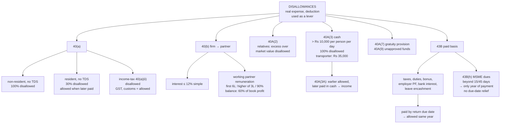

# PG-3 — Disallowed Expenses, Sections 40, 40A and 43B

Covers: why disallowance sections exist, TDS-linked disallowance u/s 40(a), taxes on income, partner payments u/s 40(b), payments to relatives u/s 40A(2), cash payments u/s 40A(3), provisions u/s 40A(7) and (9), and the paid-basis rule of s. 43B including the MSME clause 43B(h).

## Why the Act disallows expenses that are genuinely incurred

PG-2 asked "is this a business expense?" PG-3 asks a different question: **"even though it is a business expense, does the Act want to use the deduction as a lever?"**

Every section in this node is an **enforcement tool**. The expense is real. The Act denies (or postpones) the deduction to make the assessee do something else:

- deduct TDS → s. 40(a)
- pay partners within limits the firm cannot manipulate → s. 40(b)
- not shift profits to relatives → s. 40A(2)
- pay through banks, not cash → s. 40A(3)
- actually pay statutory dues instead of just providing for them → s. 43B
- pay small suppliers on time → s. 43B(h)

Once you see each section as "deny the deduction until behaviour X happens", the conditions stop being arbitrary.

## Section 40(a) — TDS-linked and tax disallowances

| Clause | Payment | Disallowance |
|---|---|---|
| 40(a)(i) | Interest, royalty, fees for technical services or other sum **payable to a non-resident** (or outside India) on which TDS is not deducted, or deducted but not paid | **100%** of the payment |
| 40(a)(ia) | Sum **payable to a resident** (salary, commission, rent, contract, professional fees, interest etc.) on which TDS is not deducted, or deducted but not paid by the due date of return | **30%** of the payment |
| 40(a)(ii) | **Income-tax** (and any tax on profits) | 100% |
| 40(a)(iib) | Royalty, licence fee, or any fee levied exclusively on a State Government undertaking by the State | 100% |
| 40(a)(v) | Tax paid by the employer on **non-monetary perquisites** of the employee (u/s 10(10CC)) | 100% |

**The 30% disallowance is not permanent.** If the TDS is deducted in a later year and paid, the disallowed 30% is allowed in the year of payment. For residents the Act uses a partial disallowance because the payee will usually report the income anyway; for non-residents it disallows the full 100% because TDS may be India's only chance to collect.

**GST, customs, excise, stamp duty and municipal taxes are not "tax on income".** They are deductible (subject to s. 43B). Only taxes computed on profits (income-tax, surcharge, cess, and wealth-tax historically) are disallowed under 40(a)(ii).

## Section 40(b) — payments by a firm to partners

A firm is allowed to deduct interest and remuneration to partners only within limits, and only if authorised by the partnership deed.

| Payment | Condition / limit |
|---|---|
| **Interest** to partners | Authorised by the deed, and not exceeding **12% simple interest p.a.** |
| **Remuneration** to **working partners** | Authorised by the deed, and not exceeding the limit on **book profit**: first ₹6,00,000 of book profit (or a loss): higher of **₹3,00,000 or 90%** of book profit; balance book profit: **60%** |

Remuneration to a **non-working partner** is disallowed entirely. This ties into PG-1: the partner is taxed under s. 28(v) only on what the firm was allowed.

## Section 40A(2) — excessive payments to relatives

Where an expenditure is paid to a **specified person** (a relative of the assessee, a director or partner and their relatives, a person having substantial interest, etc.), and the tax officer considers it **excessive or unreasonable** having regard to the fair market value of goods, services or facilities, the **excess** is disallowed.

The test is market value. Paying your brother ₹80,000 a month for a job the market pays ₹50,000 for disallows ₹30,000 a month. The ₹50,000 remains allowed.

## Section 40A(3) — cash payments

Any expenditure where payment to a person **in a day** otherwise than by an account payee cheque, account payee bank draft, or electronic clearing / other prescribed electronic mode **exceeds ₹10,000** is **disallowed in full** (100%, not just the excess).

- The limit is **₹35,000** for payments to **transporters** for plying, hiring or leasing goods carriages.
- The limit applies **per person per day, aggregated.** Two cash payments of ₹6,000 each to the same supplier on the same day total ₹12,000, and the whole ₹12,000 is disallowed.
- **Section 40A(3A):** if an expense was allowed in an earlier year on accrual basis and is **paid in cash in a later year** exceeding ₹10,000, the payment is deemed to be income of the year of payment.
- **Rule 6DD** exceptions: payments to banks, government, in villages with no bank facility, to agriculturists for produce, to cottage industry producers, on bank holidays and similar.
- **Capital expenditure** is not an "expenditure" deducted, so s. 40A(3) does not apply to it directly. But for depreciation purposes, s. 43(1) excludes from actual cost any cash payment over ₹10,000. The asset simply has a lower cost.

## Section 40A(7) and 40A(9) — provisions and unapproved funds

- **40A(7):** A **provision for gratuity** is disallowed, unless it is a provision for contribution to an **approved gratuity fund** or for gratuity that has actually become payable during the year.
- **40A(9):** Contributions to any fund, trust, society or institution **other than** a recognised provident fund, approved superannuation fund, approved gratuity fund or NPS are disallowed.

Both follow the same logic as the bad-debt rule in PG-2: the Act does not allow anticipated or parked amounts, only amounts that have left the business into an approved vehicle.

## Section 43B — deduction only on actual payment

Certain sums are allowed **only in the year of actual payment**, regardless of the method of accounting. If they are paid **on or before the due date of filing the return** for the year, they are allowed in that year itself.

| Covered by s. 43B |
|---|
| (a) Any tax, duty, cess or fee (GST, customs, municipal taxes...) |
| (b) Employer's contribution to PF, superannuation, gratuity or other welfare fund |
| (c) Bonus or commission to employees |
| (d) Interest on loans from public financial institutions / state financial corporations |
| (e) Interest on loans from scheduled banks / co-operative banks / NBFCs |
| (f) Leave encashment payable to employees |
| (g) Sums payable to Indian Railways for use of railway assets |
| **(h) Sums payable to a micro or small enterprise beyond the time limit under s. 15 of the MSMED Act** |

**43B(h), from AY 2024-25.** Payment to a micro or small enterprise must be made within the agreed period, which cannot exceed **45 days** (or **15 days** if there is no written agreement). If the business pays later than that, the expense is allowed only in the year it is **actually paid**. The **return-due-date relief does not apply** to clause (h). This is a deliberate exception, meant to force large businesses to pay small suppliers on time.

**Unpaid interest converted into a loan** is not "actual payment". It is deductible only when the new loan is actually repaid.

## What to remember

- Disallowances are **enforcement levers**, not judgments about genuineness.
- TDS default: **non-resident 100%**, **resident 30%** (allowed later when paid).
- **Income-tax** is disallowed; GST, customs, municipal tax are allowed (s. 43B).
- Firm to partners: interest **12%**; working-partner remuneration **₹3L or 90% of first ₹6L, 60% of the rest**.
- 40A(2): **excess over market value** to relatives disallowed.
- 40A(3): **cash > ₹10,000 per person per day → 100% disallowed**; ₹35,000 for transporters.
- 43B: **paid by return due date** → allowed in the year; else in the year of payment. **43B(h) MSME: no due-date relief.**

## Concept map

## Flashcards
Q: What is the disallowance for failure to deduct TDS on a payment to a resident?
A: 30% of the payment under s. 40(a)(ia); it is allowed in the year the TDS is later deducted and paid.

Q: What is the disallowance for failure to deduct TDS on interest payable to a non-resident?
A: 100% of the payment under s. 40(a)(i).

Q: Is GST paid by a business deductible?
A: Yes, it is not a tax on income. It is subject to s. 43B (actual payment).

Q: Maximum interest a firm can pay a partner and deduct?
A: 12% simple interest p.a., if authorised by the partnership deed.

Q: State the s. 40(b) limit on remuneration to working partners.
A: On the first ₹6,00,000 of book profit or loss: higher of ₹3,00,000 or 90% of book profit. On the balance: 60% of book profit.

Q: Is remuneration to a non-working partner deductible for the firm?
A: No.

Q: What does s. 40A(2) disallow?
A: The excess over fair market value of payments made to specified persons such as relatives.

Q: What is the cash-payment limit under s. 40A(3), and how much is disallowed if crossed?
A: ₹10,000 per person per day (₹35,000 for transporters). The whole payment is disallowed, not only the excess.

Q: Two cash payments of ₹7,000 each to the same supplier on the same day — disallowed?
A: Yes, the aggregate ₹14,000 exceeds ₹10,000 per person per day, so ₹14,000 is disallowed.

Q: Bonus for the year is paid after year end but before the return due date. When is it allowed?
A: In the same year, because s. 43B allows it if paid on or before the due date of the return.

Q: What is special about s. 43B(h)?
A: Dues to micro and small enterprises paid beyond 15/45 days are allowed only in the year of actual payment; the return-due-date relief does not apply.

Q: Is a provision for gratuity deductible?
A: No, unless it is for contribution to an approved gratuity fund or gratuity actually payable during the year (s. 40A(7)).

Q: Is interest to a bank "paid" by converting it into a new loan?
A: No. It is allowed only when actually paid.

## Sources
- Course plan Unit III: allowed and disallowed expenses
- Income-tax Act 1961: ss. 40(a), 40(b), 40A(2), 40A(3), 40A(3A), 40A(7), 40A(9), 43B; Rule 6DD; MSMED Act s. 15
- Previous node: [[Unit 3B - PG-2 Allowed Expenses]]
- Next node: [[Unit 3B - PG-4 Scientific Research Section 35]]
- [[Unit 3B - PGBP MOC (Node Map)]]
