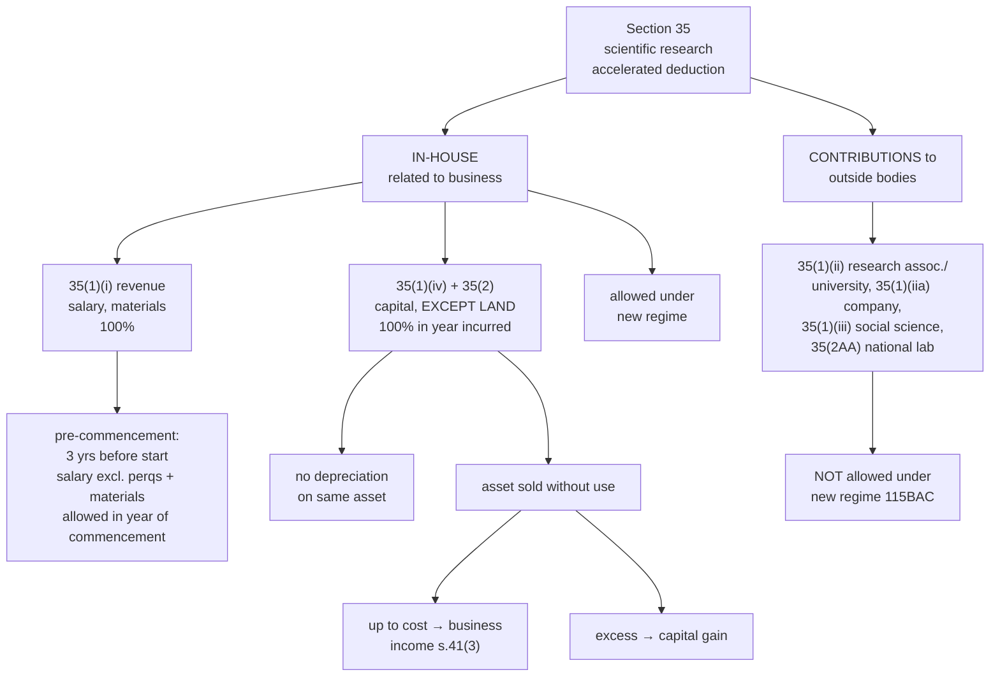

# PG-4 — Expenditure on Scientific Research, Section 35

Covers: what "scientific research" means, in-house revenue and capital expenditure, pre-commencement expenditure, contributions to outside institutions, which limbs survive the new regime, and what happens when a research asset is sold.

## Why the Act treats research specially

Ordinary rules would split research spending two ways: salaries of researchers and chemicals consumed are revenue (deductible), while the lab building and equipment are capital (depreciated slowly over many years). Research, though, is exactly the activity the government wants to encourage, and it produces no revenue for years. So s. 35 **accelerates** the deduction: even **capital** expenditure on research (other than land) is written off **100% in the year it is incurred**, and spending incurred **before the business even starts** is allowed.

**Scientific research** (s. 43(4)) means any activity for the extension of knowledge in the fields of natural or applied sciences, including agriculture, animal husbandry and fisheries. It must be **related to the business** of the assessee for the in-house limbs.

## The limbs of Section 35

| Limb | What | Deduction | Available under new regime (115BAC)? |
|---|---|---|---|
| **35(1)(i)** | **Revenue expenditure** on in-house research related to the business (salaries of research staff, materials consumed) | **100%** in the year incurred | **Yes** |
| 35(1)(i) proviso | **Pre-commencement** revenue expenditure in the **3 years immediately before** commencement of business, on salaries (excluding perquisites) and materials, certified by the prescribed authority | **100% in the year of commencement** | Yes |
| **35(1)(iv) with 35(2)** | **Capital expenditure** on in-house research related to the business, **other than land** | **100%** in the year incurred | **Yes** |
| 35(2) pre-commencement | Capital expenditure in the 3 years before commencement (other than land) | Allowed in the year of commencement | Yes |
| 35(1)(ii) | Contribution to an approved research association, university, college or institution | 100% (weighted deduction ended from AY 2021-22) | **No** |
| 35(1)(iia) | Contribution to an approved Indian company for research | 100% | **No** |
| 35(1)(iii) | Contribution to an approved institution for social science or statistical research | 100% | **No** |
| 35(2AA) | Payment to a National Laboratory, university or IIT for an approved programme | 100% | **No** |

**Under the new regime,** the in-house limbs (revenue and capital) survive; the **contribution limbs** (ii), (iia), (iii) and (2AA) are **not allowed** by s. 115BAC(2). Since the course computes tax under the new regime, a donation to a research association is added back and gives no deduction.

## Capital expenditure: the details that get examined

- **Land is excluded.** Cost of land purchased for a research lab is not deductible at all under s. 35; it is a capital asset held.
- **No depreciation** is allowed on an asset whose cost has been deducted under s. 35 (otherwise the cost would be deducted twice).
- The deduction is available even if the asset is not "used" for research in the same year; what matters is that the expenditure is on scientific research.
- **Unabsorbed capital expenditure** on scientific research is carried forward like unabsorbed depreciation (no time limit).

## When the research asset is sold (s. 41(3))

Since the asset's full cost was already deducted, a sale without use in the business produces a recovery.

- **Sale proceeds (up to the amount deducted)** are taxed as **business income** u/s 41(3) in the year of sale.
- **Excess of sale proceeds over cost** is a **capital gain**.

Example: lab equipment cost ₹10,00,000, deducted in full u/s 35. Sold without being used in any other business for ₹12,00,000. Business income ₹10,00,000 (recovery of deduction); capital gain ₹2,00,000.

If the asset is later **used in the business** (not for research), it enters the depreciation block at **nil WDV** because its cost has already been fully written off.

## Worked illustration

X Ltd started manufacturing on 1 June 2025 (PY 2025-26). Research expenditure:

| Period | Item | Amount |
|---|---|---|
| FY 2021-22 | Salary to research staff | ₹2,00,000 |
| FY 2022-23 | Materials for research | ₹1,50,000 |
| FY 2023-24 | Research equipment | ₹4,00,000 |
| FY 2024-25 | Salary incl. perquisites ₹30,000 | ₹3,30,000 |
| PY 2025-26 | Land for R&D lab | ₹10,00,000 |
| PY 2025-26 | Building for R&D lab | ₹6,00,000 |
| PY 2025-26 | Salary to researchers | ₹5,00,000 |
| PY 2025-26 | Donation to approved research association | ₹1,00,000 |

Three years before commencement = 1 June 2022 to 31 May 2025. FY 2021-22 falls outside it (disallowed). Assume the FY 2022-23 materials fall inside.

| Item | Deduction PY 2025-26 (new regime) |
|---|---|
| Salary FY 2021-22 | Nil (outside 3 years) |
| Materials FY 2022-23 | ₹1,50,000 |
| Equipment FY 2023-24 (capital) | ₹4,00,000 |
| Salary FY 2024-25, excluding perquisites | ₹3,00,000 |
| Land | Nil (land excluded) |
| Building | ₹6,00,000 |
| Current salary | ₹5,00,000 |
| Donation to research association | Nil (35(1)(ii) not allowed under 115BAC) |
| **Total s. 35 deduction** | **₹19,50,000** |

## What to remember

- In-house **revenue** research: **100%**. In-house **capital** research: **100%**, **except land**.
- **Pre-commencement**: 3 years before start; salary **excluding perquisites** and materials; certified; allowed in the **year of commencement**.
- **No depreciation** on assets already deducted u/s 35.
- **New regime**: in-house limbs allowed; **contributions to outside bodies not allowed**.
- Asset sold without use: sale price **up to cost** → business income (41(3)); **excess** → capital gain.

## Concept map

## Flashcards
Q: What does s. 35 allow for in-house revenue expenditure on scientific research?
A: 100% deduction in the year incurred, if related to the business (s. 35(1)(i)).

Q: What capital expenditure on scientific research is NOT deductible under s. 35?
A: Cost of land.

Q: What pre-commencement research expenditure is allowed, and when?
A: Salary (excluding perquisites) and materials, and capital expenditure other than land, incurred in the 3 years immediately before commencement, allowed in the year of commencement.

Q: Is depreciation allowed on a research asset whose cost was deducted u/s 35?
A: No, that would be a double deduction.

Q: Is a contribution to an approved research association deductible under the new regime?
A: No. Section 115BAC disallows 35(1)(ii), (iia), (iii) and 35(2AA).

Q: Are in-house research deductions available under the new regime?
A: Yes, 35(1)(i) and 35(1)(iv) are available.

Q: A research asset costing ₹5 lakh (fully deducted) is sold unused for ₹6 lakh. Treatment?
A: ₹5 lakh is business income u/s 41(3); ₹1 lakh is capital gain.

Q: Define scientific research.
A: Any activity for the extension of knowledge in the fields of natural or applied sciences, including agriculture, animal husbandry or fisheries (s. 43(4)).

## Sources
- Course plan Unit III: expenditure on scientific research
- Income-tax Act 1961: ss. 35, 41(3), 43(4), 115BAC(2)
- Previous node: [[Unit 3B - PG-3 Disallowed Expenses]]
- Next node: [[Unit 3B - PG-5 Depreciation Section 32]]
- [[Unit 3B - PGBP MOC (Node Map)]]
