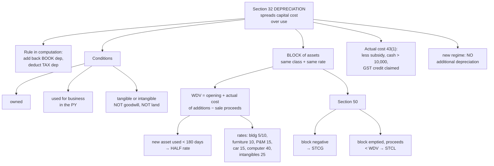

# PG-5 — Depreciation, Section 32

Covers: why depreciation is the doorway for capital expenditure, the conditions, the block-of-assets system, the half-rate rule, the common rates, and what happens when a block is sold off. The course plan does not list depreciation by name, but almost every "computation of business income" problem contains a depreciation adjustment, so this node is essential.

## Why depreciation exists

PG-2 said capital expenditure cannot be deducted. That would be unfair if the cost were never recovered: a machine is consumed by the business over its life just as surely as raw material is consumed in a year. **Depreciation spreads the cost of a capital asset across the years it is used.**

The Act does not trust the depreciation in the books (companies follow the Companies Act, individuals follow whatever method they like). So the rule in every computation is:

> **Add back the depreciation charged in the P&L. Deduct depreciation computed under s. 32.**

## Conditions for depreciation

1. The asset must be **owned** by the assessee, wholly or partly. (A lessee who constructs a building on leased land gets depreciation on the building.)
2. It must be **used for business or profession** during the previous year. It need not be used for the full year.
3. It must be a **tangible asset** (building, machinery, plant, furniture) or an **intangible asset** (know-how, patents, copyrights, trademarks, licences, franchises). **Goodwill of a business is not depreciable** from AY 2021-22.
4. Depreciation is **mandatory**. It is allowed whether or not the assessee claims it.
5. **Land is never depreciable.**

## Block of assets and WDV

Depreciation is not computed asset by asset. Assets are grouped into **blocks**: a group of assets of the same class (tangible buildings, machinery, furniture; intangibles) carrying the **same rate** of depreciation (s. 2(11)). Depreciation is charged on the **written down value (WDV)** of the whole block.

### WDV of the block

```
  Opening WDV of the block (1 April)
+ Actual cost of assets acquired during the year
– Moneys payable for assets sold/discarded/destroyed during the year
  (sale price + scrap value + insurance compensation),
  but not beyond the WDV (see s. 50 below)
= WDV for depreciation
```

### The half-rate rule

If an asset is **acquired during the year** and **put to use for less than 180 days** in that year, depreciation on it is allowed at **50% of the normal rate**. The balance is not lost; the WDV simply carries forward.

In practice: split the block's closing WDV into (a) the part attributable to assets used ≥ 180 days (full rate) and (b) new assets used < 180 days (half rate). **Deduct sale proceeds from the full-rate portion first.**

180 days from 1 October onwards gives 182 days to 31 March, so an asset **put to use on or after 3 October** (roughly, the second half of the year) is used < 180 days. In exam problems: **acquired and put to use in the second half of the year → half rate.**

### Common rates (WDV, Income-tax Rules, Appendix I)

| Block | Rate |
|---|---|
| Buildings — residential (other than hotels) | 5% |
| Buildings — non-residential (office, factory) | 10% |
| Temporary wooden structures | 40% |
| Furniture and fittings | 10% |
| Plant and machinery — general | 15% |
| Motor cars (not used for hire) | 15% |
| Motor vehicles used in a business of running them on hire | 30% |
| Computers including software | 40% |
| Books (annual publications) of professionals | 40% |
| Intangible assets (know-how, patents, licences, trademarks) | 25% |

**Additional depreciation** (20% extra on new plant and machinery for manufacturing, s. 32(1)(iia)) is **not allowed under the new regime** s. 115BAC. Since this course computes under the new regime, ignore it unless the question says otherwise.

## Actual cost (s. 43(1))

The cost that enters the block is the **actual cost** to the assessee, including freight, installation and interest till the asset is first put to use (PG-2), **reduced by**:
- any part of the cost met by a government subsidy or grant;
- **cash payment exceeding ₹10,000 per day per person** (s. 43(1) proviso, mirroring 40A(3));
- input tax credit of GST claimed.

## When the block ceases or goes negative — s. 50

Depreciable assets never produce long-term capital gains. The block simply absorbs sale proceeds.

| Situation | Result |
|---|---|
| Sale proceeds **exceed** opening WDV + additions (block goes negative) | The excess is a **short-term capital gain** u/s 50. No depreciation for the year. |
| **All assets** in the block are sold, and proceeds are **less than** the WDV | The shortfall is a **short-term capital loss**. No depreciation. |
| Block continues (some assets remain) and WDV is positive | Normal depreciation; no gain or loss even if an individual asset was sold at a loss. |

This is why depreciable assets are always short-term regardless of how long they were held: the gain represents recovery of depreciation that was deducted against normal income.

## Worked illustration

Plant and machinery block (15%). Opening WDV on 1.4.2025: ₹8,00,000.
- New machine A bought 10.5.2025 for ₹2,00,000, put to use the same day.
- New machine B bought 15.11.2025 for ₹3,00,000, put to use 1.12.2025.
- Old machine sold 20.8.2025 for ₹1,50,000.

| | Full rate portion | Half rate portion |
|---|---|---|
| Opening WDV | 8,00,000 | |
| Add: Machine A (≥ 180 days) | 2,00,000 | |
| Add: Machine B (< 180 days) | | 3,00,000 |
| Less: Sale proceeds | (1,50,000) | |
| WDV | **8,50,000** | **3,00,000** |
| Depreciation | 15% = **1,27,500** | 7.5% = **22,500** |

Total depreciation = **₹1,50,000**. Closing WDV on 1.4.2026 = 11,50,000 − 1,50,000 = **₹10,00,000**.

## What to remember

- Add back **book** depreciation; deduct **s. 32** depreciation.
- Owned + used in business + tangible or intangible. **Goodwill and land: no.**
- **Block of assets, WDV method.** Opening + additions − sale proceeds.
- **< 180 days in year of acquisition → half rate.**
- Rates: building 5/10, furniture 10, P&M 15, car 15, computer 40, intangibles 25.
- **Block negative → STCG. Block emptied at a loss → STCL.** Depreciable assets are always short-term.
- New regime: **no additional depreciation**.

## Concept map



## Flashcards
Q: In a business income computation, how is book depreciation handled?
A: Add back the depreciation debited in the P&L and deduct depreciation allowable under s. 32.

Q: Name two assets on which depreciation is never allowed.
A: Land, and goodwill of a business or profession (from AY 2021-22).

Q: What is a block of assets?
A: A group of assets falling within a class of assets (tangible or intangible) for which the same rate of depreciation is prescribed.

Q: When is only half the normal rate of depreciation allowed?
A: When an asset acquired during the year is put to use for less than 180 days in that year.

Q: Depreciation rate on computers and software?
A: 40%.

Q: Depreciation rate on general plant and machinery and on motor cars (not for hire)?
A: 15%.

Q: Depreciation rate on a factory building and on a residential building?
A: Non-residential (factory, office) 10%; residential 5%.

Q: What happens when sale proceeds exceed the WDV of the block?
A: The excess is short-term capital gain u/s 50, and no depreciation is allowed on that block for the year.

Q: What if all assets of a block are sold for less than its WDV?
A: The shortfall is a short-term capital loss u/s 50.

Q: Is additional depreciation available under the new regime?
A: No, s. 115BAC disallows s. 32(1)(iia).

Q: Machine bought for ₹50,000 paid in cash in one go. Actual cost for depreciation?
A: Nil for that payment; cash payments exceeding ₹10,000 per person per day are excluded from actual cost under s. 43(1).

## Sources
- Income-tax Act 1961: ss. 2(11), 32, 43(1), 43(6), 50, 115BAC(2); Appendix I to the Income-tax Rules
- Reference textbook chapter 8 (PGBP)
- Previous node: [[Unit 3B - PG-4 Scientific Research Section 35]]
- Next node: [[Unit 3B - PG-6 Computation of Business and Professional Income]]
- [[Unit 3B - PGBP MOC (Node Map)]]
