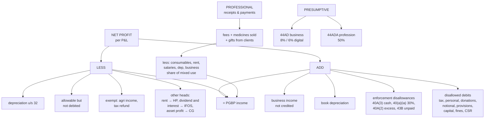

# PG-6 — Computation of Business and Professional Income

Covers: the adjustment format for a business (P&L route), the receipts-and-payments format for a professional, the decision table for every common P&L item, two fully worked problems, and a short note on presumptive taxation (44AD, 44ADA). This is the terminal node of the unit; it gates on PG-1 to PG-5 and is exactly what a 10-mark question tests.

## The one idea

The accountant's net profit is right by accounting rules and wrong by tax rules. The computation fixes it in two directions:

```
Net profit as per P&L account
ADD   1. Expenses debited but NOT allowed         (PG-2, PG-3)
      2. Book depreciation                        (PG-5)
      3. Business incomes NOT credited            (PG-1)
LESS  4. Incomes credited but NOT business income (PG-1: taxed elsewhere or exempt)
      5. Expenses allowed but NOT debited         (PG-2, PG-4)
      6. Depreciation u/s 32                      (PG-5)
= Profits and gains of business or profession
```

Write every adjustment with a **one-line reason** citing the section. In the exam, the reasons carry marks. A correct final figure with no reasons scores poorly; wrong arithmetic with correct reasons scores well.

## Decision table for common P&L items

### Debit side — add back if you see these

| Item | Add back? | Section / reason |
|---|---|---|
| Depreciation as per books | Yes (then deduct tax dep.) | s. 32 |
| Income-tax, wealth-tax, advance tax | Yes | 40(a)(ii) |
| Drawings, household expenses, proprietor's personal items | Yes | Personal, s. 37(1) |
| Proprietor's life insurance premium, medical premium | Yes | Personal |
| Donations and charity | Yes | Not for business |
| Interest on proprietor's own capital | Yes | Notional |
| Salary to proprietor himself | Yes | Notional |
| Provision for bad debts / for future losses / for income-tax | Yes | Anticipated, not incurred |
| Reserve / transfer to general reserve | Yes | Appropriation, not expense |
| Capital expenditure (purchase of asset, capital repairs) | Yes | Capital; depreciation instead |
| Fines and penalties for breach of law | Yes | Expl. 1 to 37(1) |
| CSR expenditure | Yes | Expl. 2 to 37(1) |
| Cash payment > ₹10,000 per person per day | Yes, 100% | 40A(3) |
| Payment to resident without TDS | Yes, 30% | 40(a)(ia) |
| Excess payment to a relative | Yes, the excess | 40A(2) |
| Bonus / employer's PF / GST not paid by return due date | Yes | 43B |
| Employees' PF deposited late (after PF Act due date) | Yes | 36(1)(va) |
| Loss on sale of a capital asset / investment | Yes | Capital loss, dealt with under Capital Gains |

### Debit side — allowed, no adjustment

Salaries, wages, rent of business premises, advertisement, bad debts written off, current repairs, insurance of business assets, legal expenses for business, GST paid in time, interest on business loans, bank charges, penalty for breach of contract, loss by theft/embezzlement.

### Credit side — deduct if you see these

| Item | Deduct? | Correct treatment |
|---|---|---|
| Rent from house property | Yes | House Property |
| Dividend | Yes | IFOS |
| Interest on securities / FD held as investment | Yes | IFOS |
| Profit on sale of capital asset / investment | Yes | Capital Gains |
| Agricultural income | Yes | Exempt 10(1) |
| Income-tax refund | Yes | Not income (interest on it → IFOS) |
| Bad debts recovered, earlier allowed | **No, keep** | Taxable u/s 41(4) |
| Gifts received in the course of profession | **No, keep** | Business/professional receipt |

## Worked problem 1 — a trader (10 marks)

Profit and Loss account of Mr. Kiran for the year ended 31.3.2026:

| Debit | ₹ | Credit | ₹ |
|---|---|---|---|
| Salaries | 3,60,000 | Gross profit | 12,00,000 |
| Rent of shop | 1,20,000 | Rent from house property | 72,000 |
| Bonus to staff (not paid till due date of return) | 40,000 | Dividend | 10,000 |
| Advertisement | 30,000 | Interest on fixed deposit | 8,000 |
| Depreciation | 80,000 | Profit on sale of investments | 50,000 |
| Income-tax | 25,000 | | |
| Household expenses | 60,000 | | |
| Donation to temple | 10,000 | | |
| Repairs paid in cash to one contractor on one day | 18,000 | | |
| Provision for bad debts | 15,000 | | |
| Bad debts written off | 12,000 | | |
| Interest on own capital | 20,000 | | |
| GST paid | 45,000 | | |
| Fine for traffic violation | 5,000 | | |
| Net profit | 5,00,000 | | |
| **Total** | **13,40,000** | **Total** | **13,40,000** |

Depreciation allowable u/s 32: ₹95,000.

**Computation of income under PGBP, AY 2026-27**

| Particulars | ₹ | ₹ |
|---|---|---|
| Net profit as per P&L | | 5,00,000 |
| **Add: inadmissible expenses** | | |
| Bonus not paid by due date — s. 43B | 40,000 | |
| Depreciation as per books | 80,000 | |
| Income-tax — s. 40(a)(ii) | 25,000 | |
| Household expenses — personal | 60,000 | |
| Donation — not for business | 10,000 | |
| Repairs in cash > ₹10,000 — s. 40A(3), 100% | 18,000 | |
| Provision for bad debts — anticipated loss | 15,000 | |
| Interest on own capital — notional | 20,000 | |
| Fine for breach of law — Expl. 1 to s. 37(1) | 5,000 | 2,73,000 |
| | | 7,73,000 |
| **Less: incomes not taxable under this head / allowable items** | | |
| Rent — taxable under House Property | 72,000 | |
| Dividend — taxable under IFOS | 10,000 | |
| Interest on FD — taxable under IFOS | 8,000 | |
| Profit on sale of investments — Capital Gains | 50,000 | |
| Depreciation u/s 32 | 95,000 | 2,35,000 |
| **Income from business** | | **5,38,000** |

Items allowed without adjustment: salaries, rent of shop, advertisement, bad debts written off (s. 36(1)(vii)), GST paid (not a tax on income).

## Worked problem 2 — a doctor (Receipts and Payments)

Professionals often keep a Receipts and Payments account on cash basis. The logic is identical: take the professional receipts, deduct the allowable professional expenses, and ignore capital and personal items.

Dr. Meera's Receipts and Payments account for PY 2025-26:

| Receipts | ₹ | Payments | ₹ |
|---|---|---|---|
| Consultation fees | 9,00,000 | Medicines purchased | 2,00,000 |
| Visiting fees | 2,40,000 | Dispensary rent | 1,20,000 |
| Sale of medicines | 3,00,000 | Salary to staff | 1,50,000 |
| Gifts from patients | 50,000 | X-ray machine (put to use 1.7.2025) | 3,00,000 |
| Dividend | 12,000 | Car expenses (1/3 personal use) | 60,000 |
| Loan from bank | 2,00,000 | Household expenses | 1,00,000 |
| | | Life insurance premium | 25,000 |
| | | Income-tax | 30,000 |

Closing stock of medicines ₹20,000 (no opening stock). X-ray machine rate 15%.

| Particulars | ₹ | ₹ |
|---|---|---|
| **Professional receipts** | | |
| Consultation fees | 9,00,000 | |
| Visiting fees | 2,40,000 | |
| Sale of medicines | 3,00,000 | |
| Gifts from patients (received because of profession) | 50,000 | 14,90,000 |
| **Less: professional expenses** | | |
| Medicines consumed (2,00,000 − 20,000) | 1,80,000 | |
| Dispensary rent | 1,20,000 | |
| Salary to staff | 1,50,000 | |
| Depreciation on X-ray machine: 15% of 3,00,000 (used ≥ 180 days) | 45,000 | |
| Car expenses, professional share 2/3 of 60,000 | 40,000 | 5,35,000 |
| **Income from profession** | | **9,55,000** |

Excluded: dividend (IFOS), loan (capital receipt), X-ray machine cost (capital; depreciation instead), household, life insurance, income-tax (personal/40(a)(ii)).

## Presumptive taxation (for awareness)

| Section | Who | Limit | Deemed income |
|---|---|---|---|
| **44AD** | Resident individual/HUF/firm (not LLP) in eligible business | Turnover ≤ ₹2 crore (₹3 crore if cash receipts ≤ 5%) | **8%** of turnover; **6%** of digital/banking receipts |
| **44ADA** | Resident in a specified profession (legal, medical, engineering, architecture, CA, technical consultancy, interior decoration) | Gross receipts ≤ ₹50 lakh (₹75 lakh if cash receipts ≤ 5%) | **50%** of gross receipts |

All deductions under ss. 30-38 are deemed to have been allowed; no separate expenses or depreciation are claimed.

## What to remember

- Start from **net profit**, **add** disallowed and book depreciation, **deduct** other-head incomes and tax depreciation.
- **Give a reason with a section for every adjustment.** The reasons carry the marks.
- **Kept, not deducted:** bad debts recovered (41(4)), gifts received in the course of profession.
- Professional problems: **receipts − allowable professional expenses**; exclude capital and personal items; **apportion mixed-use** expenses (car).
- 44AD 8%/6%; 44ADA 50%.

## Concept map



## Flashcards
Q: What is the starting point of a business income computation?
A: Net profit as per the Profit and Loss account.

Q: Book depreciation ₹80,000; tax depreciation ₹95,000. What are the two adjustments?
A: Add back ₹80,000 and deduct ₹95,000.

Q: Rent from a house property credited to P&L — adjustment?
A: Deduct it; it is taxed under Income from House Property.

Q: Bad debts recovered (earlier allowed) credited to P&L — adjustment?
A: None. It is taxable business income u/s 41(4); keep it.

Q: Gifts received by a doctor from patients — taxable?
A: Yes, as professional receipts, since they arise from the profession.

Q: A doctor's car is used one-third for personal purposes. How much of car expenses and depreciation is allowed?
A: Two-thirds, the professional share.

Q: Is a bank loan received by a professional a receipt for income?
A: No, it is a capital receipt and is excluded.

Q: What is the deemed income under s. 44AD?
A: 8% of turnover, or 6% of turnover received through banking/digital modes.

Q: Turnover limit for s. 44AD?
A: ₹2 crore, or ₹3 crore if cash receipts do not exceed 5% of total receipts.

Q: What is the deemed income and limit under s. 44ADA?
A: 50% of gross receipts; gross receipts up to ₹50 lakh (₹75 lakh if cash receipts ≤ 5%).

Q: Why write a reason for every adjustment in the answer?
A: The reasons, with sections, carry most of the marks; a bare figure scores poorly.

## Sources
- Course plan Unit III: computation of taxable income from business and profession (problems)
- Income-tax Act 1961: ss. 28-44ADA
- Previous nodes: [[Unit 3B - PG-1 Meaning and Chargeable Incomes]], [[Unit 3B - PG-2 Allowed Expenses]], [[Unit 3B - PG-3 Disallowed Expenses]], [[Unit 3B - PG-4 Scientific Research Section 35]], [[Unit 3B - PG-5 Depreciation Section 32]]
- [[Unit 3B - PGBP MOC (Node Map)]]
