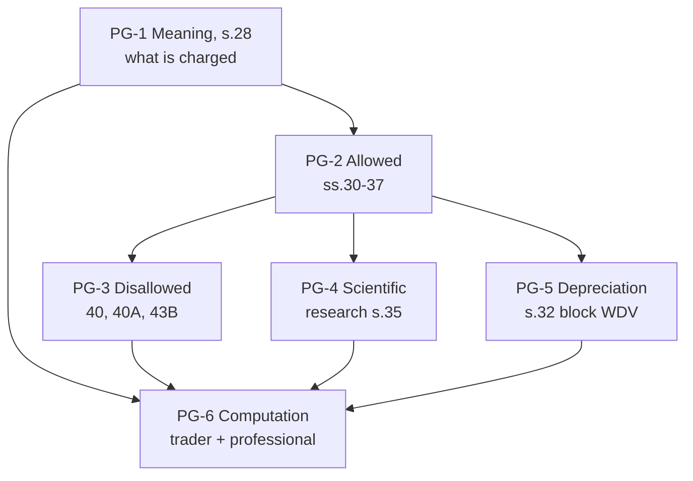

# Unit 3B — Profits and Gains of Business or Profession (Sections 28 to 44ADA)

One node = one topic = one file. States (studied → mapped → drilled) live in each note's frontmatter.

## The loop, per node

1. **Study** the note (one 45-minute block).
2. **Map** it: close the note, redraw the concept map from memory, diff against the note.
3. **Recall**: drill the flashcards until clean.
4. **Mini test**: MCQs, a 5-marker and a 10-marker. Log every lost mark in the error book in the 15-minute slot.
5. After all six nodes: **sectional test** for Unit 3B.

## Nodes

| Node | Topic | Depends on | Minutes | Exam focus |
| --- | --- | --- | --- | --- |
| PG-1 | [[Unit 3B - PG-1 Meaning and Chargeable Incomes]] | — | 40 | |
| PG-2 | [[Unit 3B - PG-2 Allowed Expenses]] | PG-1 | 45 | ★ |
| PG-3 | [[Unit 3B - PG-3 Disallowed Expenses]] | PG-2 | 45 | ★ |
| PG-4 | [[Unit 3B - PG-4 Scientific Research Section 35]] | PG-2 | 30 | |
| PG-5 | [[Unit 3B - PG-5 Depreciation Section 32]] | PG-2 | 45 | ★ |
| PG-6 | [[Unit 3B - PG-6 Computation of Business and Professional Income]] | PG-1 to PG-5 | 60 | ★ |

## Dependency graph

**PG-6 is the terminal node** and is what a 10-mark question tests: a P&L with 12-15 items, each needing add back / deduct / no change with a reason.

## Regime assumption

Computed under the **new regime (s. 115BAC)**, the course default. The regime changes three things in this unit: no additional depreciation (PG-5), no deduction for contributions to outside research bodies (PG-4), and no Chapter VI-A deductions later in Unit 5.

## Links
- [[Taxation Law MOC]]
- [[BBA303-5 - Taxation Laws and Practice Course Plan]]
