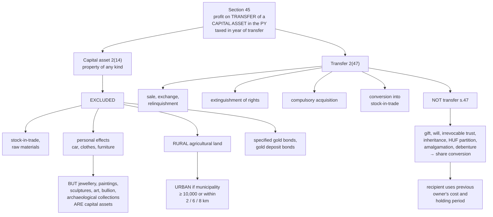

# CG-1 — Chargeability, Capital Asset and Transfer

Covers: the four conditions for a charge under s. 45, what is and is not a capital asset under s. 2(14), what counts as a transfer under s. 2(47), and the transactions s. 47 says are not transfers at all (gift, will, inheritance and others).

## The shape of the head

Capital gains is the only head that taxes a **single event**: the transfer of an asset. Salary, business and house property all tax something that recurs. Capital gains asks four questions and taxes only when all four are answered "yes".

**Section 45(1):** Any profit or gain arising from the **transfer** of a **capital asset** effected in the **previous year** is chargeable under the head "Capital Gains" and is deemed to be the income of the **previous year in which the transfer took place**.

| Condition | Question |
|---|---|
| 1 | Is there a **capital asset**? |
| 2 | Has it been **transferred**? |
| 3 | Did the transfer happen in the **previous year**? |
| 4 | Has a **profit or gain** arisen (or a loss, which is dealt with separately)? |

The gain is taxed in the year of **transfer**, not the year the money is received. Sell a flat in March 2026 for payment in June 2026, and the gain belongs to PY 2025-26.

## Capital asset — s. 2(14)

A capital asset is **property of any kind held by an assessee, whether or not connected with his business or profession**, and includes securities held by an FII and ULIP proceeds not exempt u/s 10(10D).

The definition is deliberately wide, then carved down by exclusions. **Everything is a capital asset unless it falls within an exclusion.**

### Excluded (NOT capital assets)

| Exclusion | Why |
|---|---|
| **Stock-in-trade**, consumable stores or raw materials held for business | Profit on them is business income (PG-1) |
| **Personal effects** — movable property (wearing apparel, furniture, car) held for personal use by the assessee or dependent family member | Not an investment |
| **Rural agricultural land** in India | Protects farmers |
| 6.5% Gold Bonds 1977, 7% Gold Bonds 1980, National Defence Gold Bonds 1980 | Historic government bonds |
| Special Bearer Bonds 1991 | — |
| Gold Deposit Bonds / deposit certificates under Gold Monetisation Scheme | Encourages monetising gold |

### Personal effects that ARE capital assets

The exclusion for personal effects does **not** cover: **jewellery, archaeological collections, drawings, paintings, sculptures, any work of art, and bullion.** These are capital assets even if held for personal use. The logic: they are stores of value, and a gain on them is an investment gain.

So a personal car sold at a profit: no capital gain. A personal gold necklace sold at a profit: capital gain.

### Rural versus urban agricultural land

Agricultural land in India is **not** a capital asset if it is **rural**. It is **urban** (and so a capital asset) if situated:
- within a municipality or cantonment board with population **≥ 10,000**; or
- within the following aerial distance from the local limits of such a municipality:

| Population of the municipality | Distance |
|---|---|
| > 10,000 but ≤ 1 lakh | up to 2 km |
| > 1 lakh but ≤ 10 lakh | up to 6 km |
| > 10 lakh | up to 8 km |

Population is taken as per the last census published before the first day of the previous year.

## Transfer — s. 2(47)

"Transfer" is also defined widely. It **includes**:

1. **Sale, exchange or relinquishment** of the asset;
2. **Extinguishment** of any rights in it (e.g. redemption of preference shares, cancellation of shares on reduction of capital);
3. **Compulsory acquisition** under any law;
4. **Conversion** of a capital asset into **stock-in-trade** of a business;
5. **Maturity or redemption of a zero coupon bond**;
6. Any transaction allowing **possession** of immovable property in part performance of a contract (s. 53A of the Transfer of Property Act);
7. Any transaction (e.g. by becoming a member of a co-operative society or company) that has the effect of enabling enjoyment of immovable property.

## Not a transfer — s. 47

Section 47 lists transactions that are **not regarded as transfers**, so no capital gain arises at that moment. For individuals, the important ones:

| s. 47 clause | Transaction |
|---|---|
| (i) | Distribution of assets on **partition of an HUF** |
| (iii) | Transfer under a **gift, will or irrevocable trust** |
| (iv), (v) | Transfer between a holding company and its wholly-owned Indian subsidiary |
| (vi) | Transfer in a scheme of **amalgamation** to an Indian amalgamated company |
| (viib) | Transfer of Sovereign Gold Bonds by way of **redemption** by an individual |
| (x) | Conversion of bonds/debentures into **shares** of the same company |
| (xvi) | Conversion of **gold into gold deposit / monetisation** scheme |

**Inheritance** is not a transfer at all (the asset passes by operation of law). The key downstream effect of all of these: when the recipient later sells the asset, **the previous owner's cost and holding period are used** (s. 49 and s. 2(42A)). That is CG-3.

Note that a gift is not a transfer for **capital gains in the donor's hands**, but the **recipient** may be taxed on the gift under **Income from Other Sources** u/s 56(2)(x) if it is not from a relative (OS-2).

## What to remember

- **Four conditions:** capital asset, transfer, in the previous year, gain. Taxed in the **year of transfer**.
- **Capital asset = everything except**: stock-in-trade, personal effects, rural agricultural land, specified gold bonds.
- **Jewellery, paintings, sculptures, archaeological collections, bullion** are capital assets even if personal.
- **Urban agricultural land**: municipality ≥ 10,000 population, or within 2/6/8 km.
- **Transfer** includes sale, exchange, relinquishment, extinguishment, compulsory acquisition, conversion into stock-in-trade.
- **Gift, will, inheritance, HUF partition** are not transfers; recipient takes over **previous owner's cost and holding period**.

## Concept map

## Flashcards
Q: State the charging section for capital gains and its four conditions.
A: Section 45: a capital asset, a transfer of it, the transfer in the previous year, and a profit or gain arising.

Q: In which year is a capital gain taxed?
A: The previous year in which the transfer takes place, regardless of when consideration is received.

Q: Is a personal car a capital asset?
A: No, it is a personal effect (movable property held for personal use).

Q: Is personal jewellery a capital asset?
A: Yes. Jewellery, paintings, sculptures, works of art, archaeological collections and bullion are capital assets even if held for personal use.

Q: When is agricultural land in India a capital asset?
A: When it is urban: within a municipality/cantonment with population of 10,000 or more, or within 2/6/8 km of such a municipality depending on its population.

Q: State the distance thresholds for urban agricultural land.
A: Population 10,000-1 lakh: 2 km; 1 lakh-10 lakh: 6 km; above 10 lakh: 8 km.

Q: Is stock-in-trade a capital asset?
A: No. Gains on stock-in-trade are business income.

Q: Name four transactions included in "transfer" under s. 2(47).
A: Sale/exchange/relinquishment; extinguishment of rights; compulsory acquisition; conversion of a capital asset into stock-in-trade.

Q: Is a gift of shares to a son a transfer for capital gains purposes?
A: No, s. 47(iii) excludes transfers under a gift or will.

Q: When the son later sells those gifted shares, whose cost is used?
A: The previous owner's (father's) cost, under s. 49, and the father's holding period is included.

Q: Is conversion of debentures into shares of the same company a transfer?
A: No, s. 47(x).

## Sources
- Course plan Unit IV: chargeability, transfer of assets
- Income-tax Act 1961: ss. 2(14), 2(47), 45, 47, 49
- Next node: [[Unit 4A - CG-2 Short-term and Long-term Capital Gains]]
- [[Unit 4A - Capital Gains MOC (Node Map)]]
