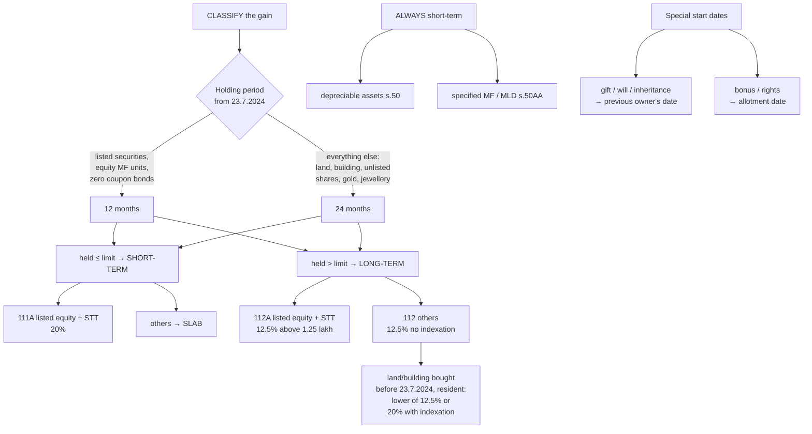

# CG-2 — Short-term and Long-term Capital Gains

Covers: why the Act distinguishes short-term from long-term, the holding periods after the 23 July 2024 overhaul, how the holding period is counted in special cases, the assets that are always short-term, and the tax rates for each type. Every capital gains computation begins with this classification, because it decides the rate, the exemptions available and whether grandfathering applies.

## Why the split exists

A gain on an asset held for years is partly inflation and partly reward for patient investment. The Act taxes such **long-term** gains at a concessional flat rate. A gain on a quick in-and-out trade looks more like trading income and is taxed as **short-term**, either at slab rates or at a higher special rate.

## The 23 July 2024 overhaul

The Finance (No. 2) Act 2024 simplified the system for transfers **on or after 23 July 2024**. Your exam year (PY 2025-26) falls entirely after that date, so **use the new rules**. The old ones matter only for recognising the change in a theory question.

| | Before 23.7.2024 | From 23.7.2024 (use this) |
|---|---|---|
| Holding periods | 12 / 24 / 36 months | **12 / 24 months only** |
| STCG on listed equity (s. 111A) | 15% | **20%** |
| LTCG on listed equity (s. 112A) | 10% above ₹1,00,000 | **12.5% above ₹1,25,000** |
| Other LTCG (s. 112) | 20% with indexation | **12.5% without indexation** |
| Indexation | Available | **Removed** (except a resident individual/HUF's option for land/building acquired before 23.7.2024) |

## Holding periods (s. 2(42A)) — from 23.7.2024

A capital asset is **short-term** if held for **not more than** the period below immediately before transfer; otherwise **long-term**.

| Asset | Short-term if held |
|---|---|
| **Listed securities** (listed shares, listed debentures, listed bonds) on a recognised stock exchange in India, **units of equity-oriented mutual funds**, units of UTI, **zero coupon bonds** | **≤ 12 months** |
| **All other capital assets**: land, building, house, unlisted shares, gold, jewellery, debt mutual funds (other than specified), paintings | **≤ 24 months** |

"Not more than 12 months" means an asset held for exactly 12 months is short-term; 12 months and 1 day is long-term.

## Always short-term, regardless of holding period

| Asset | Section | Why |
|---|---|---|
| **Depreciable assets** (in a block) | s. 50 | Gain is recovery of depreciation deducted against normal income (PG-5) |
| **Specified mutual funds** (≤ 35% in equity, acquired on or after 1.4.2023) and **market-linked debentures** | s. 50AA | Treated like debt interest, so taxed at slab |

## Counting the holding period in special cases

| Situation | Holding period starts from |
|---|---|
| Asset acquired by **gift, will, inheritance, HUF partition** (s. 47/49 modes) | Date **previous owner** acquired it (include previous owner's period) |
| **Bonus shares** | Date of **allotment** of bonus shares |
| **Rights shares** | Date of **allotment** of rights shares |
| **Right entitlement renounced** | Date of offer to date of renunciation |
| Shares received on **amalgamation** | Date the original shares in the amalgamating company were acquired |
| Shares on conversion of **debentures** | Date the debentures were acquired |
| Flat in a **co-operative society** | Date of allotment / membership |

## Tax rates by type (PY 2025-26, new regime)

| Gain | Section | Rate |
|---|---|---|
| STCG on **listed equity shares / equity MF units / units of business trust**, where **STT** is paid | **111A** | **20%** |
| All **other STCG** (land, building, unlisted shares, gold, debt funds, depreciable assets) | — | **Slab rates** (added to normal income) |
| LTCG on **listed equity shares / equity MF units** with STT | **112A** | **12.5%** on the amount **exceeding ₹1,25,000** in the year |
| All **other LTCG** (land, building, unlisted shares, gold, jewellery) | **112** | **12.5% without indexation** |
| **Option**: LTCG on **land or building** acquired **before 23.7.2024** by a **resident individual or HUF** | 112 proviso | Compute both — 12.5% without indexation and **20% with indexation** — and pay **the lower** tax |

Two things tie this to Unit 5:
- STCG u/s 111A and LTCG u/s 112/112A are taxed at **special rates**; they are **not** added to slab income. But a **resident** individual can use any **unused basic exemption limit** (₹4,00,000 in the new regime) against them.
- **No Chapter VI-A deduction** and **no s. 87A rebate** can be used against 111A/112/112A tax (Unit 5, TL-2).

## Worked classification

| Asset | Held | Classification |
|---|---|---|
| Listed shares of TCS, bought 1.9.2024, sold 30.8.2025 | < 12 months | STCG (111A, 20%) |
| Same shares sold 2.9.2025 | > 12 months | LTCG (112A, 12.5% above ₹1.25L) |
| Unlisted shares bought June 2023, sold August 2025 | 26 months | LTCG (112, 12.5%) |
| Gold jewellery bought March 2024, sold December 2025 | 21 months | STCG (slab) |
| Flat inherited in 2025, father bought in 2010 | Father's period included | LTCG |
| Plant and machinery (depreciable) held 10 years | — | STCG u/s 50 |
| Debt fund units bought May 2023 (specified MF) | any | STCG u/s 50AA (slab) |

## What to remember

- From **23.7.2024**: **12 months** for listed securities and equity MF units; **24 months** for everything else.
- **Depreciable assets (s. 50)** and **specified MFs / MLDs (s. 50AA)** are **always short-term**.
- Inherited/gifted assets: **include previous owner's period**. Bonus/rights: from **allotment**.
- **111A STCG 20%; 112A LTCG 12.5% above ₹1.25L; 112 LTCG 12.5% no indexation.**
- Land/building bought before 23.7.2024 by resident individual/HUF: **lower of 12.5% without or 20% with indexation**.
- Other STCG → **slab rates**.

## Concept map

## Flashcards
Q: Holding period for listed shares to be long-term, for transfers from 23.7.2024?
A: More than 12 months.

Q: Holding period for land, building or unlisted shares to be long-term, from 23.7.2024?
A: More than 24 months.

Q: Gold jewellery held for 30 months — short-term or long-term?
A: Long-term (more than 24 months).

Q: Which assets are always short-term regardless of holding period?
A: Depreciable assets (s. 50) and specified mutual funds/market-linked debentures (s. 50AA).

Q: Rate on STCG u/s 111A from 23.7.2024?
A: 20%.

Q: Rate and exemption on LTCG u/s 112A from 23.7.2024?
A: 12.5% on the amount exceeding ₹1,25,000.

Q: Rate on LTCG u/s 112 on land, from 23.7.2024?
A: 12.5% without indexation; a resident individual/HUF with land/building bought before 23.7.2024 may instead pay 20% with indexation, whichever is lower.

Q: How is STCG on unlisted shares taxed?
A: At normal slab rates.

Q: Holding period of shares inherited from a father?
A: Includes the father's holding period (from the date he acquired them).

Q: From when is the holding period of bonus shares counted?
A: From the date of allotment of the bonus shares.

Q: Can a resident use unexhausted basic exemption against 111A/112A gains?
A: Yes, a resident individual/HUF can.

## Sources
- Course plan Unit IV: short-term and long-term capital gains
- Income-tax Act 1961: ss. 2(42A), 2(42B), 2(29B), 50, 50AA, 111A, 112, 112A, as amended by Finance (No. 2) Act 2024
- Previous node: [[Unit 4A - CG-1 Chargeability Capital Asset and Transfer]]
- Next node: [[Unit 4A - CG-3 Cost of Acquisition and Improvement]]
- [[Unit 4A - Capital Gains MOC (Node Map)]]
