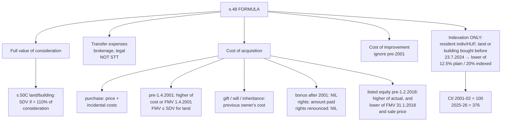

# CG-3 — Cost of Acquisition, Cost of Improvement and Full Value of Consideration

Covers: the three components deducted from sale value, what "full value of consideration" means including the stamp duty rule of s. 50C, cost for assets acquired before 2001, inherited or gifted assets, bonus and rights shares, the 31 January 2018 grandfathering for listed equity, cost of improvement, and indexation where it still survives.

## The formula (s. 48)

```
  Full value of consideration (FVC)
– Expenditure incurred wholly and exclusively in connection with the transfer
– Cost of acquisition
– Cost of improvement
= Capital gain
```

Under the post-23.7.2024 regime, costs are **not indexed**. The one exception is a resident individual/HUF's land or building acquired before 23.7.2024 (see "Indexation" below).

## Full value of consideration

The price received or receivable for the transfer, in money or money's worth.

**Section 50C (land and building):** if the **stamp duty value (SDV)** adopted by the registration authority **exceeds 110%** of the actual consideration, the **SDV is deemed** to be the full value of consideration. If SDV is within 110% of the consideration, the actual consideration is used. The 10% tolerance allows for genuine differences in valuation.

Example: Flat sold for ₹80 lakh; SDV ₹86 lakh. 110% of 80 = 88. SDV ₹86 lakh is within the tolerance → FVC = ₹80 lakh. If SDV were ₹90 lakh → FVC = ₹90 lakh.

## Expenses on transfer

Brokerage, commission, legal fees, stamp duty and registration borne by the seller, advertisement for sale. **Securities Transaction Tax (STT) is not deductible** as an expense on transfer.

## Cost of acquisition — the rules by case

| Case | Cost of acquisition |
|---|---|
| **Normal purchase** | Price paid + incidental costs (brokerage, stamp duty, registration on purchase) |
| Asset acquired **before 1.4.2001** | **Actual cost or FMV on 1.4.2001, at the option of the assessee**. For land/building, the FMV cannot exceed the **stamp duty value on 1.4.2001** |
| Acquired by **gift, will, inheritance, HUF partition** etc. (s. 49) | **Cost to the previous owner** (the last owner who acquired it by purchase), plus his cost of improvement. If the previous owner acquired before 1.4.2001, the FMV-on-1.4.2001 option applies |
| **Bonus shares** allotted **after 1.4.2001** | **Nil** |
| Bonus shares allotted **before 1.4.2001** | FMV on 1.4.2001 (option) |
| **Rights shares** subscribed | Amount **paid** to the company |
| **Right entitlement renounced** (sold) | **Nil** (whole sale price is STCG) |
| Shares bought by a **renouncee** | Price paid to the renouncer + amount paid to the company |
| Goodwill, trademark, tenancy rights, **self-generated** | **Nil** (s. 55(2)) |
| Asset received on which tax was paid u/s **56(2)(x)** (gift from non-relative) | The **value taxed** under 56(2)(x) |

## Grandfathering for listed equity (s. 112A / 55(2)(ac))

LTCG on listed equity was exempt until 31 March 2018. To avoid taxing gains that had accrued while exempt, the cost of listed equity **acquired before 1 February 2018** is:

> **Cost = higher of (a) actual cost, and (b) lower of [FMV on 31.1.2018, full value of consideration]**

Walk through it with three cases (bought for ₹100):

| FMV 31.1.2018 | Sale price | Lower of FMV & sale | Cost = higher of 100 & that | Gain |
|---|---|---|---|---|
| 200 | 250 | 200 | 200 | 50 |
| 200 | 150 | 150 | 150 | 0 |
| 50 | 150 | 50 | 100 | 50 |

The rule protects the pre-2018 gain (row 1) but never creates an artificial loss (row 2) and never lowers the actual cost (row 3).

## Cost of improvement

All **capital expenditure** incurred to make additions or alterations to the asset, **by the assessee or the previous owner**.
- Improvement **before 1.4.2001** is **ignored** (the FMV on 1.4.2001 is assumed to include it).
- **Not** cost of improvement: routine repairs, and expenditure already deductible under another head (e.g. house property repairs covered by the 30%).
- Self-generated goodwill/rights: cost of improvement is nil.

## Indexation — where it still survives

Indexation inflates cost by the Cost Inflation Index (CII):

```
Indexed cost of acquisition = Cost × CII of year of transfer / CII of year of acquisition
                              (or of FY 2001-02, if acquired before 1.4.2001)
Indexed cost of improvement  = Cost of improvement × CII of year of transfer / CII of year of improvement
```

From 23.7.2024 indexation is **only** available as the **option** for a **resident individual/HUF** selling **land or building acquired before 23.7.2024**: tax = **lower of** (a) 12.5% of gain without indexation, (b) 20% of gain with indexation.

| FY | CII | FY | CII |
|---|---|---|---|
| 2001-02 | 100 | 2019-20 | 289 |
| 2005-06 | 117 | 2020-21 | 301 |
| 2010-11 | 167 | 2021-22 | 317 |
| 2015-16 | 254 | 2022-23 | 331 |
| 2016-17 | 264 | 2023-24 | 348 |
| 2017-18 | 272 | 2024-25 | 363 |
| 2018-19 | 280 | **2025-26** | **376** |

## Worked illustration — land bought in 1995

Mr. Varun sold a plot of land on 10.12.2025 for ₹90,00,000 (SDV ₹92,00,000). Brokerage 1%. Bought in 1995 for ₹6,00,000; FMV on 1.4.2001 ₹10,00,000 (SDV on that date ₹9,00,000). Improvement: boundary wall in 1998 ₹1,00,000; levelling in FY 2010-11 ₹4,00,000.

- FVC: SDV 92 lakh ≤ 110% of 90 lakh (99 lakh), so FVC = **₹90,00,000**.
- Expenses: 1% of 90 lakh = ₹90,000.
- Cost: higher of actual (6 lakh) or FMV on 1.4.2001 capped at SDV (9 lakh) → **₹9,00,000**.
- Improvement: 1998 wall ignored (before 2001); FY 2010-11 ₹4,00,000.

| | (a) Without indexation @ 12.5% | (b) With indexation @ 20% |
|---|---|---|
| FVC | 90,00,000 | 90,00,000 |
| Less: expenses | (90,000) | (90,000) |
| Less: cost | (9,00,000) | 9,00,000 × 376/100 = (33,84,000) |
| Less: improvement | (4,00,000) | 4,00,000 × 376/167 = (9,00,599) |
| LTCG | **76,10,000** | **46,25,401** |
| Tax | 9,51,250 | **9,25,080** |

Option (b) gives lower tax, so he pays ₹9,25,080 (plus cess), treating the LTCG as ₹46,25,401 at 20%.

## What to remember

- **FVC − transfer expenses − cost − improvement.** STT is not an expense on transfer.
- **s. 50C**: SDV used if it exceeds **110%** of consideration.
- Pre-2001 assets: **higher of actual cost or FMV on 1.4.2001** (FMV capped at SDV for land/building). **Improvement before 2001 ignored.**
- Gift/inheritance: **previous owner's cost**. Bonus after 2001: **nil**. Rights renounced: **nil**.
- Listed equity bought before 1.2.2018: **higher of actual, and lower of (FMV 31.1.2018, sale price)**.
- Indexation only in the **land/building option** (pre-23.7.2024, resident individual/HUF). **CII 2025-26 = 376, 2001-02 = 100.**

## Concept map



## Flashcards
Q: State the s. 48 formula for capital gains.
A: Full value of consideration minus transfer expenses minus cost of acquisition minus cost of improvement.

Q: When does s. 50C substitute the stamp duty value?
A: When the SDV of land or building exceeds 110% of the actual consideration.

Q: Is STT deductible as a transfer expense?
A: No.

Q: Cost of an asset acquired before 1.4.2001?
A: At the assessee's option, actual cost or FMV on 1.4.2001; for land/building the FMV cannot exceed the SDV on 1.4.2001.

Q: Is cost of improvement incurred before 1.4.2001 considered?
A: No, it is ignored.

Q: Cost of acquisition of an inherited house?
A: The cost to the previous owner (with the FMV-on-1.4.2001 option if acquired before that date).

Q: Cost of bonus shares allotted in 2019?
A: Nil.

Q: Cost of a right entitlement that is renounced?
A: Nil; the entire sale price is short-term capital gain.

Q: State the grandfathering rule for listed equity acquired before 1.2.2018.
A: Cost is the higher of actual cost and the lower of (FMV on 31.1.2018, full value of consideration).

Q: Who can still use indexation after 23.7.2024, and on what?
A: A resident individual or HUF, on land or building acquired before 23.7.2024, as an option: pay the lower of 12.5% without indexation or 20% with indexation.

Q: CII for FY 2025-26 and FY 2001-02?
A: 376 and 100.

Q: Cost of self-generated goodwill?
A: Nil.

## Sources
- Course plan Unit IV: cost of acquisition of capital assets, computation of capital gains
- Income-tax Act 1961: ss. 48, 49, 50C, 55, 112 proviso, 112A; CBDT CII notifications
- Previous node: [[Unit 4A - CG-2 Short-term and Long-term Capital Gains]]
- Next node: [[Unit 4A - CG-4 Computation of Capital Gains]]
- [[Unit 4A - Capital Gains MOC (Node Map)]]
