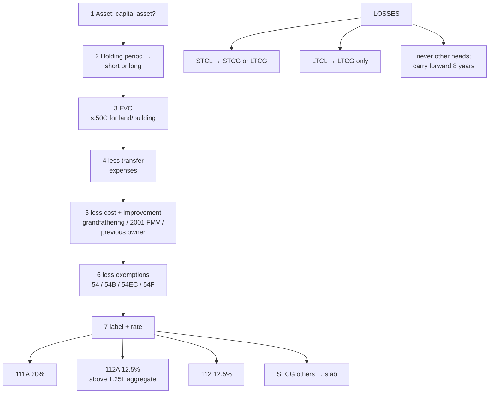

# CG-4 — Computation of Capital Gains

Covers: the answer-script format for STCG and LTCG, three worked problems (listed shares with grandfathering and the ₹1.25 lakh exemption, a short-term sale of gold, depreciable assets), set-off and carry forward of capital losses, and the order of steps that avoids the usual mistakes.

## The seven-step method

1. **Identify the asset** and confirm it is a capital asset (CG-1).
2. **Find the holding period** and classify: short or long (CG-2).
3. **Determine the full value of consideration** (check s. 50C for land/building) (CG-3).
4. **Deduct transfer expenses.**
5. **Deduct cost of acquisition and improvement** (with grandfathering for listed equity, FMV-2001 option, previous owner's cost) (CG-3).
6. **Deduct exemptions** u/s 54 / 54B / 54EC / 54F if applicable (CG-5).
7. **Label the result with its section and rate**: 111A @ 20%, 112A @ 12.5% above ₹1.25L, 112 @ 12.5%, or slab.

## Answer-script format

```
Computation of Capital Gains — Mr. X, AY 2026-27

(i) Long-term capital gain on sale of ___ (held __ months, > 24 / 12)
    Full value of consideration                         xxx
    Less: Expenses on transfer                          (xx)
    Net consideration                                   xxx
    Less: Cost of acquisition                           (xx)
    Less: Cost of improvement                           (xx)
    Long-term capital gain                              xxx
    Less: Exemption u/s 54 / 54EC / 54F                 (xx)
    Taxable LTCG u/s 112 @ 12.5%                        xxx

(ii) Short-term capital gain on sale of ___ (held __ months)
    ...same format...
    Taxable STCG — at slab / u/s 111A @ 20%             xxx
```

Always keep the **types separate**. In Unit 5 they are taxed at different rates, so they must be carried into the total income computation as separate lines.

## Worked problem 1 — listed shares (grandfathering + ₹1.25L)

Ms. Anita sold listed equity shares on the stock exchange (STT paid):

| Lot | Bought | Cost | FMV 31.1.2018 | Sold | Sale price | Brokerage |
|---|---|---|---|---|---|---|
| A | 10.6.2016 | 2,00,000 | 3,50,000 | 5.8.2025 | 5,00,000 | 2,500 |
| B | 15.3.2025 | 1,50,000 | — | 20.1.2026 | 2,10,000 | 1,000 |
| C | 1.4.2024 | 3,00,000 | — | 10.2.2026 | 4,40,000 | 2,000 |

**Lot A** (held > 12 months → LTCG 112A). Cost = higher of 2,00,000 and lower of (3,50,000, 5,00,000) = **3,50,000**.
LTCG = 5,00,000 − 2,500 − 3,50,000 = **1,47,500**.

**Lot B** (15.3.2025 → 20.1.2026 = ~10 months → STCG 111A).
STCG = 2,10,000 − 1,000 − 1,50,000 = **59,000** @ 20%.

**Lot C** (1.4.2024 → 10.2.2026 = ~22 months, > 12 → LTCG 112A).
LTCG = 4,40,000 − 2,000 − 3,00,000 = **1,38,000**.

| | ₹ |
|---|---|
| LTCG u/s 112A (1,47,500 + 1,38,000) | 2,85,500 |
| Less: exempt up to ₹1,25,000 | (1,25,000) |
| **Taxable LTCG u/s 112A @ 12.5%** | **1,60,500** → tax ₹20,063 |
| **STCG u/s 111A @ 20%** | **59,000** → tax ₹11,800 |

(Before cess; and before any unused basic exemption adjustment, which is done in Unit 5.)

## Worked problem 2 — gold and a house

Mr. Raj sold:
- **Gold jewellery** on 1.11.2025 for ₹6,00,000, bought 1.5.2024 for ₹4,50,000. Held 18 months → **STCG** at slab: 6,00,000 − 4,50,000 = **₹1,50,000**.
- **A residential house** on 15.1.2026 for ₹1,20,00,000 (SDV ₹1,25,00,000; 110% of 1.2 cr = 1.32 cr so actual consideration used). Brokerage ₹1,20,000. Bought on 1.8.2024 for ₹85,00,000. Held ~17 months → **STCG** at slab: 1,20,00,000 − 1,20,000 − 85,00,000 = **₹33,80,000**.

Note that the house is short-term (≤ 24 months), so **s. 54 is not available** (it needs LTCG). Both gains go into normal income at slab rates.

## Worked problem 3 — depreciable assets (s. 50)

Block of machinery @ 15%: opening WDV ₹4,00,000. Machine bought during the year ₹1,00,000. One machine sold for ₹7,00,000.
WDV before sale = 5,00,000. Sale proceeds exceed it by ₹2,00,000 → **STCG u/s 50 ₹2,00,000** (at slab), no depreciation for the block this year, and the block's WDV becomes nil.

## Set-off and carry forward of capital losses

| Loss | Can be set off against | Carry forward |
|---|---|---|
| **Short-term capital loss** | STCG **or** LTCG | 8 assessment years; set off against STCG or LTCG |
| **Long-term capital loss** | **LTCG only** | 8 assessment years; against LTCG only |
| Capital loss of any kind | **Never** against other heads | — |

The asymmetry follows from the rates: LTCG is taxed at a concessional rate, so a long-term loss cannot be allowed to wipe out short-term gain taxed at a higher rate. Losses must be claimed in a return filed by the due date to be carried forward.

## Traps

- Classify **each lot** separately; don't average holding periods.
- **₹1,25,000 exemption is per year, per assessee**, across all 112A gains, not per lot.
- **Section 54 needs a long-term** residential house. A short-term house sale gets no exemption.
- A depreciable asset held 20 years still produces **STCG** (s. 50).
- Buy-back of shares by a company **from 1.10.2024**: the amount received is **dividend** (IFOS) in the shareholder's hands, and the cost of the shares becomes a **capital loss**.

## What to remember

- Seven steps: asset → holding → FVC → expenses → cost/improvement → exemptions → label with rate.
- Keep STCG (111A / slab) and LTCG (112A / 112) **on separate lines**.
- ₹1.25 lakh 112A exemption is **per year in aggregate**.
- STCL against STCG or LTCG; **LTCL only against LTCG**; never against other heads; carry forward 8 years.

## Concept map



## Flashcards
Q: List the seven steps of a capital gains computation.
A: Identify the capital asset; classify by holding period; FVC (s. 50C check); less transfer expenses; less cost and improvement; less exemptions; label with section and rate.

Q: Is the ₹1,25,000 exemption under s. 112A per transaction?
A: No, it is per assessee per year, applied to aggregate 112A gains.

Q: A house bought 20 months ago is sold at a gain. Can s. 54 be claimed?
A: No. The gain is short-term; s. 54 requires a long-term capital gain.

Q: Against what can a long-term capital loss be set off?
A: Only against long-term capital gains.

Q: Against what can a short-term capital loss be set off?
A: Against short-term or long-term capital gains.

Q: Can a capital loss be set off against salary income?
A: No. Capital losses can only be set off within the head.

Q: For how many years can capital losses be carried forward?
A: 8 assessment years.

Q: How is an amount received on buy-back of shares taxed from 1.10.2024?
A: As dividend under IFOS; the cost of the shares is treated as a capital loss.

Q: Why keep STCG and LTCG on separate lines in the computation?
A: They are taxed at different rates in the final tax computation.

## Sources
- Course plan Unit IV: computation of short-term and long-term capital gains
- Income-tax Act 1961: ss. 48, 50, 70, 71, 74, 111A, 112, 112A; s. 2(22)(f) and 46A as amended from 1.10.2024
- Previous node: [[Unit 4A - CG-3 Cost of Acquisition and Improvement]]
- Next node: [[Unit 4A - CG-5 Exemptions Sections 54 54B 54EC 54F]]
- [[Unit 4A - Capital Gains MOC (Node Map)]]
