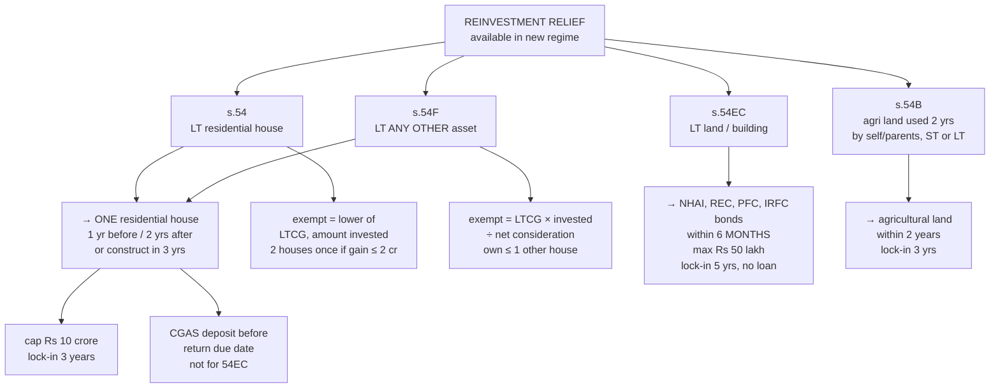

# CG-5 — Exemptions u/s 54, 54B, 54EC and 54F

Covers: the idea of reinvestment relief, each of the four sections (who, what asset, what reinvestment, time limits, amount, lock-in), the Capital Gains Account Scheme, the withdrawal rules, a comparison table, and worked problems. These exemptions **are available under the new regime** (they are not Chapter VI-A deductions).

> **Syllabus note:** the course plan's unit summary lists **54, 54B, 54EC and 54F**; the week-by-week table lists **54, 54EC and 54F** only. 54B is covered here briefly. **Confirm with faculty whether 54B is examinable.**

## The idea

All four sections share one logic: **if you reinvest the gain in something the government wants to encourage, you are not taxed on the gain now.** Housing (54, 54F), agriculture (54B), and infrastructure bonds (54EC). Each section attaches a **lock-in**: sell the new asset too soon and the exemption is clawed back.

## Section 54 — residential house to residential house

| Feature | Rule |
|---|---|
| **Who** | Individual or HUF |
| **Asset transferred** | **Long-term** residential house (building or land appurtenant), income from which is chargeable under House Property |
| **Reinvestment** | **One residential house in India** — purchased **1 year before or 2 years after** the transfer, or **constructed within 3 years** after the transfer |
| **Two houses option** | If LTCG **≤ ₹2 crore**, the assessee may, **once in a lifetime**, invest in **two** houses |
| **Amount exempt** | **Lower of**: LTCG, or amount invested in the new house |
| **Cap** | Cost of new house above **₹10 crore** is ignored (exemption capped at ₹10 crore) |
| **Lock-in** | New house must not be transferred within **3 years** of purchase/construction |

## Section 54F — any other long-term asset to residential house

| Feature | Rule |
|---|---|
| **Who** | Individual or HUF |
| **Asset transferred** | **Any long-term capital asset other than a residential house** (plot of land, shares, gold, jewellery, commercial building) |
| **Reinvestment** | **One residential house in India**; same time limits as s. 54 (1 yr before / 2 yrs after purchase; 3 yrs construction) |
| **Condition** | On the date of transfer, the assessee must **not own more than one residential house** other than the new one; and must not buy another within 2 years or construct another within 3 years |
| **Amount exempt** | **LTCG × Amount invested / Net consideration** (if the whole net consideration is invested, the whole LTCG is exempt) |
| **Cap** | Investment above **₹10 crore** ignored |
| **Lock-in** | New house not to be transferred within **3 years** |

**The key difference between 54 and 54F:** 54 asks you to reinvest the **gain**; 54F asks you to reinvest the **net consideration** (the whole sale proceeds less expenses). That is because 54F frees up money from a non-housing asset; the Act wants the whole value moved into housing before it gives the full exemption.

## Section 54EC — land or building to specified bonds

| Feature | Rule |
|---|---|
| **Who** | **Any assessee** |
| **Asset transferred** | **Long-term** capital asset being **land or building or both** |
| **Reinvestment** | **Long-term specified assets**: bonds of **NHAI, REC, PFC, IRFC** (or others notified) |
| **Time limit** | Within **6 months** from the date of transfer |
| **Amount exempt** | **Lower of** LTCG and amount invested |
| **Cap** | **₹50 lakh** in total (in the FY of transfer and the following FY combined) |
| **Lock-in** | **5 years**. If the bonds are transferred, **converted into money**, or **a loan is taken against them** within 5 years, the exempted amount becomes LTCG of that year |

## Section 54B — agricultural land to agricultural land

| Feature | Rule |
|---|---|
| **Who** | Individual or HUF |
| **Asset transferred** | **Urban agricultural land** (a capital asset, CG-1), **used for agricultural purposes** by the assessee or his **parents** (or the HUF) for **2 years** immediately before transfer. **Short-term or long-term** both qualify |
| **Reinvestment** | Other **agricultural land** (rural or urban) purchased within **2 years** after transfer |
| **Amount exempt** | Lower of capital gain and cost of new land |
| **Lock-in** | **3 years**; if sold within 3 years, cost of new land is reduced by the exemption for computing gain on its sale |

## Capital Gains Account Scheme (CGAS)

If the new asset (for 54, 54B, 54F) is not bought/constructed by the **due date of filing the return**, the unutilised amount must be deposited in a **Capital Gains Account Scheme** with a bank **before the due date of return**. The deposit is treated as invested. If it is not utilised within the time limit (2 or 3 years), the unutilised amount becomes capital gain of the year in which the period expires. **There is no CGAS for 54EC** (the 6-month limit is absolute).

## Withdrawal rules (clawback) in one table

| Section | If new asset transferred within | Consequence |
|---|---|---|
| 54 | 3 years | Cost of new house reduced by the exemption claimed → larger (short-term) gain on its sale |
| 54B | 3 years | Same mechanism, on the new agricultural land |
| 54F | 3 years (or another house bought within 2 yrs / built within 3 yrs) | The exemption earlier allowed becomes **LTCG** of the year of transfer/purchase |
| 54EC | 5 years (incl. loan against the bonds) | Exempted amount becomes **LTCG** of that year |

## Comparison table

| | 54 | 54F | 54EC | 54B |
|---|---|---|---|---|
| Assessee | Indl/HUF | Indl/HUF | Any | Indl/HUF |
| Asset sold | LT residential house | LT **any other** asset | LT land/building | Agri land used 2 yrs (ST or LT) |
| Invest in | Residential house | Residential house | NHAI/REC/PFC/IRFC bonds | Agricultural land |
| Time | 1 yr before / 2 yr purchase / 3 yr construct | Same as 54 | 6 months | 2 years |
| What must be invested | **Gain** | **Net consideration** | Gain | Gain |
| Cap | ₹10 cr | ₹10 cr | ₹50 lakh | — |
| Lock-in | 3 yrs | 3 yrs | 5 yrs | 3 yrs |

## Worked problems

**(a) Section 54.** Mr. Suresh sold a residential house (held 8 years) on 1.6.2025. LTCG ₹60,00,000. He bought a new house on 1.3.2026 for ₹45,00,000 and invested ₹20,00,000 in NHAI bonds on 30.11.2025.
- 54: lower of 60 lakh and 45 lakh = **₹45,00,000**.
- 54EC: the gain is from a building (a house is a building) → lower of the remaining LTCG (15 lakh) and 20 lakh = **₹15,00,000**.
- Taxable LTCG = 60 − 45 − 15 = **nil**.

**(b) Section 54F.** Ms. Priya sold a plot of land (held 6 years). Net consideration ₹80,00,000; LTCG ₹50,00,000. She owns no other house. She buys a house for ₹60,00,000 within 1 year.
- Exemption = 50,00,000 × 60,00,000 / 80,00,000 = **₹37,50,000**.
- Taxable LTCG = **₹12,50,000** u/s 112 @ 12.5%.
- Had she invested the full ₹80 lakh, the whole ₹50 lakh would be exempt.

**(c) 54EC cap and time limit.** LTCG on sale of a commercial building ₹75,00,000 on 1.5.2025. Invested ₹50,00,000 in REC bonds on 15.10.2025 and ₹10,00,000 in PFC bonds on 20.11.2025.
- 6 months from 1.5.2025 is 31.10.2025. The PFC investment is late.
- Exemption = **₹50,00,000** (also the maximum). Taxable LTCG = **₹25,00,000**.

## What to remember

- **54**: LT **house → house**; invest the **gain**; 1 yr before / 2 yrs after / 3 yrs construct; two houses once if gain ≤ ₹2 cr; cap ₹10 cr; lock-in 3 yrs.
- **54F**: LT **other asset → house**; invest **net consideration**; exemption = LTCG × invested / net consideration; must not own > 1 other house.
- **54EC**: LT **land/building → NHAI/REC/PFC/IRFC bonds**; **6 months**; max **₹50 lakh**; lock-in **5 yrs**; any assessee.
- **54B**: agri land used **2 yrs** by self/parents → agri land within 2 yrs; ST or LT.
- **CGAS** deposit before return due date for 54/54B/54F, not 54EC.
- All available under the **new regime**.

## Concept map

## Flashcards
Q: Which asset must be transferred to claim s. 54?
A: A long-term residential house whose income is chargeable under House Property.

Q: Time limits for the new house under ss. 54 and 54F?
A: Purchased within 1 year before or 2 years after the transfer, or constructed within 3 years after.

Q: When can s. 54 be claimed for two houses?
A: Once in a lifetime, if the LTCG does not exceed ₹2 crore.

Q: Amount exempt under s. 54?
A: Lower of the LTCG and the cost of the new house (new house cost capped at ₹10 crore).

Q: Amount exempt under s. 54F?
A: LTCG × amount invested ÷ net consideration.

Q: What house-ownership condition applies under s. 54F?
A: On the date of transfer the assessee must not own more than one residential house other than the new one.

Q: Which bonds qualify under s. 54EC and within what time?
A: Bonds of NHAI, REC, PFC or IRFC (or notified), within 6 months of transfer.

Q: Maximum investment eligible under s. 54EC?
A: ₹50 lakh (across the year of transfer and the next year).

Q: Lock-in for 54EC bonds, and what breaks it?
A: 5 years; transfer, conversion into money, or taking a loan against the bonds.

Q: Which asset qualifies under s. 54B?
A: Agricultural land used for agriculture by the assessee or his parents for 2 years before transfer; gain may be short-term or long-term.

Q: What is the Capital Gains Account Scheme for?
A: Depositing unutilised gain/consideration before the return due date so that ss. 54/54B/54F exemption is not lost; not available for 54EC.

Q: Are ss. 54/54EC/54F available under the new regime?
A: Yes, they are not Chapter VI-A deductions.

## Sources
- Course plan Unit IV: exemptions from LTCG u/s 54, 54B, 54EC and 54F
- Income-tax Act 1961: ss. 54, 54B, 54EC, 54F; Capital Gains Accounts Scheme, 1988; Finance Act 2023 (₹10 crore cap)
- Previous node: [[Unit 4A - CG-4 Computation of Capital Gains]]
- Next node: [[Unit 4A - CG-6 Capital Gains Composite Problems]]
- [[Unit 4A - Capital Gains MOC (Node Map)]]
