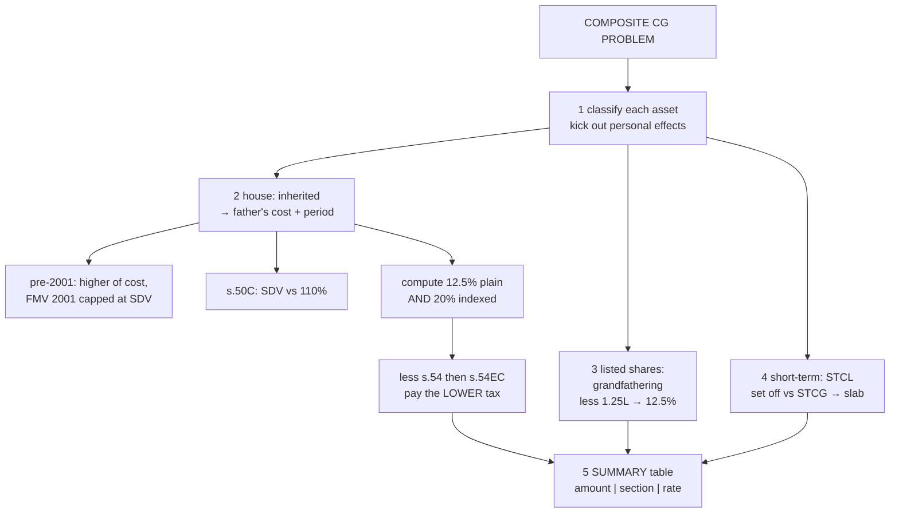

# CG-6 — Capital Gains Composite Problems

Covers: one full 10-to-15-mark problem that forces every node of the unit into play (inheritance, pre-2001 FMV, s. 50C, the indexation option, ss. 54 and 54EC, grandfathering, the ₹1.25 lakh exemption, a capital loss and a personal effect), solved line by line, followed by the checklist that turns it into marks.

## The problem

Mr. Vikram, a resident individual, furnishes the following for PY 2025-26:

1. **Residential house** sold on **10.7.2025** for ₹1,50,00,000. Stamp duty value ₹1,60,00,000. Brokerage 1% of sale price. The house was **inherited from his father in 2012**; the father bought it in **1998** for ₹10,00,000. FMV on 1.4.2001 ₹20,00,000; SDV on 1.4.2001 ₹18,00,000. Vikram added a floor in **FY 2015-16** at ₹5,00,000.
   He bought a **new residential house** on **1.2.2026** for ₹60,00,000 and invested ₹10,00,000 in **NHAI bonds** on **30.12.2025**.
2. **Listed equity shares** (STT paid) bought on **1.12.2017** for ₹3,00,000 (FMV on 31.1.2018 ₹2,50,000), sold on **1.9.2025** for ₹5,20,000, brokerage ₹2,000.
3. **Unlisted shares** bought on **1.3.2025** for ₹2,00,000, sold on **1.1.2026** for ₹1,40,000.
4. **Gold coins** bought on **1.6.2024** for ₹3,00,000, sold on **1.3.2026** for ₹4,10,000.
5. **His personal car**, bought in 2021 for ₹8,00,000, sold for ₹5,50,000.

Compute his capital gains for AY 2026-27 and the tax on each type (ignore cess).

## Solution

### Step 1 — classify

| Asset | Holding | Classification |
|---|---|---|
| House | Father's holding from 1998 included (s. 2(42A)) → far > 24 months | **LTCG** (land/building acquired before 23.7.2024, resident → **indexation option**) |
| Listed shares | 1.12.2017 → 1.9.2025, > 12 months | **LTCG u/s 112A** |
| Unlisted shares | ~10 months, ≤ 24 | **STCL** |
| Gold coins | 1.6.2024 → 1.3.2026, 21 months, ≤ 24 | **STCG** (slab) |
| Personal car | — | **Not a capital asset** (personal effect) → ignore |

### Step 2 — the house

- **FVC:** 110% of ₹1.5 crore = ₹1.65 crore; SDV ₹1.6 crore is within it → FVC = **₹1,50,00,000** (s. 50C does not apply).
- **Expenses:** 1% = ₹1,50,000.
- **Cost of acquisition:** previous owner's (father's) cost, s. 49; acquired before 2001, so higher of actual ₹10,00,000 and FMV on 1.4.2001 capped at SDV (lower of 20 lakh and 18 lakh = 18 lakh) → **₹18,00,000**.
- **Improvement:** ₹5,00,000 in FY 2015-16.

| | (a) Without indexation | (b) With indexation |
|---|---|---|
| FVC | 1,50,00,000 | 1,50,00,000 |
| Less: brokerage | (1,50,000) | (1,50,000) |
| Less: cost | (18,00,000) | 18,00,000 × 376/100 = (67,68,000) |
| Less: improvement | (5,00,000) | 5,00,000 × 376/254 = (7,40,157) |
| **LTCG** | **1,25,50,000** | **73,41,843** |
| Less: s. 54 (new house) — lower of gain and ₹60,00,000 | (60,00,000) | (60,00,000) |
| Less: s. 54EC (NHAI bonds, within 6 months of 10.7.2025) | (10,00,000) | (10,00,000) |
| **Taxable LTCG** | **55,50,000** | **3,41,843** |
| Rate | 12.5% | 20% |
| **Tax** | **6,93,750** | **68,369** |

Option (b) gives lower tax → **LTCG on house ₹3,41,843 taxed @ 20% = ₹68,369**.

### Step 3 — listed shares

Grandfathering: cost = higher of actual ₹3,00,000 and lower of (FMV 31.1.2018 ₹2,50,000; sale ₹5,20,000) = ₹2,50,000 → **₹3,00,000** (actual cost is higher; grandfathering never reduces the actual cost).

LTCG = 5,20,000 − 2,000 − 3,00,000 = **₹2,18,000**. Less exemption ₹1,25,000 → **₹93,000 @ 12.5% = ₹11,625**.

### Step 4 — short-term items and set-off

- Unlisted shares: 1,40,000 − 2,00,000 = **STCL ₹60,000**.
- Gold coins: 4,10,000 − 3,00,000 = **STCG ₹1,10,000**.
- Set off STCL against STCG (s. 70) → **net STCG ₹50,000**, taxed at **slab rates** as part of normal income.

(STCL may also be set off against LTCG; setting it against the slab-taxed STCG is usually the most beneficial because slab rates can be 30%.)

### Summary

| Type | Amount | Rate |
|---|---|---|
| STCG (slab) | 50,000 | Slab (added to normal income) |
| LTCG on house (s. 112, indexation option) | 3,41,843 | 20% |
| LTCG on listed shares (s. 112A) | 93,000 (after ₹1.25L exemption) | 12.5% |

## The marking checklist

What a 10- or 15-mark CG question rewards, in order of frequency:

1. **Classification with a stated holding period** for each asset.
2. **Personal effects / non-capital assets explicitly excluded** with a one-line reason.
3. **Previous owner's cost and holding period** for inherited or gifted assets, citing s. 49.
4. **s. 50C tested** and conclusion stated, even when it does not apply.
5. **FMV-2001 option** chosen, with the SDV cap for land/building.
6. **Indexation option** computed both ways where it applies, and the lower tax chosen.
7. **Exemptions**: conditions tested (time limit, asset type, cap), amount computed.
8. **Grandfathering** worked out for pre-2018 listed equity.
9. **Set-off** of losses in the correct direction.
10. **Summary table with sections and rates.**

## What to remember

- Classify everything first; kick out non-capital assets.
- Inherited: previous owner's cost **and** period.
- Land/building bought before 23.7.2024 by a resident: compute **both ways**, pay the lower.
- Exemptions come **after** computing the gain, and 54EC takes only what 54 leaves.
- Grandfathering never reduces actual cost.
- End with a **summary table: amount, section, rate.**

## Concept map

## Flashcards
Q: In a composite CG problem, what is the first step?
A: Classify every asset (capital or not; short or long) with its holding period.

Q: A personal car is sold at a loss in a CG problem. Treatment?
A: Ignore; it is a personal effect, not a capital asset. Write a one-line note saying so.

Q: A house inherited in 2012, bought by the father in 1998 — whose cost and which date?
A: The father's cost; holding period from 1998; FMV-2001 option available since acquisition was before 1.4.2001.

Q: When both 54 and 54EC are claimed, how is the 54EC amount limited?
A: To the gain remaining after the s. 54 exemption (and to the amount invested, max ₹50 lakh).

Q: Listed shares cost ₹3 lakh, FMV on 31.1.2018 ₹2.5 lakh, sold for ₹5.2 lakh. Cost?
A: ₹3 lakh; grandfathered cost is the higher of actual cost and lower of (FMV, sale price), so actual prevails.

Q: STCL ₹60,000 on unlisted shares, STCG ₹1.1 lakh on gold. Net?
A: STCG ₹50,000, taxed at slab rates.

## Sources
- Course plan Unit IV: practical problems on computation of STCG/LTCG with exemptions
- Previous nodes: [[Unit 4A - CG-1 Chargeability Capital Asset and Transfer]] to [[Unit 4A - CG-5 Exemptions Sections 54 54B 54EC 54F]]
- [[Unit 4A - Capital Gains MOC (Node Map)]]
