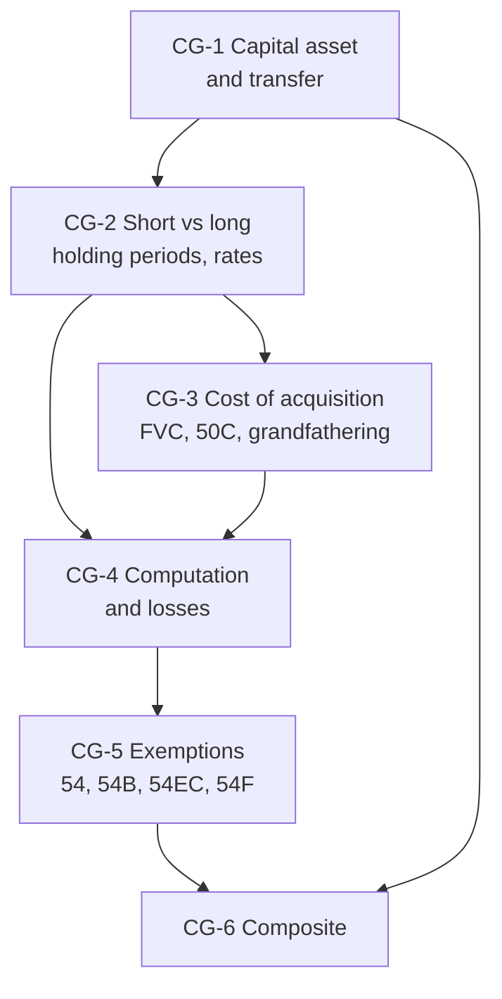

# Unit 4A — Capital Gains (Sections 45 to 55, 111A, 112, 112A)

One node = one topic = one file. States live in each note's frontmatter.

## The loop, per node

Study (45 min) → redraw the concept map from memory → flashcards → mini test (MCQ + 5-marker + 10-marker) → log every lost mark in the error book (15 min). After all six nodes: Unit 4A sectional test.

## Nodes

| Node | Topic | Depends on | Minutes | Exam focus |
| --- | --- | --- | --- | --- |
| CG-1 | [[Unit 4A - CG-1 Chargeability Capital Asset and Transfer]] | — | 40 | ★ |
| CG-2 | [[Unit 4A - CG-2 Short-term and Long-term Capital Gains]] | CG-1 | 45 | ★ |
| CG-3 | [[Unit 4A - CG-3 Cost of Acquisition and Improvement]] | CG-2 | 45 | ★ |
| CG-4 | [[Unit 4A - CG-4 Computation of Capital Gains]] | CG-2, CG-3 | 45 | ★ |
| CG-5 | [[Unit 4A - CG-5 Exemptions Sections 54 54B 54EC 54F]] | CG-4 | 50 | ★ |
| CG-6 | [[Unit 4A - CG-6 Capital Gains Composite Problems]] | CG-1 to CG-5 | 60 | ★ |

## Dependency graph

## Dated-law warning

The whole unit uses the rules for transfers **on or after 23 July 2024** (Finance (No. 2) Act 2024): 12/24-month holding periods, 111A @ 20%, 112A @ 12.5% above ₹1.25 lakh, 112 @ 12.5% without indexation, and the indexation option only for land/building acquired before 23.7.2024 by a resident individual/HUF. Older textbooks still print 36 months, 15%, 10% and ₹1 lakh. **Do not use those for AY 2026-27.**

## Links
- [[Taxation Law MOC]]
- [[BBA303-5 - Taxation Laws and Practice Course Plan]]
