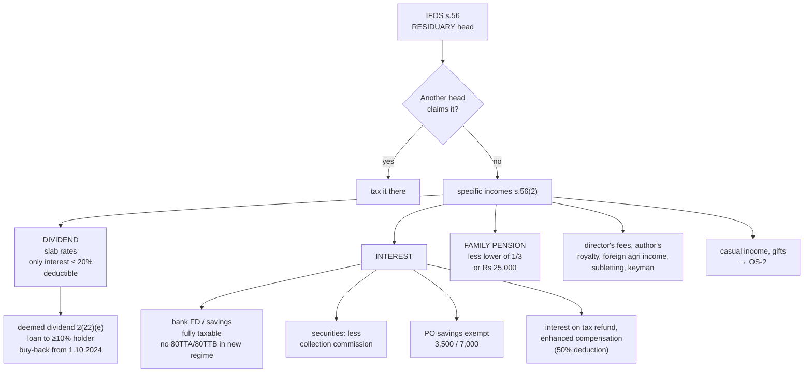

# OS-1 — Incomes Taxable under Income from Other Sources

Covers: why IFOS is the residuary head, the specific incomes s. 56(2) always places here, dividends (including deemed dividend and buy-back), interest on bank deposits, securities and post office savings, family pension, and the smaller items the course plan names (director's fees, interest on income-tax refund, royalty, agricultural income from outside India, subletting).

## The residuary head

Section 14 lists five heads. **Income from Other Sources is the fifth and the last resort.** Section 56(1) says any income that is **not chargeable under any of the other four heads**, and is not exempt, is taxed here.

So the question in any IFOS problem is two-sided:

1. **Is it income at all?** (A capital receipt like a loan, or a gift from a relative, is not.)
2. **Does another head claim it first?** If yes, it goes there. Only what is left falls into IFOS.

Section 56(2) then lists items that are **always** taxed under IFOS (they are "specific" incomes). The rest are general residuary incomes.

## Dividends — s. 56(2)(i)

**Dividends are taxed in the hands of the shareholder at normal slab rates** (since AY 2021-22, when Dividend Distribution Tax was abolished). Under the new regime, dividend is just added to normal income.

| Point | Rule |
|---|---|
| Deduction allowed | **Only interest** on money borrowed to earn the dividend, **up to 20% of the dividend** (s. 57(i) proviso). No other expense — not even collection commission |
| TDS | 10% on dividend from an Indian company exceeding ₹10,000 in a year (from FY 2025-26) |
| **Deemed dividend** s. 2(22)(e) | A **loan or advance** by a **closely held company** to a shareholder holding **≥ 10% voting power** (or to a concern in which he has ≥ 20% interest) is deemed dividend, **to the extent of the company's accumulated profits** |
| **Buy-back** s. 2(22)(f) | From **1.10.2024**, the amount received on buy-back of shares is deemed dividend in the shareholder's hands; the cost of shares becomes a capital loss |
| Dividend from a foreign company | Also taxable under IFOS at slab rates |

## Interest

| Interest on | Treatment |
|---|---|
| **Bank fixed deposits, recurring deposits, savings bank accounts** | Fully taxable under IFOS (unless the assessee is in the business of money-lending → PGBP) |
| **Securities** (government securities, debentures, bonds) — s. 56(2)(id) | Taxable under IFOS if held as investment. Deduction: collection commission and interest on money borrowed to buy the securities |
| **Post office savings account** — s. 10(15)(i) | **Exempt** up to **₹3,500** (individual account) / **₹7,000** (joint account). Excess taxable |
| Post office **time deposits, NSC, Kisan Vikas Patra** | Taxable |
| **PPF** interest, **Sukanya Samriddhi** interest | **Exempt** u/s 10(11) |
| **Interest on income-tax refund** | Taxable under IFOS (the refund itself is not income) |
| **Interest on compensation / enhanced compensation** (s. 56(2)(viii)) | Taxable in the year of **receipt**; **50% deduction** u/s 57(iv) |

**Deductions for savings interest under the new regime:** s. **80TTA** (₹10,000 on savings interest) and **80TTB** (₹50,000 for senior citizens) are **not available** under s. 115BAC. So under the new regime, savings bank interest is fully taxable (only the s. 10(15) post office exemption survives, since it is an exemption, not a deduction).

**Accrual vs receipt:** interest is taxed on the basis of the assessee's method of accounting. For a salaried individual, the usual assumption is **accrual** for FD interest (taxable yearly even if the FD is cumulative).

## Family pension — s. 56(2)(iia)

**Family pension** is the pension received by the **legal heirs** of a deceased employee (e.g. the widow). The widow was never the employer's employee, so it cannot be salary. It is IFOS.

- **Deduction u/s 57(iia):** **1/3 of family pension or ₹25,000, whichever is lower** (new regime, from AY 2025-26; the old regime limit is ₹15,000).
- Contrast: **pension received by the retired employee himself** is **salary** (Unit 2).
- Family pension to families of armed forces personnel killed in action is exempt u/s 10(19).

## Other items the course plan names

| Income | Head and note |
|---|---|
| **Director's sitting fees / remuneration** (not as an employee) | IFOS. If the director is an employee (e.g. managing director under a contract of service), it is salary |
| **Royalty / copyright income of an author** | IFOS, unless writing is the author's profession, in which case PGBP |
| **Agricultural income from land outside India** | IFOS; the s. 10(1) exemption covers only Indian agricultural land |
| **Income from subletting** a house by a tenant | IFOS (the tenant is not the owner, so it cannot be House Property) |
| **Rent from plant, machinery, furniture**; **composite letting** of building with plant/machinery where inseparable | IFOS, if not the assessee's business (OS-3) |
| **Casual income**: winnings from lotteries, crossword puzzles, races, card games, gambling, betting | IFOS at 30% flat (OS-2) |
| **Gifts** above ₹50,000 from non-relatives | IFOS u/s 56(2)(x) (OS-2) |
| **Keyman insurance** sums received (other than by the business or employee) | IFOS u/s 56(2)(xi) |
| **Interest on a loan given to a friend** | IFOS |
| **Salary of an MP/MLA** | IFOS (no employer-employee relationship) |

## What to remember

- IFOS is **residuary**: first ask if another head claims the income.
- **Dividend**: slab rates; only **interest up to 20%** deductible; deemed dividend 2(22)(e); **buy-back = dividend from 1.10.2024**.
- **Bank interest** fully taxable in new regime (**no 80TTA/80TTB**). **PO savings** exempt ₹3,500 / ₹7,000. **PPF** exempt.
- **Family pension**: IFOS, deduction **lower of 1/3 or ₹25,000**.
- **Director's fees, author's royalty (non-professional), foreign agri income, subletting, interest on refund** → IFOS.

## Concept map

## Flashcards
Q: Why is IFOS called the residuary head?
A: Section 56(1) taxes under it any income not chargeable under the other four heads and not exempt.

Q: How are dividends taxed in the shareholder's hands?
A: At normal slab rates under IFOS.

Q: What deduction is allowed against dividend income?
A: Only interest on money borrowed to earn it, up to 20% of the dividend.

Q: What is deemed dividend under s. 2(22)(e)?
A: A loan or advance by a closely held company to a shareholder with at least 10% voting power (or to a concern in which he has 20% interest), to the extent of accumulated profits.

Q: How is the amount received on a buy-back of shares taxed from 1.10.2024?
A: As dividend in the shareholder's hands; the cost of the shares becomes a capital loss.

Q: Is savings bank interest deductible u/s 80TTA under the new regime?
A: No. 80TTA and 80TTB are not available under s. 115BAC.

Q: Exemption on post office savings account interest?
A: ₹3,500 for an individual account and ₹7,000 for a joint account, under s. 10(15)(i).

Q: Head for family pension, and deduction?
A: IFOS; deduction of 1/3 of the pension or ₹25,000, whichever is lower (new regime).

Q: Pension received by a retired employee — which head?
A: Salaries.

Q: Director's sitting fees received by a non-employee director — which head?
A: IFOS.

Q: Income from subletting by a tenant — which head?
A: IFOS, because the tenant is not the owner.

Q: Agricultural income from land in Nepal — treatment?
A: Taxable under IFOS; s. 10(1) exempts only agricultural income from land in India.

Q: Interest on enhanced compensation received — how is it taxed?
A: In the year of receipt under IFOS, with a 50% deduction u/s 57(iv).

## Sources
- Course plan Unit IV: incomes taxable under other sources (dividend income, interest on bank deposits, securities, post office savings, family pension, director's remuneration, casual income, interest on income-tax refund, royalty, agricultural income from outside India)
- Income-tax Act 1961: ss. 2(22), 10(11), 10(15), 56, 57, 115BAC(2)
- Next node: [[Unit 4B - OS-2 Casual Income and Gifts]]
- [[Unit 4B - Other Sources MOC (Node Map)]]
