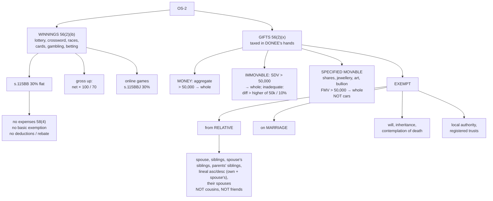

# OS-2 — Casual Income and Gifts

Covers: winnings from lotteries, crossword puzzles, races, card games and gambling, the 30% flat rate and why no deduction is allowed, grossing up for TDS, online games; then gifts under s. 56(2)(x): money, immovable property and specified movable property, the ₹50,000 thresholds, inadequate consideration, the definition of relative, and the exempt occasions.

## Part 1 — Winnings (casual income)

### What is covered

Section 56(2)(ib): winnings from **lotteries, crossword puzzles, races including horse races, card games and other games of any sort, gambling or betting of any form or nature**. Winnings from **online games** are dealt with separately u/s 115BBJ.

### How it is taxed — s. 115BB

| Rule | Detail |
|---|---|
| Rate | **Flat 30%** (plus surcharge if applicable and 4% cess) |
| Expenses | **No deduction** of any expenditure (s. 58(4)) — not even the cost of the lottery ticket |
| Basic exemption | **Cannot** be set off against winnings. Even a person with no other income pays 30% |
| Chapter VI-A deductions / 87A rebate | **Not** allowed against winnings |
| Losses | No loss from any other source can be set off against winnings |
| Exception to 58(4) | Owners of race horses may deduct expenses of maintaining them against income from races (horse race business) |

The logic: casual income is pure windfall, so the Act taxes it at the highest slab rate and refuses to let any relief reduce it.

### Grossing up

Winnings above **₹10,000 per transaction** (from FY 2025-26) suffer **TDS @ 30%** u/s 194B/194BB. Problems often give the **net amount received**. The taxable amount is the **gross** winning:

> **Gross winnings = Net received × 100 / 70**

Example: Received ₹70,000 net from a lottery → gross ₹1,00,000 → taxable ₹1,00,000 @ 30% = ₹30,000 (already deducted as TDS, so credited against the tax liability).

### Online games — s. 115BBJ

Net winnings from **online games** are taxed at **30%**, with TDS u/s 194BA on the net winnings. Treat it like 115BB in computation: flat rate, no expenses (other than as provided for computing net winnings).

## Part 2 — Gifts, s. 56(2)(x)

When a person receives money or property **without consideration** (or for **inadequate** consideration), the value may be taxed as IFOS in the **recipient's** hands. Remember from CG-1: the gift is not a transfer for the **donor**, so the donor has no capital gain. This section taxes the **donee**.

### The three categories

| Category | Received **without consideration** | Received for **inadequate consideration** |
|---|---|---|
| **Money** (cash, cheque, draft) | **Aggregate** of sums in the year **> ₹50,000** → **whole aggregate** taxable | — |
| **Immovable property** (land, building) | **SDV > ₹50,000** → **whole SDV** taxable | SDV − consideration **> higher of ₹50,000 and 10% of consideration** → the **difference** is taxable |
| **Specified movable property** | **Aggregate FMV > ₹50,000** → **whole FMV** taxable | FMV − consideration **> ₹50,000** → the **difference** is taxable |

**Specified movable property** means: **shares and securities, jewellery, archaeological collections, drawings, paintings, sculptures, any work of art, and bullion.** Everything else — a car, a phone, furniture, a watch that is not jewellery — is **not** covered. A gift of a car worth ₹10 lakh from a friend is **not taxable**.

**"Whole amount" is the key trap.** The ₹50,000 is a threshold, not an exemption. Receive ₹30,000 and ₹25,000 from two friends in the same year: aggregate ₹55,000 exceeds ₹50,000, so **₹55,000** is taxable, not ₹5,000.

The thresholds are applied **per category**. Money gifts are aggregated with money; movable property gifts are aggregated with movable property.

### Not taxable — the exempt situations

The value is **not** taxable if received:
1. **From a relative** (any amount);
2. **On the occasion of the marriage** of the individual (from anyone);
3. **Under a will or by way of inheritance**;
4. **In contemplation of death** of the payer or donor;
5. From a **local authority**;
6. From a **fund, trust or institution** registered u/s 12A/12AB or approved u/s 10(23C);
7. By way of a transaction **not regarded as transfer** u/s 47 (e.g. amalgamation);
8. From an individual by a **trust created solely for the benefit of the relative** of the individual.

**Birthday, anniversary, Diwali and festival gifts are NOT exempt occasions.** Only marriage is.

### Relative (for an individual)

| # | Relative |
|---|---|
| 1 | **Spouse** |
| 2 | **Brother or sister** of the individual |
| 3 | Brother or sister of the **spouse** |
| 4 | Brother or sister of **either parent** (uncles and aunts) |
| 5 | Any **lineal ascendant or descendant** (parents, grandparents, children, grandchildren) |
| 6 | Any lineal ascendant or descendant **of the spouse** (in-laws) |
| 7 | **Spouse** of any person in 2 to 6 |

**Not relatives:** cousins, nephews and nieces, friends, the spouse's uncle. A gift from a cousin above ₹50,000 is taxable.

### Worked example

Ms. Neha received during PY 2025-26:

| Gift | From | Value | Taxable? |
|---|---|---|---|
| Cash ₹40,000 | Friend, on birthday | 40,000 | Money, aggregate |
| Cash ₹25,000 | Cousin | 25,000 | Money, aggregate (cousin is not a relative) |
| Cash ₹2,00,000 | Grandfather | — | Exempt (relative) |
| Gold necklace FMV ₹60,000 | Friend, on her marriage | — | Exempt (marriage) |
| Car ₹6,00,000 | Uncle's friend | — | Not specified movable property |
| Plot SDV ₹10,00,000, bought from a stranger for ₹8,00,000 | — | Difference ₹2,00,000 | Higher of 50,000 and 10% of 8 lakh = 80,000; 2 lakh > 80,000 → taxable |
| Painting FMV ₹45,000 | Friend | 45,000 | Movable aggregate ₹45,000 ≤ 50,000 → not taxable |

- Money: 40,000 + 25,000 = 65,000 > 50,000 → **₹65,000**.
- Immovable: **₹2,00,000**.
- Movable: ₹45,000 → nil.
- **Total taxable u/s 56(2)(x) = ₹2,65,000.**

### Cost for future capital gains

If a gifted asset is taxed u/s 56(2)(x), the **value taxed** becomes its **cost of acquisition** when it is later sold (s. 49(4)), so the same value is not taxed twice (CG-3).

## What to remember

- Winnings: **30% flat, no expenses, no basic exemption, no deductions**. Gross up net × 100/70.
- Gifts 56(2)(x): money / immovable / specified movable; **₹50,000 threshold, then the whole amount**.
- Inadequate consideration: immovable **> higher of ₹50,000 and 10%**; movable **> ₹50,000**; tax the **difference**.
- **Specified movable** = shares, jewellery, art, bullion, archaeological collections. **Not cars.**
- Exempt: **relative, marriage, will/inheritance, contemplation of death**, local authority, trusts.
- **Cousins and friends are not relatives. Birthdays are not marriage.**

## Concept map

## Flashcards
Q: Rate of tax on lottery winnings?
A: 30% flat u/s 115BB (plus surcharge if any and cess).

Q: Can the cost of lottery tickets be deducted from winnings?
A: No, s. 58(4) disallows any expenditure.

Q: Can basic exemption limit be used against lottery winnings?
A: No.

Q: Net lottery winnings received ₹1,40,000 after TDS. Taxable amount?
A: ₹2,00,000 (1,40,000 × 100/70).

Q: Money gifts from friends total ₹55,000 in a year. How much is taxable?
A: The whole ₹55,000, since the aggregate exceeds ₹50,000.

Q: Is a car received as a gift from a friend taxable u/s 56(2)(x)?
A: No, a car is not specified movable property.

Q: What is specified movable property?
A: Shares and securities, jewellery, archaeological collections, drawings, paintings, sculptures, any work of art, and bullion.

Q: Immovable property bought for ₹20 lakh with SDV ₹23 lakh. Taxable?
A: The difference ₹3 lakh exceeds the higher of ₹50,000 and 10% of ₹20 lakh (₹2 lakh), so ₹3 lakh is taxable.

Q: Name four situations in which a gift is not taxable.
A: From a relative; on marriage; under a will or inheritance; in contemplation of death of the donor (also local authority and registered trusts).

Q: Is a gift of ₹1 lakh from a cousin taxable?
A: Yes. A cousin is not a relative under the definition.

Q: Is a gift of ₹1 lakh on birthday from a friend exempt?
A: No. Only marriage is an exempt occasion.

Q: Is a gift from the spouse's brother taxable?
A: No, a brother of the spouse is a relative.

Q: If a gifted share is taxed u/s 56(2)(x), what is its cost when later sold?
A: The value taxed under 56(2)(x) (s. 49(4)).

## Sources
- Course plan Unit IV: winnings from lotteries, crossword puzzles, horse races, card games and gambling; gifts received without consideration or for inadequate consideration subject to prescribed limits
- Income-tax Act 1961: ss. 56(2)(ib), 56(2)(x), 58(4), 115BB, 115BBJ, 194B, 49(4)
- Previous node: [[Unit 4B - OS-1 Incomes Taxable under Other Sources]]
- Next node: [[Unit 4B - OS-3 Deductions and Disallowances Sections 57 58]]
- [[Unit 4B - Other Sources MOC (Node Map)]]
