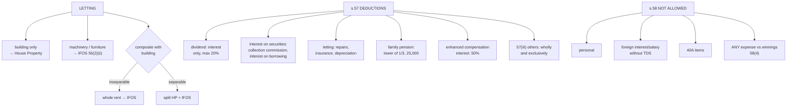

# OS-3 — Letting of Plant, Machinery and Furniture; Deductions u/s 57; Disallowances u/s 58

Covers: when rent from plant, machinery or furniture and composite letting fall under IFOS, the full list of deductions in s. 57, the family pension standard deduction, and the disallowances in s. 58 (including why no deduction is allowed against winnings).

## Letting of plant, machinery, furniture — s. 56(2)(ii) and (iii)

| Situation | Head |
|---|---|
| Rent from letting **only a building** (owner) | House Property |
| Rent from letting **machinery, plant or furniture** (not the assessee's business) | **IFOS**, s. 56(2)(ii) |
| **Composite letting** of a building **with** machinery/furniture, where the lettings are **inseparable** (tenant would not take one without the other) | **IFOS**, s. 56(2)(iii) (whole rent) |
| Composite letting where the lettings are **separable** | Building rent → House Property; machinery/furniture rent → IFOS |
| Any of the above as a **business** of letting (a regular commercial activity) | PGBP |

The inseparability test is factual: a furnished hotel let as a going unit is inseparable; a house with a separately priced furniture rental agreement is separable.

## Deductions allowed — s. 57

| Clause | Income | Deduction |
|---|---|---|
| **57(i)** | **Dividend** | **Only** interest on money borrowed to earn it, **max 20%** of the dividend. No commission or other expense |
| 57(i) | **Interest on securities** | Reasonable **commission or remuneration to a banker** or other person for **realising** the interest; interest on money borrowed to buy the securities |
| 57(ia) | Employees' contributions to welfare funds received by an employer (taxed as income) | Deductible if credited to the employee's account by the due date under the relevant Act |
| **57(ii)** | **Letting of plant, machinery, furniture, building** under IFOS | **Current repairs**, **insurance** premium, and **depreciation** (as under ss. 30, 31, 32) |
| **57(iia)** | **Family pension** | **1/3 of the pension or ₹25,000, whichever is lower** (new regime; ₹15,000 in old regime) |
| **57(iii)** | Any other IFOS income | Any expenditure (not capital, not personal) laid out **wholly and exclusively** for earning the income |
| **57(iv)** | **Interest on compensation / enhanced compensation** (s. 56(2)(viii)) | **50%** of the interest, no other deduction |

Two points distinguish 57(iii) from 37(1) in PGBP. It must be for **earning this particular income**, and the income must be of a kind that expenses can reasonably produce. **Interest on a loan taken to make a fixed deposit** is deductible against the FD interest. **Interest on a loan taken to give a gift** is not.

## Disallowances — s. 58

| Clause | Not deductible |
|---|---|
| 58(1)(a)(i) | Any **personal** expenses |
| 58(1)(a)(ii) | **Interest payable outside India** on which TDS was not deducted/paid |
| 58(1)(a)(iii) | **Salary payable outside India** on which TDS was not deducted/paid |
| 58(1)(a)(iv) | **Wealth tax** |
| 58(1A) | Amounts disallowed u/s 40(a)(ia) (TDS default on resident payments, 30%) |
| 58(2) | Expenditure hit by s. **40A** (e.g. cash payments over ₹10,000, excessive payments to relatives) |
| **58(4)** | **Any expenditure or allowance in connection with winnings** from lotteries, crossword puzzles, races, card games, gambling or betting |

The proviso to 58(4) exempts an owner maintaining race horses: expenditure on maintaining the horses is deductible against income from horse races.

## Worked example — IFOS with deductions

Mr. Anil, a resident, has for PY 2025-26:
- Dividend from Indian companies ₹90,000; interest on loan taken to buy those shares ₹25,000; collection commission ₹1,000.
- Interest on debentures ₹40,000; collection commission ₹800.
- Rent from letting machinery ₹1,20,000; repairs ₹10,000; insurance ₹4,000; depreciation ₹16,000.
- Family pension ₹1,20,000.
- Interest on enhanced compensation received ₹60,000.
- Lottery winning (net) ₹35,000.

| Particulars | ₹ |
|---|---|
| Dividend 90,000 − interest restricted to 20% (18,000) (commission not allowed) | 72,000 |
| Interest on debentures 40,000 − commission 800 | 39,200 |
| Rent of machinery 1,20,000 − (10,000 + 4,000 + 16,000) | 90,000 |
| Family pension 1,20,000 − lower of 1/3 (40,000) or 25,000 | 95,000 |
| Interest on enhanced compensation 60,000 − 50% | 30,000 |
| **IFOS at normal rates** | **3,26,200** |
| Lottery: 35,000 × 100/70 (taxed separately @ 30% u/s 115BB) | **50,000** |

## What to remember

- Machinery/furniture rent and **inseparable** composite letting → **IFOS**; separable → split.
- 57(i): dividend → **only interest, max 20%**; interest on securities → commission + interest.
- 57(ii): **repairs, insurance, depreciation** on let machinery/building.
- 57(iia): family pension **lower of 1/3 or ₹25,000**.
- 57(iv): **50%** of interest on compensation.
- 58: personal, foreign interest/salary without TDS, 40A items, and **nothing against winnings**.

## Concept map

## Flashcards
Q: Rent from letting machinery (not a business) — which head?
A: Income from Other Sources, s. 56(2)(ii).

Q: Composite letting of a building with machinery, inseparable — which head?
A: The whole rent is IFOS, s. 56(2)(iii).

Q: Composite letting, separable — treatment?
A: Building rent under House Property; machinery/furniture rent under IFOS.

Q: What deductions are allowed against rent from machinery under IFOS?
A: Current repairs, insurance and depreciation (s. 57(ii)).

Q: Dividend ₹50,000; interest on loan to buy the shares ₹15,000. Deduction?
A: ₹10,000 (restricted to 20% of the dividend).

Q: Is collection commission deductible against dividend?
A: No. Only interest, up to 20%, is allowed against dividend.

Q: Deduction against interest on enhanced compensation?
A: 50% of the interest, s. 57(iv).

Q: Family pension ₹60,000. Deduction under the new regime?
A: ₹20,000 (1/3 of ₹60,000 is lower than ₹25,000).

Q: What does s. 58(4) disallow?
A: Any expenditure or allowance in connection with winnings from lotteries, races, card games, gambling or betting.

Q: Is interest payable outside India without TDS deductible against IFOS?
A: No, s. 58(1)(a)(ii).

## Sources
- Course plan Unit IV: various deductions available under Income from Other Sources
- Income-tax Act 1961: ss. 56(2)(ii), (iii), 57, 58
- Previous node: [[Unit 4B - OS-2 Casual Income and Gifts]]
- Next node: [[Unit 4B - OS-4 Computation of Income from Other Sources]]
- [[Unit 4B - Other Sources MOC (Node Map)]]
