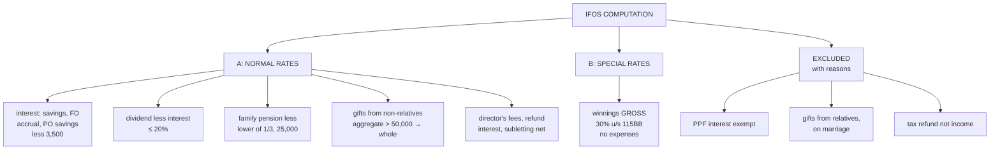

# OS-4 — Computation of Income from Other Sources

Covers: the answer-script format, a full worked problem that brings together interest, exemptions, dividend, family pension, gifts, winnings, director's fees and subletting, and the checklist of traps. This is the terminal node for Unit 4B.

## Format

Split IFOS into **two parts**, because they are taxed differently in Unit 5:

```
Computation of Income from Other Sources — AY 2026-27

A. Income chargeable at NORMAL (slab) rates
   Each item gross
   Less: deduction u/s 57 against that item
   Net of each item
   Total A                                             xxx

B. Income chargeable at SPECIAL rates
   Winnings from lottery / crossword / races (gross)   xxx   @ 30% u/s 115BB
   Online games (net winnings)                         xxx   @ 30% u/s 115BBJ
   Total B                                             xxx

Items EXCLUDED (with one-line reason)
```

The excluded list earns marks: every exempt item, non-income item and wrong-head item should be named with its reason.

## Worked problem (10 marks)

Ms. Kavya, a resident individual, furnishes for PY 2025-26:

1. Savings bank interest ₹18,000.
2. Interest on a cumulative fixed deposit, accrued for the year ₹62,000 (not received).
3. Post office savings account interest (individual account) ₹5,000.
4. PPF interest ₹20,000.
5. Dividend from Indian companies ₹40,000. Interest on a loan taken to buy the shares ₹10,000.
6. Family pension ₹90,000.
7. Gifts: ₹30,000 from a friend on her birthday; ₹30,000 from a colleague; ₹1,00,000 from her brother's wife.
8. Winnings from a crossword puzzle (gross) ₹25,000; entry expenses ₹2,000.
9. Director's sitting fees ₹50,000.
10. Income-tax refund ₹15,000 with interest ₹1,200.
11. She sublets part of her rented flat: rent received ₹1,80,000; rent paid to landlord for that portion ₹1,20,000; repairs borne ₹10,000.

**Solution**

| Particulars | ₹ | ₹ |
|---|---|---|
| **A. Normal rates** | | |
| Savings bank interest (no 80TTA in new regime) | | 18,000 |
| FD interest, accrual basis | | 62,000 |
| PO savings interest 5,000 − exempt 3,500 u/s 10(15)(i) | | 1,500 |
| Dividend | 40,000 | |
| Less: interest, restricted to 20% of 40,000 | (8,000) | 32,000 |
| Family pension | 90,000 | |
| Less: lower of 1/3 (30,000) or 25,000 | (25,000) | 65,000 |
| Gifts of money from non-relatives: 30,000 + 30,000 = 60,000 > 50,000, whole taxable | | 60,000 |
| Director's sitting fees | | 50,000 |
| Interest on income-tax refund | | 1,200 |
| Subletting: rent received | 1,80,000 | |
| Less: rent paid and repairs u/s 57(iii) | (1,30,000) | 50,000 |
| **Total A** | | **3,39,700** |
| **B. Special rate** | | |
| Crossword winnings (gross), expenses disallowed u/s 58(4) | | **25,000** @ 30% |

**Excluded:**
- PPF interest ₹20,000 — exempt u/s 10(11).
- Gift from brother's wife ₹1,00,000 — spouse of a brother is a relative.
- Income-tax refund ₹15,000 — not income.
- Crossword expenses ₹2,000 — disallowed u/s 58(4).
- Excess of dividend interest (₹2,000) — disallowed by the 20% cap.

## Trap checklist

| Trap | Correct treatment |
|---|---|
| Birthday gift from friend | Not an exempt occasion; aggregate with other money gifts |
| Gift from cousin | Not a relative |
| Gift from spouse's brother / brother's wife | Relative → exempt |
| Car received as gift | Not specified movable property → not taxable |
| Net lottery winning given | Gross up × 100/70 |
| Collection commission against dividend | Not allowed |
| Interest > 20% of dividend | Restricted |
| Family pension | Lower of 1/3 or ₹25,000 |
| Pension to the retired employee himself | Salary, not IFOS |
| Savings interest | Fully taxable (no 80TTA in new regime) |
| PPF interest | Exempt |
| Interest on tax refund | Taxable; the refund itself is not |

## What to remember

- **Two parts: normal-rate IFOS and special-rate winnings.** Keep them separate.
- **Exclusions with reasons** earn marks.
- Money gifts from non-relatives: **aggregate, and if > ₹50,000, the whole**.
- Dividend deduction **only interest, max 20%**. Family pension **lower of 1/3 or ₹25,000**.
- Winnings: **gross, 30%, no expenses**.

## Concept map



## Flashcards
Q: Why split IFOS into two parts in a computation?
A: Normal-rate income is added to total income at slab rates; winnings are taxed separately at a flat 30%.

Q: FD interest accrued but not received (cumulative FD) — taxable this year?
A: Yes, on accrual basis.

Q: PO savings interest ₹5,000 in an individual account — taxable amount?
A: ₹1,500 (₹3,500 exempt).

Q: A tenant receives ₹1,80,000 from subletting and pays ₹1,20,000 rent for that portion. Income?
A: IFOS; rent paid (and repairs borne) is deductible u/s 57(iii), so ₹60,000 before repairs.

Q: Gift of ₹1 lakh from brother's wife — taxable?
A: No, the spouse of a brother is a relative.

Q: Income-tax refund of ₹15,000 received with interest ₹1,200 — what is taxable?
A: Only the interest of ₹1,200 under IFOS.

Q: Crossword entry expenses — deductible?
A: No, s. 58(4).

## Sources
- Course plan Unit IV: incomes taxable under other sources and deductions (problems)
- Previous nodes: [[Unit 4B - OS-1 Incomes Taxable under Other Sources]], [[Unit 4B - OS-2 Casual Income and Gifts]], [[Unit 4B - OS-3 Deductions and Disallowances Sections 57 58]]
- [[Unit 4B - Other Sources MOC (Node Map)]]
