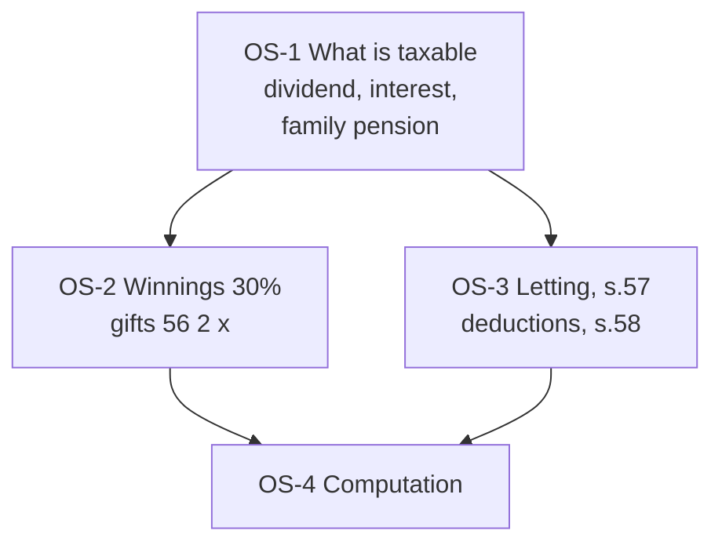

# Unit 4B — Income from Other Sources (Sections 56 to 59)

One node = one topic = one file. States live in each note's frontmatter.

## The loop, per node

Study (45 min) → redraw the concept map from memory → flashcards → mini test → error log (15 min). After all four nodes: Unit 4B sectional test (combined with 4A for the Unit IV sectional).

## Nodes

| Node | Topic | Depends on | Minutes | Exam focus |
| --- | --- | --- | --- | --- |
| OS-1 | [[Unit 4B - OS-1 Incomes Taxable under Other Sources]] | — | 40 | ★ |
| OS-2 | [[Unit 4B - OS-2 Casual Income and Gifts]] | OS-1 | 45 | ★ |
| OS-3 | [[Unit 4B - OS-3 Deductions and Disallowances Sections 57 58]] | OS-1 | 35 | |
| OS-4 | [[Unit 4B - OS-4 Computation of Income from Other Sources]] | OS-1, OS-2, OS-3 | 45 | ★ |

## Dependency graph

## Links
- [[Taxation Law MOC]]
- [[BBA303-5 - Taxation Laws and Practice Course Plan]]
