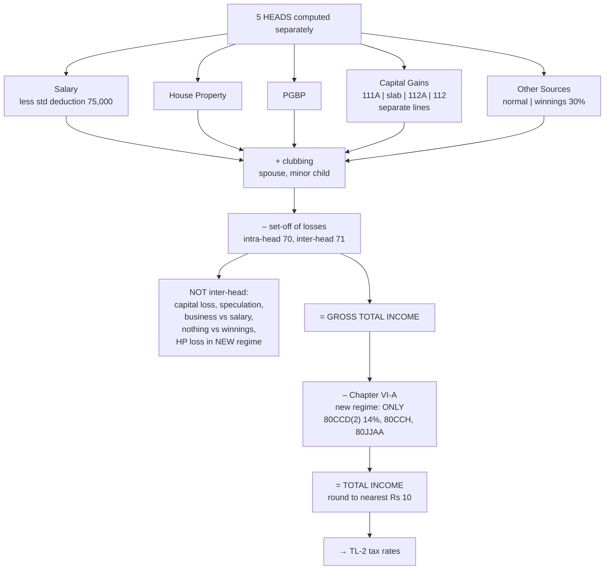

# TL-1 — From Five Heads to Gross Total Income to Total Income

Covers: the order of operations that turns five separate head computations into one taxable figure, clubbing in outline, set-off and carry forward of losses (with the new-regime restriction on house property loss), the deductions that survive under s. 115BAC, what the new regime takes away, and rounding.

## The pipeline

```
  Income under each of the five heads
    Salaries
    Income from House Property
    Profits and Gains of Business or Profession
    Capital Gains  (STCG 111A | STCG slab | LTCG 112A | LTCG 112 — kept separate)
    Income from Other Sources  (normal | winnings 115BB — kept separate)
+ Clubbing of income of other persons (ss. 60-64)
– Set-off of current-year losses (ss. 70, 71)
– Set-off of brought-forward losses (ss. 72-80)
= GROSS TOTAL INCOME (GTI)
– Deductions under Chapter VI-A (new regime: only 80CCD(2), 80CCH, 80JJAA)
= TOTAL INCOME (rounded off to the nearest ₹10, s. 288A)
```

Each step exists for a reason. The heads compute income **source by source** with their own rules. Clubbing prevents income being parked with a family member. Set-off lets a loss in one place reduce income in another, within limits. Deductions reward specific behaviour. Only then is the rate applied (TL-2).

## Clubbing in outline (ss. 60-64)

Some income of **another person** is added to the assessee's own income because it was arranged to avoid tax.

| Situation | Clubbed with |
|---|---|
| Income from assets **transferred to spouse** without adequate consideration (not in connection with an agreement to live apart) | Transferor |
| **Remuneration of spouse** from a concern in which the assessee has substantial interest (≥ 20%), unless due to the spouse's technical/professional qualification | The spouse with higher total income (before this) |
| Income of a **minor child** (other than from manual work, skill or talent) | The parent with **higher** income; if parents are separated, the parent maintaining the child |
| Income from assets transferred to **son's wife** without consideration | Transferor |
| Revocable transfers | Transferor |

Under the new regime, the **₹1,500 per child exemption u/s 10(32)** on clubbed minor income is **not available** (it is in the list of exemptions withdrawn by s. 115BAC).

## Set-off and carry forward

### Current-year losses

| Rule | Detail |
|---|---|
| **Intra-head** (s. 70) | Loss from one source set off against income from another source under the **same head** |
| **Inter-head** (s. 71) | Loss under one head set off against income under another head |
| Exceptions (no inter-head set-off) | **Capital loss** (only within capital gains); **speculation loss** (only against speculation profit); **business loss** cannot be set off against **salary** (s. 71(2A)); losses from owning race horses; **nothing** can be set off against **winnings** (s. 58(4), 115BB) |
| LTCL | Only against LTCG |

### The new-regime restriction on house property loss

Under **s. 115BAC**, a **loss under the head House Property cannot be set off against income under any other head**. Combined with the denial of interest on self-occupied property (HP-6), this means a let-out property's loss (from large interest under 24(b)) simply stays within the head.

**Practical rule for problems under the new regime:** if HP produces a loss, show it, write "not allowed to be set off against other heads u/s 115BAC", and take HP as **nil** in the GTI.

### Carry forward

| Loss | Carry forward | Set off against |
|---|---|---|
| House property | 8 AYs | HP income only |
| Business (non-speculative) | 8 AYs | Business income only |
| Speculation business | 4 AYs | Speculation income only |
| Short-term capital loss | 8 AYs | STCG or LTCG |
| Long-term capital loss | 8 AYs | LTCG only |
| **Unabsorbed depreciation** | **Indefinitely** | Any head (except salary) |

Losses (other than unabsorbed depreciation and HP loss) can be carried forward **only if the return of the loss year was filed by the due date**.

## Deductions under the new regime

Chapter VI-A contains many deductions (80C, 80D, 80G, 80E, 80TTA...). **Under s. 115BAC, almost all are withdrawn.** Only three survive:

| Section | Deduction | Limit |
|---|---|---|
| **80CCD(2)** | **Employer's contribution to NPS** on behalf of the employee | **14% of salary** (basic + DA), for all employers under the new regime |
| **80CCH(2)** | Central Government's contribution to the **Agniveer Corpus Fund** | Full contribution |
| **80JJAA** | Employment of **new employees** by a business with tax audit | 30% of additional employee cost for 3 years |

Note the employer's NPS contribution is first **included** in salary as a perquisite (s. 17(1)(viii)), then deducted under 80CCD(2).

### What else the new regime takes away (summary across units)

| Withdrawn under 115BAC | Unit |
|---|---|
| HRA 10(13A), LTA 10(5), most 10(14) allowances, entertainment allowance and professional tax u/s 16 | Unit 2 |
| **Interest on self-occupied property** u/s 24(b); **set-off of HP loss** against other heads | Unit 3A / here |
| Additional depreciation 32(1)(iia); contributions to outside research bodies u/s 35 | Unit 3B |
| 80C, 80CCC, 80CCD(1), 80CCD(1B), 80D, 80E, 80EE, 80G, 80TTA, 80TTB, 80U and all other VI-A except 80CCD(2), 80CCH, 80JJAA | Here |
| ₹1,500 minor child exemption 10(32) | Here |

### What survives

| Allowed under 115BAC | Amount |
|---|---|
| **Standard deduction** on salary/pension | **₹75,000** |
| **Family pension** deduction | Lower of 1/3 or **₹25,000** |
| Transport allowance for specially-abled, conveyance/travel/daily allowance on official duty | As per Rule 2BB |
| Employer's NPS contribution **80CCD(2)** | 14% of salary |
| Exemptions u/s 54, 54B, 54EC, 54F | In full |
| Gratuity, leave encashment, commuted pension, PPF interest exemptions | As per s. 10 |

## Rounding

- **Total income** is rounded off to the **nearest multiple of ₹10** (s. 288A).
- **Tax** payable is rounded off to the **nearest multiple of ₹10** (s. 288B).

## What to remember

- **Heads → clubbing → set-off → GTI → VI-A → Total income (round to ₹10).**
- Keep **special-rate** capital gains and winnings on **separate lines** throughout.
- New regime: **HP loss cannot be set off** against other heads → take HP as nil.
- Capital loss and winnings: no inter-head set-off. Business loss not against salary.
- Only **80CCD(2), 80CCH, 80JJAA** survive in the new regime.
- Standard deduction **₹75,000**; family pension **₹25,000** cap.

## Concept map



## Flashcards
Q: State the order of steps from heads of income to total income.
A: Compute each head; add clubbed income; set off current and brought-forward losses; this gives GTI; deduct Chapter VI-A deductions; total income, rounded to the nearest ₹10.

Q: Which Chapter VI-A deductions are allowed under the new regime?
A: 80CCD(2) (employer's NPS contribution), 80CCH (Agniveer Corpus Fund), and 80JJAA (new employees).

Q: Limit on 80CCD(2) under the new regime?
A: 14% of salary (basic + DA).

Q: Is 80C available under the new regime?
A: No.

Q: Can a loss from a let-out house property be set off against salary under the new regime?
A: No. Section 115BAC does not allow HP loss to be set off against any other head.

Q: Can a business loss be set off against salary income?
A: No, s. 71(2A).

Q: Against what can a long-term capital loss be set off?
A: Only long-term capital gains.

Q: Can any loss be set off against lottery winnings?
A: No.

Q: For how many years can unabsorbed depreciation be carried forward?
A: Indefinitely.

Q: Minor child's income from investments — with whom is it clubbed?
A: The parent whose total income (before clubbing) is higher.

Q: How is total income rounded off?
A: To the nearest multiple of ₹10 (s. 288A).

Q: Standard deduction on salary under the new regime for AY 2026-27?
A: ₹75,000.

## Sources
- Course plan Unit V: computation of GTI and taxable income
- Income-tax Act 1961: ss. 14, 60-64, 70-80, 80CCD(2), 80CCH, 80JJAA, 115BAC, 288A, 288B
- Next node: [[Unit 5 - TL-2 Tax Rates Rebate and Tax Liability]]
- [[Unit 5 - Tax Liability MOC (Node Map)]]
