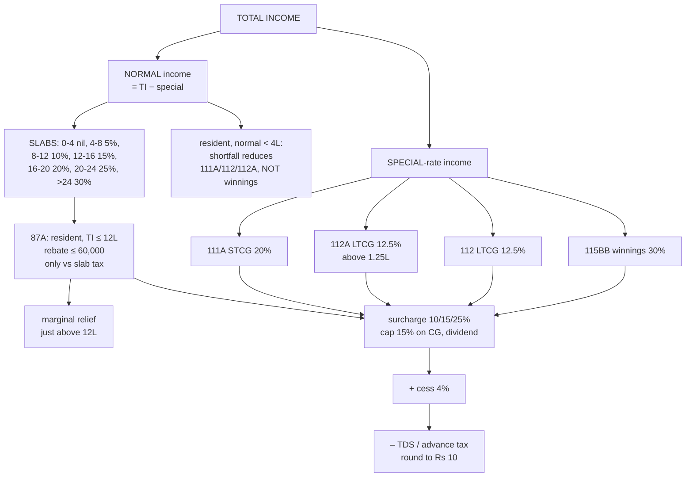

# TL-2 — From Total Income to Tax Payable

Covers: the AY 2026-27 new-regime slabs, how special-rate income is taxed alongside slab income, the basic-exemption shortfall adjustment, the s. 87A rebate of ₹60,000 and marginal relief, surcharge and cess, and the full tax computation format with three worked examples.

## New-regime slab rates, AY 2026-27 (s. 115BAC, Finance Act 2025)

Same for all individuals regardless of age (the new regime has no separate senior-citizen slabs).

| Total income (normal) | Rate | Cumulative tax at top of slab |
|---|---|---|
| Up to ₹4,00,000 | Nil | 0 |
| ₹4,00,001 – ₹8,00,000 | 5% | 20,000 |
| ₹8,00,001 – ₹12,00,000 | 10% | 60,000 |
| ₹12,00,001 – ₹16,00,000 | 15% | 1,20,000 |
| ₹16,00,001 – ₹20,00,000 | 20% | 2,00,000 |
| ₹20,00,001 – ₹24,00,000 | 25% | 3,00,000 |
| Above ₹24,00,000 | 30% | — |

Memorise the cumulative column. Tax on ₹15,00,000 = 60,000 + 15% × 3,00,000 = **₹1,05,000**, in one line.

## Special-rate income

These are **not** put through the slabs. Each is taxed at its own rate:

| Income | Section | Rate |
|---|---|---|
| STCG on listed equity/equity MF (STT paid) | 111A | 20% |
| LTCG on listed equity/equity MF (STT paid) | 112A | 12.5% on the amount above ₹1,25,000 |
| Other LTCG | 112 | 12.5% (or 20% with indexation under the land/building option) |
| Winnings from lotteries, crossword puzzles, races, card games, gambling | 115BB | 30% |
| Online game winnings | 115BBJ | 30% |

**Normal income** = Total income − all special-rate income. Only normal income goes through the slabs.

## Basic exemption shortfall adjustment

A **resident** individual whose **normal income is below ₹4,00,000** may use the unused part of the basic exemption to reduce **111A, 112 and 112A** gains (s. 111A proviso, 112 proviso, 112A). **Not** against winnings (115BB). Non-residents cannot.

Example: normal income ₹3,00,000, STCG 111A ₹2,00,000. Unused exemption ₹1,00,000 → taxable 111A STCG ₹1,00,000 @ 20% = ₹20,000.

## Rebate u/s 87A — AY 2026-27, new regime

| Rule | Detail |
|---|---|
| Who | **Resident individual** only |
| Condition | **Total income ≤ ₹12,00,000** |
| Amount | **Lower of the tax on total income or ₹60,000** |
| Special-rate income | Rebate is **not available against tax on special-rate income** (111A, 112, 112A, 115BB etc.), per the amendment by Finance Act 2025. It is applied against tax on normal (slab) income only. **[Confirm with faculty]** |
| Marginal relief | If total income slightly **exceeds ₹12,00,000**, the tax on it (before cess) cannot exceed the amount by which income exceeds ₹12,00,000 |

**Salaried shortcut:** with the ₹75,000 standard deduction, a salary of **₹12,75,000** gives total income ₹12,00,000 and **zero tax** (if there is no other income).

### Marginal relief example

Total income ₹12,10,000 (all salary, after standard deduction).
- Tax on slabs: 60,000 + 15% × 10,000 = ₹61,500.
- Income above ₹12L = ₹10,000. Tax cannot exceed ₹10,000.
- **Marginal relief = ₹51,500. Tax = ₹10,000 + cess 4% ₹400 = ₹10,400.**

Relief stops at about ₹12,70,588 of total income, where the slab tax (60,000 + 15% of the excess) equals the excess over ₹12 lakh.

## Surcharge (new regime)

| Total income | Surcharge on income-tax |
|---|---|
| ≤ ₹50 lakh | Nil |
| ₹50 lakh – ₹1 crore | 10% |
| ₹1 crore – ₹2 crore | 15% |
| Above ₹2 crore | **25% (maximum under the new regime; no 37%)** |

On tax attributable to **111A, 112, 112A and dividend**, surcharge is **capped at 15%**. Marginal relief applies at each threshold.

## Health and Education Cess

**4%** on (income-tax + surcharge). Applies to all taxpayers, including on special-rate tax.

## Tax computation format

```
Tax on normal income at slab rates                         xxx
Tax on STCG u/s 111A @ 20%                                 xxx
Tax on LTCG u/s 112A @ 12.5% on excess over 1,25,000       xxx
Tax on LTCG u/s 112 @ 12.5% / 20%                          xxx
Tax on winnings u/s 115BB @ 30%                            xxx
= Tax on total income                                      xxx
Less: Rebate u/s 87A (if TI ≤ 12 lakh; only vs slab tax)  (xx)
Add: Surcharge (if TI > 50 lakh)                           xxx
Add: Health & Education Cess @ 4%                          xxx
= Tax liability                                            xxx
Less: TDS / TCS / advance tax                             (xx)
= Tax payable / (refundable)   rounded to nearest Rs 10    xxx
```

## Worked examples

**(a) Pure salary, ₹12,75,000.**
Salary 12,75,000 − standard deduction 75,000 = TI ₹12,00,000. Tax 60,000. Rebate 87A 60,000. **Tax nil.**

**(b) Salary + capital gains.** Resident, age 30. Salary ₹10,75,000; STCG u/s 111A ₹1,00,000; LTCG 112A ₹2,00,000.
- Normal income: 10,75,000 − 75,000 = 10,00,000.
- Total income = 10,00,000 + 1,00,000 + 2,00,000 = **₹13,00,000** (> 12L → **no 87A rebate**).
- Slab tax on 10,00,000 = 20,000 + 10% × 2,00,000 = 40,000.
- 111A: 20% × 1,00,000 = 20,000.
- 112A: 12.5% × (2,00,000 − 1,25,000) = 9,375.
- Tax = 69,375; cess 2,775; **total ₹72,150**.

**(c) Low income with STCG.** Resident. Normal income ₹3,20,000 (interest); STCG 111A ₹3,00,000; lottery (gross) ₹50,000.
- TI = 6,70,000 (≤ 12L → rebate available, but only against slab tax).
- Basic exemption shortfall: 4,00,000 − 3,20,000 = 80,000 → 111A taxable 2,20,000 @ 20% = 44,000.
- Slab tax on normal income: nil.
- Lottery: 30% × 50,000 = 15,000 (no exemption adjustment).
- Tax = 59,000. Rebate u/s 87A: only against slab tax, which is nil → rebate nil.
- Cess 2,360. **Tax liability ₹61,360**; less TDS on lottery 15,000 → payable ₹46,360.

## What to remember

- Slabs: **0-4 nil, 4-8 5%, 8-12 10%, 12-16 15%, 16-20 20%, 20-24 25%, > 24 30%**. Cumulative: 20k, 60k, 1.2L, 2L, 3L.
- **Special-rate income stays out of the slabs**; normal income = TI − special income.
- Resident: unused basic exemption reduces 111A/112/112A, **not winnings**.
- **87A: resident, TI ≤ ₹12L, rebate up to ₹60,000**, only vs slab tax; **marginal relief** just above ₹12L.
- Surcharge 10/15/25%, capped 15% on capital gains and dividend. **Cess 4%.**
- Round total income and tax to **₹10**.

## Concept map



## Flashcards
Q: State the new-regime slabs for AY 2026-27.
A: Up to ₹4L nil; ₹4-8L 5%; ₹8-12L 10%; ₹12-16L 15%; ₹16-20L 20%; ₹20-24L 25%; above ₹24L 30%.

Q: Tax on a normal income of ₹16,00,000 under the new regime (before cess)?
A: ₹1,20,000.

Q: Tax on a normal income of ₹20,00,000 under the new regime (before cess)?
A: ₹2,00,000.

Q: Conditions and amount of s. 87A rebate under the new regime for AY 2026-27?
A: Resident individual with total income up to ₹12,00,000; rebate of the tax or ₹60,000, whichever is lower.

Q: Can the 87A rebate be used against tax on STCG u/s 111A?
A: No (per the Finance Act 2025 amendment, rebate is not available on special-rate income); confirm your faculty's position.

Q: Total income ₹12,05,000. Tax after marginal relief (before cess)?
A: ₹5,000, the excess over ₹12 lakh (slab tax would be ₹60,750).

Q: Maximum surcharge rate under the new regime?
A: 25%.

Q: Maximum surcharge on tax on capital gains u/s 111A/112A?
A: 15%.

Q: Rate of Health and Education Cess?
A: 4% of income-tax plus surcharge.

Q: Who can adjust unused basic exemption against 111A gains?
A: A resident individual or HUF.

Q: Can unused basic exemption be adjusted against lottery winnings?
A: No.

Q: What gross salary gives zero tax under the new regime if there is no other income?
A: ₹12,75,000 (₹12L total income after the ₹75,000 standard deduction).

## Sources
- Course plan Unit V: tax rates for individuals as per new regime; computation of tax liability
- Finance Act 2025 (slabs and 87A for AY 2026-27); Income-tax Act 1961 ss. 87A, 111A, 112, 112A, 115BAC, 115BB, 288A, 288B
- Existing vault note: [[Unit 1-2 Fact Check and Corrections]] (verified slabs, 87A, surcharge)
- Previous node: [[Unit 5 - TL-1 Gross Total Income to Total Income]]
- Next node: [[Unit 5 - TL-3 Comprehensive Cases ITR and E-filing]]
- [[Unit 5 - Tax Liability MOC (Node Map)]]
