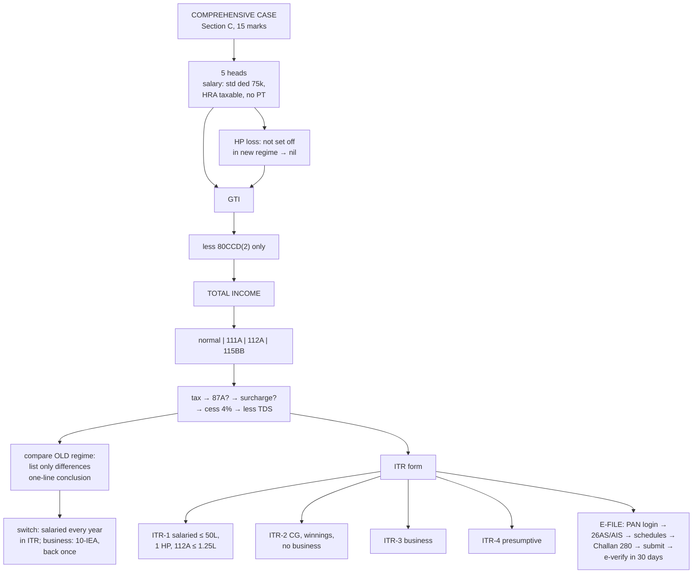

# TL-3 — Comprehensive Case, Old vs New Regime, ITR Forms and E-filing

Covers: a full comprehensive case through all five heads to tax payable under the new regime, the same case under the old regime to show how the choice is made, how and when the regime can be switched, which ITR form applies, and the step-by-step e-filing procedure. This is the node that the **Section C case study (15 marks)** tests.

## The comprehensive case

Mr. Rohan, **resident**, age 40, PY 2025-26:

**Salary:** gross salary ₹15,00,000 (includes basic ₹12,00,000, HRA ₹2,40,000, other allowances ₹60,000). Employer's contribution to NPS ₹1,20,000 (10% of basic). Professional tax paid ₹2,400. He lives in a rented flat in Bengaluru; HRA exemption under the old regime works out to ₹1,20,000.
**House property (let out):** rent ₹3,00,000 (equals GAV); municipal tax paid ₹20,000; interest on housing loan ₹2,50,000.
**Capital gains:** STCG on listed shares (STT paid) ₹80,000; LTCG on listed shares ₹2,25,000.
**Other sources:** savings interest ₹15,000; FD interest ₹45,000; dividend ₹20,000; lottery winnings (gross) ₹50,000.
**Investments:** LIC premium ₹50,000; mediclaim ₹25,000.

### New regime (default)

| Particulars | ₹ | ₹ |
|---|---|---|
| **Salaries** | | |
| Gross salary (HRA fully taxable in new regime) | 15,00,000 | |
| Employer's NPS contribution, s. 17(1)(viii) | 1,20,000 | |
| | 16,20,000 | |
| Less: standard deduction u/s 16(ia) | (75,000) | |
| Professional tax — not deductible under 115BAC | — | 15,45,000 |
| **House property** | | |
| GAV 3,00,000 − municipal tax 20,000 = NAV | 2,80,000 | |
| Less: 30% u/s 24(a) | (84,000) | |
| Less: interest u/s 24(b) (let out, no limit) | (2,50,000) | |
| Loss | (54,000) | |
| Not allowed to be set off against other heads under 115BAC | | Nil |
| **Capital gains** | | |
| STCG u/s 111A | 80,000 | |
| LTCG u/s 112A | 2,25,000 | 3,05,000 |
| **Other sources** | | |
| Savings interest + FD interest + dividend | 80,000 | |
| Lottery winnings | 50,000 | 1,30,000 |
| **Gross total income** | | **19,80,000** |
| Less: 80CCD(2), employer NPS (within 14% of basic) | | (1,20,000) |
| LIC (80C) and mediclaim (80D) — not allowed under 115BAC | | — |
| **Total income** | | **18,60,000** |

**Tax:**

| Component | Income | Tax |
|---|---|---|
| Normal income = 18,60,000 − 80,000 − 2,25,000 − 50,000 | 15,05,000 | 60,000 + 15% × 3,05,000 = **1,05,750** |
| STCG u/s 111A @ 20% | 80,000 | **16,000** |
| LTCG u/s 112A @ 12.5% on (2,25,000 − 1,25,000) | 1,00,000 | **12,500** |
| Lottery u/s 115BB @ 30% | 50,000 | **15,000** |
| Tax | | 1,49,250 |
| 87A rebate (TI > 12L) | | Nil |
| Surcharge (TI < 50L) | | Nil |
| Cess @ 4% | | 5,970 |
| **Tax liability** | | **1,55,220** |
| Less: TDS on lottery | | (15,000) |
| **Tax payable** (after other TDS, if any) | | **1,40,220** |

### Old regime (for comparison)

| Changes from the new regime | Effect |
|---|---|
| Standard deduction ₹50,000 (not ₹75,000) | Salary higher by 25,000 |
| HRA exemption ₹1,20,000 | Salary lower |
| Professional tax ₹2,400 deductible u/s 16(iii) | Salary lower |
| HP loss ₹54,000 set off against salary | GTI lower |
| 80C LIC ₹50,000; 80D ₹25,000; 80CCD(2) ₹1,20,000 (10% limit in old regime); 80TTA ₹10,000 | Deductions |
| Old slabs: 0-2.5L nil, 2.5-5L 5%, 5-10L 20%, > 10L 30% | Higher rates |

Salary: 16,20,000 − 1,20,000 − 50,000 − 2,400 = 14,47,600. Normal income: 14,47,600 − 54,000 + 80,000 = 14,73,600. Less deductions 2,05,000 → normal TI **12,68,600**.
Slab tax: 12,500 + 1,00,000 + 30% × 2,68,600 = **1,93,080**. Special-rate tax as before: 43,500. Total 2,36,580 + cess 9,463 = **₹2,46,043**.

**Decision: new regime saves about ₹90,800.** The new regime's lower slabs outweigh about ₹2.6 lakh of lost exemptions, deductions and set-off (HRA, professional tax, HP loss, 80C, 80D, 80TTA). Under the old regime, the break-even usually needs deductions and exemptions well above ₹4-5 lakh at this income level.

### How to write the regime decision in an answer

1. Compute under the new regime (the default).
2. If the question asks, compute under the old regime, listing only the **differences**.
3. Conclude in one line: "Tax under the new regime ₹1,55,220 is lower than under the old regime ₹2,46,043; Mr. Rohan should continue in the new regime."

## Switching regimes

| Taxpayer | How to choose |
|---|---|
| **No business/professional income** (salaried, pensioner, investor) | Can choose **every year**, in the ITR itself, filed by the due date u/s 139(1) |
| **With business/professional income** | Opt out of the new regime by filing **Form 10-IEA** before the due date; can **switch back to the new regime only once** in a lifetime |

## Which ITR form (AY 2026-27)

| Form | Who | Rohan? |
|---|---|---|
| **ITR-1 (Sahaj)** | **Resident** individual (not RNOR), total income **≤ ₹50 lakh**, from salary/pension, **one house property**, other sources (not winnings), agricultural income ≤ ₹5,000, LTCG u/s 112A ≤ ₹1.25 lakh | No — has STCG, LTCG > 1.25L and lottery winnings |
| **ITR-2** | Individual/HUF **without** business/professional income: capital gains, more than one house, winnings, foreign income/assets, director, unlisted shares, income > ₹50L | **Yes** |
| **ITR-3** | Individual/HUF **with** business or professional income (non-presumptive) | — |
| **ITR-4 (Sugam)** | Resident individual/HUF/firm (not LLP) with **presumptive** income u/s 44AD / 44ADA / 44AE, total income ≤ ₹50 lakh | — |

## E-filing procedure (course plan: "Procedure for e-return filing")

1. **Register / log in** on the income-tax e-filing portal (incometax.gov.in) using **PAN** as the user ID; ensure **PAN is linked with Aadhaar**.
2. **Download and check** Form **26AS**, the **Annual Information Statement (AIS)** and the **Taxpayer Information Summary (TIS)** — TDS, interest, dividends, securities transactions reported about you.
3. Collect documents: **Form 16** (salary TDS), Form 16A/16B, capital gains statements, bank interest certificates.
4. Choose **e-File → Income Tax Return**, select the **assessment year (2026-27)**, the **mode (online)**, status (individual) and the **ITR form**.
5. Choose the **regime** (new is default; old requires opting out in the return, or Form 10-IEA for business income).
6. Verify the **pre-filled data** and fill in each schedule: salary, house property, capital gains, other sources, deductions, taxes paid.
7. **Compute tax**. If tax is payable, pay **self-assessment tax** through **e-Pay Tax (Challan ITNS 280)** and enter the challan details.
8. **Preview and submit** the return.
9. **E-verify within 30 days** of filing: Aadhaar OTP, net banking, EVC through bank/demat account, or sign and post **ITR-V** to CPC Bengaluru. An unverified return is treated as not filed.
10. Track processing; the CPC issues an **intimation u/s 143(1)**, and any refund is credited to the pre-validated bank account.

**Due dates (AY 2026-27):** **31 July 2026** for individuals not requiring audit; **31 October 2026** for audit cases. **Belated or revised** return: by **31 December 2026**. **Updated return (ITR-U)**: within **48 months** from the end of the relevant AY, with additional tax.

## What to remember

- Case study layout: **five heads → GTI → VI-A → TI → normal vs special income → tax → rebate → surcharge → cess → TDS**.
- New regime in the case: **HRA taxable, professional tax not deductible, HP loss not set off, only 80CCD(2)**.
- Compare regimes by listing **only the differences**; conclude in one line.
- Salaried can **switch every year** in the ITR; business income: **Form 10-IEA**, switch back **once**.
- **ITR-1** simple salaried ≤ 50L; **ITR-2** capital gains/winnings, no business; **ITR-3** business; **ITR-4** presumptive.
- E-file: PAN login → 26AS/AIS → form → schedules → pay (Challan 280) → submit → **e-verify in 30 days**.

## Concept map

## Flashcards
Q: In the new regime, how is HRA received by a salaried employee treated?
A: Fully taxable; the s. 10(13A) exemption is not available.

Q: Is professional tax deductible from salary under the new regime?
A: No.

Q: A let-out property shows a loss of ₹54,000 under the new regime. How does it enter GTI?
A: It cannot be set off against other heads, so HP is taken as nil in GTI.

Q: How is employer's NPS contribution treated in the new regime?
A: Included in salary u/s 17(1)(viii) and deducted u/s 80CCD(2), up to 14% of salary.

Q: How often can a salaried person switch between regimes?
A: Every year, by choosing in the return filed by the due date.

Q: How does a person with business income opt out of the new regime?
A: By filing Form 10-IEA before the due date; they can come back to the new regime only once.

Q: Which ITR form for a salaried person with STCG and lottery winnings?
A: ITR-2.

Q: Which ITR form for a doctor declaring income u/s 44ADA with receipts of ₹40 lakh?
A: ITR-4 (Sugam), if resident and total income ≤ ₹50 lakh.

Q: Which ITR for a proprietor with regular books of a business?
A: ITR-3.

Q: Within how many days must an e-filed return be verified?
A: 30 days.

Q: Through which challan is self-assessment tax paid?
A: Challan ITNS 280 through e-Pay Tax.

Q: Due date for a salaried individual's return for AY 2026-27?
A: 31 July 2026.

Q: Last date for a belated or revised return for AY 2026-27?
A: 31 December 2026.

Q: Which statements should be checked before filing?
A: Form 26AS, the Annual Information Statement (AIS) and the Taxpayer Information Summary (TIS).

## Sources
- Course plan Unit V: computation of GTI, total income and tax liability under the new regime; comprehensive cases on choosing between old and new regimes; procedure for e-return filing
- CIA-3 brief: tax consulting case, ITR form selection and filling for AY 2026-27
- Income-tax Act 1961: ss. 115BAC, 139, 139(8A), 143(1); Form 10-IEA; Challan ITNS 280
- Previous nodes: [[Unit 5 - TL-1 Gross Total Income to Total Income]], [[Unit 5 - TL-2 Tax Rates Rebate and Tax Liability]]
- [[Unit 5 - Tax Liability MOC (Node Map)]]
