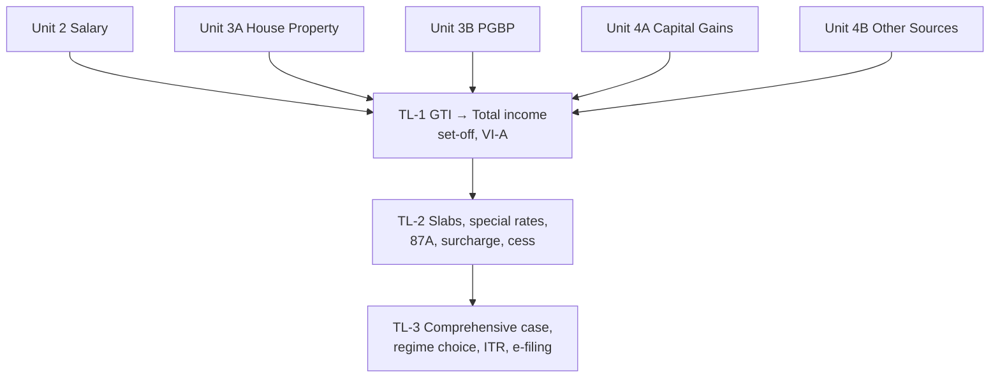

# Unit 5 — Computation of Tax Liability of Individuals

One node = one topic = one file. States live in each note's frontmatter. This unit integrates every other unit; study it after Units 2, 3A, 3B, 4A and 4B.

## Nodes

| Node | Topic | Depends on | Minutes | Exam focus |
| --- | --- | --- | --- | --- |
| TL-1 | [[Unit 5 - TL-1 Gross Total Income to Total Income]] | — | 45 | ★ |
| TL-2 | [[Unit 5 - TL-2 Tax Rates Rebate and Tax Liability]] | TL-1 | 50 | ★ |
| TL-3 | [[Unit 5 - TL-3 Comprehensive Cases ITR and E-filing]] | TL-1, TL-2 | 75 | ★ |

## Dependency graph

**TL-3 is the exam's Section C.** The 15-mark compulsory case study will look like the Rohan case: several heads, a few traps per head, and a tax computation at the end.

## Links
- [[Taxation Law MOC]]
- [[BBA303-5 - Taxation Laws and Practice Course Plan]]
