# Units 1–2 — How Income Tax Actually Works

An understanding-first companion to the seven topic notes in this folder. Those notes tell you
*what the rules are*. This one tells you *why they are that way*, so the rules stop being a list
and start being derivable.

Figures are kept deliberately light here. Every threshold and rate lives in
[[Unit 1-2 Fact Check and Corrections]] and the topic notes. This note is for the reasoning.

Topic notes: [[Unit 1 - Tax Fundamentals and Statutory Framework]] ·
[[Unit 1 - Basic Concepts and Residential Status]] ·
[[Unit 1 - Capital vs Revenue and Exempted Incomes]] ·
[[Unit 2 - Salary Chargeability and Allowances]] · [[Unit 2 - Perquisites]] ·
[[Unit 2 - PF Gratuity Pension and Leave Encashment]] ·
[[Unit 2 - Deductions and Computation of Taxable Salary]]

---

## 0. The shape of the whole subject

The Income Tax Act is a machine that answers four questions in a fixed order. Every topic in
Units 1 and 2 sits under one of them.

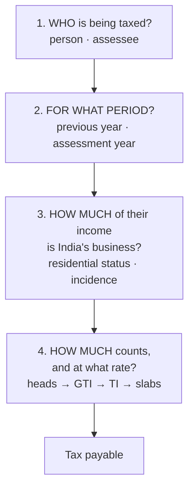

Unit 1 walks all four questions at the level of the whole Act. Unit 2 takes question 4 and zooms
all the way into a single head: salary.

Every time you feel lost in a topic, ask which of the four it belongs to. That alone resolves most
confusion, because the commonest mistake in this subject is answering the wrong question. A
residential status problem is a *scope* question, not a *computation* question. A perquisite
valuation is a *how much counts* question, not a *is it taxable* question.

---

# PART ONE — UNIT 1

## 1. Who, and for what period

### Person and assessee are not the same word

**Person (Sec 2(31))** is the list of things capable of being taxed: individual, HUF, company,
firm, AOP or BOI, local authority, and every other artificial juridical person. Seven categories,
and the seventh is a catch-all so that nothing taxable escapes by being an unusual kind of entity
(a deity with property, a university, a bar council).

**Assessee (Sec 2(7))** is a person who is actually inside the system. Liable to pay tax, or
liable to pay interest or penalty, or someone against whom proceedings have been started, or a
person deemed to be an assessee for someone else's income.

So: every assessee is a person, not every person is an assessee. The distinction matters because
"assessee" is a *procedural* status. You become one by being drawn into the machinery, and you can
be one before any liability is finally established. Someone who owes nothing but is under
assessment proceedings is still an assessee.

The classic distractor is something that is plainly not a person in the Act's sense (a crop, a
building, a bank account). Being valuable is not the test. Being an entity capable of holding
rights and bearing liabilities is.

### Why income tax needs two years to do anything

You cannot tax a year's income until the year is over. Until 31 March you do not know how much
there was. So the Act splits time in two:

- **Previous year (Sec 3)** — the financial year in which income is *earned*. Always 1 April to
  31 March.
- **Assessment year (Sec 2(9))** — the financial year *following* it, in which that income is
  assessed and taxed.

So "AY 2026-27" is never a period in which you earn anything. It is the label for the machinery
that processes money earned between 1 April 2025 and 31 March 2026.

This is worth internalising rather than memorising, because every problem you are given is dated,
and getting the pairing backwards corrupts the whole answer. If the question says "for the
assessment year 2026-27," every fact about days, salary and receipts belongs to the twelve months
ending 31 March 2026.

The one wrinkle: a newly set up business or a newly created source of income has a *shorter first
previous year*, running from the date it came into existence to the following 31 March. The
previous year can be less than twelve months. It can never be more.

---

## 2. Residential status is a question about reach

This is the topic most often memorised and least often understood, and it is worth slowing down,
because Unit 1 lists practical problems on it twice and it is the natural first half of a
case-study question.

### The actual question being asked

Not "is this person Indian." **Citizenship is irrelevant.** An Indian citizen can be a
non-resident; a foreign national can be an ordinarily resident. Nationality does not appear in the
basic test at all.

The real question is: **how far into the world can India reach for this person's income?**

A country taxes on two possible bases. **Source** — money that arises here is ours, whoever earned
it. **Residence** — people who belong here owe us on everything, wherever earned. Most countries,
India included, use both. Residential status is the dial that decides how much of the residence
basis applies to you.

And the answer is proportional to connection. The more of your life is lived in India, the more of
your worldwide income India claims.

| Status | What India taxes | Underlying idea |
|---|---|---|
| **ROR** | Worldwide income, remitted or not | You belong here fully |
| **RNOR** | Indian income, plus foreign income from a business controlled from or profession set up in India | You are in transition, in or out |
| **NR** | Only income received, accruing, or deemed to accrue in India | You are a stranger who happens to earn here |

The RNOR category is the one that looks arbitrary until you see its purpose. It is a **grace
period**. Someone returning to India after fifteen years abroad would otherwise be hit with tax on
their entire foreign portfolio the moment they landed. RNOR gives them a couple of years of
shelter on genuinely foreign income while they settle. Symmetrically, someone recently departed is
not immediately cut loose. It softens both edges of the boundary.

### The tests are proxies, not rules

Once you accept that the question is "how connected," the tests decode themselves. They are
measuring connection in the only objective unit available: days of physical presence.

**Step 1 — Resident or not? (Sec 6(1))** Satisfy *either* basic condition:

- **182 days or more in the previous year.** More than half the year. Obviously connected. No
  further argument needed.
- **60 days or more in the previous year, AND 365 days or more across the four preceding years.**
  This catches the person who is never here for six months at a stretch but is habitually here.
  Roughly three months a year, every year, is a pattern of life, not a visit.

Fail both and you are a **non-resident**.

**Step 2 — If resident, ordinarily or not? (Sec 6(6))** Now the question changes from *are you
here* to *have you been here long*. Both additional conditions must hold to be ROR:

- Resident in at least **2 of the 10** preceding previous years, and
- Present in India **730 days or more across the 7** preceding years.

Fail either and you are **RNOR**. Notice these are deliberately about *history*. Step 1 asks about
this year, step 2 asks whether this year is part of a long pattern. Two questions, two time
horizons, and the grace period falls out of the gap between them.

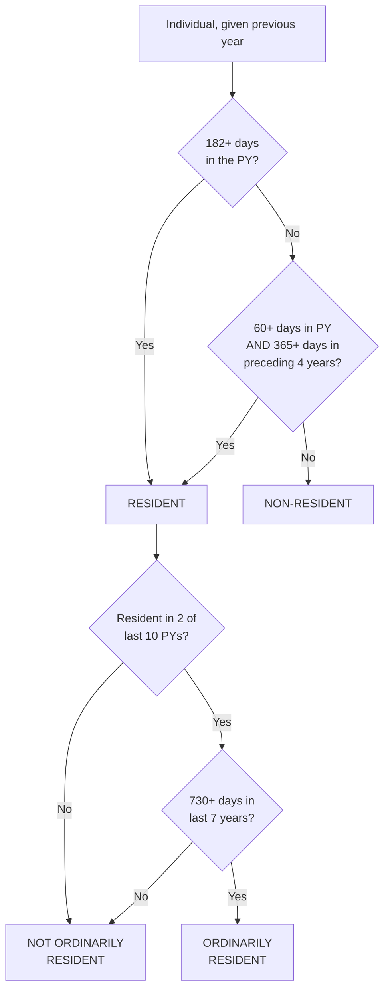

### The exceptions, and why they exist

The 60-day limb is **extended to 182 days** for two groups:

- An Indian citizen who **leaves India for employment abroad**, or as a member of the crew of an
  Indian ship.
- An Indian citizen or person of Indian origin who is **visiting India**.

Both carve-outs have the same purpose: do not punish people for the ordinary movement of a
diaspora. Without them, a migrant worker who came home for a two-month family visit, having been
in India for years before leaving, would be dragged back into residence by the 60+365 rule. The
exception says: for these people, we want real evidence of return, so the bar goes back up to 182
days.

**But the visiting-India relaxation was being used as a shelter.** A high earner could keep large
Indian-source income, stay just under the line every year, and never be resident anywhere.
So two anti-avoidance provisions were added, and both are worth knowing because they are exactly
the kind of thing an examiner uses to make a residential status question non-trivial:

- **The 120-day rule.** For an Indian citizen or PIO visiting India whose Indian-source income
  exceeds a prescribed threshold, the relaxed 182-day bar drops back to 120 days. High Indian
  income buys less leniency.
- **Deemed residence (Sec 6(1A)).** An Indian citizen whose Indian-source income exceeds the
  threshold and who is **not liable to tax in any other country by reason of domicile or
  residence** is deemed resident in India regardless of days. This targets the "stateless for tax
  purposes" structure. The policy is that you should be tax-resident *somewhere*; if you have
  arranged to be resident nowhere, India claims you.

A person caught by either of these is treated as **RNOR**, not ROR. India wants a claim on the
Indian income, not the worldwide portfolio of someone who genuinely lives elsewhere.

Exact thresholds: see [[Unit 1-2 Fact Check and Corrections]].

### Incidence of tax — what the scope table actually rests on

Residential status alone does not finish a problem. You then have to sort each item of income into
Indian or foreign, and that sorting is done by **Section 5** read with **Sections 7 and 9**. This
is the step most commonly skipped, and it is where incidence problems are actually won.

Income falls into India's net if it is:

1. **Received in India** — first receipt matters. Money earned abroad and *then* remitted to India
   was received abroad; remittance is not receipt. This is the single most tested trap in the
   topic. Once income has been received outside India, bringing it in later does not make it
   Indian income.
2. **Deemed to be received in India (Sec 7)** — a small statutory list that matters directly for
   Unit 2: the employer's excess contribution to a recognised provident fund, excess interest
   credited to an RPF, and the transferred balance when an unrecognised fund becomes recognised.
   You never touched the money, but the Act says you received it.
3. **Accrues or arises in India** — the right to receive it came into existence here.
4. **Deemed to accrue or arise in India (Sec 9)** — the important one for salary. Salary is deemed
   to accrue **where the services are rendered**, not where it is paid or where the contract was
   signed. So an Indian company paying a foreign national into a foreign bank account for work
   done in Delhi is paying Indian income. And an Indian resident's salary for work performed
   entirely abroad is foreign income, however it is paid.

Sec 9 also deems Indian a range of other items: income from property or assets situated in India,
capital gains on the transfer of a capital asset situated in India, dividends paid by an Indian
company, and interest, royalty or technical fees payable by the government or (with conditions) by
residents.

**The method for every incidence problem, in order:**

1. Fix residential status by the two-step test.
2. Take each income item and label it Indian or foreign, using receipt and accrual, *including*
   the deeming rules. Do not skip to the table before this is done.
3. Apply the scope table to the labels.

Most marks lost here are lost at step 2, because the fact pattern is written to make an item
*look* foreign when a deeming provision makes it Indian, or to make a remittance look like a
receipt.

---

## 3. What counts as income in the first place

### Capital versus revenue: the tree and the fruit

This is the deepest idea in Unit 1, and it explains more of the Act than any other single
distinction.

**Revenue** is the fruit: the recurring return thrown off by a source. **Capital** is the tree: the
source itself.

Income tax, as originally conceived, taxes fruit. Which means selling the tree is not income at
all. That is not a loophole, it is the definition doing its work.

And this is why **capital gains needs its own head and its own charging section**. If capital
receipts were naturally income, Section 45 would be redundant. Its existence is the proof of the
general rule: capital receipts are outside the net *unless a specific provision drags them in*.
Revenue receipts are inside the net *unless a specific provision lets them out*. Two opposite
default presumptions, and knowing which default you are arguing against is most of a
capital-versus-revenue answer.

| | Capital receipt | Revenue receipt |
|---|---|---|
| Relationship to the source | Is, or disposes of, the source | Comes *from* the source |
| Pattern | One-off, non-recurring | Recurring, part of normal operations |
| Default | Not taxable unless a provision taxes it | Taxable unless a provision exempts it |
| Examples | Sale of a fixed asset, loan received, capital introduced by a partner, compensation for loss of a source of income | Sale of goods, rent, interest, commission, compensation for a temporary loss of profit |

The mirror on the expenditure side runs on identical logic:

- **Capital expenditure** acquires or improves an enduring asset. You still hold the value, so you
  cannot deduct it all at once. You release it slowly, as depreciation.
- **Revenue expenditure** is consumed in the year. Deduct it now.

**The test that resolves most exam items:** did this create, acquire, enlarge or dispose of a
*source*, or did it merely arise from operating one? A repair that keeps a machine running is
revenue. A replacement that extends its life or raises its capacity is capital. Compensation for
losing a whole agency is capital, because the source is gone. Compensation for a cancelled order
is revenue, because the business continues.

The same reasoning also explains why the question "is the receipt taxable" and "was it recorded in
the profit and loss account" tend to move together. Revenue items pass through P&L; capital items
sit on the balance sheet.

### Exempt income is not the same as a deduction

Both reduce your tax, and students routinely fuse them. They operate at different points in the
machine, and the difference is testable.

- **Exempt income (Sec 10)** never enters gross total income at all. It is invisible to the
  computation. It cannot be set off against, it does not appear in GTI, it is simply not part of
  the base.
- **Deduction (Chapter VI-A)** applies *after* income has entered GTI. The income is counted, then
  a permitted amount is taken out to arrive at total income.

So the order is: exclude exempt income → compute each head → sum to GTI → subtract deductions →
total income → apply rates.

Section 10 is a long list of policy decisions rather than a principle. The categories that
recur in this syllabus: agricultural income, a member's share from an HUF, a partner's share of
firm profit (the firm has already been taxed on it, so taxing the partner again would be double
taxation), gratuity, commuted pension, leave encashment, house rent allowance, and the prescribed
special allowances under 10(14). Note how many of them are Unit 2 items. Much of "salary" is
really "salary, less the Section 10 exemptions the regime allows you."

### Agricultural income, and the constitutional reason it is exempt

Agricultural income is exempt under Sec 10(1). The reason is **not** generosity. Under the
Constitution's division of powers, taxes on agricultural income are a **State** subject. The Union
Parliament, which enacts the Income Tax Act, has no power to tax it.

That is why the exemption is unconditional and why it cannot simply be withdrawn by a Finance Act.

**Definition (Sec 2(1A))**, three limbs:

1. Rent or revenue derived from land situated in India and used for agricultural purposes.
2. Income from agricultural operations on such land, including processing done by the cultivator
   to render the produce fit to be taken to market.
3. Income from a farm building, subject to conditions tying it to the land and its use.

Note the constraints hiding in there. **The land must be in India** — agricultural income from a
farm in Nepal is not exempt, it is ordinary foreign income taxable under Other Sources. And
processing is only agricultural to the extent it is *necessary to make the produce marketable*;
manufacturing beyond that point is business income. This is why tea, coffee and rubber have
special apportionment rules: part of the value comes from growing, part from manufacture.

### Partial integration: taxing the rate, not the income

Exempting agricultural income creates a fairness problem the Union *can* fix without taxing it.

Consider someone with large agricultural income and modest salary. Their salary would be taxed in
the lowest slabs, exactly as if they were a low earner, even though their actual capacity to pay is
high. Meanwhile a person whose entire income is that same modest salary pays the same tax. The
progressive structure has been defeated.

Partial integration restores the rate without touching the exemption:

1. Compute tax on **(non-agricultural income + net agricultural income)** at slab rates.
2. Compute tax on **(basic exemption limit + net agricultural income)** at slab rates.
3. Tax payable = step 1 − step 2.

Step 2 is subtracting out the tax attributable to the agricultural income and to the exempt slab.
What survives is tax on the non-agricultural income alone, **but computed at the rate the total
justifies.** The agricultural income is never itself taxed. It only decides which slabs your other
income falls into.

It applies only when both gates are open: net agricultural income above a small threshold, and
non-agricultural income above the basic exemption limit. If either fails there is nothing to
integrate, because the rate would not change anyway.

Whether and how this operates under the new regime, and with which exemption limit, is resolved in
[[Unit 1-2 Fact Check and Corrections]].

---

## 4. The computation machine

### Why there are heads at all

Different kinds of income need different rules about what counts and what may be subtracted. A
business deducts its costs. A salaried employee cannot deduct the commute. Property has a notional
annual value. Capital gains needs a cost of acquisition and a holding period.

Trying to write one rule for all of that produces either a rule so loose it is unenforceable or one
so tight it is unfair. So the Act computes each head **under its own rules**, then adds the
results.

The five heads (Sec 14): Salary, House Property, Profits and Gains of Business or Profession,
Capital Gains, and Income from Other Sources. The fifth is residual by design, so that income that
is genuinely income does not escape by failing to fit the first four.

A practical consequence worth holding: **the head determines the rules, so classification precedes
computation.** The same rupee is treated differently depending on which head it lands in. Rent from
a building is house property; rent from plant and machinery is other sources. A professional's fee
is business income; the same person's salary from a lectureship is salary. Getting the head wrong
makes every subsequent step wrong even if the arithmetic is perfect.

### The chain from income to tax

```
Income under each of the five heads, computed separately
  + clubbing (income legally another's, added to yours)
  ± set-off of losses (intra-head, then inter-head)
  ─────────────────────────────
  = GROSS TOTAL INCOME
  − Chapter VI-A deductions
  ─────────────────────────────
  = TOTAL INCOME              ← round off, then apply slabs to this
  → tax at slab rates
  − rebate u/s 87A
  + surcharge (only at high income)
  + health & education cess (on tax + surcharge)
  ─────────────────────────────
  = TAX LIABILITY
  − TDS, advance tax, self-assessment tax already paid
  ─────────────────────────────
  = PAYABLE or REFUNDABLE
```

Two features of this chain are worth understanding rather than memorising.

**Clubbing (Secs 60–65)** exists because a progressive rate structure creates an obvious incentive:
split your income across family members so each portion sits in a lower slab. Gift the deposit to
your spouse, put the shares in your minor child's name. Clubbing defeats this by taxing the income
in the hands of the person who really controls the source, not the one whose name is on it. Hence
the pattern: transfers to a spouse or son's wife without adequate consideration, revocable
transfers, and a minor's income all come back to the transferor or parent. And hence the
exceptions: a minor's earnings from their *own* skill or talent are genuinely theirs, so they are
not clubbed.

**Set-off** exists because "income" for a year should mean net income. A person with one profitable
business and one loss-making business has not earned the gross figure. The restrictions on set-off
are then anti-avoidance patches on top: speculative losses only against speculative gains, capital
losses only against capital gains, a cap on house-property loss set off against other heads. Each
restriction is closing a route by which an artificial or lightly-taxed loss could be used to shelter
ordinary income. And carry-forward requires the return to have been filed on time, because the loss
must have been declared when it happened, not invented later.

### Slabs, and why marginal rates confuse people

The slab table is **marginal**, not average. Falling into the 30% bracket does not mean 30% of your
income. It means 30% of the portion above that bracket's floor. Every rupee is taxed at the rate of
the slab it sits in, and your income is sliced across all the slabs below you.

This is why the **average rate of tax** (total tax ÷ total income) is a separate defined concept and
is always lower than your top marginal rate. It is also why a raise never leaves you worse off.

**Rebate under Sec 87A** then operates on the tax figure, not on income. If total income is below
the prescribed threshold, the computed tax is knocked out up to a ceiling. This is the mechanism by
which the effective no-tax point sits far above the nil slab: the nil slab is where the *rate*
becomes positive, the rebate threshold is where *liability* becomes positive. Two different things
that students routinely merge.

**Surcharge and cess sit on top of tax, not on income.** Compute tax, then:

- **Surcharge** is a percentage of the tax, applying only above high income thresholds, at
  escalating rates. It is the tool for making very high earners pay more than the top slab alone
  delivers, without adding more slabs. It is general revenue, not earmarked.
- **Cess** is a percentage of (tax + surcharge), applying to everyone. Its defining feature is that
  the money is **locked to a stated purpose** and must be spent on it.

The one-line test between them: *does the money have a locked purpose?* Yes, cess. No, surcharge.

Because surcharge kicks in as a cliff at a threshold, a **marginal relief** mechanism exists so that
crossing the threshold by one rupee cannot increase your tax by more than the extra income. Without
it there would be a band where earning more leaves you with less.

Finally, **rounding**: total income is rounded to the nearest ten rupees before rates are applied,
and the final tax payable is likewise rounded to the nearest ten (Secs 288A and 288B).

### Direct and indirect, properly stated

A direct tax is one where the person **legally liable** to pay is also the person who **bears the
economic burden**. An indirect tax is one where liability and burden separate: the seller pays the
government, and passes the cost to the buyer in the price.

Every other difference follows from that single split:

- Direct taxes **can** be progressive, because the government knows who you are and what you earn.
  Indirect taxes **cannot**, because the shop has no idea what the customer earns. The same GST
  applies to a labourer and a millionaire buying the same soap, which makes indirect taxes
  regressive in effect.
- The burden of a direct tax cannot be shifted. The burden of an indirect tax is designed to shift.
- Direct taxes are visible and resented; indirect taxes are buried in prices and politically
  easier. Which is a real reason governments lean on them.

**Duty** belongs to a different axis entirely. It is a tax on a *thing* — goods crossing a border
(customs) or leaving a factory (excise) — rather than on a person's income. Do not line it up
against cess and surcharge as though the three were alternatives; duty is a tax, while cess and
surcharge are additions computed on a tax.

### The canons, and what they are actually for

Adam Smith's four, plus the modern additions, are a **checklist for evaluating a tax**, which is how
they get examined: given a feature of the Indian system, which canon does it serve or violate?

- **Equity** — burden should track ability to pay. Served by progressive slabs, surcharge, and the
  87A rebate. Violated by regressive indirect taxes.
- **Certainty** — the taxpayer must know how much, when, and how. Served by fixed slabs and due
  dates. Violated by retrospective amendment and by discretion in the hands of officers.
- **Convenience** — collect at the time and in the manner that suits the payer. This is the entire
  justification for **TDS**: take it when the money is being paid, so the taxpayer never has to
  find a lump sum later.
- **Economy** — the cost of collection should be small relative to the revenue. Served by TDS and
  electronic filing, which push the administrative work onto payers and software.
- **Simplicity** — comprehensible and cheap to comply with. This is the stated case for the **new
  regime**, and the honest counterargument is that running two regimes simultaneously is less
  simple than running one.
- **Productivity and elasticity** — the tax should yield enough, and should yield more
  automatically as the economy grows. Income tax is highly elastic; a fixed licence fee is not.
- **Diversity** — do not depend on a single tax, or a shock to that base becomes a fiscal crisis.

### Objectives of taxation

Revenue is the obvious one and not the only one. A tax system is also used to **redistribute**
(progressive rates, surcharge), to **allocate resources** (high duty on tobacco to discourage it,
concessions to encourage an industry), to **stabilise** the economy counter-cyclically, to
**protect domestic industry** (customs duty), and to **correct externalities** (taxing the polluter).

Worth noticing: several of these pull against each other. A tax designed to discourage consumption
is a tax designed to raise less revenue if it succeeds.

---

# PART TWO — UNIT 2: SALARY

## 5. Why salary is treated the way it is

Salary is the most visible income in the economy. It is paid by an organised employer, recorded in
their books, and taxed at source before it reaches you. Compared to business income, there is
almost nowhere to hide.

The Act also takes the view that a salaried person has **essentially no deductible expenses**. The
employer bears the costs of doing the work. You do not deduct your commute, your clothes, or your
lunch, because in the Act's model those are private consumption, not the cost of earning.

So the head is structurally the simplest of the five:

**Add up everything the employer gave you. Subtract one flat deduction. Done.**

All of Unit 2's apparent complexity is inside the phrase "everything the employer gave you."

### Chargeability (Sec 15): due or receipt, whichever is earlier

Salary is taxed when it becomes **due** or when it is **received**, whichever happens first.

This is an anti-avoidance rule and reads as one. Without it, you could simply ask your employer to
hold March's salary until April and push a year's tax forward indefinitely. "Whichever is earlier"
means the choice of timing is taken away from you.

Consequences that get tested:

- March salary credited on 5 April is taxed in the year it fell **due**, not the year it was paid.
- **Advance salary** is taxed on receipt, because receipt came first.
- **Arrears** are taxed when received, if they were not already taxed when due. Which creates a
  bunching problem — several years' income landing in one year pushes you into higher slabs — and
  that is what relief under Sec 89 exists to soften.
- The same amount is never taxed twice. Once it has been taxed on the due basis it is not taxed
  again on receipt.

### The employer–employee relationship is the gateway

Salary requires a **relationship of employer and employee**, which is to say a relationship of
master and servant: control over *how* the work is done, not merely over what is delivered.

Without that relationship the same money is business or professional income, and the difference is
substantial because business income permits deduction of expenses while salary does not.

- A doctor employed by a hospital on a salary receives salary. The same doctor's private
  consultation fees are professional income.
- A salesperson employed by the company receives salary including their commission. An independent
  agent selling the same goods receives business income.
- **Members of Parliament and Legislative Assemblies do not receive salary** in this sense, because
  there is no employer. Their remuneration is taxed under Income from Other Sources. This is a
  favourite one-line question precisely because it is counterintuitive.
- Salary from **more than one employer** in the same year is all taxable under this head, added
  together.

### Section 17(1): the definition is deliberately wide

Salary includes wages, annuity or pension, gratuity, fees, commission, perquisites, profits in lieu
of salary, advance of salary, leave encashment, the taxable transferred balance from an
unrecognised fund, and the annual accretion to a recognised fund beyond limits.

The breadth *is* the provision. The list is drawn wide so that nothing can escape by being called
something other than salary. Every time you meet a new item in this unit, the question is not "is
this salary" — if it came from the employment, it is. The question is "how much of it is taxable."

---

## 6. The three things an employer can give you

This is the structural key to Unit 2. Everything the employer provides falls into one of three
kinds, and each kind raises a *different legal problem*, which is why each is governed differently.

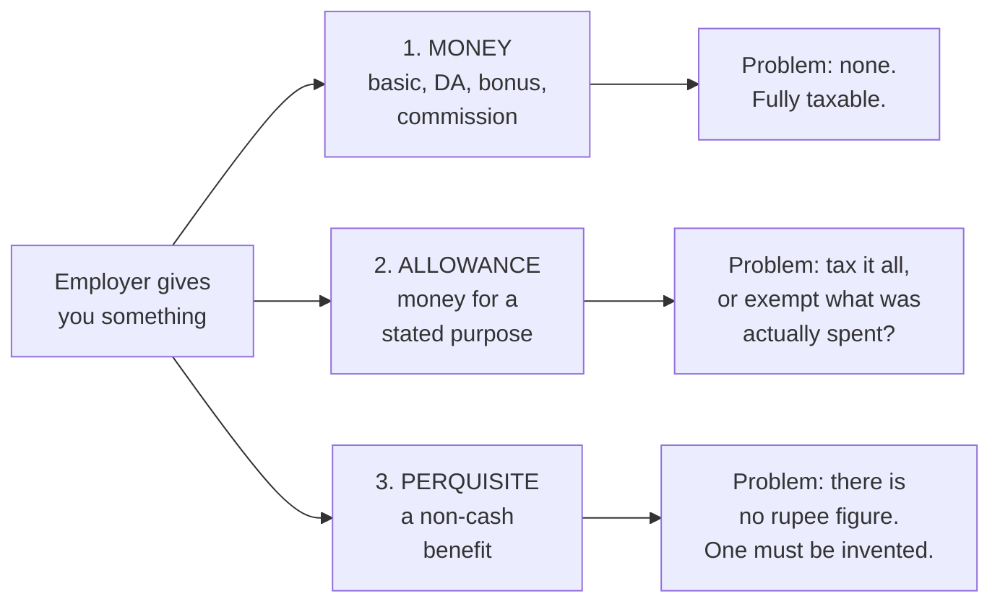

### Kind one: money

Basic salary, dearness allowance, bonus, commission. Cash with no strings. There is no legal problem
to solve, so there is no relief. Fully taxable, always.

**Dearness allowance** deserves its own attention, not because its own treatment is complicated
(it is fully taxable, unconditionally, with no exemption anywhere in the Act) but because **other
computations key off it.**

The critical qualifier is whether DA **forms part of salary for retirement benefits** under the
terms of employment. If it does, DA enters the "salary" base used for provident fund contributions,
for gratuity, and for leave encashment. If it does not, those formulas run on basic alone.
This single condition is the most commonly missed line in salary problems, and examiners state it
explicitly in the question precisely because it changes the answer.

Note also that the definition of "salary" is **not constant across the Act**. It means basic plus DA
(if retirement-linked) plus turnover commission for leave encashment; it means something else again
for gratuity. Do not carry one definition across formulas. Read which base each formula asks for.

**Bonus** is taxed on receipt, because a bonus is not contractually due until declared.
**Commission** is salary if it arises from the employment, and is taxed on the ordinary due-or-receipt
basis. Turnover-based commission fixed as a percentage under the employment terms is one of the few
components admitted into the retirement-benefit salary bases.

### Kind two: allowances

An allowance is money paid **for a stated purpose**: to cover rent, travel, a child's schooling, a
uniform.

Here the law faces a genuine choice. The money is cash, so on principle it is income. But it was
given to be spent on something, and if it was in fact spent, taxing it means taxing a
reimbursement of a cost.

Section 115BAC answers it by drawing a single line. Where the allowance genuinely reimburses a cost
of doing the job, the exemption stands: exempt to the extent spent, or up to a prescribed ceiling.
Where the allowance is really a top-up of pay wearing a purpose as a label, it is treated as money
and taxed in full.

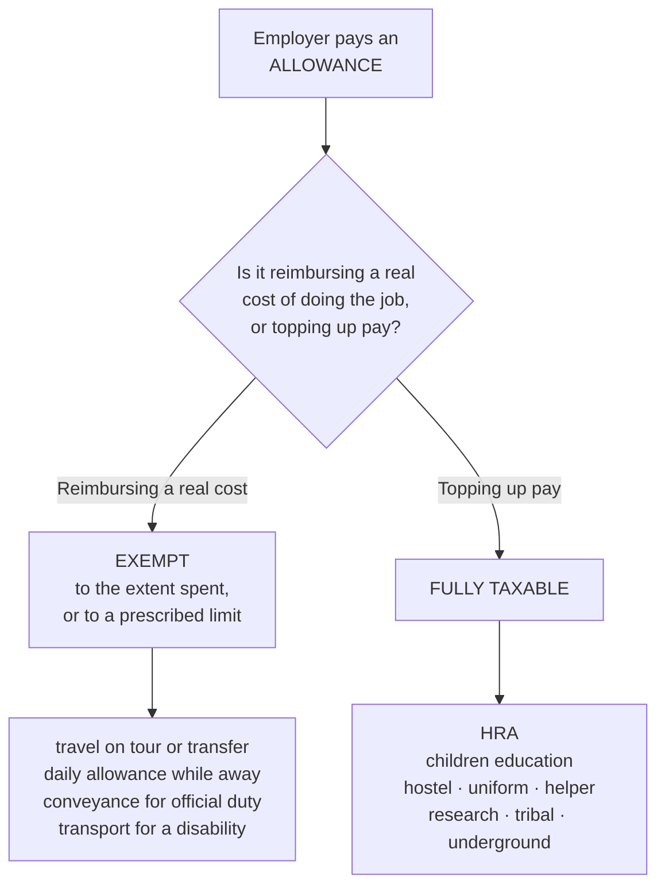

The four that stay exempt are the ones where the "reimbursement of a real cost" argument is
strongest: travel on tour or transfer, daily allowance while away from the normal place of duty,
conveyance for official duties, and transport allowance for an employee with a disability. Each is
closer to a business expense being reimbursed than to a top-up of pay.

**House rent allowance (Sec 10(13A))** is the clearest case on the taxable side, and worth
understanding rather than memorising as an exception. Rent is a cost of living, not a cost of doing
the job — everyone pays for somewhere to live, employed or not. So 115BAC treats HRA as pay by
another name and taxes the whole of it, whatever the rent actually paid and whatever the city. There
is no computation to run: the full HRA received enters gross salary.

### Kind three: perquisites

A perquisite is a **non-cash benefit** arising from employment: a flat, a car, a driver, a loan at
below-market interest, a servant, school fees paid for your child.

The legal problem here is different from the other two and much harder. The benefit is real, it is
clearly part of what you get for working, and **there is no rupee figure anywhere.** No invoice, no
payslip line. If perquisites were untaxed, employers and employees would simply convert salary into
benefits until nothing was left to tax.

So the law has to **invent a value**. That is all Rule 3 is: a valuation table, because reality does
not supply one.

Once you see that, the thirteen perquisites stop being thirteen arbitrary rules and become thirteen
answers to the same question — *how do we put a defensible number on this?* — each shaped by the
practical difficulty of the item:

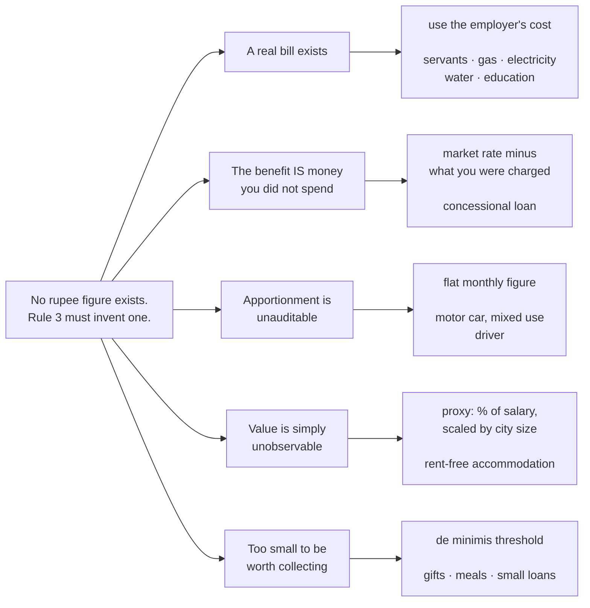

| Perquisite                         | Valuation approach                                                                 | Why that approach                                                                                                                               |
| ---------------------------------- | ---------------------------------------------------------------------------------- | ----------------------------------------------------------------------------------------------------------------------------------------------- |
| Rent-free accommodation            | A percentage of salary, scaled by city population                                  | Market rents are unknowable in bulk; salary is a decent proxy for the standard of accommodation provided, and city size proxies for rent levels |
| Concessional accommodation         | Same value, minus rent actually recovered                                          | You only benefit by what you did not pay                                                                                                        |
| Motor car, mixed use               | A flat monthly figure, higher for larger engines, plus a fixed amount for a driver | Honestly apportioning personal and official mileage is impossible to audit, so a rough flat figure is used instead                              |
| Motor car, wholly personal         | Actual running cost, plus driver, plus depreciation on cost, less recovery         | Here there is no apportionment problem, so use real numbers                                                                                     |
| Interest-free or concessional loan | SBI's lending rate, less what you were charged                                     | The benefit **is** the interest you did not pay, so the market rate is the natural measure                                                      |
| Free or concessional education     | Cost, with a small per-child de minimis                                            | Below a trivial amount, not worth administering                                                                                                 |
| Domestic servants                  | Actual cost to the employer, less recovery                                         | The employer's cost is known and documented                                                                                                     |
| Gas, electricity, water            | Employer's own cost, or amount paid to the outside supplier                        | Same reason: there is a real bill                                                                                                               |
| Free food                          | Exempt up to a small per-meal limit                                                | Feeding staff during work is ordinary and not a disguised payment; beyond a limit it is                                                         |
| Gifts and vouchers                 | Exempt below an aggregate annual threshold                                         | Genuine occasional gifts are not remuneration; large ones are                                                                                   |
| Employer's PF contribution         | Taxable only beyond a percentage of salary                                         | Retirement saving is encouraged, but not without limit                                                                                          |
| Club membership                    | Taxable unless genuinely business-related                                          | Personal enjoyment dressed as a business facility is the obvious abuse                                                                          |
| Employer-paid insurance premium    | Taxable, except statutory or group accident schemes                                | A premium on a policy that benefits *you* is pay in another form                                                                                |

Two exemptions in this area follow directly from the same reasoning. **Medical treatment in the
employer's own hospital** is exempt without ceiling, because the employer is running a facility
rather than paying cash that substitutes for salary. And a **keyman insurance premium** is not a
perquisite at all, because the policy protects the company's interest, not the employee's; the
employee gets nothing.

**Specified employees.** Some perquisites are taxable only for directors, employees with a
substantial (20%) voting interest, and employees whose salary exceeds a threshold excluding
non-monetary perquisites. This is a **de minimis policy** rather than a principle. The original
concern was not taxing a junior employee on a shared amenity. Senior people receive these benefits
as real remuneration, so for them they are taxed.

### Profit in lieu of salary (Sec 17(3))

The residual catch-all within salary. Payments connected with employment that are not periodic
wages: compensation for termination or for modification of employment terms, payments from an
unrecognised fund, sums under a keyman policy, and amounts received before joining or after leaving.

Its function is to stop the boundary of "salary" being gamed at the *edges* of the employment
relationship. A large payment to induce you to resign is economically remuneration; without 17(3) it
could be argued to be a capital receipt for surrendering a right. So 17(3) names it and taxes it as
salary.

---

## 7. Retirement benefits, and why every formula says "least of"

Gratuity, commuted pension and leave encashment all resolve into the same shape: **exempt to the
least of several limits, balance taxable.** That is not coincidence. It is one policy problem
producing one solution, four times.

**The tension.** These are lump sums received at the end of a working life, often the person's main
capital. Taxing them fully at slab rates in a single year would be harsh, and would land at the
worst moment. So the state wants to relieve them.

But the moment you exempt a category, employers and employees will push income into it. A generous
uncapped "gratuity" is just tax-free salary with a different label.

**The solution: relieve it, but cap it several ways at once, so no single route can be gamed.**

- **Actual amount received.** You cannot exempt more than you got. Blocks inflating the exemption
  above the real payment.
- **A formula tied to salary and years of service.** Ties relief to a genuine long employment
  relationship, so a sudden large payout to a short-serving employee gets little.
- **An absolute statutory ceiling.** Stops the relief scaling indefinitely with pay, which would
  make it worth most to those who need it least.

Take the **least**, so the most restrictive cap binds. Once you see it as three independent
anti-abuse locks rather than three unrelated numbers, you stop mixing them up.

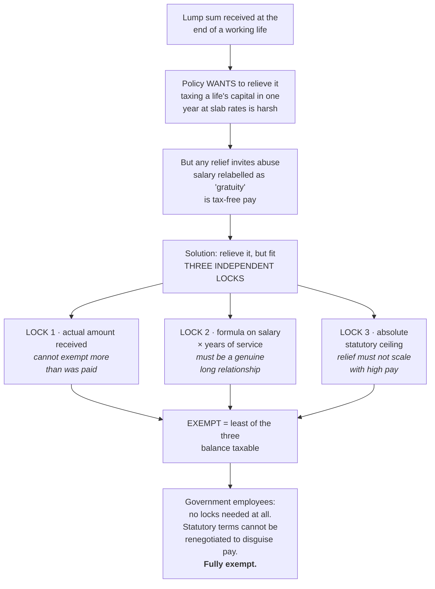

The same shape, three times: gratuity, leave encashment, commuted pension.

**Why government employees are treated more generously.** Gratuity, commuted pension and leave
encashment are all **fully exempt** for government employees, while private-sector employees get the
capped formulas. This looks like favouritism and is actually structural: government service terms
are fixed by statute and cannot be negotiated to disguise salary as a retirement benefit. A private
employer and a willing employee can rewrite a contract. The state cannot game its own rules, so the
anti-abuse caps are unnecessary there.

**Uncommuted versus commuted pension.** Monthly pension as it arrives is fully taxable for everyone,
because it is simply deferred salary being paid periodically. **Commutation** is taking a lump sum
now in exchange for giving up part of the future stream. That is the lump-sum problem again, so it
gets relief. And the relief is larger for someone who receives **no gratuity** than for someone who
does, because the two are alternative forms of the same end-of-service provision. Getting both means
you need less relief on each.

**Why "15 days ÷ 26" appears in the gratuity formula.** Twenty-six is the standard working-days
divisor under the Payment of Gratuity Act, which excludes weekly offs. Employees not covered by that
Act use a half-month's average salary instead, on ordinary calendar logic. Two different statutory
sources, two different divisors. Also note the rounding differs: under the Act, part of a year of six
months or more rounds up; outside it, only completed years count.

**Leave encashment during service is fully taxable.** No relief, because you have not retired and the
lump-sum-at-end-of-life justification does not apply. It is simply payment for untaken leave, which
is pay.

### Provident fund is a question about *when*, not whether

The three fund types differ in **which of three moments the tax bites**: contribution, accumulation,
or withdrawal.

| | Contribution in | Interest accruing | Withdrawal out |
|---|---|---|---|
| **Statutory PF** | Relieved | Exempt | Exempt |
| **Recognised PF** | Employer's share exempt to a percentage of salary; excess taxed as salary | Exempt to prescribed limits; excess taxed | Exempt if service conditions met |
| **Unrecognised PF** | No relief | Not taxed as it accrues | Employer's share and its interest taxed as profit in lieu; interest on your own share taxed as other sources; your own principal not taxed again |
| **Public PF** | Relieved | Exempt | Exempt |

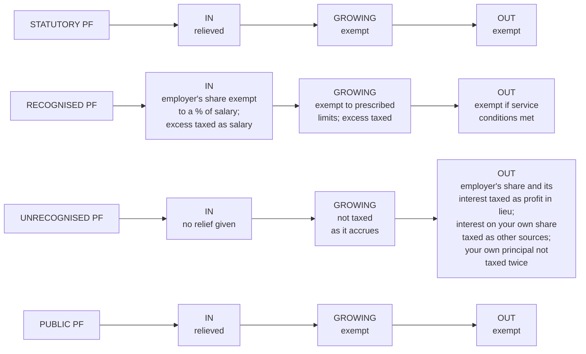

Read the URPF row carefully, because it is the one that is examined. The fund was never recognised,
so the state never granted relief, so at withdrawal it collects what it deferred. And your own
contributions are not taxed a second time, because they were taxed as salary when earned. Every line
of that row follows from "no relief was given, so tax is now due on the parts that were never taxed."

The **percentage cap on the employer's contribution** to a recognised fund exists for the obvious
reason: without it, an employer could route unlimited salary through a tax-advantaged wrapper. The
cap is where "reasonable retirement provision" ends and "disguised pay" begins. Note also that this
excess is one of the items **deemed to be received** under Sec 7 even though no money reached you.

---

## 8. Section 16, and what the new regime actually is

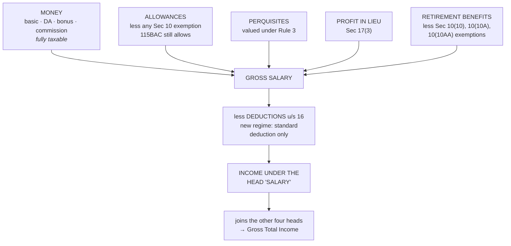

After everything above is added into **gross salary**, exactly one subtraction stands between it and
income under the head: the **standard deduction (Sec 16(ia))** — a flat amount, no proof, no
expenditure required. Section 16 has two other clauses, the entertainment allowance deduction at
16(ii) and professional tax at 16(iii), and 115BAC allows neither.

The standard deduction is a deliberate simplification. Rather than adjudicating whether a given
employee's expenses were incurred for employment, the Act gives everyone a flat sum and stops
arguing. It is the "economy" and "simplicity" canons made concrete.

### The new regime is not a different tax, it is a different bargain

This is the single most useful thing to hold about Sec 115BAC, and it explains at a stroke why so
many exemptions in the Act are simply switched off.

**The trade: give up nearly all exemptions and deductions, receive lower slab rates and a much
larger effective no-tax threshold.**

Not a concession, and not a penalty. An exchange. The alternative is a system that rewards you for
documenting and itemising — rent receipts, insurance premiums, investment proofs, home loan
certificates. Sec 115BAC's position is that the compliance cost of all that, on both sides, exceeds
its value, so here are gentler rates and almost nothing to prove.

Everything follows from that one sentence:

- HRA is fully taxable, because HRA relief is itemisation.
- Most Sec 10(14) allowances are fully taxable, for the same reason.
- Chapter VI-A largely disappears, with employer NPS contribution among the narrow survivors.
- Only one Section 16 deduction remains.
- **Perquisites remain fully taxable.** This catches people out. Perquisites are not a relief being
  withdrawn; they are *income being measured*. The new regime removed reliefs. It did not stop
  valuing benefits.
- Retirement exemptions under Sec 10(10), 10(10A) and 10(10AA) **continue**, because those are not
  itemised reliefs for expenditure — they are relief for a lump sum landing in one year, and that
  problem is unchanged by the choice of regime.

That last distinction is the useful test for anything you are unsure about. **Ask what the relief was
for.** If it existed to reward documented spending or investment, the new regime almost certainly
removed it. If it existed to solve a structural problem, like a lump sum bunching into one year or a
genuine business cost being reimbursed, it almost certainly survived.

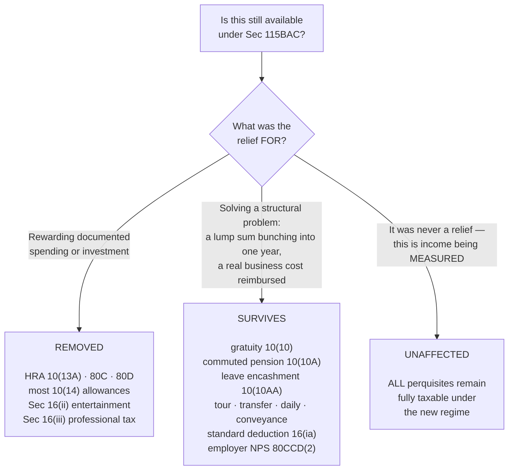

The new regime is also now the **default**. You are in it unless you actively opt out, which reverses
the earlier position and tells you which way the policy is moving.

---

## 9. The design principles that repeat

Six ideas generate most of the rules in these two units. Once you can name them, unfamiliar
provisions become guessable, which is worth a great deal in a case-study question.

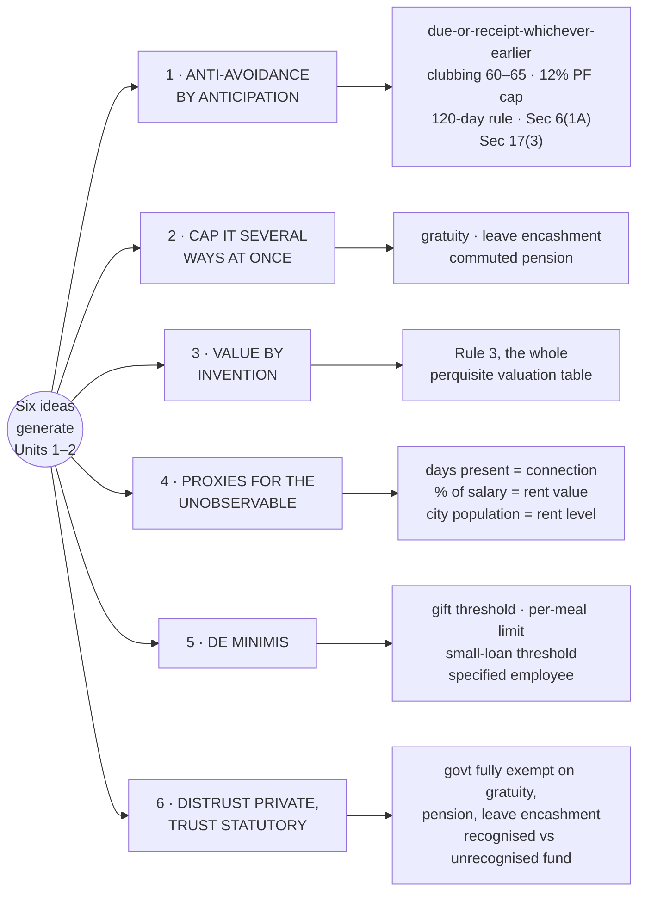

**1. Anti-avoidance by anticipation.** Wherever the Act looks fussy, ask what abuse it is blocking.
Due-or-receipt-whichever-is-earlier blocks timing games. Clubbing blocks income-splitting across a
family. The 12% PF cap blocks routing salary through a shelter. The 120-day rule and deemed
residence block engineered non-residence. Section 17(3) blocks relabelling severance as capital.
Almost every irregular-looking rule is a patch over a hole someone found.

**2. Cap it several ways at once.** When the Act gives relief, it rarely gives it one limit. Actual
amount, a formula, and an absolute ceiling, take the least. Used for gratuity, leave encashment and
commuted pension. Three locks are much harder to pick than one.

**3. Value by invention where reality gives no number.** Perquisites have no invoice, so Rule 3
manufactures a figure. Rough and administrable beats precise and unenforceable, which is why a car
is worth a flat monthly amount rather than an audited mileage split.

**4. Proxies for things you cannot observe.** You cannot measure connection to a country, so count
days. You cannot know what a flat is worth, so take a percentage of salary and scale by city size.
The proxy is always cruder than the truth and always easier to administer, and that trade is made
deliberately.

**5. De minimis.** Small amounts are exempted because collecting on them costs more than it raises,
and taxing a shared water supply or a tin of sweets brings the system into disrepute. Hence the gift
threshold, the per-meal limit, the small loan threshold, the specified-employee rule.

**6. Distrust private arrangements, trust statutory ones.** Wherever government employees get simpler
or fuller relief, the reason is that their terms are fixed by statute and cannot be renegotiated to
disguise salary. Private contracts can be. Same logic explains why a recognised fund, approved by
the Commissioner, is treated better than an unrecognised one.

---

## 10. The one thing to hold if you hold nothing else

Unit 1 decides **whose income, from where, over what period, and of what character.** Unit 2 takes
one head and asks **how much of what an employer gave you counts.**

Every problem in the two units is a sorting exercise before it is an arithmetic exercise. Fix the
period. Fix the status. Sort each item — Indian or foreign, capital or revenue, exempt or taxable,
money or allowance or perquisite. Only then compute.

Marks are almost never lost on the arithmetic. They are lost by starting it too early.

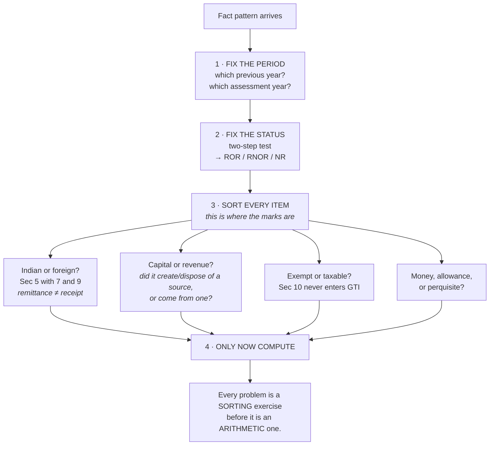

## Links
- [[Taxation Law MOC]]
- [[Unit 1-2 Fact Check and Corrections]]
- [[Taxation Units 1-2 MCQ Bank]]
- [[Home]]
