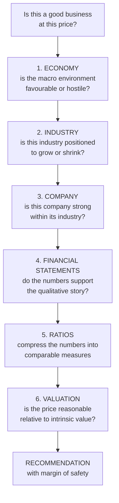
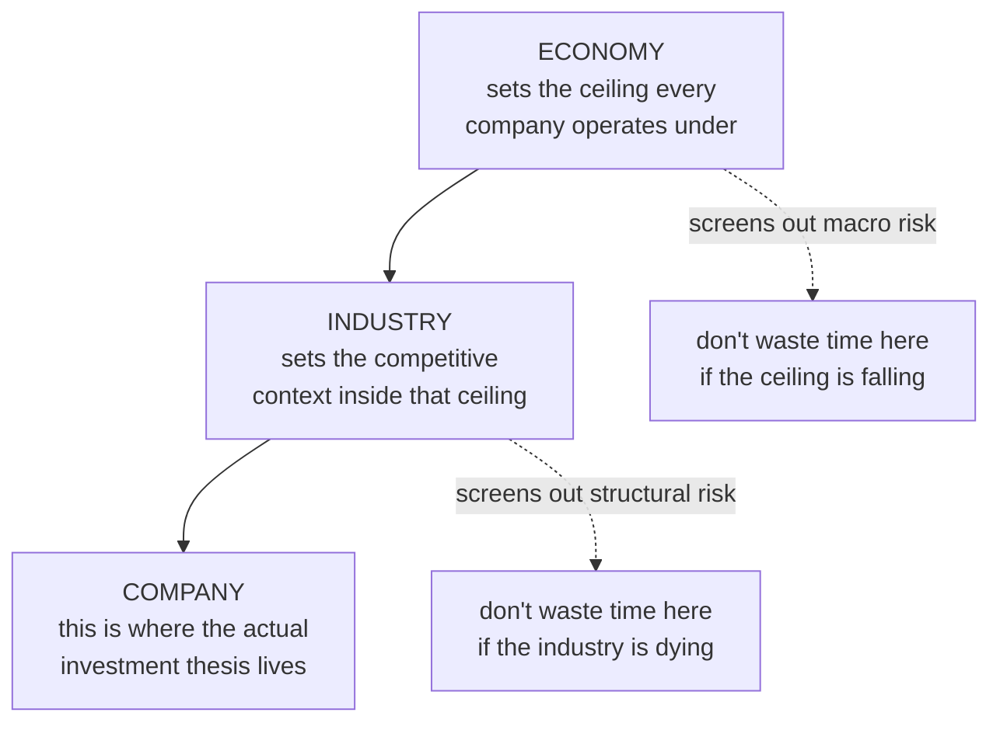
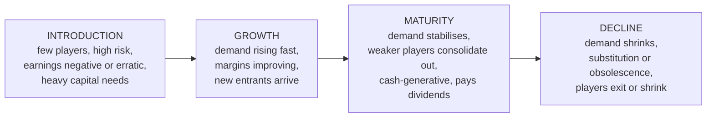
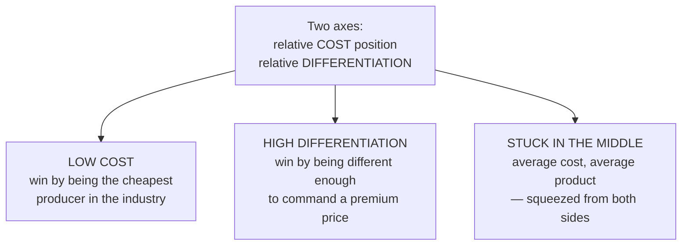
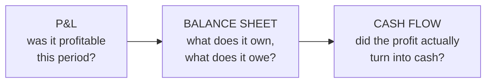
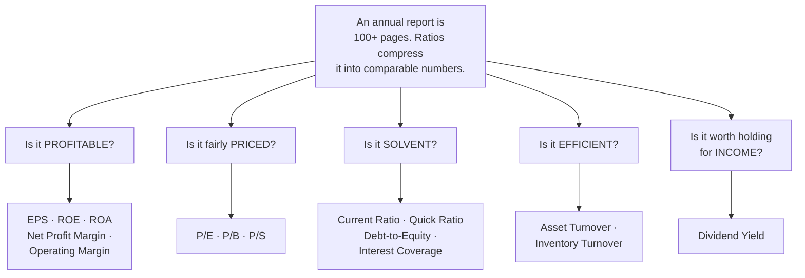
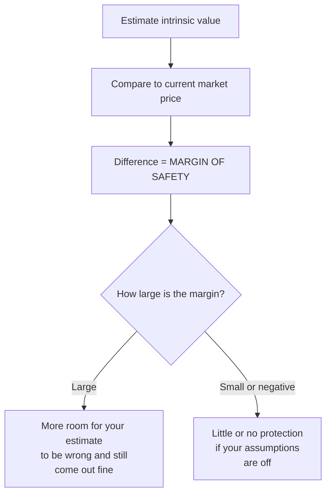
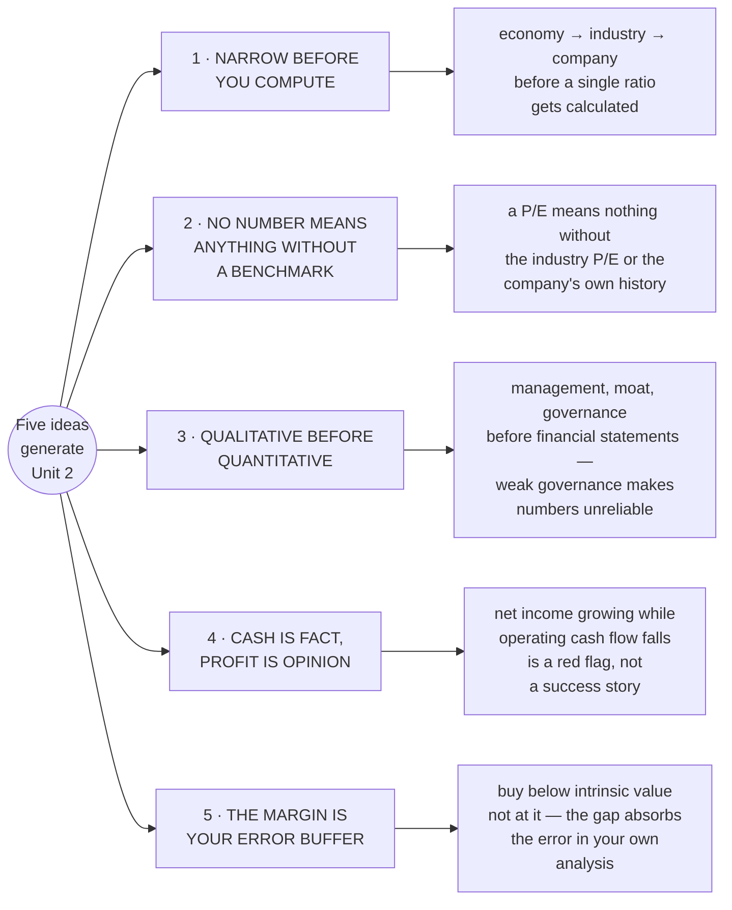
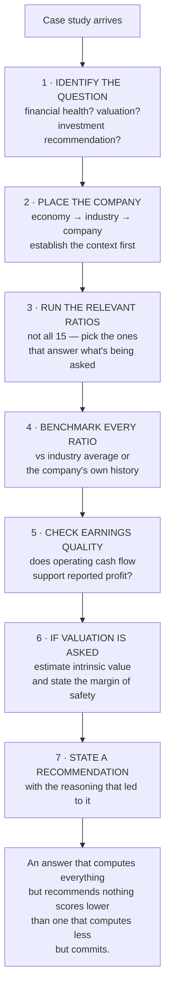

# Unit 2 — How Fundamental Analysis Actually Works

An understanding-first companion for the mid-semester case study. That paper will hand you a
company and its numbers and ask you to reason your way to a recommendation. It will not ask you to
recite definitions. This note exists so that every tool you reach for has a *reason* attached to
it, because the rubric's top band is explicit: it wants "accurate interpretation," "clear
analytical reasoning," and a "logical, data-supported" recommendation. That is a reasoning rubric,
not a recall rubric.

Your own fragments: [[Index - SAPM]] · [[Types Of Analysis]] · [[Company Analysis]].

---

## 0. The shape of the whole subject

Fundamental analysis answers one question: **is this a good business, priced reasonably?** Every
topic in Unit 2 sits under one step of the process that answers it.

Each step narrows. The economy screens out macro risk. The industry screens out structural risk.
The company-level analysis is where the actual investment thesis lives. Financial statements are
the evidence. Ratios are the compression of that evidence into comparable numbers. Valuation and
margin of safety are the final judgment.

Every time you feel lost mid-answer, ask which step you are actually on. Most marks lost in this
kind of paper come from jumping to ratios before establishing the context that decides what those
ratios mean.

---

## 1. Why top-down exists

Your fragment note already has the shape right: fundamental analysis is the "examination of
various factors such as earnings of the company, growth rate and risk exposure that affect the
value of shares," done in three layers — economy, industry, company. What it does not yet say is
*why* you move in that order rather than jumping straight to the company.

Each layer is a filter, not just a description. You do not analyse a brilliant company in a
collapsing industry the same way you analyse the same company in a growing one, because the
industry sets what growth is even *available* to be captured. And you do not analyse an industry
in isolation from the economy, because a recession compresses demand across every industry at
once, just by different amounts. Top-down exists so that you screen out the risks you cannot
diversify away from (macro, structural) before you spend effort on the risk that is actually
company-specific and where your analysis can add value. This is also why it is called top-down:
you narrow from the broadest, least controllable factor to the narrowest, most controllable one.

## 2. Economy analysis — the ceiling

The economy does not determine whether one company beats another. It determines the size of the
pie every company in the country is cutting from. The variables worth knowing are the ones that
change the size or the price of that pie.

| Variable | Why it moves equity value |
|---|---|
| **GDP growth** | Corporate revenue, in aggregate, tracks national output. A slowing economy means slowing topline growth is available to *any* company, however well run. |
| **Inflation** | Erodes real purchasing power and squeezes margins for companies that cannot pass rising input costs to customers. Also forces the central bank's hand on rates. |
| **Interest rates** | The discount rate used to value every future cash flow. Higher rates mean a rupee earned five years from now is worth less today, so valuations across the market compress mechanically, independent of company performance. Higher rates also raise the cost of debt, hurting leveraged companies more. |
| **Fiscal policy** | Government spending and taxation change disposable income and demand in specific sectors (infrastructure spend lifts cement and steel; a tax cut lifts consumption plays). |
| **Monetary policy** | Repo rate and liquidity conditions set by the RBI. Loose policy pushes money into risk assets; tight policy pulls it back into safer, higher-yielding debt. |
| **Business cycle stage** | Expansion, peak, contraction, trough. Different sectors lead at different stages — cyclicals lead expansion, defensives hold up in contraction — so knowing the stage tells you which industries deserve attention right now. |

The single idea to hold: none of these variables tell you which stock to buy. They tell you
whether the wind is at your back or in your face while you decide.

## 3. Industry analysis — the competitive context

### The life cycle

An industry behaves differently depending on where it sits in its life, and the same financial
ratio means something different at each stage.

A company burning cash in the introduction stage is not automatically a bad investment; that is
what every company in that stage looks like. A company with flat revenue in the maturity stage is
not automatically stagnant; flat, cash-generative and dividend-paying is exactly what a healthy
mature-industry company should look like. Reading a ratio without first placing the industry on
this curve is one of the fastest ways to misjudge a company that is behaving completely normally
for its stage.

### Competitive positioning

Your own fragment names the framework correctly but compresses it to a phrase: "2x2 Matrix,
Relative Differentiation to relative Cost Position." Unpacked, this is a positioning map with two
axes.

There are two coherent ways to win in an industry: be the lowest-cost producer, so you can
underprice everyone and still earn a margin, or be differentiated enough that customers will pay
more rather than switch. What you cannot do is sit in the middle with an average cost structure
and an average product, because the low-cost players will underprice you and the differentiated
players will out-sell you on quality. When a case study asks you to assess a company's competitive
position, this is the question underneath it: which corner of the map is this company actually in,
and is that a defensible place to be?

## 4. Company analysis

Once the industry has been screened, the actual investment thesis is built at the company level,
in two layers.

**Qualitative first, because it decides whether you can trust the numbers.** Management quality
and track record (has this team delivered on past guidance, or over-promised repeatedly),
competitive advantage or moat (brand, patents, switching costs, network effects, cost position —
something that stops a competitor from copying the returns away), and corporate governance (board
independence, related-party transactions, promoter shareholding and pledging). A company can show
excellent ratios and still be a bad investment if governance is weak, because weak governance is
precisely the condition under which reported numbers stop being reliable.

**Quantitative second, because this is where the numbers finally enter.** The three financial
statements, read in sequence:

The P&L tells you if the company made money on paper. The balance sheet tells you what it is
carrying, and whether it could survive a bad year. The cash flow statement is the check on both,
because profit is an accounting opinion and cash is a fact. A company that shows rising profit but
falling operating cash flow is a company where receivables are piling up, or earnings are being
manufactured through accounting choices, and that gap is one of the most examinable red flags in
this unit.

## 5. Why ratios exist

A full annual report runs to over a hundred pages. Nobody can hold that much information in their
head, and nobody can compare it across companies of different sizes as raw numbers. A ratio
compresses the report into a single figure that is comparable across time and across companies,
because dividing out size (revenue, assets, share count) is exactly what makes Rs.500 crore profit
on a Rs.2,000 crore company comparable to Rs.50 crore profit on a Rs.200 crore one.

Group ratios by the question they answer, not by which statement they come from. That is how an
examiner will actually use them in a case study — "assess profitability," "assess solvency" — not
"list five ratios."

**Profitability — is the company earning money, and how hard is it working to do so?**
- **EPS (earnings per share)** — profit attributed to one share. The raw building block almost
  every other equity ratio is built from.
- **ROE (return on equity)** — profit as a return on the shareholders' own money in the business.
  This is the number that tells an equity investor specifically, as opposed to a lender, how hard
  their capital is working. But it can be inflated by leverage — Du Pont decomposition (ROE =
  Margin x Turnover x Equity Multiplier) reveals whether the return is operationally earned or
  debt-driven.
- **ROA (return on assets)** — profit as a return on everything the company controls, borrowed or
  owned. Comparing ROE to ROA tells you how much of the equity return is coming from leverage
  rather than genuine operating efficiency, which matters because leveraged returns are riskier
  returns.
- **Net Profit Margin** — what fraction of every rupee of revenue survives to the bottom line.
  Trend matters more than level: shrinking margins on growing revenue is a warning.
- **Operating Margin** — profitability from core operations, before financing costs and tax.
  Isolates the business from its capital structure.

**Valuation — is the price reasonable relative to what you get?**
- **P/E (price to earnings)** — how many years of current earnings you are paying for the share,
  in effect. A high P/E means the market is pricing in strong future growth; a low P/E means
  either the market doubts the company or it is genuinely cheap. The number alone cannot tell you
  which, which is exactly why it needs to be read next to the industry and the growth story, never
  in isolation.
- **P/B (price to book)** — price relative to the accounting net worth of the company. Useful
  where assets are the story (banks, capital-intensive industries), less useful where the real
  value is intangible (brand, software, know-how) and never sits on the balance sheet.
- **P/S (price to sales)** — price relative to revenue. Used when a company has no profit yet to
  put a P/E on, which is common in the growth stage of the industry life cycle.

**Solvency — can it survive a bad year?**
- **Current ratio** and **quick ratio** — current assets against current liabilities, with the
  quick ratio stripping out inventory because inventory is the current asset least reliably
  convertible to cash in a hurry. Both answer "can this company meet what it owes in the next
  twelve months without a fire sale."
- **D/E (debt to equity)** — how much of the company is financed by lenders versus owners.
  Lenders get paid first and get paid a fixed amount regardless of how the business performs, so
  higher D/E means the equity holder's return is more volatile in both directions. This is the
  single ratio most directly linked to risk, not just to financial position.
- **Interest Coverage** — EBIT divided by interest expense. How many times over the company can
  cover its debt service from operating earnings. Below 1.5x is uncomfortable; below 1x means
  operating earnings do not cover interest.

**Efficiency — is it using its resources well?**
- **Asset Turnover** — revenue generated per rupee of assets. Capital-light businesses (IT
  services) naturally show higher turnover than capital-heavy ones (utilities, manufacturing), so
  this is strictly an intra-industry comparison.
- **Inventory Turnover** — how fast inventory cycles through. Higher is generally better (less
  cash tied up in stock sitting on shelves), but compare to the industry — a retailer's normal
  is very different from a heavy-equipment manufacturer's.

**Income.**
- **Dividend yield** — dividend per share as a percentage of price. Tells an income-focused
  investor what cash return they get simply for holding, independent of any price appreciation.

The examiner's real test is never "define P/E." It is "given this company's numbers, is it
overvalued, undervalued, or fairly valued relative to its industry and its own history" — which
means a ratio without a benchmark to compare it against is an unfinished answer.

## 6. Margin of safety

Suppose your valuation is right and you calculate the intrinsic value of a share precisely. Buying
at exactly that price is still the wrong move, because the premise "your valuation is right" is
the one thing you cannot actually verify in advance. Every input into a valuation — growth rate,
discount rate, margin assumptions — is an estimate, and estimates are wrong more often than they
are exactly right.

Margin of safety, Benjamin Graham's idea, is the gap you deliberately leave between what you
believe a share is worth and what you actually pay for it. It is not a discount you get lucky
into. It is the buffer that absorbs the error in your own analysis. The larger the margin, the
more wrong your intrinsic value estimate can be while the investment still works out, which is
precisely why value investors talk about buying at a discount to intrinsic value rather than at
intrinsic value itself. In a case study, stating a target price without stating the margin you
would want before actually buying is an unfinished valuation answer, not a complete one — the
rubric rewards conclusions, and "buy with a margin of X%" is a sharper conclusion than "fair value
is Rs.Y."

---

## 7. Design principles that repeat

Five ideas generate most of the reasoning in Unit 2. Once you can name them, unfamiliar case
study questions become approachable, because you can work out what the examiner is testing for
even if the specific company or industry is one you have never studied.

**1. Narrow before you compute.** The EIC framework funnels economy to industry to company
before a single ratio gets calculated. The broad context is fixed first, because it changes what
the narrow number means. A P/E of 30 in a high-growth industry is not the same signal as a P/E
of 30 in a mature one.

**2. No number means anything without a benchmark.** A ratio needs an industry average, a
historical trend, or a stated threshold to be an answer rather than just a number. The exam
rewards stating the benchmark explicitly, not just computing the ratio.

**3. Qualitative before quantitative.** Management quality, competitive moat, and governance are
assessed before the financial statements are opened, because they decide whether you can trust
the numbers at all. A company with opaque governance and aggressive accounting can show excellent
ratios that do not represent reality.

**4. Cash is fact, profit is opinion.** The cash flow statement is the audit on the P&L. If net
income grows but operating cash flow does not keep pace, the profit may be accrual-driven rather
than cash-backed. Always cross-check.

**5. The margin is your error buffer, not a bonus discount.** You do not buy at intrinsic value
even if you trust your estimate, because your estimate is an estimate. The gap between intrinsic
value and purchase price is the room you leave for being wrong, and a wider margin means more
room.

---

## 8. The one thing to hold if you hold nothing else

Read the case, work out what it is asking — financial health, valuation, or a full investment
recommendation. Place the company in its EIC context before touching any numbers. Run the ratios
that answer the specific question being asked, and benchmark every one of them. Check whether cash
flow supports the reported profit. If valuation is asked, estimate intrinsic value and state the
margin of safety you would want. Then commit to a recommendation and show the reasoning.

The rubric's top band asks for "a strong investment recommendation," not a well-organised set of
computations sitting next to each other. Commit to an answer, and show the reasoning that gets you
there.

## Links
- [[SAPM MOC]]
- [[Units 2-3 - SAPM Cheat Sheet]]
- [[Home]]
