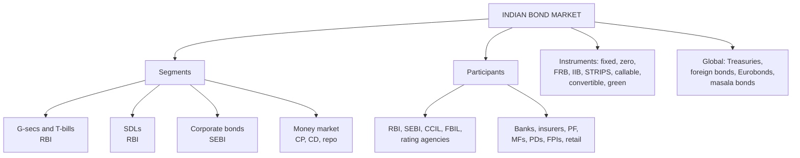

# BF-1: Bond Market Structure, Participants and Instruments (Indian and Global)

Covers: what the bond market is and why it matters, the segments of the Indian debt market, the regulators and participants, the main instruments, the global bond market and how India connects to it. **(syllabus)**

## Where this fits in the ESE

ESE: 3 × 5, 2 × 10, one compulsory 15-mark question. Unit 1 is CO1 ("explain the structure and functioning of the bond market in India"). Expect a 10-mark "structure of the Indian bond market" or 5-markers on participants or instruments. Your CIA1 report (G-sec vs corporate bond) is good revision for this node.

## What the bond market is

A **bond** is a debt instrument: the issuer borrows money and promises **periodic interest (coupon)** and **repayment of principal** at maturity. The bond market is where these are **issued (primary market)** and **traded (secondary market)**.

**Why it matters:** finances government deficits and infrastructure; gives companies long-term funding beyond bank loans; provides safe assets for banks, insurers and pension funds; transmits monetary policy (RBI's rate moves pass through G-sec yields to all borrowing costs); the G-sec yield curve is the benchmark for pricing all other debt.

## Segments of the Indian debt market

| Segment | Issuer | Instruments | Regulator |
|---|---|---|---|
| **Government securities (G-secs)** | Central government | Dated securities (2–40 years), Treasury bills (91, 182, 364 days), cash management bills | RBI |
| **State development loans (SDLs)** | State governments | Dated securities | RBI |
| **Corporate bonds** | PSUs, private companies, banks, NBFCs, financial institutions | Debentures, bonds, commercial paper (money market) | SEBI (and RBI for CP and CDs) |
| **Money market** | Banks, companies, government | T-bills, commercial paper, certificates of deposit, repo, TREPS | RBI |

G-secs dominate trading: they are the most liquid segment and the risk-free benchmark. The corporate bond market is smaller, concentrated in highly rated (AAA/AA) issuers, and less liquid.

## Participants

**Regulators and infrastructure**
- **RBI:** debt manager for the central and state governments (runs G-sec auctions), regulator of the G-sec, money and repo markets, and of banks.
- **SEBI:** regulator of corporate bond issuance and trading, mutual funds, rating agencies, debenture trustees.
- **CCIL (Clearing Corporation of India):** central counterparty that clears and settles G-sec, repo and forex trades, guaranteeing settlement.
- **NSE and BSE:** platforms for corporate bond trade reporting and settlement (RFQ platforms); retail G-sec bidding.
- **FBIL:** publishes benchmark rates and valuations (G-sec yield curve, MIBOR).
- **Credit rating agencies:** CRISIL, ICRA, CARE, India Ratings: rate corporate and state debt.
- **Depositories:** NSDL, CDSL (dematerialised holdings); RBI's SGL accounts for G-secs.

**Issuers:** central and state governments, PSUs, banks, NBFCs, private companies.

**Investors**
- **Commercial banks:** largest holders of G-secs, partly because of the **Statutory Liquidity Ratio (SLR)** requirement.
- **Insurance companies and provident/pension funds (LIC, EPFO, NPS):** long-maturity buyers matching long liabilities.
- **Mutual funds:** debt and liquid funds.
- **Primary dealers (PDs):** RBI-authorised firms that underwrite G-sec auctions and make markets.
- **Foreign portfolio investors (FPIs):** via general limits and the Fully Accessible Route (FAR) for specified G-secs; India's inclusion in the JP Morgan GBI-EM index from June 2024 brought new index-linked foreign flows.
- **Retail investors:** through RBI Retail Direct (since 2021), stock exchange platforms and online bond platform providers.

## Instruments (by feature)

| Type | Feature |
|---|---|
| Fixed-coupon bond | Same coupon every period (most G-secs) |
| Zero-coupon / T-bill | Issued at a discount, redeemed at par; no coupon |
| Floating rate bond (FRB) | Coupon resets with a benchmark (e.g. T-bill yield) |
| Inflation-indexed bond | Principal or coupon linked to inflation |
| STRIPS | G-sec coupons and principal separated and traded as zeros |
| Callable / puttable | Issuer may redeem early / investor may demand early repayment |
| Convertible | Can be converted into the issuer's shares |
| Perpetual (e.g. bank AT1 bonds) | No maturity; issuer call options |
| Green / sustainability bonds | Proceeds tied to environmental projects (Unit 5); India issued sovereign green bonds from 2023 |
| Secured vs unsecured debentures | Backed by assets or not |

## The global bond market

- Much larger than global equity markets by outstanding value; dominated by **US Treasuries**, followed by Japanese, Chinese, European (German Bunds, French OATs) and UK gilts.
- **Domestic bonds** (issued at home, home currency), **foreign bonds** (issued in another country's market and currency: Yankee bonds in the US, Samurai in Japan), **Eurobonds** (issued outside the currency's home country).
- **Masala bonds:** rupee-denominated bonds issued abroad by Indian entities: the foreign investor bears the currency risk.
- Global investors watch the US 10-year Treasury yield as the world's benchmark; moves in it spill over to Indian yields through FPI flows.

## Indian vs global market (comparison)

| Basis | India | Developed markets (e.g. US) |
|---|---|---|
| Dominant segment | G-secs; corporate segment small | Deep corporate and municipal segments |
| Investors | Banks (SLR), insurers, provident funds | Diverse, including large pension and retail |
| Liquidity | Concentrated in a few benchmark G-secs | Broad |
| Credit spread market | Mostly AAA/AA | Full rating spectrum incl. high yield |
| Foreign participation | Growing (index inclusion) | Very high |

## What to remember

- Segments: G-secs (dated, T-bills), SDLs, corporate bonds, money market.
- RBI: G-sec, money market, repo; SEBI: corporate bonds. CCIL clears and settles.
- Banks hold G-secs for SLR; insurers and provident funds buy long bonds; PDs underwrite auctions.
- Instruments: fixed, zero, floating, inflation-indexed, STRIPS, callable/puttable, convertible, perpetual, green.
- Global: domestic, foreign (Yankee, Samurai), Eurobonds; masala bonds; JP Morgan index inclusion from June 2024.

## Concept map

## Flashcards
Q: Name the four segments of the Indian debt market.
A: Government securities (incl. T-bills), state development loans, corporate bonds, money market instruments.

Q: Who regulates the G-sec market, and who regulates corporate bonds?
A: RBI regulates G-secs; SEBI regulates corporate bonds.

Q: What does CCIL do?
A: Acts as central counterparty, clearing and settling G-sec, repo and forex trades and guaranteeing settlement.

Q: Why are banks the largest holders of G-secs?
A: The Statutory Liquidity Ratio requires them to hold a share of deposits in liquid assets such as G-secs.

Q: What are primary dealers?
A: RBI-authorised firms that underwrite government securities auctions and make markets in G-secs.

Q: What is a masala bond?
A: A rupee-denominated bond issued abroad by an Indian entity, with the currency risk borne by the foreign investor.

Q: Difference between a foreign bond and a Eurobond?
A: A foreign bond is issued in another country's market in that country's currency; a Eurobond is issued outside the home country of its currency.

Q: What is STRIPS?
A: Separate Trading of Registered Interest and Principal of Securities: a G-sec's coupons and principal traded as separate zero-coupon securities.

## Sources
- BBA303F-5 course plan, Unit 1 (introduction to bond markets: structure, participants, instruments in Indian and global contexts)
- Fabozzi et al.; RBI and SEBI public material on the G-sec and corporate bond markets
- Next node: [[Bond Market Unit 1 - BF-2 Primary and Secondary Markets]]
- [[Bond Market Unit 1 - Foundations MOC (Node Map)]]
