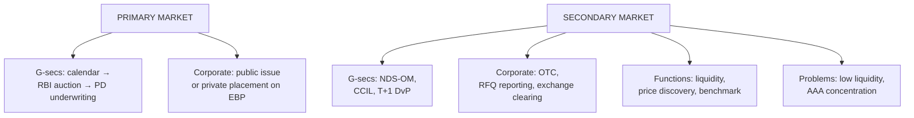

# BF-2: Primary and Secondary Bond Markets, Issuance and Trading

Covers: the primary market (how G-secs and corporate bonds are issued: auctions, public issues, private placement and the electronic book provider platform), the secondary market (OTC and exchange trading, NDS-OM, RFQ platforms, clearing and settlement), and the functions and problems of each. **(syllabus)**

## Where this fits in the ESE

A natural 10-mark question ("explain the issuance process and trading mechanism of G-secs and corporate bonds") or a 5-mark comparison of primary and secondary markets.

## Primary vs secondary

| Basis | Primary market | Secondary market |
|---|---|---|
| What happens | New bonds issued; money goes to the issuer | Existing bonds traded between investors |
| Purpose | Raise capital | Liquidity and price discovery |
| Price set by | Auction or book-building | Trading (order matching or negotiation) |
| India (G-secs) | RBI auctions | NDS-OM and OTC, settled by CCIL |
| India (corporate) | Public issue or private placement via EBP | OTC deals reported on NSE/BSE RFQ platforms |

The two support each other: investors buy new bonds more readily, and at lower yields, if they know they can sell them later.

## Primary market: government securities

1. **Borrowing calendar:** the government and RBI announce a half-yearly calendar of amounts and maturities.
2. **Notification:** a few days before each auction RBI announces the security, amount and auction method.
3. **Auction** (BF-3): competitive bids (banks, PDs, institutions) by price or yield; non-competitive bids (retail and small investors) get the weighted-average price.
4. **Underwriting:** primary dealers underwrite the issue so it is fully subscribed.
5. **Settlement:** usually T+1, via RBI's e-Kuber system, into SGL / CSGL accounts.
6. **T-bills:** auctioned weekly (91, 182 and 364 days); state government SDLs are auctioned weekly too.
7. **Retail access:** RBI Retail Direct accounts let individuals bid non-competitively.

## Primary market: corporate bonds

1. **Public issue:** offer document (prospectus) under SEBI's Issue and Listing of Non-Convertible Securities Regulations (2021); credit rating required; debenture trustee appointed; listing on exchanges. Used less often because it is costlier and slower.
2. **Private placement:** the dominant route (most corporate bonds by value). Issued to a limited number of qualified investors (banks, MFs, insurers) through the **Electronic Book Provider (EBP)** platforms of NSE and BSE above a size threshold: bids are collected electronically and the coupon/yield is discovered transparently.
3. **Requirements:** credit rating from a SEBI-registered agency, debenture trustee, disclosures, listing, demat form.
4. **Commercial paper (short-term)** and **certificates of deposit** follow RBI's money market rules.

## Secondary market: trading mechanisms

### G-secs
- **NDS-OM (Negotiated Dealing System – Order Matching):** RBI's anonymous electronic order-matching platform (operated through CCIL); most G-sec trading happens here.
- **OTC (telephone/negotiated) deals:** must be reported on NDS-OM.
- **Clearing and settlement:** CCIL acts as central counterparty; settlement is **T+1** on a delivery-versus-payment (DvP) basis, so securities and funds move together.
- **Retail:** NSE/BSE platforms and RBI Retail Direct's secondary-market module.

### Corporate bonds
- Mostly **OTC**: dealers and institutions negotiate, then **report trades on the RFQ (Request for Quote) platforms** or reporting platforms of NSE/BSE.
- **Clearing and settlement** through the exchanges' clearing corporations (NSE Clearing, ICCL), T+1, DvP.
- **Online bond platform providers (OBPPs)**, regulated by SEBI since 2022, let retail investors buy listed bonds.
- **Market makers** quote two-way prices in some segments.

### Price conventions
- Prices are quoted **clean** (excluding accrued interest); the buyer pays the **dirty price** = clean price + accrued interest since the last coupon.
- Yields are quoted on a semi-annual basis for G-secs.

## Functions of the secondary market

Liquidity (investors can exit); price discovery (yields reflect information); a benchmark yield curve; lower issuance cost for issuers; transmission of monetary policy.

## Problems of the Indian corporate bond secondary market

1. **Low liquidity:** most bonds rarely trade after issue; investors buy and hold.
2. **Concentration** in AAA/AA issuers and in private placements.
3. **Investor base:** banks, insurers and pension funds face limits on lower-rated paper.
4. **Limited market making** and repo in corporate bonds.
5. **Credit events** (IL&FS 2018) damaged confidence in lower-rated paper.
Reforms: EBP platforms, RFQ platforms, consolidation of ISINs (fewer, larger issues), corporate bond repo, a backstop facility for corporate debt market stress, OBPPs for retail.

## What to remember

- Primary = issue (raise money); secondary = trade (liquidity, price discovery).
- G-secs: calendar → notification → RBI auction → PD underwriting → T+1 settlement via e-Kuber.
- Corporate: public issue (SEBI 2021 regulations) or private placement on EBP (dominant).
- Secondary: G-secs on NDS-OM, cleared by CCIL, T+1 DvP; corporate bonds OTC, reported on RFQ platforms, settled by exchange clearing corporations.
- Clean vs dirty price: dirty = clean + accrued interest.

## Concept map

## Flashcards
Q: Difference between primary and secondary bond markets?
A: Primary: new bonds are issued and money goes to the issuer. Secondary: existing bonds trade between investors, giving liquidity and price discovery.

Q: How are central government securities issued in India?
A: Through auctions conducted by RBI under a published borrowing calendar, underwritten by primary dealers.

Q: What is the EBP platform?
A: The Electronic Book Provider platform of NSE/BSE through which privately placed corporate bonds collect bids and discover their coupon or yield.

Q: What is NDS-OM?
A: RBI's anonymous electronic order-matching platform for secondary trading in G-secs.

Q: What is the settlement cycle for G-sec trades, and who guarantees it?
A: T+1, delivery versus payment, with CCIL as central counterparty.

Q: What is the dirty price of a bond?
A: Clean price plus accrued interest since the last coupon date.

Q: Name three problems of the Indian corporate bond secondary market.
A: Low liquidity, concentration in AAA/AA issuers and private placements, limited market making (also restricted investor base, credit events).

## Sources
- BBA303F-5 course plan, Unit 1 (primary and secondary bond markets: issuance processes and trading mechanisms)
- RBI material on G-sec auctions and NDS-OM; SEBI (Issue and Listing of Non-Convertible Securities) Regulations, 2021
- Previous: [[Bond Market Unit 1 - BF-1 Structure Participants and Instruments]] · Next: [[Bond Market Unit 1 - BF-3 Auctions and Repo Markets]]
- [[Bond Market Unit 1 - Foundations MOC (Node Map)]]
