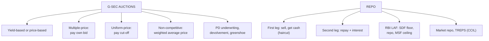

# BF-3: Auction Mechanisms and Repo Markets in India

Covers: auction types (yield-based and price-based; uniform price vs multiple price; competitive and non-competitive bids; cut-off; underwriting and greenshoe), a worked auction allotment, repo and reverse repo, RBI's liquidity adjustment facility (repo, SDF, MSF), the market repo and TREPS, and a worked repo calculation. **(syllabus)** The plan pairs this with "analytical exercises", so the two worked examples are the likely sums.

## Where this fits in the ESE

A 5-mark sum (auction allotment, or repo interest and repurchase price), or a 10-mark "explain auction mechanisms and the repo market in India".

## Auctions

### Price-based vs yield-based
- **Yield-based:** bidders quote the yield they want (used for new issues where the coupon isn't fixed yet; the cut-off yield becomes the coupon).
- **Price-based:** bidders quote a price for an existing (reissued) security with a known coupon.

### Uniform price vs multiple price
- **Multiple-price (discriminatory, "French") auction:** each successful bidder pays **its own bid price**. Encourages careful bidding; risk of the **winner's curse** (overpaying).
- **Uniform-price ("Dutch") auction:** all successful bidders pay the **same cut-off price**. Encourages aggressive bidding and wider participation; issuer may raise slightly less.
- RBI announces the method in each auction notification and has used both formats for dated G-secs.

### Bids
- **Competitive bids:** institutions quote price/yield and amount.
- **Non-competitive bids:** retail and small investors (up to a share of the notified amount, e.g. 5% for dated G-secs) get securities at the **weighted-average price** of accepted competitive bids, without quoting.

### Cut-off and allotment
Sort bids from highest price (lowest yield) to lowest price. Accept until the notified amount is filled. The last accepted price is the **cut-off**; bids at the cut-off may be filled **partially (pro rata)**.

### Underwriting and greenshoe
- **Primary dealers** underwrite each auction: a minimum underwriting commitment plus additional competitive underwriting, for a commission. If the auction is undersubscribed (**devolvement**), PDs must buy the shortfall.
- **Greenshoe option:** RBI may accept more than the notified amount when demand is strong.

### Worked example: auction allotment, laid out as the exam answer

**Question (illustrative):** RBI auctions ₹1,000 crore of an existing G-sec (price-based). Competitive bids received:

| Bid price (₹) | Amount (₹ crore) |
|---|---|
| 100.40 | 300 |
| 100.25 | 250 |
| 100.10 | 300 |
| 99.95 | 400 |
| 99.80 | 200 |

Find the cut-off price, allotments, and the amount raised under (a) multiple-price and (b) uniform-price auctions.

1. **Sort by price (highest first) and cumulate:** 300 (300) → 250 (550) → 300 (850) → 400 (1,250, exceeds 1,000).
2. **Cut-off price = ₹99.95.** Bids above it are filled in full (850 crore); at 99.95 only **150 of 400** crore is allotted, a **37.5% pro-rata** fill. The 99.80 bid is rejected.
3. **(a) Multiple-price:** each pays its own price.
   300 × 1.0040 + 250 × 1.0025 + 300 × 1.0010 + 150 × 0.9995 = 301.20 + 250.63 + 300.30 + 149.93 = **₹1,002.05 crore**.
4. **(b) Uniform-price:** everyone pays ₹99.95: 1,000 × 0.9995 = **₹999.50 crore**.

**Interpretation:** the multiple-price auction raises ₹2.55 crore more for the government here, but in practice bidders shade their bids lower in discriminatory auctions; the uniform-price format draws more aggressive bids and wider participation, which can narrow the gap.

## Repo markets

### Repo and reverse repo
A **repo (repurchase agreement)** is a short-term **collateralised loan**: the borrower **sells** securities (usually G-secs) and agrees to **buy them back** at a higher price on a fixed date. The difference is the interest (the **repo rate**). For the lender it is a **reverse repo**.

- **First leg:** borrower sells securities, receives cash.
- **Second leg:** borrower repays cash + interest, gets securities back.
- **Haircut:** the lender advances less than the market value of the collateral (margin against a price fall).

### RBI's liquidity adjustment facility (LAF)
- **Repo rate (policy rate):** RBI lends to banks against G-secs; the main signal of monetary policy.
- **Standing Deposit Facility (SDF):** since April 2022, the floor of the corridor; banks park surplus funds with RBI without collateral.
- **Marginal Standing Facility (MSF):** the ceiling; banks borrow overnight above the repo rate, even dipping into SLR securities.
- **Variable rate repo/reverse repo auctions:** fine-tune liquidity.
The corridor (SDF to MSF) keeps the overnight call rate close to the repo rate.

### Market repo
- **Bilateral repo** between market participants, cleared by CCIL.
- **TREPS (Tri-party Repo Dealing System):** CCIL acts as the tri-party agent managing collateral; the largest money-market segment, used heavily by mutual funds and banks (replaced CBLO in 2018).
- **Corporate bond repo:** allowed, but small.

### Worked example: repo calculation

**Question (illustrative):** a bank borrows by repo against G-secs with face value ₹10 crore, market price ₹101 (ignore accrued interest), haircut 2%, repo rate 6.5%, for 7 days (365-day year). Find the first-leg amount, interest and second-leg amount.

1. Market value = 10 crore × 101 ÷ 100 = ₹10.10 crore.
2. **First leg** (after haircut) = 10.10 crore × 0.98 = **₹9,89,80,000**.
3. **Interest** = 9,89,80,000 × 6.5% × 7 ÷ 365 = **₹1,23,386**.
4. **Second leg** = 9,89,80,000 + 1,23,386 = **₹9,91,03,386**.

**Interpretation:** the bank raises about ₹9.9 crore for a week at 6.5%, cheaper than unsecured call money, because the lender holds G-secs as collateral with a 2% cushion.

## What to remember

- Multiple-price: pay own bid; uniform: all pay cut-off. Non-competitive bids get the weighted average price.
- Auction example: cut-off ₹99.95, 37.5% pro rata, ₹1,002.05 crore (multiple) vs ₹999.50 crore (uniform).
- PDs underwrite; devolvement when undersubscribed; greenshoe when oversubscribed.
- Repo = sale + agreed repurchase = collateralised loan; haircut; reverse repo for the lender.
- LAF corridor: SDF (floor), repo (policy), MSF (ceiling). TREPS = CCIL tri-party repo.
- Repo example: first leg ₹9,89,80,000, interest ₹1,23,386, second leg ₹9,91,03,386.

## Concept map

## Flashcards
Q: Difference between a multiple-price and a uniform-price auction?
A: In a multiple-price auction each winner pays its own bid; in a uniform-price auction all winners pay the cut-off price.

Q: What price do non-competitive bidders pay?
A: The weighted-average price of the accepted competitive bids.

Q: What is devolvement?
A: When an auction is undersubscribed, the unsold amount devolves on the underwriting primary dealers (or RBI).

Q: Define a repo.
A: A short-term collateralised loan in which the borrower sells securities and agrees to repurchase them at a higher price on a set date.

Q: What is a haircut in a repo?
A: The margin by which the cash lent is less than the collateral's market value, protecting the lender against a fall in price.

Q: What forms the floor and ceiling of RBI's LAF corridor?
A: The Standing Deposit Facility (floor) and the Marginal Standing Facility (ceiling), with the repo rate in between.

Q: What is TREPS?
A: The Tri-party Repo Dealing System run by CCIL as tri-party agent; the largest money-market segment in India.

Q: Repo: collateral ₹10.10 crore, haircut 2%, 6.5%, 7 days. Interest?
A: 9,89,80,000 × 6.5% × 7/365 = ₹1,23,386.

## Sources
- BBA303F-5 course plan, Unit 1 (auction mechanisms and repo markets in India)
- RBI material on G-sec auctions, the liquidity adjustment facility and TREPS
- Previous: [[Bond Market Unit 1 - BF-2 Primary and Secondary Markets]] · Next: [[Bond Market Unit 1 - BF-4 Unit 1 Exam Answers]]
- [[Bond Market Unit 1 - Foundations MOC (Node Map)]]
