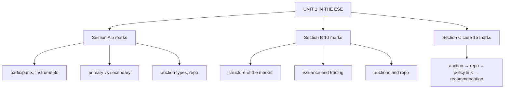

# BF-4: Unit 1 Exam Answers

Covers: what the ESE will ask from Unit 1, 5-mark and 10-mark skeletons, and a 15-mark case layout with a model answer. Numbers come from BF-1 to BF-3.

## What the test will ask

ESE: Section A 3 × 5 (internal choice), Section B 2 × 10 (internal choice), Section C one compulsory 15-mark question; no phone calculators. Unit 1 is CO1 (structure and functioning of the Indian bond market), mostly theory with two sums (auction allotment, repo). Expect at least one 5- or 10-marker from here.

## Five-mark answer skeletons

**1. Participants in the Indian bond market (BF-1).** Regulators (RBI, SEBI), infrastructure (CCIL, FBIL, exchanges, rating agencies), issuers, investors (banks/SLR, insurers, PF, MFs, PDs, FPIs, retail) one line each.

**2. Types of bonds (BF-1).** Six types with one-line features: fixed, zero, floating, inflation-indexed, callable/puttable, convertible (add STRIPS, green).

**3. Primary vs secondary market (BF-2).** Table: purpose, price setting, Indian G-sec and corporate mechanisms.

**4. Uniform vs multiple-price auction (BF-3).** Definitions, who pays what, pros and cons, a one-line numeric (₹1,002.05 vs ₹999.50 crore).

**5. Repo and reverse repo (BF-3).** Definition, two legs, haircut, LAF corridor, TREPS; one-line numeric.

## Ten-mark answer skeletons

**A. Structure of the Indian bond market (BF-1, BF-2).** Segments table → regulators and infrastructure → participants → instruments → primary process (G-sec auction, corporate EBP) → secondary trading (NDS-OM, RFQ) → problems and reforms → India in the global market (index inclusion).

**B. Issuance and trading of G-secs and corporate bonds (BF-2).** Side-by-side: G-sec (calendar, RBI auction, PD underwriting, NDS-OM, CCIL T+1) vs corporate (public issue or private placement on EBP, OTC + RFQ, exchange clearing) → problems of the corporate segment → reforms.

**C. Auctions and repo (BF-3).** Auction types → allotment with cut-off and pro rata → PD role → repo mechanics → LAF corridor → market repo/TREPS → role in monetary policy.

## Fifteen-mark case layout (market operations)

1. **Auction allotment (5):** sort, cut-off, pro rata, amount raised under both methods.
2. **Repo financing (4):** first leg with haircut, interest, second leg.
3. **Policy link (3):** how the repo rate and LAF corridor affect short-term yields and the bank's decision.
4. **Recommendation (3):** auction format choice, or funding choice (repo vs call money vs MSF).

### Model answer, laid out as the exam answer

**Data (illustrative):** the auction and repo figures from BF-3; the bank's alternative is MSF borrowing at repo + 0.25%.

1. **Auction:** cut-off ₹99.95; allotments 300 / 250 / 300 / 150 crore (37.5% pro rata at the cut-off); raised **₹1,002.05 crore** (multiple-price) vs **₹999.50 crore** (uniform).
2. **Repo:** first leg ₹9,89,80,000; interest ₹1,23,386; second leg **₹9,91,03,386**.
3. **Policy link:** repo borrowing at the market rate near the policy repo rate is cheaper than MSF (repo + 0.25%); the LAF corridor keeps overnight rates between SDF and MSF, so short-term G-sec yields track the repo rate.
4. **Recommendation:** fund the 7-day need through market repo/TREPS rather than MSF (saves 25 bps a year ≈ ₹4,700 on this loan); for the government, a multiple-price format raised more in this auction, but a uniform format may widen participation in volatile markets.

Close with: *the comparison holds only for the bids received; bidding behaviour changes with the auction format.*

## Time rule

If short of time: do the auction table and the repo legs (they carry the marks), then one line on the policy link.

## What to remember

- Unit 1 = CO1 theory plus two sums (auction, repo).
- Auction: cut-off ₹99.95; ₹1,002.05 vs ₹999.50 crore.
- Repo: ₹9,89,80,000 → interest ₹1,23,386 → ₹9,91,03,386.
- Section B favourite: structure of the Indian bond market.

## Concept map

## Flashcards
Q: What are the two sums most likely from Unit 1?
A: Auction allotment (cut-off, pro rata, amount raised) and repo legs (first leg with haircut, interest, second leg).

Q: Skeleton for "structure of the Indian bond market" (10 marks)?
A: Segments, regulators and infrastructure, participants, instruments, primary process, secondary trading, problems and reforms, global link.

Q: Why is market repo cheaper than MSF for a bank?
A: MSF is priced at repo + 0.25% as the corridor ceiling; market repo trades close to the policy repo rate.

## Sources
- BBA303F-5 course plan, Unit 1 and ESE question paper pattern
- [[Bond Market Unit 1 - Foundations MOC (Node Map)]]
