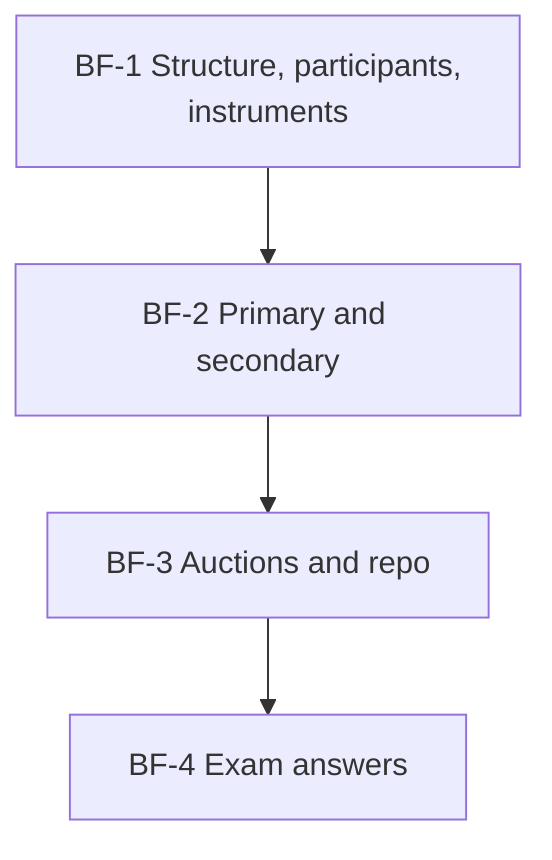

# Bond Market Unit 1: Foundations of Bond Markets, node map

ESE: 50 marks, Section A 3 × 5, Section B 2 × 10, Section C one compulsory 15-mark question; no phone calculators. Unit 1 is CO1 (structure and functioning of the Indian bond market). Mostly theory, with two sums: auction allotment and repo. Examples are **illustrative**; institutional facts are from RBI and SEBI public material.

## Nodes

| Node | Topic | Deps | Minutes | Exam focus |
|---|---|---|---|---|
| BF-1 | Structure, Participants and Instruments | none | 40 | yes |
| BF-2 | Primary and Secondary Markets | BF-1 | 35 | yes |
| BF-3 | Auctions and Repo Markets | BF-2 | 45 | yes |
| BF-4 | Unit 1 Exam Answers | BF-1 to BF-3 | 25 | yes |

Total reading time: about 145 minutes.

## Dependency graph

## Headline numbers and facts to know

- Segments: G-secs and T-bills (91/182/364 days), SDLs, corporate bonds, money market. RBI for G-secs, SEBI for corporate bonds; CCIL clears and settles; T+1 DvP.
- Auction (₹1,000 crore notified): cut-off ₹99.95, 37.5% pro rata; multiple-price ₹1,002.05 crore vs uniform ₹999.50 crore.
- Repo (₹10 crore face at ₹101, 2% haircut, 6.5%, 7 days): first leg ₹9,89,80,000, interest ₹1,23,386, second leg ₹9,91,03,386.
- LAF corridor: SDF (floor) – repo – MSF (ceiling, repo + 25 bps). TREPS replaced CBLO in 2018.
- India in the JP Morgan GBI-EM index from June 2024.

## Links
- [[Bond Market MOC]]
