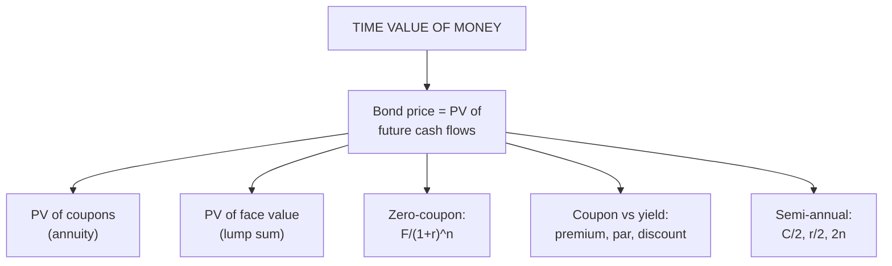

# BV-1: Time Value of Money and Bond Valuation Basics

Covers: why TVM is the foundation of bond valuation, the coupon bond price formula (annual and semi-annual), zero-coupon bonds, premium, par and discount bonds, and worked pricing examples laid out without a phone calculator. **(syllabus)**

## Where this fits in the ESE

ESE: 3 × 5, 2 × 10, one compulsory 15-mark question; no phone calculators. Unit 2 was CIA2's focus and is CO2 in the ESE. Bond pricing is the first step of almost every Unit 2 sum (yield, duration and convexity all start from the price).

## Why TVM is the entire foundation

A rupee today is worth more than a rupee later, because it can be invested. A bond is a **promise of future cash flows** (coupons and face value), so its value today is the **present value** of those cash flows at the yield investors require. Everything in Unit 2 (yields, duration, convexity, risk) is a consequence of this one idea.

## The coupon bond price formula

**P = C × [1 − (1 + r)⁻ⁿ] ÷ r + F ÷ (1 + r)ⁿ**

- C = coupon per period = face value × coupon rate ÷ payments a year
- r = required yield per period = annual yield ÷ payments a year
- n = number of periods = years × payments a year
- F = face (par) value
- First term = PV of the coupon **annuity**; second term = PV of the **face value**.

**Zero-coupon bond:** P = F ÷ (1 + r)ⁿ: no coupons; always below par; the discount is the return.

## Premium, par and discount

| Coupon vs required yield | Price | Name |
|---|---|---|
| Coupon > yield | Above face value | **Premium** bond |
| Coupon = yield | At face value | **Par** bond |
| Coupon < yield | Below face value | **Discount** bond |

## Worked example 1: annual coupon, laid out as the exam answer

**Question (illustrative):** face ₹1,000, 8% annual coupon, 3 years to maturity, required yield 10%. Find the price.

| Year | Cash flow | Discount factor (1.10ᵗ) | PV |
|---|---|---|---|
| 1 | 80 | 1.10 | 72.73 |
| 2 | 80 | 1.21 | 66.12 |
| 3 | 1,080 | 1.331 | 811.42 |
| | | **Price** | **₹950.26** |

Coupon (8%) < yield (10%), so it is a **discount bond**: the ₹49.74 discount makes up the 2% shortfall in coupon each year.

## Worked example 2: semi-annual coupon

**Question:** face ₹1,000, 9% coupon paid semi-annually, 5 years, required yield 8%.
- C = 45, r = 4%, n = 10.
- PV of coupons = 45 × [1 − 1.04⁻¹⁰] ÷ 0.04 = 45 × 8.1109 = 364.99
- PV of face = 1,000 ÷ 1.04¹⁰ = 1,000 ÷ 1.48024 = 675.56
- **Price = ₹1,040.55** (premium: coupon 9% > yield 8%).

**Trap:** halve the coupon **and** the yield, and double the periods.

## Worked example 3: zero-coupon

5-year zero, face ₹1,000, yield 8%: P = 1,000 ÷ 1.08⁵ = 1,000 ÷ 1.46933 = **₹680.58**.

## Without a phone calculator

- Build discount factors by repeated multiplication: 1.1, 1.21, 1.331 …
- Use annuity tables (PVIFA) if allowed; otherwise list each cash flow in a table as in Example 1.
- Round discount factors to 4–5 decimals and the price to 2.

## What to remember

- Price = PV of coupons (annuity) + PV of face value.
- Semi-annual: C/2, r/2, 2n.
- Coupon > yield → premium; = → par; < → discount.
- Examples: 8%/3y at 10% → ₹950.26; 9% semi-annual 5y at 8% → ₹1,040.55; 5-year zero at 8% → ₹680.58.

## Concept map

## Flashcards
Q: Write the coupon bond price formula.
A: P = C × [1 − (1 + r)⁻ⁿ] ÷ r + F ÷ (1 + r)ⁿ.

Q: How do you adjust for semi-annual coupons?
A: Halve the coupon and the yield, and double the number of periods.

Q: Face ₹1,000, 8% annual coupon, 3 years, yield 10%. Price?
A: ₹950.26.

Q: When does a bond trade at a premium?
A: When its coupon rate is above the required yield.

Q: Price of a 5-year zero-coupon bond (face ₹1,000) at 8%?
A: ₹680.58.

Q: Why is TVM the foundation of bond valuation?
A: A bond is a set of future cash flows, so its value is their present value at the required yield.

## Sources
- Split of [[Bond Market Unit 2 - How Bond Valuation Actually Works]] (section 1) and [[Bond Market Unit 2 - Cheat Sheet]] (bond valuation)
- BBA303F-5 course plan, Unit 2 (time value of money and bond valuation basics)
- Next node: [[Bond Market Unit 2 - BV-2 Yield Measures and Price-Yield Relationship]]
- [[Bond Market Unit 2 - Bond Valuation MOC (Node Map)]]
