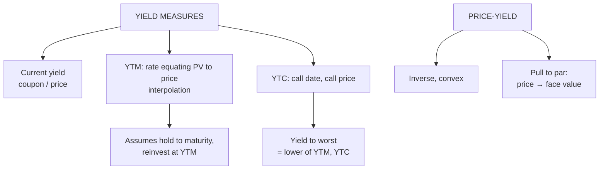

# BV-2: Yield Measures (CY, YTM, YTC), Price-Yield Relationship and Pull-to-Par

Covers: current yield, yield to maturity by interpolation, yield to call and yield to worst, the inverse price-yield relationship, and the pull-to-par effect, each with a worked example. **(syllabus)**

## Where this fits in the ESE

YTM by interpolation is the classic 5-mark sum (and the hardest without a calculator); "explain the price-yield relationship and pull to par" is a 5-mark theory question. The plan's "numerical quiz" for this week signals sums.

## Current yield

**CY = Annual coupon ÷ Market price × 100**

Simple income return; **ignores** the capital gain or loss to maturity and time value.

*Example:* 10% coupon on ₹1,000 face, price ₹950: CY = 100 ÷ 950 = **10.53%**.

## Yield to maturity (YTM)

The **single discount rate** that makes the PV of all future cash flows equal the market price: the bond's internal rate of return if held to maturity.

**Assumptions:** held to maturity; issuer doesn't default; **all coupons reinvested at the YTM**.

YTM can't be solved algebraically, so use **trial and error + interpolation**:

**YTM ≈ r_low + [(PV_low − Price) ÷ (PV_low − PV_high)] × (r_high − r_low)**

### Worked example: YTM by interpolation, laid out as the exam answer

**Question (illustrative):** face ₹1,000, 10% annual coupon, 5 years, price ₹950. Find YTM.

1. The price is below par, so YTM > coupon (10%). Try 11% and 12%.
2. At 11%: PV = 100 × 3.6959 + 1,000 × 0.5935 = **₹963.04**.
3. At 12%: PV = 100 × 3.6048 + 1,000 × 0.5674 = **₹927.90**.
4. Interpolate: YTM ≈ 11 + [(963.04 − 950) ÷ (963.04 − 927.90)] × 1 = 11 + 13.04 ÷ 35.14 = **11.37%**.
(Exact: 11.37%.)

**Approximate YTM formula** (quick check): [C + (F − P)/n] ÷ [(F + P)/2] = [100 + 50/5] ÷ 975 = 110 ÷ 975 = **11.28%**, close to the interpolated value.

Compare: CY 10.53% < YTM 11.37% because YTM also counts the ₹50 gain at maturity.

## Yield to call (YTC) and yield to worst

For a **callable** bond: the same formula, but **n = periods to the call date** and **F = call price**.

**Use YTC when the bond trades above the call price**: the issuer is likely to call it (refinance at lower rates), so the investor won't get the full stream to maturity.

**Yield to worst** = the lower of YTM and YTC: the conservative figure to quote.

*Example:* 10% annual coupon, 5 years to maturity, callable in 2 years at ₹1,050, price ₹1,080.
- YTM (5 years to ₹1,000) ≈ **8.00%**.
- YTC (2 years to ₹1,050) ≈ **7.92%**.
- Yield to worst = **7.92%** (YTC): the investor should expect the call.

## Price-yield relationship

**Price and yield move in opposite directions. Always.** A higher required yield lowers the PV of fixed future cash flows. This is arithmetic, not sentiment. (If a calculation shows both rising, there's an error.)

The price-yield curve is **convex**: a fall in yield raises the price by more than an equal rise in yield lowers it (Malkiel theorem 4; convexity in BV-4).

## Pull-to-par

As maturity approaches, a bond's price **converges to face value**, whatever it trades at now, because n shrinks and the PV of the face value approaches the face value itself.

| Years to maturity | 12% coupon at 10% (premium) | 8% coupon at 10% (discount) |
|---|---|---|
| 4 | 1,063.40 | 936.60 |
| 3 | 1,049.74 | 950.26 |
| 2 | 1,034.71 | 965.29 |
| 1 | 1,018.18 | 981.82 |
| 0 | 1,000.00 | 1,000.00 |

Premium bonds drift **down** to par; discount bonds drift **up** to par (yield unchanged at 10%).

## Traps

- **CY is not a full return measure.**
- **YTM is your realised return only if every coupon is reinvested at the YTM** (reinvestment risk, BV-5).
- **Interpolation bracket:** pick one rate giving a PV above the price and one below.
- **Callable bond above call price:** quote YTC (yield to worst), not YTM.

## What to remember

- CY = coupon ÷ price (10.53% on ₹950).
- YTM: interpolate between two trial rates (11% → 963.04, 12% → 927.90; YTM 11.37%).
- YTC uses call date and call price; yield to worst = lower of YTM and YTC (7.92% vs 8.00%).
- Price and yield move inversely; the curve is convex.
- Pull to par: premium falls to par, discount rises to par.

## Concept map

## Flashcards
Q: Formula for current yield?
A: Annual coupon ÷ market price × 100.

Q: Define yield to maturity.
A: The discount rate that equates the present value of all future cash flows to the bond's market price.

Q: What does YTM assume about coupons?
A: That they are all reinvested at the YTM itself.

Q: 10% coupon, 5 years, price ₹950. PV at 11% is 963.04 and at 12% is 927.90. YTM?
A: 11 + 13.04/35.14 ≈ 11.37%.

Q: When should you use yield to call?
A: When a callable bond trades above its call price, so the issuer is likely to call it.

Q: What is yield to worst?
A: The lower of YTM and YTC.

Q: What is the pull-to-par effect?
A: A bond's price converges to its face value as maturity approaches.

## Sources
- Split of [[Bond Market Unit 2 - How Bond Valuation Actually Works]] (section 2) and [[Bond Market Unit 2 - Cheat Sheet]] (yield measures, pull to par, traps)
- BBA303F-5 course plan, Unit 2 (yield measures: YTM, YTC, price-yield relationship, pull-to-par)
- Previous: [[Bond Market Unit 2 - BV-1 TVM and Bond Pricing]] · Next: [[Bond Market Unit 2 - BV-3 Duration and Modified Duration]]
- [[Bond Market Unit 2 - Bond Valuation MOC (Node Map)]]
