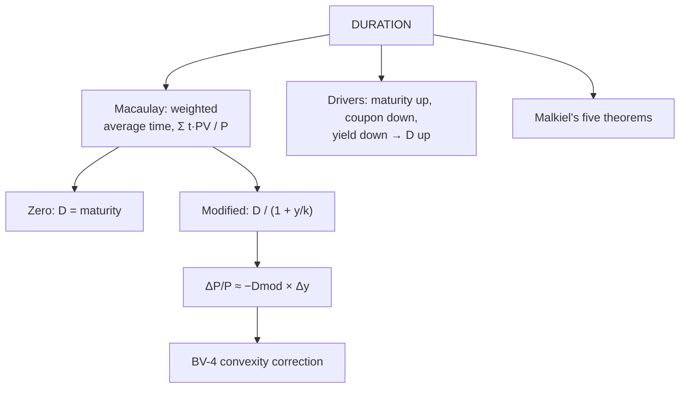

# BV-3: Duration, Modified Duration and Malkiel's Theorems

Covers: why duration exists, Macaulay duration (computed step by step), modified duration, the price-change estimate, what drives duration, and Malkiel's five bond price theorems. **(syllabus)**

## Where this fits in the ESE

A Macaulay duration table is a standard 5- or 10-mark sum; "explain Malkiel's theorems" is a standard theory answer; and Unit 4 (immunization, stress testing) builds directly on duration.

## Why duration exists

Maturity tells you when the **last** cash flow arrives, but a coupon bond pays cash all along. **Duration** is the **weighted average time** to receive the bond's cash flows, weighted by each cash flow's share of the price. It also measures **price sensitivity to yield changes**: the single number that captures the effects of maturity, coupon and yield.

## Macaulay duration

**D = Σ [t × PV(CFₜ)] ÷ P**

- For a zero-coupon bond, **D = maturity**.
- For a coupon bond, **D < maturity**.

### Worked example, laid out as the exam answer

**Question (illustrative):** face ₹1,000, 8% annual coupon, 3 years, yield 10% (price ₹950.26 from BV-1). Find Macaulay and modified duration, and the estimated price change for a 1% rise in yield.

| t | Cash flow | PV at 10% | t × PV |
|---|---|---|---|
| 1 | 80 | 72.73 | 72.73 |
| 2 | 80 | 66.12 | 132.23 |
| 3 | 1,080 | 811.42 | 2,434.26 |
| **Total** | | **950.26** | **2,639.22** |

1. **Macaulay duration** = 2,639.22 ÷ 950.26 = **2.78 years** (below the 3-year maturity).
2. **Modified duration** = D ÷ (1 + y) = 2.78 ÷ 1.10 = **2.52**.
3. **Estimated price change** for +1%: ΔP/P ≈ −2.52 × 0.01 = **−2.52%** → price ≈ 950.26 × (1 − 0.0252) ≈ ₹926.3. (Actual price at 11%: ₹926.69; adding convexity in BV-4 closes the gap.)

## Modified duration

**D_mod = D_Macaulay ÷ (1 + y/k)**, k = coupon payments a year.

**ΔP/P ≈ −D_mod × Δy**

Modified duration (not Macaulay) measures price sensitivity: a modified duration of 6.8 means a 1% rise in yield cuts the price by about 6.8%. (Trap 3: if given Macaulay, divide by 1 + y/k first.)

## What drives duration

| Factor | Effect on duration |
|---|---|
| Longer maturity | Higher |
| Lower coupon | Higher (more value in the distant face payment) |
| Lower yield | Higher (distant cash flows discounted less, so they weigh more) |
| More frequent coupons | Slightly lower |

*Example:* 10-year bonds at 8%: a 4% coupon bond has duration **8.12 years**; a 10% coupon bond **6.97 years**.

## Malkiel's five bond price theorems

1. **Prices move inversely to yields.**
2. For a given yield change, **longer-maturity bonds** show **larger** percentage price changes.
3. That sensitivity rises with maturity at a **decreasing rate** (5 → 10 years adds more than 20 → 25 years).
4. For a given maturity, a **fall** in yield raises the price **more** than an equal **rise** lowers it (convexity).
5. **Lower-coupon bonds** show **larger** percentage price changes than higher-coupon bonds of the same maturity.

**Duration theorem:** bonds with **higher duration** show larger price changes; duration summarises theorems 1, 2 and 5 in one number.

## What to remember

- Macaulay D = Σ t·PV ÷ P; zero-coupon D = maturity; coupon bond D < maturity.
- D_mod = D ÷ (1 + y/k); ΔP/P ≈ −D_mod × Δy.
- Example: D 2.78, D_mod 2.52, +1% → about −2.52% (actual −2.48%).
- Duration rises with maturity, falls with coupon and yield.
- Malkiel: inverse; longer = more sensitive; at a decreasing rate; falls gain more than rises lose; low coupon = more sensitive.

## Concept map

## Flashcards
Q: Define Macaulay duration.
A: The weighted average time to receive a bond's cash flows, weighted by each cash flow's PV as a share of price.

Q: What is the duration of a zero-coupon bond?
A: Exactly its maturity.

Q: Formula for modified duration?
A: Macaulay duration ÷ (1 + yield per period).

Q: Modified duration 2.52, yields rise 1%. Approximate price change?
A: −2.52%.

Q: How does a lower coupon affect duration?
A: It raises duration, because more of the value sits in the distant face payment.

Q: State Malkiel's theorem 4.
A: For a given maturity, a fall in yield raises price more than an equal rise in yield lowers it.

Q: State Malkiel's theorem 5.
A: Lower-coupon bonds show larger percentage price changes than higher-coupon bonds of the same maturity.

## Sources
- Split of [[Bond Market Unit 2 - How Bond Valuation Actually Works]] (section 3) and [[Bond Market Unit 2 - Cheat Sheet]] (duration, Malkiel)
- BBA303F-5 course plan, Unit 2 (duration, modified duration)
- Previous: [[Bond Market Unit 2 - BV-2 Yield Measures and Price-Yield Relationship]] · Next: [[Bond Market Unit 2 - BV-4 Convexity]]
- [[Bond Market Unit 2 - Bond Valuation MOC (Node Map)]]
